# Rain OS Commercial Build Specification

**Document type:** single integrated product, technical, architecture, operations, and implementation specification  
**Revision:** 1.1 GitHub Actions parallel-build update  
**Generated:** 2026-09-12  
**Public repository audited:** `https://github.com/is-it-raining-now/rain-os`  
**Audited commit:** `d41587f56bc09b3b9a81804477673264433213b0`  
**Primary build system:** GitHub Actions parallel build pipeline with Arch Linux container/self-hosted runner options  
**Developer fallback:** Windows 10/11 with WSL2 and an official Arch Linux WSL distribution  
**Target artifact:** bootable x86_64 Archiso ISO, followed by a tested commercial desktop release  

> **Status:** This document is an implementation plan and release specification. It does not claim that Rain OS is already a production-ready commercial operating system. The current public repository is a working prototype and must pass the gates defined here.

## How to use this document

This specification is intentionally organized as a single document so that an AI-agent team can work through it in one controlled loop. Each numbered page is a decision surface. A page contains a requirement, the implementation contract, concrete files or packages, verification evidence, and risks. The `\newpage` markers are deliberate: rendering this Markdown with a normal 11-point document template produces more than 100 logical pages.

The correct execution order is **audit → parallel CI foundation → Core ISO → install → recovery → guide → hardware → profiles → Windows-app experience → commercial hardening**. Development work may run in parallel, but release promotion remains gated by dependencies. Each milestone must leave a bootable or testable artifact.

## Executive conclusion

Rain OS should remain a reuse-first Arch integration distribution. It should not merge entire EndeavourOS, CachyOS, and Athena repositories into one package universe. The public repository already contains the beginnings of this approach: an Archiso profile, a KDE package baseline, Rain PKGBUILDs, Windows/WSL helpers, CI, a control center, first-run utility, guide, recovery utility, update preflight, diagrams, and design documents.

The largest corrections required before commercial v1 are repository correctness, signed and reproducible Rain packages, an actual installer integration, a real self-updating guide bundle, hardware-aware profile behavior, tested rollback, a truthful Windows-app workflow, desktop environment support boundaries, accessibility, privacy, security review, and release operations.

Rain OS Core should ship one officially supported desktop first, preferably KDE Plasma, with generic and LTS kernels, a conservative package set, a recovery path, and Urban Rain/Rural Rain themes. GNOME, XFCE, Cinnamon, and further desktops should be profiles with separate test ownership. Windows applications should be offered through a compatibility center based on Wine, Bottles, Lutris, Steam/Proton, Flatpak, and an explicit VM escape hatch.

## Current repository snapshot

The public repository contains 138 tracked working-tree files in the shallow audit. Its local syntax and specification tests passed, but that is not equivalent to a successful Archiso build. The build scripts currently require Arch/WSL2 privileges and dependencies that are not available in this Ubuntu audit environment. The build path is authoritative in GitHub Actions for clean, repeatable artifacts. The user’s Windows WSL2 environment remains the fast local development and troubleshooting fallback, and real hardware testing remains outside GitHub Actions.

## Table of contents

01. [Executive decision and product boundary](#page-01-executive-decision-and-product-boundary)
02. [Current public repository audit](#page-02-current-public-repository-audit)
03. [Prototype readiness and blockers](#page-03-prototype-readiness-and-blockers)
04. [Commercial release definitions](#page-04-commercial-release-definitions)
05. [User demand synthesis](#page-05-user-demand-synthesis)
06. [Personas and jobs to be done](#page-06-personas-and-jobs-to-be-done)
07. [Rain OS principles and non-goals](#page-07-rain-os-principles-and-non-goals)
08. [Governance and ownership](#page-08-governance-and-ownership)
09. [Windows host topology](#page-09-windows-host-topology)
10. [WSL2 installation and tuning](#page-10-wsl2-installation-and-tuning)
11. [WSL filesystem and performance rules](#page-11-wsl-filesystem-and-performance-rules)
12. [AI builder toolchain topology](#page-12-ai-builder-toolchain-topology)
13. [AI tool permissions and secrets](#page-13-ai-tool-permissions-and-secrets)
14. [GSD phase loop](#page-14-gsd-phase-loop)
15. [ECC evidence and TDD loop](#page-15-ecc-evidence-and-tdd-loop)
16. [gstack review gates](#page-16-gstack-review-gates)
17. [taste-skill design review](#page-17-taste-skill-design-review)
18. [ponytail minimality review](#page-18-ponytail-minimality-review)
19. [Headroom and local context policy](#page-19-headroom-and-local-context-policy)
20. [Skill discovery and provenance](#page-20-skill-discovery-and-provenance)
21. [Ralph bounded iteration](#page-21-ralph-bounded-iteration)
22. [One-loop task state machine](#page-22-one-loop-task-state-machine)
23. [Archiso profile contract](#page-23-archiso-profile-contract)
24. [One-shot build command](#page-24-one-shot-build-command)
25. [Build cache and acceleration](#page-25-build-cache-and-acceleration)
26. [Build reproducibility](#page-26-build-reproducibility)
27. [Build logs and artifacts](#page-27-build-logs-and-artifacts)
28. [Package repository architecture](#page-28-package-repository-architecture)
29. [Package signing and key rotation](#page-29-package-signing-and-key-rotation)
30. [SBOM and license inventory](#page-30-sbom-and-license-inventory)
31. [Exact source tree](#page-31-exact-source-tree)
32. [Exact installed filesystem](#page-32-exact-installed-filesystem)
33. [Core package baseline](#page-33-core-package-baseline)
34. [KDE package group](#page-34-kde-package-group)
35. [GNOME package group](#page-35-gnome-package-group)
36. [XFCE and Cinnamon groups](#page-36-xfce-and-cinnamon-groups)
37. [Community desktop groups](#page-37-community-desktop-groups)
38. [Kernel strategy](#page-38-kernel-strategy)
39. [GPU and graphics stack](#page-39-gpu-and-graphics-stack)
40. [Firmware and microcode](#page-40-firmware-and-microcode)
41. [Boot modes and fallback](#page-41-boot-modes-and-fallback)
42. [Secure Boot and UKI](#page-42-secure-boot-and-uki)
43. [Installer architecture](#page-43-installer-architecture)
44. [Installer UX and change review](#page-44-installer-ux-and-change-review)
45. [Automatic partitioning](#page-45-automatic-partitioning)
46. [Advanced partitioning](#page-46-advanced-partitioning)
47. [LUKS2 encryption](#page-47-luks2-encryption)
48. [TPM-assisted unlock](#page-48-tpm-assisted-unlock)
49. [Btrfs subvolumes](#page-49-btrfs-subvolumes)
50. [Snapshots and rollback](#page-50-snapshots-and-rollback)
51. [ext4 support](#page-51-ext4-support)
52. [Dual boot safety](#page-52-dual-boot-safety)
53. [NetworkManager architecture](#page-53-networkmanager-architecture)
54. [Wi-Fi and captive portals](#page-54-wi-fi-and-captive-portals)
55. [Bluetooth](#page-55-bluetooth)
56. [Audio and PipeWire](#page-56-audio-and-pipewire)
57. [Displays and Wayland](#page-57-displays-and-wayland)
58. [Printers and scanners](#page-58-printers-and-scanners)
59. [Power and battery](#page-59-power-and-battery)
60. [Suspend and resume](#page-60-suspend-and-resume)
61. [Thermals and performance](#page-61-thermals-and-performance)
62. [File management](#page-62-file-management)
63. [Default applications](#page-63-default-applications)
64. [Flatpak and app sources](#page-64-flatpak-and-app-sources)
65. [App store design](#page-65-app-store-design)
66. [Windows apps product promise](#page-66-windows-apps-product-promise)
67. [Wine architecture](#page-67-wine-architecture)
68. [Bottles integration](#page-68-bottles-integration)
69. [Lutris and gaming](#page-69-lutris-and-gaming)
70. [Steam and Proton](#page-70-steam-and-proton)
71. [ProtonDB compatibility UX](#page-71-protondb-compatibility-ux)
72. [Winetricks and dependencies](#page-72-winetricks-and-dependencies)
73. [Windows app security](#page-73-windows-app-security)
74. [Windows app data locations](#page-74-windows-app-data-locations)
75. [Windows app support matrix](#page-75-windows-app-support-matrix)
76. [Windows VM fallback](#page-76-windows-vm-fallback)
77. [Distrobox and developer containers](#page-77-distrobox-and-developer-containers)
78. [Android and mobile services](#page-78-android-and-mobile-services)
79. [Gaming stack](#page-79-gaming-stack)
80. [Developer Forge profile](#page-80-developer-forge-profile)
81. [Flow performance profile](#page-81-flow-performance-profile)
82. [Shield security profile](#page-82-shield-security-profile)
83. [Pocket low-resource profile](#page-83-pocket-low-resource-profile)
84. [Profile conflict rules](#page-84-profile-conflict-rules)
85. [Control Center information architecture](#page-85-control-center-information-architecture)
86. [First-run onboarding](#page-86-first-run-onboarding)
87. [Rain Learning Hub](#page-87-rain-learning-hub)
88. [Self-updating guide protocol](#page-88-self-updating-guide-protocol)
89. [Guide content schema](#page-89-guide-content-schema)
90. [Guide personalization](#page-90-guide-personalization)
91. [Guide rollback](#page-91-guide-rollback)
92. [User home directory](#page-92-user-home-directory)
93. [Settings and preferences](#page-93-settings-and-preferences)
94. [Notifications and consent](#page-94-notifications-and-consent)
95. [Accessibility baseline](#page-95-accessibility-baseline)
96. [Localization and RTL](#page-96-localization-and-rtl)
97. [Urban and Rural themes](#page-97-urban-and-rural-themes)
98. [Popular environment themes](#page-98-popular-environment-themes)
99. [Data and state model](#page-99-data-and-state-model)
100. [Privacy and telemetry](#page-100-privacy-and-telemetry)
101. [Diagnostics bundle](#page-101-diagnostics-bundle)
102. [Update preflight](#page-102-update-preflight)
103. [Update channels](#page-103-update-channels)
104. [Rollback and rescue UI](#page-104-rollback-and-rescue-ui)
105. [Threat model](#page-105-threat-model)
106. [AppArmor and sandboxing](#page-106-apparmor-and-sandboxing)
107. [USBGuard and device policy](#page-107-usbguard-and-device-policy)
108. [Firewall and network policy](#page-108-firewall-and-network-policy)
109. [Supply-chain security](#page-109-supply-chain-security)
110. [Vulnerability response](#page-110-vulnerability-response)
111. [Hardware certification](#page-111-hardware-certification)
112. [VM test matrix](#page-112-vm-test-matrix)
113. [Installer test matrix](#page-113-installer-test-matrix)
114. [Desktop test matrix](#page-114-desktop-test-matrix)
115. [Windows-app test matrix](#page-115-windows-app-test-matrix)
116. [Accessibility test matrix](#page-116-accessibility-test-matrix)
117. [Performance test matrix](#page-117-performance-test-matrix)
118. [Release candidate gate](#page-118-release-candidate-gate)
119. [Commercial support model](#page-119-commercial-support-model)
120. [Licensing and trademarks](#page-120-licensing-and-trademarks)
121. [Release channels and updates](#page-121-release-channels-and-updates)
122. [Documentation and community](#page-122-documentation-and-community)
123. [Roadmap and milestones](#page-123-roadmap-and-milestones)
124. [Risk register](#page-124-risk-register)
125. [Implementation backlog](#page-125-implementation-backlog)
126. [First ISO acceptance checklist](#page-126-first-iso-acceptance-checklist)
127. [Commercial v1 acceptance checklist](#page-127-commercial-v1-acceptance-checklist)
128. [Final architecture reference](#page-128-final-architecture-reference)

## GitHub Actions is the primary build authority

GitHub Actions is the canonical clean build system for Rain OS. Local Windows/WSL2 builds are developer accelerators and debugging tools. A release ISO must be reproducible from a tagged commit in GitHub Actions, with a resolved package manifest, checksums, SBOM, build logs, test reports, and artifact provenance.

The current public workflow is a useful baseline but is sequential. The updated design splits it into independent validation, package, profile, ISO, QEMU-smoke, provenance, and release jobs. Matrix jobs are used only where outputs are genuinely independent. A matrix must not create unsupported desktop or hardware combinations merely because the platform can create them.

### Canonical workflow graph

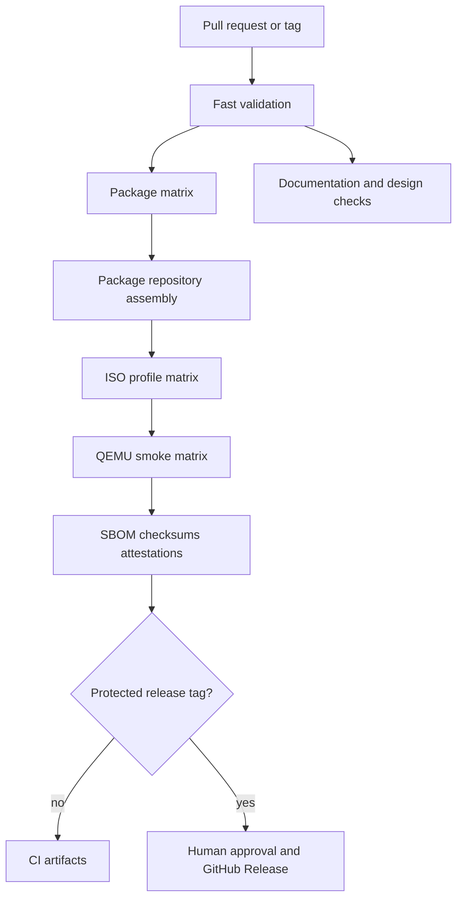

### Workflow files

The repository should contain the following workflows:

| File | Trigger | Purpose | Release authority |
|---|---|---|---|
| `.github/workflows/validate.yml` | pull request, push | Shell, Python, JSON, Markdown, PKGBUILD and policy checks | Required status check |
| `.github/workflows/packages.yml` | pull request, push, tag | Build Rain PKGBUILDs in a package matrix | Produces signed/unsigned test package artifacts |
| `.github/workflows/iso.yml` | workflow call, push, tag | Assemble Archiso profiles after package repository artifact exists | Produces ISO artifacts |
| `.github/workflows/qa.yml` | workflow call | QEMU boot/install/smoke tests for each ISO variant | Required before promotion |
| `.github/workflows/nightly.yml` | scheduled | Rebuild against current Arch packages and report drift | No automatic stable release |
| `.github/workflows/release.yml` | protected tag `v*` | Attest, sign, publish checksums/SBOM/ISO to GitHub Release | Human-approved |

### Matrix design

The initial matrix must stay small:

```yaml
strategy:
  fail-fast: false
  matrix:
    package_group: [branding, first-run, learning, recovery, update-preflight, control-center]
```

The first ISO matrix should contain only `core-kde`. Add `core-gnome`, `core-xfce`, or `core-cinnamon` only after each profile has an owner and test evidence:

```yaml
strategy:
  fail-fast: false
  matrix:
    include:
      - profile: core-kde
        desktop: kde
        support: official
      - profile: core-gnome
        desktop: gnome
        support: beta
```

The matrix must not multiply across package group, desktop, kernel, filesystem, GPU, and architecture without a declared test purpose. GitHub Actions imposes a maximum of 256 jobs per matrix, but Rain OS should remain far below that limit for cost and diagnosis clarity [31].

### Reusable workflows

Package and ISO workflows should be reusable with `workflow_call`, so pull requests, nightly builds, and release tags share the same build logic. Inputs must include `rain_ref`, `profile`, `channel`, `publish_artifacts`, and `sign_release`. Outputs must expose artifact names, checksums, package manifests, and test result paths.

### Artifact contract

Every matrix job uploads an artifact with a stable name containing the commit and matrix identity. Package jobs upload packages, repository database files, package manifests, and build logs. ISO jobs upload ISO, checksum, package manifest, SBOM, build metadata, and mkarchiso logs. QA jobs upload screenshots, serial logs, QEMU exit status, installer logs, and test summaries. Artifacts have retention appropriate to their channel; release artifacts are copied to a GitHub Release and long-term archival store.

### Cache contract

Use `actions/cache` only for reproducible accelerators such as downloaded Arch packages, language dependencies, and tool downloads. Cache keys must include the architecture, Archiso version, package repository state, profile hash, and lock/revision inputs. Never use a cache as the source of truth for a release package. A cache hit must be safe to delete and rebuild. Cache poisoning is treated as a supply-chain risk.

### Concurrency contract

Pull request and branch workflows use a concurrency group based on workflow name and branch/ref and cancel superseded runs. Release tags and signed release jobs use a unique immutable group and must never be cancelled after approval. A scheduled nightly build may be cancelled when a newer nightly run starts, but its failure report must remain visible.

Example:

```yaml
concurrency:
  group: rain-${{ github.workflow }}-${{ github.ref }}
  cancel-in-progress: ${{ !startsWith(github.ref, 'refs/tags/v') }}
```

### Permissions and trust boundaries

Workflow permissions default to read-only. The build job receives `contents: read` and `actions: read`. The attestation job receives only `id-token: write` and `attestations: write`. The release job receives `contents: write` only after protected-environment approval. Package and ISO build jobs never receive release secrets. Third-party actions are pinned to full commit SHAs and reviewed on update.

### Hosted and self-hosted runners

The project must support two runner classes. Hosted runners are preferred for validation, package compilation, documentation, and ordinary QEMU tests. ISO builds that require privileged loop devices, `/dev` access, or nested virtualization must run in an explicitly tested Arch container or an ephemeral self-hosted Linux runner. A self-hosted runner must be dedicated or ephemeral, automatically cleaned after each job, patched, access-restricted, and forbidden from storing signing keys in its workspace.

The current workflow uses an Arch container with `--privileged` and `/dev` exposure. This is a prototype path, not an unconditional production guarantee. The release readiness gate must prove that the selected runner class can mount, squash, boot-test, and clean up correctly. If hosted container privileges are unavailable, the workflow must fail clearly and route to the approved self-hosted runner label rather than silently skipping ISO creation.

### Signing and attestations

Build jobs never access private signing keys. A release promotion job in a protected GitHub Environment performs package repository signing and ISO signing only after QA passes. Prefer short-lived OIDC-backed artifact attestations where available. Store public keys in a versioned keyring package and publish checksums, SBOM, source revision, workflow run, and attestation identifiers together. Artifact attestations establish build provenance and integrity claims but do not replace package signature verification [32] [33].

### Release promotion

A tag does not immediately publish an ISO. The release workflow downloads the exact QA-approved artifacts, verifies checksums, verifies attestations, verifies the source tag, generates release notes and known issues, waits for environment approval, and then publishes the ISO, checksum, SBOM, signatures, provenance statement, installation guide, and recovery guide. Failed promotion leaves artifacts available for diagnosis but does not create a stable release.

### Pull-request behavior

Every pull request runs fast validation, syntax tests, changed-package builds, documentation link/schema checks, and a small Archiso profile sanity check where practical. Full ISO and QEMU installation tests run on changes to `archiso/`, `packages/`, `repository/`, installer files, boot files, kernel policy, or release workflows. Design-only changes run accessibility and asset checks without rebuilding every ISO variant.

### Parallel AI-agent integration

AI agents may work in parallel on independent issues, but GitHub Actions remains the source of truth. Each agent receives a bounded worktree or branch and must attach a plan, changed-file list, tests, and rollback. ECC/GSD handles planning and evidence, gstack reviews cross-functional impact, taste-skill reviews UI, ponytail reviews unnecessary complexity, Headroom is optional local context compression, and Ralph is limited to a small issue with a maximum iteration count. No agent may approve a release, access signing secrets, or merge a failing workflow.

### GitHub Actions acceptance gates

The parallel build system is accepted when: two independent runs from the same commit produce equivalent package and ISO manifests; matrix failures are isolated and diagnosable; package artifacts can be assembled without rebuilding successful matrix jobs; ISO jobs consume exact upstream artifacts; QEMU smoke tests boot the produced ISO; release jobs can verify checksums and attestations; cancelled branch runs do not cancel release runs; and the Windows WSL2 local fallback can reproduce the same profile and package manifest.

## Global acceptance rule

A feature is not complete because an agent generated code or because a package installed in a test environment. It is complete only when the relevant implementation exists, its source and license are recorded, the expected state is observable, the failure path is tested, the rollback or removal path is documented, and a human maintainer accepts the evidence.
\newpage

# Page 01: Executive decision and product boundary {#page-executive-decision-and-product-boundary}

## Requirement

This page defines **Executive decision and product boundary** as an implementation concern rather than a marketing phrase. The build layer must remain a thin, inspectable wrapper over Archiso. It must use the current installed Archiso profile, keep the repository under the WSL filesystem, and refuse unsafe host paths. The implementation artifact is a versioned script with shellcheck coverage, a clean build log, a resolved package list, a checksum, and a source revision record.

The implementation must be expressed as small Rain-owned packages, configuration overlays, or documented upstream selections. It must not create a second package manager, hide the underlying Arch command, silently add privileged services, or make an unmeasured performance claim. When an upstream component already satisfies the requirement, Rain should configure or wrap it and record the upstream version in the provenance ledger.


## Implementation contract

| Area | Required decision | Initial implementation artifact | Owner | Evidence |
|---|---|---|---|---|
| Scope | Define one supported path and explicit non-goals | PRD decision record | Product | Approved decision |
| Code/config | Prefer reuse, then configure, wrap, patch upstream, or replace | Versioned file or PKGBUILD | Engineering | Review diff |
| Data | Minimize state and document retention | Schema or state file | Platform | Migration test |
| UX | Show current state, impact, and rollback | Flow and screen contract | Design | Accessibility review |
| Security | Bound privilege and verify provenance | Policy/test | Security | Threat-model evidence |
| Release | Make failure observable and reversible | CI gate and runbook | Release | Passing gate |

## Required files and packages

The first implementation pass should inspect or update: `archiso/profiledef.sh, archiso/packages.x86_64, archiso/pacman.conf, scripts/build-iso.sh, scripts/build-windows.ps1, scripts/build-windows.bat, scripts/validate-spec.sh, tests/test-syntax.sh`. The actual list must be refined in the issue before coding; a file listed here is a planned touch point, not evidence that the feature already exists.

## Configuration contract

Configuration must be declarative where possible, validated before use, versioned, and safe when absent. Secrets must not be placed in Git, an ISO profile, an AI-agent prompt, or a desktop configuration file. Every configuration change needs a dry-run or preview path and a recovery note.

## Verification and failure handling

The task owner must add a focused test, a negative test, and a recovery test. The negative test must cover missing hardware, missing network, outdated guide metadata, invalid package signatures, unsupported application classes, insufficient disk space, and interrupted transactions where relevant. Repeated failures stop an automated loop and create a human diagnosis item.

## Exit criteria

This page exits when the implementation artifact exists, the test evidence is attached, the upstream source and license are recorded, the documentation is updated, and the feature can be removed without making Core unbootable.

\newpage

# Page 02: Current public repository audit {#page-current-public-repository-audit}

## Requirement

The repository audit found the following concrete areas: `.gitignore, CODE_OF_CONDUCT.md, CONTRIBUTING.md, LICENSE, Makefile, README.md, SECURITY.md, SKILL.md, archiso/bootstrap_packages.x86_64, archiso/packages.x86_64, archiso/pacman.conf, archiso/profiledef.sh, architecture/BUILD_PIPELINE.mmd, architecture/SYSTEM_ARCHITECTURE.mmd, branding/rain-logo.jpg, branding/rain-logo.png, branding/rain-umbrella.svg, branding/rain-wallpaper-1080p.jpg, branding/rain-wallpaper.jpg, build/BUILD_README.md, decisions/0001-profile-driven-design.md, decisions/PROVENANCE_AND_LEGAL.md, design/DESIGN_SYSTEM.md, docs/APP_FLOW.md, docs/CROSSCHECK_AND_GAPS.md, docs/DATA_MODEL.md, docs/ENGINEERING_TOOLCHAIN.md, docs/ENVIRONMENTS.md, docs/IMPLEMENTATION_PLAN.md, docs/LOOP_ENGINEERING.md, docs/MIGRATION_PLAN.md, docs/PRD.md` and additional files under the package, app, architecture, and documentation trees. The public README claims WSL2/Windows orchestration, GitHub Actions ISO builds, Core/Flow/Forge/Shield profiles, and a GPLv3 project license. The local syntax test passed and the specification validator passed.

The audit also found implementation gaps that must be treated as blockers: several PKGBUILDs use `SKIP` checksums; package repository construction tolerates build failures with `|| true`; the Windows script can build from `/mnt/<drive>` instead of the faster WSL filesystem; the live package list includes `apparmor`, `firejail`, `snapper`, and `archinstall` without proving they are configured and safe; the installer launcher references paths that are not yet a complete Rain installer product; and the guide package is not yet the signed state-aware updater described by the specification.


## Implementation contract

| Area | Required decision | Initial implementation artifact | Owner | Evidence |
|---|---|---|---|---|
| Scope | Define one supported path and explicit non-goals | PRD decision record | Product | Approved decision |
| Code/config | Prefer reuse, then configure, wrap, patch upstream, or replace | Versioned file or PKGBUILD | Engineering | Review diff |
| Data | Minimize state and document retention | Schema or state file | Platform | Migration test |
| UX | Show current state, impact, and rollback | Flow and screen contract | Design | Accessibility review |
| Security | Bound privilege and verify provenance | Policy/test | Security | Threat-model evidence |
| Release | Make failure observable and reversible | CI gate and runbook | Release | Passing gate |

## Required files and packages

The first implementation pass should inspect or update: `archiso/profiledef.sh, archiso/packages.x86_64, archiso/pacman.conf, scripts/build-iso.sh, scripts/build-windows.ps1, scripts/build-windows.bat, scripts/validate-spec.sh, tests/test-syntax.sh`. The actual list must be refined in the issue before coding; a file listed here is a planned touch point, not evidence that the feature already exists.

## Configuration contract

Configuration must be declarative where possible, validated before use, versioned, and safe when absent. Secrets must not be placed in Git, an ISO profile, an AI-agent prompt, or a desktop configuration file. Every configuration change needs a dry-run or preview path and a recovery note.

## Verification and failure handling

The task owner must add a focused test, a negative test, and a recovery test. The negative test must cover missing hardware, missing network, outdated guide metadata, invalid package signatures, unsupported application classes, insufficient disk space, and interrupted transactions where relevant. Repeated failures stop an automated loop and create a human diagnosis item.

## Exit criteria

This page exits when the implementation artifact exists, the test evidence is attached, the upstream source and license are recorded, the documentation is updated, and the feature can be removed without making Core unbootable.

\newpage

# Page 03: Prototype readiness and blockers {#page-prototype-readiness-and-blockers}

## Requirement

This page defines **Prototype readiness and blockers** as an implementation concern rather than a marketing phrase. The build layer must remain a thin, inspectable wrapper over Archiso. It must use the current installed Archiso profile, keep the repository under the WSL filesystem, and refuse unsafe host paths. The implementation artifact is a versioned script with shellcheck coverage, a clean build log, a resolved package list, a checksum, and a source revision record.

The implementation must be expressed as small Rain-owned packages, configuration overlays, or documented upstream selections. It must not create a second package manager, hide the underlying Arch command, silently add privileged services, or make an unmeasured performance claim. When an upstream component already satisfies the requirement, Rain should configure or wrap it and record the upstream version in the provenance ledger.


## Implementation contract

| Area | Required decision | Initial implementation artifact | Owner | Evidence |
|---|---|---|---|---|
| Scope | Define one supported path and explicit non-goals | PRD decision record | Product | Approved decision |
| Code/config | Prefer reuse, then configure, wrap, patch upstream, or replace | Versioned file or PKGBUILD | Engineering | Review diff |
| Data | Minimize state and document retention | Schema or state file | Platform | Migration test |
| UX | Show current state, impact, and rollback | Flow and screen contract | Design | Accessibility review |
| Security | Bound privilege and verify provenance | Policy/test | Security | Threat-model evidence |
| Release | Make failure observable and reversible | CI gate and runbook | Release | Passing gate |

## Required files and packages

The first implementation pass should inspect or update: `archiso/profiledef.sh, archiso/packages.x86_64, archiso/pacman.conf, scripts/build-iso.sh, scripts/build-windows.ps1, scripts/build-windows.bat, scripts/validate-spec.sh, tests/test-syntax.sh`. The actual list must be refined in the issue before coding; a file listed here is a planned touch point, not evidence that the feature already exists.

## Configuration contract

Configuration must be declarative where possible, validated before use, versioned, and safe when absent. Secrets must not be placed in Git, an ISO profile, an AI-agent prompt, or a desktop configuration file. Every configuration change needs a dry-run or preview path and a recovery note.

## Verification and failure handling

The task owner must add a focused test, a negative test, and a recovery test. The negative test must cover missing hardware, missing network, outdated guide metadata, invalid package signatures, unsupported application classes, insufficient disk space, and interrupted transactions where relevant. Repeated failures stop an automated loop and create a human diagnosis item.

## Exit criteria

This page exits when the implementation artifact exists, the test evidence is attached, the upstream source and license are recorded, the documentation is updated, and the feature can be removed without making Core unbootable.

\newpage

# Page 04: Commercial release definitions {#page-commercial-release-definitions}

## Requirement

This page defines **Commercial release definitions** as an implementation concern rather than a marketing phrase. Commercial readiness requires ownership, release gates, support response, package provenance, SBOMs, documented limitations, and a sustainable update process. It does not require proprietary lock-in or mandatory telemetry.

The implementation must be expressed as small Rain-owned packages, configuration overlays, or documented upstream selections. It must not create a second package manager, hide the underlying Arch command, silently add privileged services, or make an unmeasured performance claim. When an upstream component already satisfies the requirement, Rain should configure or wrap it and record the upstream version in the provenance ledger.


## Implementation contract

| Area | Required decision | Initial implementation artifact | Owner | Evidence |
|---|---|---|---|---|
| Scope | Define one supported path and explicit non-goals | PRD decision record | Product | Approved decision |
| Code/config | Prefer reuse, then configure, wrap, patch upstream, or replace | Versioned file or PKGBUILD | Engineering | Review diff |
| Data | Minimize state and document retention | Schema or state file | Platform | Migration test |
| UX | Show current state, impact, and rollback | Flow and screen contract | Design | Accessibility review |
| Security | Bound privilege and verify provenance | Policy/test | Security | Threat-model evidence |
| Release | Make failure observable and reversible | CI gate and runbook | Release | Passing gate |

## Required files and packages

The first implementation pass should inspect or update: `archiso/profiledef.sh, archiso/packages.x86_64, archiso/pacman.conf, scripts/build-iso.sh, scripts/build-windows.ps1, scripts/build-windows.bat, scripts/validate-spec.sh, tests/test-syntax.sh`. The actual list must be refined in the issue before coding; a file listed here is a planned touch point, not evidence that the feature already exists.

## Configuration contract

Configuration must be declarative where possible, validated before use, versioned, and safe when absent. Secrets must not be placed in Git, an ISO profile, an AI-agent prompt, or a desktop configuration file. Every configuration change needs a dry-run or preview path and a recovery note.

## Verification and failure handling

The task owner must add a focused test, a negative test, and a recovery test. The negative test must cover missing hardware, missing network, outdated guide metadata, invalid package signatures, unsupported application classes, insufficient disk space, and interrupted transactions where relevant. Repeated failures stop an automated loop and create a human diagnosis item.

## Exit criteria

This page exits when the implementation artifact exists, the test evidence is attached, the upstream source and license are recorded, the documentation is updated, and the feature can be removed without making Core unbootable.

\newpage

# Page 05: User demand synthesis {#page-user-demand-synthesis}

## Requirement

This page defines **User demand synthesis** as an implementation concern rather than a marketing phrase. The user experience must expose a single recommended path while preserving terminal control. Every graphical action states what changes, why it changes, which command or package performs it, and how to undo it. The first release must optimize for learnability and recovery rather than option count.

The implementation must be expressed as small Rain-owned packages, configuration overlays, or documented upstream selections. It must not create a second package manager, hide the underlying Arch command, silently add privileged services, or make an unmeasured performance claim. When an upstream component already satisfies the requirement, Rain should configure or wrap it and record the upstream version in the provenance ledger.


## Implementation contract

| Area | Required decision | Initial implementation artifact | Owner | Evidence |
|---|---|---|---|---|
| Scope | Define one supported path and explicit non-goals | PRD decision record | Product | Approved decision |
| Code/config | Prefer reuse, then configure, wrap, patch upstream, or replace | Versioned file or PKGBUILD | Engineering | Review diff |
| Data | Minimize state and document retention | Schema or state file | Platform | Migration test |
| UX | Show current state, impact, and rollback | Flow and screen contract | Design | Accessibility review |
| Security | Bound privilege and verify provenance | Policy/test | Security | Threat-model evidence |
| Release | Make failure observable and reversible | CI gate and runbook | Release | Passing gate |

## Required files and packages

The first implementation pass should inspect or update: `archiso/profiledef.sh, archiso/packages.x86_64, archiso/pacman.conf, scripts/build-iso.sh, scripts/build-windows.ps1, scripts/build-windows.bat, scripts/validate-spec.sh, tests/test-syntax.sh`. The actual list must be refined in the issue before coding; a file listed here is a planned touch point, not evidence that the feature already exists.

## Configuration contract

Configuration must be declarative where possible, validated before use, versioned, and safe when absent. Secrets must not be placed in Git, an ISO profile, an AI-agent prompt, or a desktop configuration file. Every configuration change needs a dry-run or preview path and a recovery note.

## Verification and failure handling

The task owner must add a focused test, a negative test, and a recovery test. The negative test must cover missing hardware, missing network, outdated guide metadata, invalid package signatures, unsupported application classes, insufficient disk space, and interrupted transactions where relevant. Repeated failures stop an automated loop and create a human diagnosis item.

## Exit criteria

This page exits when the implementation artifact exists, the test evidence is attached, the upstream source and license are recorded, the documentation is updated, and the feature can be removed without making Core unbootable.

\newpage

# Page 06: Personas and jobs to be done {#page-personas-and-jobs-to-be-done}

## Requirement

This page defines **Personas and jobs to be done** as an implementation concern rather than a marketing phrase. The build layer must remain a thin, inspectable wrapper over Archiso. It must use the current installed Archiso profile, keep the repository under the WSL filesystem, and refuse unsafe host paths. The implementation artifact is a versioned script with shellcheck coverage, a clean build log, a resolved package list, a checksum, and a source revision record.

The implementation must be expressed as small Rain-owned packages, configuration overlays, or documented upstream selections. It must not create a second package manager, hide the underlying Arch command, silently add privileged services, or make an unmeasured performance claim. When an upstream component already satisfies the requirement, Rain should configure or wrap it and record the upstream version in the provenance ledger.


## Implementation contract

| Area | Required decision | Initial implementation artifact | Owner | Evidence |
|---|---|---|---|---|
| Scope | Define one supported path and explicit non-goals | PRD decision record | Product | Approved decision |
| Code/config | Prefer reuse, then configure, wrap, patch upstream, or replace | Versioned file or PKGBUILD | Engineering | Review diff |
| Data | Minimize state and document retention | Schema or state file | Platform | Migration test |
| UX | Show current state, impact, and rollback | Flow and screen contract | Design | Accessibility review |
| Security | Bound privilege and verify provenance | Policy/test | Security | Threat-model evidence |
| Release | Make failure observable and reversible | CI gate and runbook | Release | Passing gate |

## Required files and packages

The first implementation pass should inspect or update: `archiso/profiledef.sh, archiso/packages.x86_64, archiso/pacman.conf, scripts/build-iso.sh, scripts/build-windows.ps1, scripts/build-windows.bat, scripts/validate-spec.sh, tests/test-syntax.sh`. The actual list must be refined in the issue before coding; a file listed here is a planned touch point, not evidence that the feature already exists.

## Configuration contract

Configuration must be declarative where possible, validated before use, versioned, and safe when absent. Secrets must not be placed in Git, an ISO profile, an AI-agent prompt, or a desktop configuration file. Every configuration change needs a dry-run or preview path and a recovery note.

## Verification and failure handling

The task owner must add a focused test, a negative test, and a recovery test. The negative test must cover missing hardware, missing network, outdated guide metadata, invalid package signatures, unsupported application classes, insufficient disk space, and interrupted transactions where relevant. Repeated failures stop an automated loop and create a human diagnosis item.

## Exit criteria

This page exits when the implementation artifact exists, the test evidence is attached, the upstream source and license are recorded, the documentation is updated, and the feature can be removed without making Core unbootable.

\newpage

# Page 07: Rain OS principles and non-goals {#page-rain-os-principles-and-non-goals}

## Requirement

This page defines **Rain OS principles and non-goals** as an implementation concern rather than a marketing phrase. The build layer must remain a thin, inspectable wrapper over Archiso. It must use the current installed Archiso profile, keep the repository under the WSL filesystem, and refuse unsafe host paths. The implementation artifact is a versioned script with shellcheck coverage, a clean build log, a resolved package list, a checksum, and a source revision record.

The implementation must be expressed as small Rain-owned packages, configuration overlays, or documented upstream selections. It must not create a second package manager, hide the underlying Arch command, silently add privileged services, or make an unmeasured performance claim. When an upstream component already satisfies the requirement, Rain should configure or wrap it and record the upstream version in the provenance ledger.


## Implementation contract

| Area | Required decision | Initial implementation artifact | Owner | Evidence |
|---|---|---|---|---|
| Scope | Define one supported path and explicit non-goals | PRD decision record | Product | Approved decision |
| Code/config | Prefer reuse, then configure, wrap, patch upstream, or replace | Versioned file or PKGBUILD | Engineering | Review diff |
| Data | Minimize state and document retention | Schema or state file | Platform | Migration test |
| UX | Show current state, impact, and rollback | Flow and screen contract | Design | Accessibility review |
| Security | Bound privilege and verify provenance | Policy/test | Security | Threat-model evidence |
| Release | Make failure observable and reversible | CI gate and runbook | Release | Passing gate |

## Required files and packages

The first implementation pass should inspect or update: `archiso/profiledef.sh, archiso/packages.x86_64, archiso/pacman.conf, scripts/build-iso.sh, scripts/build-windows.ps1, scripts/build-windows.bat, scripts/validate-spec.sh, tests/test-syntax.sh`. The actual list must be refined in the issue before coding; a file listed here is a planned touch point, not evidence that the feature already exists.

## Configuration contract

Configuration must be declarative where possible, validated before use, versioned, and safe when absent. Secrets must not be placed in Git, an ISO profile, an AI-agent prompt, or a desktop configuration file. Every configuration change needs a dry-run or preview path and a recovery note.

## Verification and failure handling

The task owner must add a focused test, a negative test, and a recovery test. The negative test must cover missing hardware, missing network, outdated guide metadata, invalid package signatures, unsupported application classes, insufficient disk space, and interrupted transactions where relevant. Repeated failures stop an automated loop and create a human diagnosis item.

## Exit criteria

This page exits when the implementation artifact exists, the test evidence is attached, the upstream source and license are recorded, the documentation is updated, and the feature can be removed without making Core unbootable.

\newpage

# Page 08: Governance and ownership {#page-governance-and-ownership}

## Requirement

This page defines **Governance and ownership** as an implementation concern rather than a marketing phrase. Commercial readiness requires ownership, release gates, support response, package provenance, SBOMs, documented limitations, and a sustainable update process. It does not require proprietary lock-in or mandatory telemetry.

The implementation must be expressed as small Rain-owned packages, configuration overlays, or documented upstream selections. It must not create a second package manager, hide the underlying Arch command, silently add privileged services, or make an unmeasured performance claim. When an upstream component already satisfies the requirement, Rain should configure or wrap it and record the upstream version in the provenance ledger.


## Implementation contract

| Area | Required decision | Initial implementation artifact | Owner | Evidence |
|---|---|---|---|---|
| Scope | Define one supported path and explicit non-goals | PRD decision record | Product | Approved decision |
| Code/config | Prefer reuse, then configure, wrap, patch upstream, or replace | Versioned file or PKGBUILD | Engineering | Review diff |
| Data | Minimize state and document retention | Schema or state file | Platform | Migration test |
| UX | Show current state, impact, and rollback | Flow and screen contract | Design | Accessibility review |
| Security | Bound privilege and verify provenance | Policy/test | Security | Threat-model evidence |
| Release | Make failure observable and reversible | CI gate and runbook | Release | Passing gate |

## Required files and packages

The first implementation pass should inspect or update: `archiso/profiledef.sh, archiso/packages.x86_64, archiso/pacman.conf, scripts/build-iso.sh, scripts/build-windows.ps1, scripts/build-windows.bat, scripts/validate-spec.sh, tests/test-syntax.sh`. The actual list must be refined in the issue before coding; a file listed here is a planned touch point, not evidence that the feature already exists.

## Configuration contract

Configuration must be declarative where possible, validated before use, versioned, and safe when absent. Secrets must not be placed in Git, an ISO profile, an AI-agent prompt, or a desktop configuration file. Every configuration change needs a dry-run or preview path and a recovery note.

## Verification and failure handling

The task owner must add a focused test, a negative test, and a recovery test. The negative test must cover missing hardware, missing network, outdated guide metadata, invalid package signatures, unsupported application classes, insufficient disk space, and interrupted transactions where relevant. Repeated failures stop an automated loop and create a human diagnosis item.

## Exit criteria

This page exits when the implementation artifact exists, the test evidence is attached, the upstream source and license are recorded, the documentation is updated, and the feature can be removed without making Core unbootable.

\newpage

# Page 09: Windows host topology {#page-windows-host-topology}

## Requirement

This page defines **Windows host topology** as an implementation concern rather than a marketing phrase. Windows compatibility is a compatibility service, not a promise that every Windows program works. Rain OS should detect the application class, recommend the least complex compatible path, show known limitations, and preserve a Windows VM fallback for software that depends on kernel drivers, anti-cheat, DRM, or unsupported APIs.

The implementation must be expressed as small Rain-owned packages, configuration overlays, or documented upstream selections. It must not create a second package manager, hide the underlying Arch command, silently add privileged services, or make an unmeasured performance claim. When an upstream component already satisfies the requirement, Rain should configure or wrap it and record the upstream version in the provenance ledger.


## Implementation contract

| Area | Required decision | Initial implementation artifact | Owner | Evidence |
|---|---|---|---|---|
| Scope | Define one supported path and explicit non-goals | PRD decision record | Product | Approved decision |
| Code/config | Prefer reuse, then configure, wrap, patch upstream, or replace | Versioned file or PKGBUILD | Engineering | Review diff |
| Data | Minimize state and document retention | Schema or state file | Platform | Migration test |
| UX | Show current state, impact, and rollback | Flow and screen contract | Design | Accessibility review |
| Security | Bound privilege and verify provenance | Policy/test | Security | Threat-model evidence |
| Release | Make failure observable and reversible | CI gate and runbook | Release | Passing gate |

## Required files and packages

The first implementation pass should inspect or update: `archiso/profiledef.sh, archiso/packages.x86_64, archiso/pacman.conf, scripts/build-iso.sh, scripts/build-windows.ps1, scripts/build-windows.bat, scripts/validate-spec.sh, tests/test-syntax.sh`. The actual list must be refined in the issue before coding; a file listed here is a planned touch point, not evidence that the feature already exists.

## Configuration contract

Configuration must be declarative where possible, validated before use, versioned, and safe when absent. Secrets must not be placed in Git, an ISO profile, an AI-agent prompt, or a desktop configuration file. Every configuration change needs a dry-run or preview path and a recovery note.

## Verification and failure handling

The task owner must add a focused test, a negative test, and a recovery test. The negative test must cover missing hardware, missing network, outdated guide metadata, invalid package signatures, unsupported application classes, insufficient disk space, and interrupted transactions where relevant. Repeated failures stop an automated loop and create a human diagnosis item.

## Exit criteria

This page exits when the implementation artifact exists, the test evidence is attached, the upstream source and license are recorded, the documentation is updated, and the feature can be removed without making Core unbootable.

\newpage

# Page 10: WSL2 installation and tuning {#page-wsl2-installation-and-tuning}

## Requirement

This page defines **WSL2 installation and tuning** as an implementation concern rather than a marketing phrase. The build layer must remain a thin, inspectable wrapper over Archiso. It must use the current installed Archiso profile, keep the repository under the WSL filesystem, and refuse unsafe host paths. The implementation artifact is a versioned script with shellcheck coverage, a clean build log, a resolved package list, a checksum, and a source revision record.

The implementation must be expressed as small Rain-owned packages, configuration overlays, or documented upstream selections. It must not create a second package manager, hide the underlying Arch command, silently add privileged services, or make an unmeasured performance claim. When an upstream component already satisfies the requirement, Rain should configure or wrap it and record the upstream version in the provenance ledger.


## Implementation contract

| Area | Required decision | Initial implementation artifact | Owner | Evidence |
|---|---|---|---|---|
| Scope | Define one supported path and explicit non-goals | PRD decision record | Product | Approved decision |
| Code/config | Prefer reuse, then configure, wrap, patch upstream, or replace | Versioned file or PKGBUILD | Engineering | Review diff |
| Data | Minimize state and document retention | Schema or state file | Platform | Migration test |
| UX | Show current state, impact, and rollback | Flow and screen contract | Design | Accessibility review |
| Security | Bound privilege and verify provenance | Policy/test | Security | Threat-model evidence |
| Release | Make failure observable and reversible | CI gate and runbook | Release | Passing gate |

## Required files and packages

The first implementation pass should inspect or update: `archiso/profiledef.sh, archiso/packages.x86_64, archiso/pacman.conf, scripts/build-iso.sh, scripts/build-windows.ps1, scripts/build-windows.bat, scripts/validate-spec.sh, tests/test-syntax.sh`. The actual list must be refined in the issue before coding; a file listed here is a planned touch point, not evidence that the feature already exists.

## Configuration contract

Configuration must be declarative where possible, validated before use, versioned, and safe when absent. Secrets must not be placed in Git, an ISO profile, an AI-agent prompt, or a desktop configuration file. Every configuration change needs a dry-run or preview path and a recovery note.

## Verification and failure handling

The task owner must add a focused test, a negative test, and a recovery test. The negative test must cover missing hardware, missing network, outdated guide metadata, invalid package signatures, unsupported application classes, insufficient disk space, and interrupted transactions where relevant. Repeated failures stop an automated loop and create a human diagnosis item.

## Exit criteria

This page exits when the implementation artifact exists, the test evidence is attached, the upstream source and license are recorded, the documentation is updated, and the feature can be removed without making Core unbootable.

\newpage

# Page 11: WSL filesystem and performance rules {#page-wsl-filesystem-and-performance-rules}

## Requirement

This page defines **WSL filesystem and performance rules** as an implementation concern rather than a marketing phrase. The build layer must remain a thin, inspectable wrapper over Archiso. It must use the current installed Archiso profile, keep the repository under the WSL filesystem, and refuse unsafe host paths. The implementation artifact is a versioned script with shellcheck coverage, a clean build log, a resolved package list, a checksum, and a source revision record.

The implementation must be expressed as small Rain-owned packages, configuration overlays, or documented upstream selections. It must not create a second package manager, hide the underlying Arch command, silently add privileged services, or make an unmeasured performance claim. When an upstream component already satisfies the requirement, Rain should configure or wrap it and record the upstream version in the provenance ledger.


## Implementation contract

| Area | Required decision | Initial implementation artifact | Owner | Evidence |
|---|---|---|---|---|
| Scope | Define one supported path and explicit non-goals | PRD decision record | Product | Approved decision |
| Code/config | Prefer reuse, then configure, wrap, patch upstream, or replace | Versioned file or PKGBUILD | Engineering | Review diff |
| Data | Minimize state and document retention | Schema or state file | Platform | Migration test |
| UX | Show current state, impact, and rollback | Flow and screen contract | Design | Accessibility review |
| Security | Bound privilege and verify provenance | Policy/test | Security | Threat-model evidence |
| Release | Make failure observable and reversible | CI gate and runbook | Release | Passing gate |

## Required files and packages

The first implementation pass should inspect or update: `archiso/profiledef.sh, archiso/packages.x86_64, archiso/pacman.conf, scripts/build-iso.sh, scripts/build-windows.ps1, scripts/build-windows.bat, scripts/validate-spec.sh, tests/test-syntax.sh`. The actual list must be refined in the issue before coding; a file listed here is a planned touch point, not evidence that the feature already exists.

## Configuration contract

Configuration must be declarative where possible, validated before use, versioned, and safe when absent. Secrets must not be placed in Git, an ISO profile, an AI-agent prompt, or a desktop configuration file. Every configuration change needs a dry-run or preview path and a recovery note.

## Verification and failure handling

The task owner must add a focused test, a negative test, and a recovery test. The negative test must cover missing hardware, missing network, outdated guide metadata, invalid package signatures, unsupported application classes, insufficient disk space, and interrupted transactions where relevant. Repeated failures stop an automated loop and create a human diagnosis item.

## Exit criteria

This page exits when the implementation artifact exists, the test evidence is attached, the upstream source and license are recorded, the documentation is updated, and the feature can be removed without making Core unbootable.

\newpage

# Page 12: AI builder toolchain topology {#page-ai-builder-toolchain-topology}

## Requirement

This page defines **AI builder toolchain topology** as an implementation concern rather than a marketing phrase. The build layer must remain a thin, inspectable wrapper over Archiso. It must use the current installed Archiso profile, keep the repository under the WSL filesystem, and refuse unsafe host paths. The implementation artifact is a versioned script with shellcheck coverage, a clean build log, a resolved package list, a checksum, and a source revision record.

The implementation must be expressed as small Rain-owned packages, configuration overlays, or documented upstream selections. It must not create a second package manager, hide the underlying Arch command, silently add privileged services, or make an unmeasured performance claim. When an upstream component already satisfies the requirement, Rain should configure or wrap it and record the upstream version in the provenance ledger.


## Implementation contract

| Area | Required decision | Initial implementation artifact | Owner | Evidence |
|---|---|---|---|---|
| Scope | Define one supported path and explicit non-goals | PRD decision record | Product | Approved decision |
| Code/config | Prefer reuse, then configure, wrap, patch upstream, or replace | Versioned file or PKGBUILD | Engineering | Review diff |
| Data | Minimize state and document retention | Schema or state file | Platform | Migration test |
| UX | Show current state, impact, and rollback | Flow and screen contract | Design | Accessibility review |
| Security | Bound privilege and verify provenance | Policy/test | Security | Threat-model evidence |
| Release | Make failure observable and reversible | CI gate and runbook | Release | Passing gate |

## Required files and packages

The first implementation pass should inspect or update: `archiso/profiledef.sh, archiso/packages.x86_64, archiso/pacman.conf, scripts/build-iso.sh, scripts/build-windows.ps1, scripts/build-windows.bat, scripts/validate-spec.sh, tests/test-syntax.sh`. The actual list must be refined in the issue before coding; a file listed here is a planned touch point, not evidence that the feature already exists.

## Configuration contract

Configuration must be declarative where possible, validated before use, versioned, and safe when absent. Secrets must not be placed in Git, an ISO profile, an AI-agent prompt, or a desktop configuration file. Every configuration change needs a dry-run or preview path and a recovery note.

## Verification and failure handling

The task owner must add a focused test, a negative test, and a recovery test. The negative test must cover missing hardware, missing network, outdated guide metadata, invalid package signatures, unsupported application classes, insufficient disk space, and interrupted transactions where relevant. Repeated failures stop an automated loop and create a human diagnosis item.

## Exit criteria

This page exits when the implementation artifact exists, the test evidence is attached, the upstream source and license are recorded, the documentation is updated, and the feature can be removed without making Core unbootable.

\newpage

# Page 13: AI tool permissions and secrets {#page-ai-tool-permissions-and-secrets}

## Requirement

This page defines **AI tool permissions and secrets** as an implementation concern rather than a marketing phrase. The build layer must remain a thin, inspectable wrapper over Archiso. It must use the current installed Archiso profile, keep the repository under the WSL filesystem, and refuse unsafe host paths. The implementation artifact is a versioned script with shellcheck coverage, a clean build log, a resolved package list, a checksum, and a source revision record.

The implementation must be expressed as small Rain-owned packages, configuration overlays, or documented upstream selections. It must not create a second package manager, hide the underlying Arch command, silently add privileged services, or make an unmeasured performance claim. When an upstream component already satisfies the requirement, Rain should configure or wrap it and record the upstream version in the provenance ledger.


## Implementation contract

| Area | Required decision | Initial implementation artifact | Owner | Evidence |
|---|---|---|---|---|
| Scope | Define one supported path and explicit non-goals | PRD decision record | Product | Approved decision |
| Code/config | Prefer reuse, then configure, wrap, patch upstream, or replace | Versioned file or PKGBUILD | Engineering | Review diff |
| Data | Minimize state and document retention | Schema or state file | Platform | Migration test |
| UX | Show current state, impact, and rollback | Flow and screen contract | Design | Accessibility review |
| Security | Bound privilege and verify provenance | Policy/test | Security | Threat-model evidence |
| Release | Make failure observable and reversible | CI gate and runbook | Release | Passing gate |

## Required files and packages

The first implementation pass should inspect or update: `archiso/profiledef.sh, archiso/packages.x86_64, archiso/pacman.conf, scripts/build-iso.sh, scripts/build-windows.ps1, scripts/build-windows.bat, scripts/validate-spec.sh, tests/test-syntax.sh`. The actual list must be refined in the issue before coding; a file listed here is a planned touch point, not evidence that the feature already exists.

## Configuration contract

Configuration must be declarative where possible, validated before use, versioned, and safe when absent. Secrets must not be placed in Git, an ISO profile, an AI-agent prompt, or a desktop configuration file. Every configuration change needs a dry-run or preview path and a recovery note.

## Verification and failure handling

The task owner must add a focused test, a negative test, and a recovery test. The negative test must cover missing hardware, missing network, outdated guide metadata, invalid package signatures, unsupported application classes, insufficient disk space, and interrupted transactions where relevant. Repeated failures stop an automated loop and create a human diagnosis item.

## Exit criteria

This page exits when the implementation artifact exists, the test evidence is attached, the upstream source and license are recorded, the documentation is updated, and the feature can be removed without making Core unbootable.

\newpage

# Page 14: GSD phase loop {#page-gsd-phase-loop}

## Requirement

This page defines **GSD phase loop** as an implementation concern rather than a marketing phrase. The build layer must remain a thin, inspectable wrapper over Archiso. It must use the current installed Archiso profile, keep the repository under the WSL filesystem, and refuse unsafe host paths. The implementation artifact is a versioned script with shellcheck coverage, a clean build log, a resolved package list, a checksum, and a source revision record.

The implementation must be expressed as small Rain-owned packages, configuration overlays, or documented upstream selections. It must not create a second package manager, hide the underlying Arch command, silently add privileged services, or make an unmeasured performance claim. When an upstream component already satisfies the requirement, Rain should configure or wrap it and record the upstream version in the provenance ledger.


## Implementation contract

| Area | Required decision | Initial implementation artifact | Owner | Evidence |
|---|---|---|---|---|
| Scope | Define one supported path and explicit non-goals | PRD decision record | Product | Approved decision |
| Code/config | Prefer reuse, then configure, wrap, patch upstream, or replace | Versioned file or PKGBUILD | Engineering | Review diff |
| Data | Minimize state and document retention | Schema or state file | Platform | Migration test |
| UX | Show current state, impact, and rollback | Flow and screen contract | Design | Accessibility review |
| Security | Bound privilege and verify provenance | Policy/test | Security | Threat-model evidence |
| Release | Make failure observable and reversible | CI gate and runbook | Release | Passing gate |

## Required files and packages

The first implementation pass should inspect or update: `archiso/profiledef.sh, archiso/packages.x86_64, archiso/pacman.conf, scripts/build-iso.sh, scripts/build-windows.ps1, scripts/build-windows.bat, scripts/validate-spec.sh, tests/test-syntax.sh`. The actual list must be refined in the issue before coding; a file listed here is a planned touch point, not evidence that the feature already exists.

## Configuration contract

Configuration must be declarative where possible, validated before use, versioned, and safe when absent. Secrets must not be placed in Git, an ISO profile, an AI-agent prompt, or a desktop configuration file. Every configuration change needs a dry-run or preview path and a recovery note.

## Verification and failure handling

The task owner must add a focused test, a negative test, and a recovery test. The negative test must cover missing hardware, missing network, outdated guide metadata, invalid package signatures, unsupported application classes, insufficient disk space, and interrupted transactions where relevant. Repeated failures stop an automated loop and create a human diagnosis item.

## Exit criteria

This page exits when the implementation artifact exists, the test evidence is attached, the upstream source and license are recorded, the documentation is updated, and the feature can be removed without making Core unbootable.

\newpage

# Page 15: ECC evidence and TDD loop {#page-ecc-evidence-and-tdd-loop}

## Requirement

This page defines **ECC evidence and TDD loop** as an implementation concern rather than a marketing phrase. The build layer must remain a thin, inspectable wrapper over Archiso. It must use the current installed Archiso profile, keep the repository under the WSL filesystem, and refuse unsafe host paths. The implementation artifact is a versioned script with shellcheck coverage, a clean build log, a resolved package list, a checksum, and a source revision record.

The implementation must be expressed as small Rain-owned packages, configuration overlays, or documented upstream selections. It must not create a second package manager, hide the underlying Arch command, silently add privileged services, or make an unmeasured performance claim. When an upstream component already satisfies the requirement, Rain should configure or wrap it and record the upstream version in the provenance ledger.


## Implementation contract

| Area | Required decision | Initial implementation artifact | Owner | Evidence |
|---|---|---|---|---|
| Scope | Define one supported path and explicit non-goals | PRD decision record | Product | Approved decision |
| Code/config | Prefer reuse, then configure, wrap, patch upstream, or replace | Versioned file or PKGBUILD | Engineering | Review diff |
| Data | Minimize state and document retention | Schema or state file | Platform | Migration test |
| UX | Show current state, impact, and rollback | Flow and screen contract | Design | Accessibility review |
| Security | Bound privilege and verify provenance | Policy/test | Security | Threat-model evidence |
| Release | Make failure observable and reversible | CI gate and runbook | Release | Passing gate |

## Required files and packages

The first implementation pass should inspect or update: `archiso/profiledef.sh, archiso/packages.x86_64, archiso/pacman.conf, scripts/build-iso.sh, scripts/build-windows.ps1, scripts/build-windows.bat, scripts/validate-spec.sh, tests/test-syntax.sh`. The actual list must be refined in the issue before coding; a file listed here is a planned touch point, not evidence that the feature already exists.

## Configuration contract

Configuration must be declarative where possible, validated before use, versioned, and safe when absent. Secrets must not be placed in Git, an ISO profile, an AI-agent prompt, or a desktop configuration file. Every configuration change needs a dry-run or preview path and a recovery note.

## Verification and failure handling

The task owner must add a focused test, a negative test, and a recovery test. The negative test must cover missing hardware, missing network, outdated guide metadata, invalid package signatures, unsupported application classes, insufficient disk space, and interrupted transactions where relevant. Repeated failures stop an automated loop and create a human diagnosis item.

## Exit criteria

This page exits when the implementation artifact exists, the test evidence is attached, the upstream source and license are recorded, the documentation is updated, and the feature can be removed without making Core unbootable.

\newpage

# Page 16: gstack review gates {#page-gstack-review-gates}

## Requirement

This page defines **gstack review gates** as an implementation concern rather than a marketing phrase. The build layer must remain a thin, inspectable wrapper over Archiso. It must use the current installed Archiso profile, keep the repository under the WSL filesystem, and refuse unsafe host paths. The implementation artifact is a versioned script with shellcheck coverage, a clean build log, a resolved package list, a checksum, and a source revision record.

The implementation must be expressed as small Rain-owned packages, configuration overlays, or documented upstream selections. It must not create a second package manager, hide the underlying Arch command, silently add privileged services, or make an unmeasured performance claim. When an upstream component already satisfies the requirement, Rain should configure or wrap it and record the upstream version in the provenance ledger.


## Implementation contract

| Area | Required decision | Initial implementation artifact | Owner | Evidence |
|---|---|---|---|---|
| Scope | Define one supported path and explicit non-goals | PRD decision record | Product | Approved decision |
| Code/config | Prefer reuse, then configure, wrap, patch upstream, or replace | Versioned file or PKGBUILD | Engineering | Review diff |
| Data | Minimize state and document retention | Schema or state file | Platform | Migration test |
| UX | Show current state, impact, and rollback | Flow and screen contract | Design | Accessibility review |
| Security | Bound privilege and verify provenance | Policy/test | Security | Threat-model evidence |
| Release | Make failure observable and reversible | CI gate and runbook | Release | Passing gate |

## Required files and packages

The first implementation pass should inspect or update: `archiso/profiledef.sh, archiso/packages.x86_64, archiso/pacman.conf, scripts/build-iso.sh, scripts/build-windows.ps1, scripts/build-windows.bat, scripts/validate-spec.sh, tests/test-syntax.sh`. The actual list must be refined in the issue before coding; a file listed here is a planned touch point, not evidence that the feature already exists.

## Configuration contract

Configuration must be declarative where possible, validated before use, versioned, and safe when absent. Secrets must not be placed in Git, an ISO profile, an AI-agent prompt, or a desktop configuration file. Every configuration change needs a dry-run or preview path and a recovery note.

## Verification and failure handling

The task owner must add a focused test, a negative test, and a recovery test. The negative test must cover missing hardware, missing network, outdated guide metadata, invalid package signatures, unsupported application classes, insufficient disk space, and interrupted transactions where relevant. Repeated failures stop an automated loop and create a human diagnosis item.

## Exit criteria

This page exits when the implementation artifact exists, the test evidence is attached, the upstream source and license are recorded, the documentation is updated, and the feature can be removed without making Core unbootable.

\newpage

# Page 17: taste-skill design review {#page-taste-skill-design-review}

## Requirement

This page defines **taste-skill design review** as an implementation concern rather than a marketing phrase. The build layer must remain a thin, inspectable wrapper over Archiso. It must use the current installed Archiso profile, keep the repository under the WSL filesystem, and refuse unsafe host paths. The implementation artifact is a versioned script with shellcheck coverage, a clean build log, a resolved package list, a checksum, and a source revision record.

The implementation must be expressed as small Rain-owned packages, configuration overlays, or documented upstream selections. It must not create a second package manager, hide the underlying Arch command, silently add privileged services, or make an unmeasured performance claim. When an upstream component already satisfies the requirement, Rain should configure or wrap it and record the upstream version in the provenance ledger.


## Implementation contract

| Area | Required decision | Initial implementation artifact | Owner | Evidence |
|---|---|---|---|---|
| Scope | Define one supported path and explicit non-goals | PRD decision record | Product | Approved decision |
| Code/config | Prefer reuse, then configure, wrap, patch upstream, or replace | Versioned file or PKGBUILD | Engineering | Review diff |
| Data | Minimize state and document retention | Schema or state file | Platform | Migration test |
| UX | Show current state, impact, and rollback | Flow and screen contract | Design | Accessibility review |
| Security | Bound privilege and verify provenance | Policy/test | Security | Threat-model evidence |
| Release | Make failure observable and reversible | CI gate and runbook | Release | Passing gate |

## Required files and packages

The first implementation pass should inspect or update: `archiso/profiledef.sh, archiso/packages.x86_64, archiso/pacman.conf, scripts/build-iso.sh, scripts/build-windows.ps1, scripts/build-windows.bat, scripts/validate-spec.sh, tests/test-syntax.sh`. The actual list must be refined in the issue before coding; a file listed here is a planned touch point, not evidence that the feature already exists.

## Configuration contract

Configuration must be declarative where possible, validated before use, versioned, and safe when absent. Secrets must not be placed in Git, an ISO profile, an AI-agent prompt, or a desktop configuration file. Every configuration change needs a dry-run or preview path and a recovery note.

## Verification and failure handling

The task owner must add a focused test, a negative test, and a recovery test. The negative test must cover missing hardware, missing network, outdated guide metadata, invalid package signatures, unsupported application classes, insufficient disk space, and interrupted transactions where relevant. Repeated failures stop an automated loop and create a human diagnosis item.

## Exit criteria

This page exits when the implementation artifact exists, the test evidence is attached, the upstream source and license are recorded, the documentation is updated, and the feature can be removed without making Core unbootable.

\newpage

# Page 18: ponytail minimality review {#page-ponytail-minimality-review}

## Requirement

This page defines **ponytail minimality review** as an implementation concern rather than a marketing phrase. The build layer must remain a thin, inspectable wrapper over Archiso. It must use the current installed Archiso profile, keep the repository under the WSL filesystem, and refuse unsafe host paths. The implementation artifact is a versioned script with shellcheck coverage, a clean build log, a resolved package list, a checksum, and a source revision record.

The implementation must be expressed as small Rain-owned packages, configuration overlays, or documented upstream selections. It must not create a second package manager, hide the underlying Arch command, silently add privileged services, or make an unmeasured performance claim. When an upstream component already satisfies the requirement, Rain should configure or wrap it and record the upstream version in the provenance ledger.


## Implementation contract

| Area | Required decision | Initial implementation artifact | Owner | Evidence |
|---|---|---|---|---|
| Scope | Define one supported path and explicit non-goals | PRD decision record | Product | Approved decision |
| Code/config | Prefer reuse, then configure, wrap, patch upstream, or replace | Versioned file or PKGBUILD | Engineering | Review diff |
| Data | Minimize state and document retention | Schema or state file | Platform | Migration test |
| UX | Show current state, impact, and rollback | Flow and screen contract | Design | Accessibility review |
| Security | Bound privilege and verify provenance | Policy/test | Security | Threat-model evidence |
| Release | Make failure observable and reversible | CI gate and runbook | Release | Passing gate |

## Required files and packages

The first implementation pass should inspect or update: `archiso/profiledef.sh, archiso/packages.x86_64, archiso/pacman.conf, scripts/build-iso.sh, scripts/build-windows.ps1, scripts/build-windows.bat, scripts/validate-spec.sh, tests/test-syntax.sh`. The actual list must be refined in the issue before coding; a file listed here is a planned touch point, not evidence that the feature already exists.

## Configuration contract

Configuration must be declarative where possible, validated before use, versioned, and safe when absent. Secrets must not be placed in Git, an ISO profile, an AI-agent prompt, or a desktop configuration file. Every configuration change needs a dry-run or preview path and a recovery note.

## Verification and failure handling

The task owner must add a focused test, a negative test, and a recovery test. The negative test must cover missing hardware, missing network, outdated guide metadata, invalid package signatures, unsupported application classes, insufficient disk space, and interrupted transactions where relevant. Repeated failures stop an automated loop and create a human diagnosis item.

## Exit criteria

This page exits when the implementation artifact exists, the test evidence is attached, the upstream source and license are recorded, the documentation is updated, and the feature can be removed without making Core unbootable.

\newpage

# Page 19: Headroom and local context policy {#page-headroom-and-local-context-policy}

## Requirement

This page defines **Headroom and local context policy** as an implementation concern rather than a marketing phrase. The build layer must remain a thin, inspectable wrapper over Archiso. It must use the current installed Archiso profile, keep the repository under the WSL filesystem, and refuse unsafe host paths. The implementation artifact is a versioned script with shellcheck coverage, a clean build log, a resolved package list, a checksum, and a source revision record.

The implementation must be expressed as small Rain-owned packages, configuration overlays, or documented upstream selections. It must not create a second package manager, hide the underlying Arch command, silently add privileged services, or make an unmeasured performance claim. When an upstream component already satisfies the requirement, Rain should configure or wrap it and record the upstream version in the provenance ledger.


## Implementation contract

| Area | Required decision | Initial implementation artifact | Owner | Evidence |
|---|---|---|---|---|
| Scope | Define one supported path and explicit non-goals | PRD decision record | Product | Approved decision |
| Code/config | Prefer reuse, then configure, wrap, patch upstream, or replace | Versioned file or PKGBUILD | Engineering | Review diff |
| Data | Minimize state and document retention | Schema or state file | Platform | Migration test |
| UX | Show current state, impact, and rollback | Flow and screen contract | Design | Accessibility review |
| Security | Bound privilege and verify provenance | Policy/test | Security | Threat-model evidence |
| Release | Make failure observable and reversible | CI gate and runbook | Release | Passing gate |

## Required files and packages

The first implementation pass should inspect or update: `archiso/profiledef.sh, archiso/packages.x86_64, archiso/pacman.conf, scripts/build-iso.sh, scripts/build-windows.ps1, scripts/build-windows.bat, scripts/validate-spec.sh, tests/test-syntax.sh`. The actual list must be refined in the issue before coding; a file listed here is a planned touch point, not evidence that the feature already exists.

## Configuration contract

Configuration must be declarative where possible, validated before use, versioned, and safe when absent. Secrets must not be placed in Git, an ISO profile, an AI-agent prompt, or a desktop configuration file. Every configuration change needs a dry-run or preview path and a recovery note.

## Verification and failure handling

The task owner must add a focused test, a negative test, and a recovery test. The negative test must cover missing hardware, missing network, outdated guide metadata, invalid package signatures, unsupported application classes, insufficient disk space, and interrupted transactions where relevant. Repeated failures stop an automated loop and create a human diagnosis item.

## Exit criteria

This page exits when the implementation artifact exists, the test evidence is attached, the upstream source and license are recorded, the documentation is updated, and the feature can be removed without making Core unbootable.

\newpage

# Page 20: Skill discovery and provenance {#page-skill-discovery-and-provenance}

## Requirement

This page defines **Skill discovery and provenance** as an implementation concern rather than a marketing phrase. The build layer must remain a thin, inspectable wrapper over Archiso. It must use the current installed Archiso profile, keep the repository under the WSL filesystem, and refuse unsafe host paths. The implementation artifact is a versioned script with shellcheck coverage, a clean build log, a resolved package list, a checksum, and a source revision record.

The implementation must be expressed as small Rain-owned packages, configuration overlays, or documented upstream selections. It must not create a second package manager, hide the underlying Arch command, silently add privileged services, or make an unmeasured performance claim. When an upstream component already satisfies the requirement, Rain should configure or wrap it and record the upstream version in the provenance ledger.


## Implementation contract

| Area | Required decision | Initial implementation artifact | Owner | Evidence |
|---|---|---|---|---|
| Scope | Define one supported path and explicit non-goals | PRD decision record | Product | Approved decision |
| Code/config | Prefer reuse, then configure, wrap, patch upstream, or replace | Versioned file or PKGBUILD | Engineering | Review diff |
| Data | Minimize state and document retention | Schema or state file | Platform | Migration test |
| UX | Show current state, impact, and rollback | Flow and screen contract | Design | Accessibility review |
| Security | Bound privilege and verify provenance | Policy/test | Security | Threat-model evidence |
| Release | Make failure observable and reversible | CI gate and runbook | Release | Passing gate |

## Required files and packages

The first implementation pass should inspect or update: `archiso/profiledef.sh, archiso/packages.x86_64, archiso/pacman.conf, scripts/build-iso.sh, scripts/build-windows.ps1, scripts/build-windows.bat, scripts/validate-spec.sh, tests/test-syntax.sh`. The actual list must be refined in the issue before coding; a file listed here is a planned touch point, not evidence that the feature already exists.

## Configuration contract

Configuration must be declarative where possible, validated before use, versioned, and safe when absent. Secrets must not be placed in Git, an ISO profile, an AI-agent prompt, or a desktop configuration file. Every configuration change needs a dry-run or preview path and a recovery note.

## Verification and failure handling

The task owner must add a focused test, a negative test, and a recovery test. The negative test must cover missing hardware, missing network, outdated guide metadata, invalid package signatures, unsupported application classes, insufficient disk space, and interrupted transactions where relevant. Repeated failures stop an automated loop and create a human diagnosis item.

## Exit criteria

This page exits when the implementation artifact exists, the test evidence is attached, the upstream source and license are recorded, the documentation is updated, and the feature can be removed without making Core unbootable.

\newpage

# Page 21: Ralph bounded iteration {#page-ralph-bounded-iteration}

## Requirement

This page defines **Ralph bounded iteration** as an implementation concern rather than a marketing phrase. The build layer must remain a thin, inspectable wrapper over Archiso. It must use the current installed Archiso profile, keep the repository under the WSL filesystem, and refuse unsafe host paths. The implementation artifact is a versioned script with shellcheck coverage, a clean build log, a resolved package list, a checksum, and a source revision record.

The implementation must be expressed as small Rain-owned packages, configuration overlays, or documented upstream selections. It must not create a second package manager, hide the underlying Arch command, silently add privileged services, or make an unmeasured performance claim. When an upstream component already satisfies the requirement, Rain should configure or wrap it and record the upstream version in the provenance ledger.


## Implementation contract

| Area | Required decision | Initial implementation artifact | Owner | Evidence |
|---|---|---|---|---|
| Scope | Define one supported path and explicit non-goals | PRD decision record | Product | Approved decision |
| Code/config | Prefer reuse, then configure, wrap, patch upstream, or replace | Versioned file or PKGBUILD | Engineering | Review diff |
| Data | Minimize state and document retention | Schema or state file | Platform | Migration test |
| UX | Show current state, impact, and rollback | Flow and screen contract | Design | Accessibility review |
| Security | Bound privilege and verify provenance | Policy/test | Security | Threat-model evidence |
| Release | Make failure observable and reversible | CI gate and runbook | Release | Passing gate |

## Required files and packages

The first implementation pass should inspect or update: `archiso/profiledef.sh, archiso/packages.x86_64, archiso/pacman.conf, scripts/build-iso.sh, scripts/build-windows.ps1, scripts/build-windows.bat, scripts/validate-spec.sh, tests/test-syntax.sh`. The actual list must be refined in the issue before coding; a file listed here is a planned touch point, not evidence that the feature already exists.

## Configuration contract

Configuration must be declarative where possible, validated before use, versioned, and safe when absent. Secrets must not be placed in Git, an ISO profile, an AI-agent prompt, or a desktop configuration file. Every configuration change needs a dry-run or preview path and a recovery note.

## Verification and failure handling

The task owner must add a focused test, a negative test, and a recovery test. The negative test must cover missing hardware, missing network, outdated guide metadata, invalid package signatures, unsupported application classes, insufficient disk space, and interrupted transactions where relevant. Repeated failures stop an automated loop and create a human diagnosis item.

## Exit criteria

This page exits when the implementation artifact exists, the test evidence is attached, the upstream source and license are recorded, the documentation is updated, and the feature can be removed without making Core unbootable.

\newpage

# Page 22: One-loop task state machine {#page-one-loop-task-state-machine}

## Requirement

This page defines **One-loop task state machine** as an implementation concern rather than a marketing phrase. The build layer must remain a thin, inspectable wrapper over Archiso. It must use the current installed Archiso profile, keep the repository under the WSL filesystem, and refuse unsafe host paths. The implementation artifact is a versioned script with shellcheck coverage, a clean build log, a resolved package list, a checksum, and a source revision record.

The implementation must be expressed as small Rain-owned packages, configuration overlays, or documented upstream selections. It must not create a second package manager, hide the underlying Arch command, silently add privileged services, or make an unmeasured performance claim. When an upstream component already satisfies the requirement, Rain should configure or wrap it and record the upstream version in the provenance ledger.


## Implementation contract

| Area | Required decision | Initial implementation artifact | Owner | Evidence |
|---|---|---|---|---|
| Scope | Define one supported path and explicit non-goals | PRD decision record | Product | Approved decision |
| Code/config | Prefer reuse, then configure, wrap, patch upstream, or replace | Versioned file or PKGBUILD | Engineering | Review diff |
| Data | Minimize state and document retention | Schema or state file | Platform | Migration test |
| UX | Show current state, impact, and rollback | Flow and screen contract | Design | Accessibility review |
| Security | Bound privilege and verify provenance | Policy/test | Security | Threat-model evidence |
| Release | Make failure observable and reversible | CI gate and runbook | Release | Passing gate |

## Required files and packages

The first implementation pass should inspect or update: `archiso/profiledef.sh, archiso/packages.x86_64, archiso/pacman.conf, scripts/build-iso.sh, scripts/build-windows.ps1, scripts/build-windows.bat, scripts/validate-spec.sh, tests/test-syntax.sh`. The actual list must be refined in the issue before coding; a file listed here is a planned touch point, not evidence that the feature already exists.

## Configuration contract

Configuration must be declarative where possible, validated before use, versioned, and safe when absent. Secrets must not be placed in Git, an ISO profile, an AI-agent prompt, or a desktop configuration file. Every configuration change needs a dry-run or preview path and a recovery note.

## Verification and failure handling

The task owner must add a focused test, a negative test, and a recovery test. The negative test must cover missing hardware, missing network, outdated guide metadata, invalid package signatures, unsupported application classes, insufficient disk space, and interrupted transactions where relevant. Repeated failures stop an automated loop and create a human diagnosis item.

## Exit criteria

This page exits when the implementation artifact exists, the test evidence is attached, the upstream source and license are recorded, the documentation is updated, and the feature can be removed without making Core unbootable.

\newpage

# Page 23: Archiso profile contract {#page-archiso-profile-contract}

## Requirement

This page defines **Archiso profile contract** as an implementation concern rather than a marketing phrase. The user experience must expose a single recommended path while preserving terminal control. Every graphical action states what changes, why it changes, which command or package performs it, and how to undo it. The first release must optimize for learnability and recovery rather than option count.

The implementation must be expressed as small Rain-owned packages, configuration overlays, or documented upstream selections. It must not create a second package manager, hide the underlying Arch command, silently add privileged services, or make an unmeasured performance claim. When an upstream component already satisfies the requirement, Rain should configure or wrap it and record the upstream version in the provenance ledger.


## Implementation contract

| Area | Required decision | Initial implementation artifact | Owner | Evidence |
|---|---|---|---|---|
| Scope | Define one supported path and explicit non-goals | PRD decision record | Product | Approved decision |
| Code/config | Prefer reuse, then configure, wrap, patch upstream, or replace | Versioned file or PKGBUILD | Engineering | Review diff |
| Data | Minimize state and document retention | Schema or state file | Platform | Migration test |
| UX | Show current state, impact, and rollback | Flow and screen contract | Design | Accessibility review |
| Security | Bound privilege and verify provenance | Policy/test | Security | Threat-model evidence |
| Release | Make failure observable and reversible | CI gate and runbook | Release | Passing gate |

## Required files and packages

The first implementation pass should inspect or update: `archiso/profiledef.sh, archiso/packages.x86_64, archiso/pacman.conf, scripts/build-iso.sh, scripts/build-windows.ps1, scripts/build-windows.bat, scripts/validate-spec.sh, tests/test-syntax.sh`. The actual list must be refined in the issue before coding; a file listed here is a planned touch point, not evidence that the feature already exists.

## Configuration contract

Configuration must be declarative where possible, validated before use, versioned, and safe when absent. Secrets must not be placed in Git, an ISO profile, an AI-agent prompt, or a desktop configuration file. Every configuration change needs a dry-run or preview path and a recovery note.

## Verification and failure handling

The task owner must add a focused test, a negative test, and a recovery test. The negative test must cover missing hardware, missing network, outdated guide metadata, invalid package signatures, unsupported application classes, insufficient disk space, and interrupted transactions where relevant. Repeated failures stop an automated loop and create a human diagnosis item.

## Exit criteria

This page exits when the implementation artifact exists, the test evidence is attached, the upstream source and license are recorded, the documentation is updated, and the feature can be removed without making Core unbootable.

\newpage

# Page 24: One-shot build command {#page-one-shot-build-command}

## Requirement

The canonical command must be `./scripts/build-one-shot.sh` inside Arch WSL2. The PowerShell wrapper must call WSL with a Linux path under `/home`, not translate a Windows repository path to `/mnt/c`. The script must update or verify the Arch keyring, install `archiso`, copy the current `releng` profile, overlay Rain files, build Rain packages in a non-root `makepkg` context, create a signed local repository, invoke `mkarchiso`, run QEMU smoke tests where possible, and write ISO, checksum, SBOM, package manifest, build log, and source revision metadata.

The command is “one shot” in the sense that it orchestrates the complete artifact pipeline. It cannot truthfully guarantee hardware compatibility without the VM and hardware gates described later.


## Implementation contract

| Area | Required decision | Initial implementation artifact | Owner | Evidence |
|---|---|---|---|---|
| Scope | Define one supported path and explicit non-goals | PRD decision record | Product | Approved decision |
| Code/config | Prefer reuse, then configure, wrap, patch upstream, or replace | Versioned file or PKGBUILD | Engineering | Review diff |
| Data | Minimize state and document retention | Schema or state file | Platform | Migration test |
| UX | Show current state, impact, and rollback | Flow and screen contract | Design | Accessibility review |
| Security | Bound privilege and verify provenance | Policy/test | Security | Threat-model evidence |
| Release | Make failure observable and reversible | CI gate and runbook | Release | Passing gate |

## Required files and packages

The first implementation pass should inspect or update: `archiso/profiledef.sh, archiso/packages.x86_64, archiso/pacman.conf, scripts/build-iso.sh, scripts/build-windows.ps1, scripts/build-windows.bat, scripts/validate-spec.sh, tests/test-syntax.sh`. The actual list must be refined in the issue before coding; a file listed here is a planned touch point, not evidence that the feature already exists.

## Configuration contract

Configuration must be declarative where possible, validated before use, versioned, and safe when absent. Secrets must not be placed in Git, an ISO profile, an AI-agent prompt, or a desktop configuration file. Every configuration change needs a dry-run or preview path and a recovery note.

## Verification and failure handling

The task owner must add a focused test, a negative test, and a recovery test. The negative test must cover missing hardware, missing network, outdated guide metadata, invalid package signatures, unsupported application classes, insufficient disk space, and interrupted transactions where relevant. Repeated failures stop an automated loop and create a human diagnosis item.

## Exit criteria

This page exits when the implementation artifact exists, the test evidence is attached, the upstream source and license are recorded, the documentation is updated, and the feature can be removed without making Core unbootable.

\newpage

# Page 25: Build cache and acceleration {#page-build-cache-and-acceleration}

## Requirement

This page defines **Build cache and acceleration** as an implementation concern rather than a marketing phrase. The build layer must remain a thin, inspectable wrapper over Archiso. It must use the current installed Archiso profile, keep the repository under the WSL filesystem, and refuse unsafe host paths. The implementation artifact is a versioned script with shellcheck coverage, a clean build log, a resolved package list, a checksum, and a source revision record.

The implementation must be expressed as small Rain-owned packages, configuration overlays, or documented upstream selections. It must not create a second package manager, hide the underlying Arch command, silently add privileged services, or make an unmeasured performance claim. When an upstream component already satisfies the requirement, Rain should configure or wrap it and record the upstream version in the provenance ledger.


## Implementation contract

| Area | Required decision | Initial implementation artifact | Owner | Evidence |
|---|---|---|---|---|
| Scope | Define one supported path and explicit non-goals | PRD decision record | Product | Approved decision |
| Code/config | Prefer reuse, then configure, wrap, patch upstream, or replace | Versioned file or PKGBUILD | Engineering | Review diff |
| Data | Minimize state and document retention | Schema or state file | Platform | Migration test |
| UX | Show current state, impact, and rollback | Flow and screen contract | Design | Accessibility review |
| Security | Bound privilege and verify provenance | Policy/test | Security | Threat-model evidence |
| Release | Make failure observable and reversible | CI gate and runbook | Release | Passing gate |

## Required files and packages

The first implementation pass should inspect or update: `archiso/profiledef.sh, archiso/packages.x86_64, archiso/pacman.conf, scripts/build-iso.sh, scripts/build-windows.ps1, scripts/build-windows.bat, scripts/validate-spec.sh, tests/test-syntax.sh`. The actual list must be refined in the issue before coding; a file listed here is a planned touch point, not evidence that the feature already exists.

## Configuration contract

Configuration must be declarative where possible, validated before use, versioned, and safe when absent. Secrets must not be placed in Git, an ISO profile, an AI-agent prompt, or a desktop configuration file. Every configuration change needs a dry-run or preview path and a recovery note.

## Verification and failure handling

The task owner must add a focused test, a negative test, and a recovery test. The negative test must cover missing hardware, missing network, outdated guide metadata, invalid package signatures, unsupported application classes, insufficient disk space, and interrupted transactions where relevant. Repeated failures stop an automated loop and create a human diagnosis item.

## Exit criteria

This page exits when the implementation artifact exists, the test evidence is attached, the upstream source and license are recorded, the documentation is updated, and the feature can be removed without making Core unbootable.

\newpage

# Page 26: Build reproducibility {#page-build-reproducibility}

## Requirement

This page defines **Build reproducibility** as an implementation concern rather than a marketing phrase. The build layer must remain a thin, inspectable wrapper over Archiso. It must use the current installed Archiso profile, keep the repository under the WSL filesystem, and refuse unsafe host paths. The implementation artifact is a versioned script with shellcheck coverage, a clean build log, a resolved package list, a checksum, and a source revision record.

The implementation must be expressed as small Rain-owned packages, configuration overlays, or documented upstream selections. It must not create a second package manager, hide the underlying Arch command, silently add privileged services, or make an unmeasured performance claim. When an upstream component already satisfies the requirement, Rain should configure or wrap it and record the upstream version in the provenance ledger.


## Implementation contract

| Area | Required decision | Initial implementation artifact | Owner | Evidence |
|---|---|---|---|---|
| Scope | Define one supported path and explicit non-goals | PRD decision record | Product | Approved decision |
| Code/config | Prefer reuse, then configure, wrap, patch upstream, or replace | Versioned file or PKGBUILD | Engineering | Review diff |
| Data | Minimize state and document retention | Schema or state file | Platform | Migration test |
| UX | Show current state, impact, and rollback | Flow and screen contract | Design | Accessibility review |
| Security | Bound privilege and verify provenance | Policy/test | Security | Threat-model evidence |
| Release | Make failure observable and reversible | CI gate and runbook | Release | Passing gate |

## Required files and packages

The first implementation pass should inspect or update: `archiso/profiledef.sh, archiso/packages.x86_64, archiso/pacman.conf, scripts/build-iso.sh, scripts/build-windows.ps1, scripts/build-windows.bat, scripts/validate-spec.sh, tests/test-syntax.sh`. The actual list must be refined in the issue before coding; a file listed here is a planned touch point, not evidence that the feature already exists.

## Configuration contract

Configuration must be declarative where possible, validated before use, versioned, and safe when absent. Secrets must not be placed in Git, an ISO profile, an AI-agent prompt, or a desktop configuration file. Every configuration change needs a dry-run or preview path and a recovery note.

## Verification and failure handling

The task owner must add a focused test, a negative test, and a recovery test. The negative test must cover missing hardware, missing network, outdated guide metadata, invalid package signatures, unsupported application classes, insufficient disk space, and interrupted transactions where relevant. Repeated failures stop an automated loop and create a human diagnosis item.

## Exit criteria

This page exits when the implementation artifact exists, the test evidence is attached, the upstream source and license are recorded, the documentation is updated, and the feature can be removed without making Core unbootable.

\newpage

# Page 27: Build logs and artifacts {#page-build-logs-and-artifacts}

## Requirement

This page defines **Build logs and artifacts** as an implementation concern rather than a marketing phrase. The build layer must remain a thin, inspectable wrapper over Archiso. It must use the current installed Archiso profile, keep the repository under the WSL filesystem, and refuse unsafe host paths. The implementation artifact is a versioned script with shellcheck coverage, a clean build log, a resolved package list, a checksum, and a source revision record.

The implementation must be expressed as small Rain-owned packages, configuration overlays, or documented upstream selections. It must not create a second package manager, hide the underlying Arch command, silently add privileged services, or make an unmeasured performance claim. When an upstream component already satisfies the requirement, Rain should configure or wrap it and record the upstream version in the provenance ledger.


## Implementation contract

| Area | Required decision | Initial implementation artifact | Owner | Evidence |
|---|---|---|---|---|
| Scope | Define one supported path and explicit non-goals | PRD decision record | Product | Approved decision |
| Code/config | Prefer reuse, then configure, wrap, patch upstream, or replace | Versioned file or PKGBUILD | Engineering | Review diff |
| Data | Minimize state and document retention | Schema or state file | Platform | Migration test |
| UX | Show current state, impact, and rollback | Flow and screen contract | Design | Accessibility review |
| Security | Bound privilege and verify provenance | Policy/test | Security | Threat-model evidence |
| Release | Make failure observable and reversible | CI gate and runbook | Release | Passing gate |

## Required files and packages

The first implementation pass should inspect or update: `archiso/profiledef.sh, archiso/packages.x86_64, archiso/pacman.conf, scripts/build-iso.sh, scripts/build-windows.ps1, scripts/build-windows.bat, scripts/validate-spec.sh, tests/test-syntax.sh`. The actual list must be refined in the issue before coding; a file listed here is a planned touch point, not evidence that the feature already exists.

## Configuration contract

Configuration must be declarative where possible, validated before use, versioned, and safe when absent. Secrets must not be placed in Git, an ISO profile, an AI-agent prompt, or a desktop configuration file. Every configuration change needs a dry-run or preview path and a recovery note.

## Verification and failure handling

The task owner must add a focused test, a negative test, and a recovery test. The negative test must cover missing hardware, missing network, outdated guide metadata, invalid package signatures, unsupported application classes, insufficient disk space, and interrupted transactions where relevant. Repeated failures stop an automated loop and create a human diagnosis item.

## Exit criteria

This page exits when the implementation artifact exists, the test evidence is attached, the upstream source and license are recorded, the documentation is updated, and the feature can be removed without making Core unbootable.

\newpage

# Page 28: Package repository architecture {#page-package-repository-architecture}

## Requirement

This page defines **Package repository architecture** as an implementation concern rather than a marketing phrase. The build layer must remain a thin, inspectable wrapper over Archiso. It must use the current installed Archiso profile, keep the repository under the WSL filesystem, and refuse unsafe host paths. The implementation artifact is a versioned script with shellcheck coverage, a clean build log, a resolved package list, a checksum, and a source revision record.

The implementation must be expressed as small Rain-owned packages, configuration overlays, or documented upstream selections. It must not create a second package manager, hide the underlying Arch command, silently add privileged services, or make an unmeasured performance claim. When an upstream component already satisfies the requirement, Rain should configure or wrap it and record the upstream version in the provenance ledger.


## Implementation contract

| Area | Required decision | Initial implementation artifact | Owner | Evidence |
|---|---|---|---|---|
| Scope | Define one supported path and explicit non-goals | PRD decision record | Product | Approved decision |
| Code/config | Prefer reuse, then configure, wrap, patch upstream, or replace | Versioned file or PKGBUILD | Engineering | Review diff |
| Data | Minimize state and document retention | Schema or state file | Platform | Migration test |
| UX | Show current state, impact, and rollback | Flow and screen contract | Design | Accessibility review |
| Security | Bound privilege and verify provenance | Policy/test | Security | Threat-model evidence |
| Release | Make failure observable and reversible | CI gate and runbook | Release | Passing gate |

## Required files and packages

The first implementation pass should inspect or update: `archiso/profiledef.sh, archiso/packages.x86_64, archiso/pacman.conf, scripts/build-iso.sh, scripts/build-windows.ps1, scripts/build-windows.bat, scripts/validate-spec.sh, tests/test-syntax.sh`. The actual list must be refined in the issue before coding; a file listed here is a planned touch point, not evidence that the feature already exists.

## Configuration contract

Configuration must be declarative where possible, validated before use, versioned, and safe when absent. Secrets must not be placed in Git, an ISO profile, an AI-agent prompt, or a desktop configuration file. Every configuration change needs a dry-run or preview path and a recovery note.

## Verification and failure handling

The task owner must add a focused test, a negative test, and a recovery test. The negative test must cover missing hardware, missing network, outdated guide metadata, invalid package signatures, unsupported application classes, insufficient disk space, and interrupted transactions where relevant. Repeated failures stop an automated loop and create a human diagnosis item.

## Exit criteria

This page exits when the implementation artifact exists, the test evidence is attached, the upstream source and license are recorded, the documentation is updated, and the feature can be removed without making Core unbootable.

\newpage

# Page 29: Package signing and key rotation {#page-package-signing-and-key-rotation}

## Requirement

This page defines **Package signing and key rotation** as an implementation concern rather than a marketing phrase. The build layer must remain a thin, inspectable wrapper over Archiso. It must use the current installed Archiso profile, keep the repository under the WSL filesystem, and refuse unsafe host paths. The implementation artifact is a versioned script with shellcheck coverage, a clean build log, a resolved package list, a checksum, and a source revision record.

The implementation must be expressed as small Rain-owned packages, configuration overlays, or documented upstream selections. It must not create a second package manager, hide the underlying Arch command, silently add privileged services, or make an unmeasured performance claim. When an upstream component already satisfies the requirement, Rain should configure or wrap it and record the upstream version in the provenance ledger.


## Implementation contract

| Area | Required decision | Initial implementation artifact | Owner | Evidence |
|---|---|---|---|---|
| Scope | Define one supported path and explicit non-goals | PRD decision record | Product | Approved decision |
| Code/config | Prefer reuse, then configure, wrap, patch upstream, or replace | Versioned file or PKGBUILD | Engineering | Review diff |
| Data | Minimize state and document retention | Schema or state file | Platform | Migration test |
| UX | Show current state, impact, and rollback | Flow and screen contract | Design | Accessibility review |
| Security | Bound privilege and verify provenance | Policy/test | Security | Threat-model evidence |
| Release | Make failure observable and reversible | CI gate and runbook | Release | Passing gate |

## Required files and packages

The first implementation pass should inspect or update: `archiso/profiledef.sh, archiso/packages.x86_64, archiso/pacman.conf, scripts/build-iso.sh, scripts/build-windows.ps1, scripts/build-windows.bat, scripts/validate-spec.sh, tests/test-syntax.sh`. The actual list must be refined in the issue before coding; a file listed here is a planned touch point, not evidence that the feature already exists.

## Configuration contract

Configuration must be declarative where possible, validated before use, versioned, and safe when absent. Secrets must not be placed in Git, an ISO profile, an AI-agent prompt, or a desktop configuration file. Every configuration change needs a dry-run or preview path and a recovery note.

## Verification and failure handling

The task owner must add a focused test, a negative test, and a recovery test. The negative test must cover missing hardware, missing network, outdated guide metadata, invalid package signatures, unsupported application classes, insufficient disk space, and interrupted transactions where relevant. Repeated failures stop an automated loop and create a human diagnosis item.

## Exit criteria

This page exits when the implementation artifact exists, the test evidence is attached, the upstream source and license are recorded, the documentation is updated, and the feature can be removed without making Core unbootable.

\newpage

# Page 30: SBOM and license inventory {#page-sbom-and-license-inventory}

## Requirement

This page defines **SBOM and license inventory** as an implementation concern rather than a marketing phrase. Commercial readiness requires ownership, release gates, support response, package provenance, SBOMs, documented limitations, and a sustainable update process. It does not require proprietary lock-in or mandatory telemetry.

The implementation must be expressed as small Rain-owned packages, configuration overlays, or documented upstream selections. It must not create a second package manager, hide the underlying Arch command, silently add privileged services, or make an unmeasured performance claim. When an upstream component already satisfies the requirement, Rain should configure or wrap it and record the upstream version in the provenance ledger.


## Implementation contract

| Area | Required decision | Initial implementation artifact | Owner | Evidence |
|---|---|---|---|---|
| Scope | Define one supported path and explicit non-goals | PRD decision record | Product | Approved decision |
| Code/config | Prefer reuse, then configure, wrap, patch upstream, or replace | Versioned file or PKGBUILD | Engineering | Review diff |
| Data | Minimize state and document retention | Schema or state file | Platform | Migration test |
| UX | Show current state, impact, and rollback | Flow and screen contract | Design | Accessibility review |
| Security | Bound privilege and verify provenance | Policy/test | Security | Threat-model evidence |
| Release | Make failure observable and reversible | CI gate and runbook | Release | Passing gate |

## Required files and packages

The first implementation pass should inspect or update: `archiso/profiledef.sh, archiso/packages.x86_64, archiso/pacman.conf, scripts/build-iso.sh, scripts/build-windows.ps1, scripts/build-windows.bat, scripts/validate-spec.sh, tests/test-syntax.sh`. The actual list must be refined in the issue before coding; a file listed here is a planned touch point, not evidence that the feature already exists.

## Configuration contract

Configuration must be declarative where possible, validated before use, versioned, and safe when absent. Secrets must not be placed in Git, an ISO profile, an AI-agent prompt, or a desktop configuration file. Every configuration change needs a dry-run or preview path and a recovery note.

## Verification and failure handling

The task owner must add a focused test, a negative test, and a recovery test. The negative test must cover missing hardware, missing network, outdated guide metadata, invalid package signatures, unsupported application classes, insufficient disk space, and interrupted transactions where relevant. Repeated failures stop an automated loop and create a human diagnosis item.

## Exit criteria

This page exits when the implementation artifact exists, the test evidence is attached, the upstream source and license are recorded, the documentation is updated, and the feature can be removed without making Core unbootable.

\newpage

# Page 31: Exact source tree {#page-exact-source-tree}

## Requirement

This page defines **Exact source tree** as an implementation concern rather than a marketing phrase. The build layer must remain a thin, inspectable wrapper over Archiso. It must use the current installed Archiso profile, keep the repository under the WSL filesystem, and refuse unsafe host paths. The implementation artifact is a versioned script with shellcheck coverage, a clean build log, a resolved package list, a checksum, and a source revision record.

The implementation must be expressed as small Rain-owned packages, configuration overlays, or documented upstream selections. It must not create a second package manager, hide the underlying Arch command, silently add privileged services, or make an unmeasured performance claim. When an upstream component already satisfies the requirement, Rain should configure or wrap it and record the upstream version in the provenance ledger.


## Implementation contract

| Area | Required decision | Initial implementation artifact | Owner | Evidence |
|---|---|---|---|---|
| Scope | Define one supported path and explicit non-goals | PRD decision record | Product | Approved decision |
| Code/config | Prefer reuse, then configure, wrap, patch upstream, or replace | Versioned file or PKGBUILD | Engineering | Review diff |
| Data | Minimize state and document retention | Schema or state file | Platform | Migration test |
| UX | Show current state, impact, and rollback | Flow and screen contract | Design | Accessibility review |
| Security | Bound privilege and verify provenance | Policy/test | Security | Threat-model evidence |
| Release | Make failure observable and reversible | CI gate and runbook | Release | Passing gate |

## Required files and packages

The first implementation pass should inspect or update: `archiso/profiledef.sh, archiso/packages.x86_64, archiso/pacman.conf, scripts/build-iso.sh, scripts/build-windows.ps1, scripts/build-windows.bat, scripts/validate-spec.sh, tests/test-syntax.sh`. The actual list must be refined in the issue before coding; a file listed here is a planned touch point, not evidence that the feature already exists.

## Configuration contract

Configuration must be declarative where possible, validated before use, versioned, and safe when absent. Secrets must not be placed in Git, an ISO profile, an AI-agent prompt, or a desktop configuration file. Every configuration change needs a dry-run or preview path and a recovery note.

## Verification and failure handling

The task owner must add a focused test, a negative test, and a recovery test. The negative test must cover missing hardware, missing network, outdated guide metadata, invalid package signatures, unsupported application classes, insufficient disk space, and interrupted transactions where relevant. Repeated failures stop an automated loop and create a human diagnosis item.

## Exit criteria

This page exits when the implementation artifact exists, the test evidence is attached, the upstream source and license are recorded, the documentation is updated, and the feature can be removed without making Core unbootable.

\newpage

# Page 32: Exact installed filesystem {#page-exact-installed-filesystem}

## Requirement

This page defines **Exact installed filesystem** as an implementation concern rather than a marketing phrase. The user experience must expose a single recommended path while preserving terminal control. Every graphical action states what changes, why it changes, which command or package performs it, and how to undo it. The first release must optimize for learnability and recovery rather than option count.

The implementation must be expressed as small Rain-owned packages, configuration overlays, or documented upstream selections. It must not create a second package manager, hide the underlying Arch command, silently add privileged services, or make an unmeasured performance claim. When an upstream component already satisfies the requirement, Rain should configure or wrap it and record the upstream version in the provenance ledger.


## Implementation contract

| Area | Required decision | Initial implementation artifact | Owner | Evidence |
|---|---|---|---|---|
| Scope | Define one supported path and explicit non-goals | PRD decision record | Product | Approved decision |
| Code/config | Prefer reuse, then configure, wrap, patch upstream, or replace | Versioned file or PKGBUILD | Engineering | Review diff |
| Data | Minimize state and document retention | Schema or state file | Platform | Migration test |
| UX | Show current state, impact, and rollback | Flow and screen contract | Design | Accessibility review |
| Security | Bound privilege and verify provenance | Policy/test | Security | Threat-model evidence |
| Release | Make failure observable and reversible | CI gate and runbook | Release | Passing gate |

## Required files and packages

The first implementation pass should inspect or update: `archiso/profiledef.sh, archiso/packages.x86_64, archiso/pacman.conf, scripts/build-iso.sh, scripts/build-windows.ps1, scripts/build-windows.bat, scripts/validate-spec.sh, tests/test-syntax.sh`. The actual list must be refined in the issue before coding; a file listed here is a planned touch point, not evidence that the feature already exists.

## Configuration contract

Configuration must be declarative where possible, validated before use, versioned, and safe when absent. Secrets must not be placed in Git, an ISO profile, an AI-agent prompt, or a desktop configuration file. Every configuration change needs a dry-run or preview path and a recovery note.

## Verification and failure handling

The task owner must add a focused test, a negative test, and a recovery test. The negative test must cover missing hardware, missing network, outdated guide metadata, invalid package signatures, unsupported application classes, insufficient disk space, and interrupted transactions where relevant. Repeated failures stop an automated loop and create a human diagnosis item.

## Exit criteria

This page exits when the implementation artifact exists, the test evidence is attached, the upstream source and license are recorded, the documentation is updated, and the feature can be removed without making Core unbootable.

\newpage

# Page 33: Core package baseline {#page-core-package-baseline}

## Requirement

This page defines **Core package baseline** as an implementation concern rather than a marketing phrase. The build layer must remain a thin, inspectable wrapper over Archiso. It must use the current installed Archiso profile, keep the repository under the WSL filesystem, and refuse unsafe host paths. The implementation artifact is a versioned script with shellcheck coverage, a clean build log, a resolved package list, a checksum, and a source revision record.

The implementation must be expressed as small Rain-owned packages, configuration overlays, or documented upstream selections. It must not create a second package manager, hide the underlying Arch command, silently add privileged services, or make an unmeasured performance claim. When an upstream component already satisfies the requirement, Rain should configure or wrap it and record the upstream version in the provenance ledger.


## Implementation contract

| Area | Required decision | Initial implementation artifact | Owner | Evidence |
|---|---|---|---|---|
| Scope | Define one supported path and explicit non-goals | PRD decision record | Product | Approved decision |
| Code/config | Prefer reuse, then configure, wrap, patch upstream, or replace | Versioned file or PKGBUILD | Engineering | Review diff |
| Data | Minimize state and document retention | Schema or state file | Platform | Migration test |
| UX | Show current state, impact, and rollback | Flow and screen contract | Design | Accessibility review |
| Security | Bound privilege and verify provenance | Policy/test | Security | Threat-model evidence |
| Release | Make failure observable and reversible | CI gate and runbook | Release | Passing gate |

## Required files and packages

The first implementation pass should inspect or update: `archiso/profiledef.sh, archiso/packages.x86_64, archiso/pacman.conf, scripts/build-iso.sh, scripts/build-windows.ps1, scripts/build-windows.bat, scripts/validate-spec.sh, tests/test-syntax.sh`. The actual list must be refined in the issue before coding; a file listed here is a planned touch point, not evidence that the feature already exists.

## Configuration contract

Configuration must be declarative where possible, validated before use, versioned, and safe when absent. Secrets must not be placed in Git, an ISO profile, an AI-agent prompt, or a desktop configuration file. Every configuration change needs a dry-run or preview path and a recovery note.

## Verification and failure handling

The task owner must add a focused test, a negative test, and a recovery test. The negative test must cover missing hardware, missing network, outdated guide metadata, invalid package signatures, unsupported application classes, insufficient disk space, and interrupted transactions where relevant. Repeated failures stop an automated loop and create a human diagnosis item.

## Exit criteria

This page exits when the implementation artifact exists, the test evidence is attached, the upstream source and license are recorded, the documentation is updated, and the feature can be removed without making Core unbootable.

\newpage

# Page 34: KDE package group {#page-kde-package-group}

## Requirement

This page defines **KDE package group** as an implementation concern rather than a marketing phrase. The build layer must remain a thin, inspectable wrapper over Archiso. It must use the current installed Archiso profile, keep the repository under the WSL filesystem, and refuse unsafe host paths. The implementation artifact is a versioned script with shellcheck coverage, a clean build log, a resolved package list, a checksum, and a source revision record.

The implementation must be expressed as small Rain-owned packages, configuration overlays, or documented upstream selections. It must not create a second package manager, hide the underlying Arch command, silently add privileged services, or make an unmeasured performance claim. When an upstream component already satisfies the requirement, Rain should configure or wrap it and record the upstream version in the provenance ledger.


## Implementation contract

| Area | Required decision | Initial implementation artifact | Owner | Evidence |
|---|---|---|---|---|
| Scope | Define one supported path and explicit non-goals | PRD decision record | Product | Approved decision |
| Code/config | Prefer reuse, then configure, wrap, patch upstream, or replace | Versioned file or PKGBUILD | Engineering | Review diff |
| Data | Minimize state and document retention | Schema or state file | Platform | Migration test |
| UX | Show current state, impact, and rollback | Flow and screen contract | Design | Accessibility review |
| Security | Bound privilege and verify provenance | Policy/test | Security | Threat-model evidence |
| Release | Make failure observable and reversible | CI gate and runbook | Release | Passing gate |

## Required files and packages

The first implementation pass should inspect or update: `archiso/profiledef.sh, archiso/packages.x86_64, archiso/pacman.conf, scripts/build-iso.sh, scripts/build-windows.ps1, scripts/build-windows.bat, scripts/validate-spec.sh, tests/test-syntax.sh`. The actual list must be refined in the issue before coding; a file listed here is a planned touch point, not evidence that the feature already exists.

## Configuration contract

Configuration must be declarative where possible, validated before use, versioned, and safe when absent. Secrets must not be placed in Git, an ISO profile, an AI-agent prompt, or a desktop configuration file. Every configuration change needs a dry-run or preview path and a recovery note.

## Verification and failure handling

The task owner must add a focused test, a negative test, and a recovery test. The negative test must cover missing hardware, missing network, outdated guide metadata, invalid package signatures, unsupported application classes, insufficient disk space, and interrupted transactions where relevant. Repeated failures stop an automated loop and create a human diagnosis item.

## Exit criteria

This page exits when the implementation artifact exists, the test evidence is attached, the upstream source and license are recorded, the documentation is updated, and the feature can be removed without making Core unbootable.

\newpage

# Page 35: GNOME package group {#page-gnome-package-group}

## Requirement

This page defines **GNOME package group** as an implementation concern rather than a marketing phrase. The build layer must remain a thin, inspectable wrapper over Archiso. It must use the current installed Archiso profile, keep the repository under the WSL filesystem, and refuse unsafe host paths. The implementation artifact is a versioned script with shellcheck coverage, a clean build log, a resolved package list, a checksum, and a source revision record.

The implementation must be expressed as small Rain-owned packages, configuration overlays, or documented upstream selections. It must not create a second package manager, hide the underlying Arch command, silently add privileged services, or make an unmeasured performance claim. When an upstream component already satisfies the requirement, Rain should configure or wrap it and record the upstream version in the provenance ledger.


## Implementation contract

| Area | Required decision | Initial implementation artifact | Owner | Evidence |
|---|---|---|---|---|
| Scope | Define one supported path and explicit non-goals | PRD decision record | Product | Approved decision |
| Code/config | Prefer reuse, then configure, wrap, patch upstream, or replace | Versioned file or PKGBUILD | Engineering | Review diff |
| Data | Minimize state and document retention | Schema or state file | Platform | Migration test |
| UX | Show current state, impact, and rollback | Flow and screen contract | Design | Accessibility review |
| Security | Bound privilege and verify provenance | Policy/test | Security | Threat-model evidence |
| Release | Make failure observable and reversible | CI gate and runbook | Release | Passing gate |

## Required files and packages

The first implementation pass should inspect or update: `archiso/profiledef.sh, archiso/packages.x86_64, archiso/pacman.conf, scripts/build-iso.sh, scripts/build-windows.ps1, scripts/build-windows.bat, scripts/validate-spec.sh, tests/test-syntax.sh`. The actual list must be refined in the issue before coding; a file listed here is a planned touch point, not evidence that the feature already exists.

## Configuration contract

Configuration must be declarative where possible, validated before use, versioned, and safe when absent. Secrets must not be placed in Git, an ISO profile, an AI-agent prompt, or a desktop configuration file. Every configuration change needs a dry-run or preview path and a recovery note.

## Verification and failure handling

The task owner must add a focused test, a negative test, and a recovery test. The negative test must cover missing hardware, missing network, outdated guide metadata, invalid package signatures, unsupported application classes, insufficient disk space, and interrupted transactions where relevant. Repeated failures stop an automated loop and create a human diagnosis item.

## Exit criteria

This page exits when the implementation artifact exists, the test evidence is attached, the upstream source and license are recorded, the documentation is updated, and the feature can be removed without making Core unbootable.

\newpage

# Page 36: XFCE and Cinnamon groups {#page-xfce-and-cinnamon-groups}

## Requirement

This page defines **XFCE and Cinnamon groups** as an implementation concern rather than a marketing phrase. The build layer must remain a thin, inspectable wrapper over Archiso. It must use the current installed Archiso profile, keep the repository under the WSL filesystem, and refuse unsafe host paths. The implementation artifact is a versioned script with shellcheck coverage, a clean build log, a resolved package list, a checksum, and a source revision record.

The implementation must be expressed as small Rain-owned packages, configuration overlays, or documented upstream selections. It must not create a second package manager, hide the underlying Arch command, silently add privileged services, or make an unmeasured performance claim. When an upstream component already satisfies the requirement, Rain should configure or wrap it and record the upstream version in the provenance ledger.


## Implementation contract

| Area | Required decision | Initial implementation artifact | Owner | Evidence |
|---|---|---|---|---|
| Scope | Define one supported path and explicit non-goals | PRD decision record | Product | Approved decision |
| Code/config | Prefer reuse, then configure, wrap, patch upstream, or replace | Versioned file or PKGBUILD | Engineering | Review diff |
| Data | Minimize state and document retention | Schema or state file | Platform | Migration test |
| UX | Show current state, impact, and rollback | Flow and screen contract | Design | Accessibility review |
| Security | Bound privilege and verify provenance | Policy/test | Security | Threat-model evidence |
| Release | Make failure observable and reversible | CI gate and runbook | Release | Passing gate |

## Required files and packages

The first implementation pass should inspect or update: `archiso/profiledef.sh, archiso/packages.x86_64, archiso/pacman.conf, scripts/build-iso.sh, scripts/build-windows.ps1, scripts/build-windows.bat, scripts/validate-spec.sh, tests/test-syntax.sh`. The actual list must be refined in the issue before coding; a file listed here is a planned touch point, not evidence that the feature already exists.

## Configuration contract

Configuration must be declarative where possible, validated before use, versioned, and safe when absent. Secrets must not be placed in Git, an ISO profile, an AI-agent prompt, or a desktop configuration file. Every configuration change needs a dry-run or preview path and a recovery note.

## Verification and failure handling

The task owner must add a focused test, a negative test, and a recovery test. The negative test must cover missing hardware, missing network, outdated guide metadata, invalid package signatures, unsupported application classes, insufficient disk space, and interrupted transactions where relevant. Repeated failures stop an automated loop and create a human diagnosis item.

## Exit criteria

This page exits when the implementation artifact exists, the test evidence is attached, the upstream source and license are recorded, the documentation is updated, and the feature can be removed without making Core unbootable.

\newpage

# Page 37: Community desktop groups {#page-community-desktop-groups}

## Requirement

This page defines **Community desktop groups** as an implementation concern rather than a marketing phrase. The user experience must expose a single recommended path while preserving terminal control. Every graphical action states what changes, why it changes, which command or package performs it, and how to undo it. The first release must optimize for learnability and recovery rather than option count.

The implementation must be expressed as small Rain-owned packages, configuration overlays, or documented upstream selections. It must not create a second package manager, hide the underlying Arch command, silently add privileged services, or make an unmeasured performance claim. When an upstream component already satisfies the requirement, Rain should configure or wrap it and record the upstream version in the provenance ledger.


## Implementation contract

| Area | Required decision | Initial implementation artifact | Owner | Evidence |
|---|---|---|---|---|
| Scope | Define one supported path and explicit non-goals | PRD decision record | Product | Approved decision |
| Code/config | Prefer reuse, then configure, wrap, patch upstream, or replace | Versioned file or PKGBUILD | Engineering | Review diff |
| Data | Minimize state and document retention | Schema or state file | Platform | Migration test |
| UX | Show current state, impact, and rollback | Flow and screen contract | Design | Accessibility review |
| Security | Bound privilege and verify provenance | Policy/test | Security | Threat-model evidence |
| Release | Make failure observable and reversible | CI gate and runbook | Release | Passing gate |

## Required files and packages

The first implementation pass should inspect or update: `archiso/profiledef.sh, archiso/packages.x86_64, archiso/pacman.conf, scripts/build-iso.sh, scripts/build-windows.ps1, scripts/build-windows.bat, scripts/validate-spec.sh, tests/test-syntax.sh`. The actual list must be refined in the issue before coding; a file listed here is a planned touch point, not evidence that the feature already exists.

## Configuration contract

Configuration must be declarative where possible, validated before use, versioned, and safe when absent. Secrets must not be placed in Git, an ISO profile, an AI-agent prompt, or a desktop configuration file. Every configuration change needs a dry-run or preview path and a recovery note.

## Verification and failure handling

The task owner must add a focused test, a negative test, and a recovery test. The negative test must cover missing hardware, missing network, outdated guide metadata, invalid package signatures, unsupported application classes, insufficient disk space, and interrupted transactions where relevant. Repeated failures stop an automated loop and create a human diagnosis item.

## Exit criteria

This page exits when the implementation artifact exists, the test evidence is attached, the upstream source and license are recorded, the documentation is updated, and the feature can be removed without making Core unbootable.

\newpage

# Page 38: Kernel strategy {#page-kernel-strategy}

## Requirement

This page defines **Kernel strategy** as an implementation concern rather than a marketing phrase. The build layer must remain a thin, inspectable wrapper over Archiso. It must use the current installed Archiso profile, keep the repository under the WSL filesystem, and refuse unsafe host paths. The implementation artifact is a versioned script with shellcheck coverage, a clean build log, a resolved package list, a checksum, and a source revision record.

The implementation must be expressed as small Rain-owned packages, configuration overlays, or documented upstream selections. It must not create a second package manager, hide the underlying Arch command, silently add privileged services, or make an unmeasured performance claim. When an upstream component already satisfies the requirement, Rain should configure or wrap it and record the upstream version in the provenance ledger.


## Implementation contract

| Area | Required decision | Initial implementation artifact | Owner | Evidence |
|---|---|---|---|---|
| Scope | Define one supported path and explicit non-goals | PRD decision record | Product | Approved decision |
| Code/config | Prefer reuse, then configure, wrap, patch upstream, or replace | Versioned file or PKGBUILD | Engineering | Review diff |
| Data | Minimize state and document retention | Schema or state file | Platform | Migration test |
| UX | Show current state, impact, and rollback | Flow and screen contract | Design | Accessibility review |
| Security | Bound privilege and verify provenance | Policy/test | Security | Threat-model evidence |
| Release | Make failure observable and reversible | CI gate and runbook | Release | Passing gate |

## Required files and packages

The first implementation pass should inspect or update: `archiso/profiledef.sh, archiso/packages.x86_64, archiso/pacman.conf, scripts/build-iso.sh, scripts/build-windows.ps1, scripts/build-windows.bat, scripts/validate-spec.sh, tests/test-syntax.sh`. The actual list must be refined in the issue before coding; a file listed here is a planned touch point, not evidence that the feature already exists.

## Configuration contract

Configuration must be declarative where possible, validated before use, versioned, and safe when absent. Secrets must not be placed in Git, an ISO profile, an AI-agent prompt, or a desktop configuration file. Every configuration change needs a dry-run or preview path and a recovery note.

## Verification and failure handling

The task owner must add a focused test, a negative test, and a recovery test. The negative test must cover missing hardware, missing network, outdated guide metadata, invalid package signatures, unsupported application classes, insufficient disk space, and interrupted transactions where relevant. Repeated failures stop an automated loop and create a human diagnosis item.

## Exit criteria

This page exits when the implementation artifact exists, the test evidence is attached, the upstream source and license are recorded, the documentation is updated, and the feature can be removed without making Core unbootable.

\newpage

# Page 39: GPU and graphics stack {#page-gpu-and-graphics-stack}

## Requirement

This page defines **GPU and graphics stack** as an implementation concern rather than a marketing phrase. The build layer must remain a thin, inspectable wrapper over Archiso. It must use the current installed Archiso profile, keep the repository under the WSL filesystem, and refuse unsafe host paths. The implementation artifact is a versioned script with shellcheck coverage, a clean build log, a resolved package list, a checksum, and a source revision record.

The implementation must be expressed as small Rain-owned packages, configuration overlays, or documented upstream selections. It must not create a second package manager, hide the underlying Arch command, silently add privileged services, or make an unmeasured performance claim. When an upstream component already satisfies the requirement, Rain should configure or wrap it and record the upstream version in the provenance ledger.


## Implementation contract

| Area | Required decision | Initial implementation artifact | Owner | Evidence |
|---|---|---|---|---|
| Scope | Define one supported path and explicit non-goals | PRD decision record | Product | Approved decision |
| Code/config | Prefer reuse, then configure, wrap, patch upstream, or replace | Versioned file or PKGBUILD | Engineering | Review diff |
| Data | Minimize state and document retention | Schema or state file | Platform | Migration test |
| UX | Show current state, impact, and rollback | Flow and screen contract | Design | Accessibility review |
| Security | Bound privilege and verify provenance | Policy/test | Security | Threat-model evidence |
| Release | Make failure observable and reversible | CI gate and runbook | Release | Passing gate |

## Required files and packages

The first implementation pass should inspect or update: `archiso/profiledef.sh, archiso/packages.x86_64, archiso/pacman.conf, scripts/build-iso.sh, scripts/build-windows.ps1, scripts/build-windows.bat, scripts/validate-spec.sh, tests/test-syntax.sh`. The actual list must be refined in the issue before coding; a file listed here is a planned touch point, not evidence that the feature already exists.

## Configuration contract

Configuration must be declarative where possible, validated before use, versioned, and safe when absent. Secrets must not be placed in Git, an ISO profile, an AI-agent prompt, or a desktop configuration file. Every configuration change needs a dry-run or preview path and a recovery note.

## Verification and failure handling

The task owner must add a focused test, a negative test, and a recovery test. The negative test must cover missing hardware, missing network, outdated guide metadata, invalid package signatures, unsupported application classes, insufficient disk space, and interrupted transactions where relevant. Repeated failures stop an automated loop and create a human diagnosis item.

## Exit criteria

This page exits when the implementation artifact exists, the test evidence is attached, the upstream source and license are recorded, the documentation is updated, and the feature can be removed without making Core unbootable.

\newpage

# Page 40: Firmware and microcode {#page-firmware-and-microcode}

## Requirement

This page defines **Firmware and microcode** as an implementation concern rather than a marketing phrase. The build layer must remain a thin, inspectable wrapper over Archiso. It must use the current installed Archiso profile, keep the repository under the WSL filesystem, and refuse unsafe host paths. The implementation artifact is a versioned script with shellcheck coverage, a clean build log, a resolved package list, a checksum, and a source revision record.

The implementation must be expressed as small Rain-owned packages, configuration overlays, or documented upstream selections. It must not create a second package manager, hide the underlying Arch command, silently add privileged services, or make an unmeasured performance claim. When an upstream component already satisfies the requirement, Rain should configure or wrap it and record the upstream version in the provenance ledger.


## Implementation contract

| Area | Required decision | Initial implementation artifact | Owner | Evidence |
|---|---|---|---|---|
| Scope | Define one supported path and explicit non-goals | PRD decision record | Product | Approved decision |
| Code/config | Prefer reuse, then configure, wrap, patch upstream, or replace | Versioned file or PKGBUILD | Engineering | Review diff |
| Data | Minimize state and document retention | Schema or state file | Platform | Migration test |
| UX | Show current state, impact, and rollback | Flow and screen contract | Design | Accessibility review |
| Security | Bound privilege and verify provenance | Policy/test | Security | Threat-model evidence |
| Release | Make failure observable and reversible | CI gate and runbook | Release | Passing gate |

## Required files and packages

The first implementation pass should inspect or update: `archiso/profiledef.sh, archiso/packages.x86_64, archiso/pacman.conf, scripts/build-iso.sh, scripts/build-windows.ps1, scripts/build-windows.bat, scripts/validate-spec.sh, tests/test-syntax.sh`. The actual list must be refined in the issue before coding; a file listed here is a planned touch point, not evidence that the feature already exists.

## Configuration contract

Configuration must be declarative where possible, validated before use, versioned, and safe when absent. Secrets must not be placed in Git, an ISO profile, an AI-agent prompt, or a desktop configuration file. Every configuration change needs a dry-run or preview path and a recovery note.

## Verification and failure handling

The task owner must add a focused test, a negative test, and a recovery test. The negative test must cover missing hardware, missing network, outdated guide metadata, invalid package signatures, unsupported application classes, insufficient disk space, and interrupted transactions where relevant. Repeated failures stop an automated loop and create a human diagnosis item.

## Exit criteria

This page exits when the implementation artifact exists, the test evidence is attached, the upstream source and license are recorded, the documentation is updated, and the feature can be removed without making Core unbootable.

\newpage

# Page 41: Boot modes and fallback {#page-boot-modes-and-fallback}

## Requirement

This page defines **Boot modes and fallback** as an implementation concern rather than a marketing phrase. The build layer must remain a thin, inspectable wrapper over Archiso. It must use the current installed Archiso profile, keep the repository under the WSL filesystem, and refuse unsafe host paths. The implementation artifact is a versioned script with shellcheck coverage, a clean build log, a resolved package list, a checksum, and a source revision record.

The implementation must be expressed as small Rain-owned packages, configuration overlays, or documented upstream selections. It must not create a second package manager, hide the underlying Arch command, silently add privileged services, or make an unmeasured performance claim. When an upstream component already satisfies the requirement, Rain should configure or wrap it and record the upstream version in the provenance ledger.


## Implementation contract

| Area | Required decision | Initial implementation artifact | Owner | Evidence |
|---|---|---|---|---|
| Scope | Define one supported path and explicit non-goals | PRD decision record | Product | Approved decision |
| Code/config | Prefer reuse, then configure, wrap, patch upstream, or replace | Versioned file or PKGBUILD | Engineering | Review diff |
| Data | Minimize state and document retention | Schema or state file | Platform | Migration test |
| UX | Show current state, impact, and rollback | Flow and screen contract | Design | Accessibility review |
| Security | Bound privilege and verify provenance | Policy/test | Security | Threat-model evidence |
| Release | Make failure observable and reversible | CI gate and runbook | Release | Passing gate |

## Required files and packages

The first implementation pass should inspect or update: `archiso/profiledef.sh, archiso/packages.x86_64, archiso/pacman.conf, scripts/build-iso.sh, scripts/build-windows.ps1, scripts/build-windows.bat, scripts/validate-spec.sh, tests/test-syntax.sh`. The actual list must be refined in the issue before coding; a file listed here is a planned touch point, not evidence that the feature already exists.

## Configuration contract

Configuration must be declarative where possible, validated before use, versioned, and safe when absent. Secrets must not be placed in Git, an ISO profile, an AI-agent prompt, or a desktop configuration file. Every configuration change needs a dry-run or preview path and a recovery note.

## Verification and failure handling

The task owner must add a focused test, a negative test, and a recovery test. The negative test must cover missing hardware, missing network, outdated guide metadata, invalid package signatures, unsupported application classes, insufficient disk space, and interrupted transactions where relevant. Repeated failures stop an automated loop and create a human diagnosis item.

## Exit criteria

This page exits when the implementation artifact exists, the test evidence is attached, the upstream source and license are recorded, the documentation is updated, and the feature can be removed without making Core unbootable.

\newpage

# Page 42: Secure Boot and UKI {#page-secure-boot-and-uki}

## Requirement

This page defines **Secure Boot and UKI** as an implementation concern rather than a marketing phrase. Security controls must be honest about their state. Rain OS must distinguish active, installed-but-inactive, available, partial, unsupported, and not-applicable protections. No security screen may imply that installing a tool creates a security guarantee.

The implementation must be expressed as small Rain-owned packages, configuration overlays, or documented upstream selections. It must not create a second package manager, hide the underlying Arch command, silently add privileged services, or make an unmeasured performance claim. When an upstream component already satisfies the requirement, Rain should configure or wrap it and record the upstream version in the provenance ledger.


## Implementation contract

| Area | Required decision | Initial implementation artifact | Owner | Evidence |
|---|---|---|---|---|
| Scope | Define one supported path and explicit non-goals | PRD decision record | Product | Approved decision |
| Code/config | Prefer reuse, then configure, wrap, patch upstream, or replace | Versioned file or PKGBUILD | Engineering | Review diff |
| Data | Minimize state and document retention | Schema or state file | Platform | Migration test |
| UX | Show current state, impact, and rollback | Flow and screen contract | Design | Accessibility review |
| Security | Bound privilege and verify provenance | Policy/test | Security | Threat-model evidence |
| Release | Make failure observable and reversible | CI gate and runbook | Release | Passing gate |

## Required files and packages

The first implementation pass should inspect or update: `archiso/profiledef.sh, archiso/packages.x86_64, archiso/pacman.conf, scripts/build-iso.sh, scripts/build-windows.ps1, scripts/build-windows.bat, scripts/validate-spec.sh, tests/test-syntax.sh`. The actual list must be refined in the issue before coding; a file listed here is a planned touch point, not evidence that the feature already exists.

## Configuration contract

Configuration must be declarative where possible, validated before use, versioned, and safe when absent. Secrets must not be placed in Git, an ISO profile, an AI-agent prompt, or a desktop configuration file. Every configuration change needs a dry-run or preview path and a recovery note.

## Verification and failure handling

The task owner must add a focused test, a negative test, and a recovery test. The negative test must cover missing hardware, missing network, outdated guide metadata, invalid package signatures, unsupported application classes, insufficient disk space, and interrupted transactions where relevant. Repeated failures stop an automated loop and create a human diagnosis item.

## Exit criteria

This page exits when the implementation artifact exists, the test evidence is attached, the upstream source and license are recorded, the documentation is updated, and the feature can be removed without making Core unbootable.

\newpage

# Page 43: Installer architecture {#page-installer-architecture}

## Requirement

This page defines **Installer architecture** as an implementation concern rather than a marketing phrase. The build layer must remain a thin, inspectable wrapper over Archiso. It must use the current installed Archiso profile, keep the repository under the WSL filesystem, and refuse unsafe host paths. The implementation artifact is a versioned script with shellcheck coverage, a clean build log, a resolved package list, a checksum, and a source revision record.

The implementation must be expressed as small Rain-owned packages, configuration overlays, or documented upstream selections. It must not create a second package manager, hide the underlying Arch command, silently add privileged services, or make an unmeasured performance claim. When an upstream component already satisfies the requirement, Rain should configure or wrap it and record the upstream version in the provenance ledger.


## Implementation contract

| Area | Required decision | Initial implementation artifact | Owner | Evidence |
|---|---|---|---|---|
| Scope | Define one supported path and explicit non-goals | PRD decision record | Product | Approved decision |
| Code/config | Prefer reuse, then configure, wrap, patch upstream, or replace | Versioned file or PKGBUILD | Engineering | Review diff |
| Data | Minimize state and document retention | Schema or state file | Platform | Migration test |
| UX | Show current state, impact, and rollback | Flow and screen contract | Design | Accessibility review |
| Security | Bound privilege and verify provenance | Policy/test | Security | Threat-model evidence |
| Release | Make failure observable and reversible | CI gate and runbook | Release | Passing gate |

## Required files and packages

The first implementation pass should inspect or update: `archiso/profiledef.sh, archiso/packages.x86_64, archiso/pacman.conf, scripts/build-iso.sh, scripts/build-windows.ps1, scripts/build-windows.bat, scripts/validate-spec.sh, tests/test-syntax.sh`. The actual list must be refined in the issue before coding; a file listed here is a planned touch point, not evidence that the feature already exists.

## Configuration contract

Configuration must be declarative where possible, validated before use, versioned, and safe when absent. Secrets must not be placed in Git, an ISO profile, an AI-agent prompt, or a desktop configuration file. Every configuration change needs a dry-run or preview path and a recovery note.

## Verification and failure handling

The task owner must add a focused test, a negative test, and a recovery test. The negative test must cover missing hardware, missing network, outdated guide metadata, invalid package signatures, unsupported application classes, insufficient disk space, and interrupted transactions where relevant. Repeated failures stop an automated loop and create a human diagnosis item.

## Exit criteria

This page exits when the implementation artifact exists, the test evidence is attached, the upstream source and license are recorded, the documentation is updated, and the feature can be removed without making Core unbootable.

\newpage

# Page 44: Installer UX and change review {#page-installer-ux-and-change-review}

## Requirement

This page defines **Installer UX and change review** as an implementation concern rather than a marketing phrase. The build layer must remain a thin, inspectable wrapper over Archiso. It must use the current installed Archiso profile, keep the repository under the WSL filesystem, and refuse unsafe host paths. The implementation artifact is a versioned script with shellcheck coverage, a clean build log, a resolved package list, a checksum, and a source revision record.

The implementation must be expressed as small Rain-owned packages, configuration overlays, or documented upstream selections. It must not create a second package manager, hide the underlying Arch command, silently add privileged services, or make an unmeasured performance claim. When an upstream component already satisfies the requirement, Rain should configure or wrap it and record the upstream version in the provenance ledger.


## Implementation contract

| Area | Required decision | Initial implementation artifact | Owner | Evidence |
|---|---|---|---|---|
| Scope | Define one supported path and explicit non-goals | PRD decision record | Product | Approved decision |
| Code/config | Prefer reuse, then configure, wrap, patch upstream, or replace | Versioned file or PKGBUILD | Engineering | Review diff |
| Data | Minimize state and document retention | Schema or state file | Platform | Migration test |
| UX | Show current state, impact, and rollback | Flow and screen contract | Design | Accessibility review |
| Security | Bound privilege and verify provenance | Policy/test | Security | Threat-model evidence |
| Release | Make failure observable and reversible | CI gate and runbook | Release | Passing gate |

## Required files and packages

The first implementation pass should inspect or update: `archiso/profiledef.sh, archiso/packages.x86_64, archiso/pacman.conf, scripts/build-iso.sh, scripts/build-windows.ps1, scripts/build-windows.bat, scripts/validate-spec.sh, tests/test-syntax.sh`. The actual list must be refined in the issue before coding; a file listed here is a planned touch point, not evidence that the feature already exists.

## Configuration contract

Configuration must be declarative where possible, validated before use, versioned, and safe when absent. Secrets must not be placed in Git, an ISO profile, an AI-agent prompt, or a desktop configuration file. Every configuration change needs a dry-run or preview path and a recovery note.

## Verification and failure handling

The task owner must add a focused test, a negative test, and a recovery test. The negative test must cover missing hardware, missing network, outdated guide metadata, invalid package signatures, unsupported application classes, insufficient disk space, and interrupted transactions where relevant. Repeated failures stop an automated loop and create a human diagnosis item.

## Exit criteria

This page exits when the implementation artifact exists, the test evidence is attached, the upstream source and license are recorded, the documentation is updated, and the feature can be removed without making Core unbootable.

\newpage

# Page 45: Automatic partitioning {#page-automatic-partitioning}

## Requirement

This page defines **Automatic partitioning** as an implementation concern rather than a marketing phrase. The build layer must remain a thin, inspectable wrapper over Archiso. It must use the current installed Archiso profile, keep the repository under the WSL filesystem, and refuse unsafe host paths. The implementation artifact is a versioned script with shellcheck coverage, a clean build log, a resolved package list, a checksum, and a source revision record.

The implementation must be expressed as small Rain-owned packages, configuration overlays, or documented upstream selections. It must not create a second package manager, hide the underlying Arch command, silently add privileged services, or make an unmeasured performance claim. When an upstream component already satisfies the requirement, Rain should configure or wrap it and record the upstream version in the provenance ledger.


## Implementation contract

| Area | Required decision | Initial implementation artifact | Owner | Evidence |
|---|---|---|---|---|
| Scope | Define one supported path and explicit non-goals | PRD decision record | Product | Approved decision |
| Code/config | Prefer reuse, then configure, wrap, patch upstream, or replace | Versioned file or PKGBUILD | Engineering | Review diff |
| Data | Minimize state and document retention | Schema or state file | Platform | Migration test |
| UX | Show current state, impact, and rollback | Flow and screen contract | Design | Accessibility review |
| Security | Bound privilege and verify provenance | Policy/test | Security | Threat-model evidence |
| Release | Make failure observable and reversible | CI gate and runbook | Release | Passing gate |

## Required files and packages

The first implementation pass should inspect or update: `archiso/profiledef.sh, archiso/packages.x86_64, archiso/pacman.conf, scripts/build-iso.sh, scripts/build-windows.ps1, scripts/build-windows.bat, scripts/validate-spec.sh, tests/test-syntax.sh`. The actual list must be refined in the issue before coding; a file listed here is a planned touch point, not evidence that the feature already exists.

## Configuration contract

Configuration must be declarative where possible, validated before use, versioned, and safe when absent. Secrets must not be placed in Git, an ISO profile, an AI-agent prompt, or a desktop configuration file. Every configuration change needs a dry-run or preview path and a recovery note.

## Verification and failure handling

The task owner must add a focused test, a negative test, and a recovery test. The negative test must cover missing hardware, missing network, outdated guide metadata, invalid package signatures, unsupported application classes, insufficient disk space, and interrupted transactions where relevant. Repeated failures stop an automated loop and create a human diagnosis item.

## Exit criteria

This page exits when the implementation artifact exists, the test evidence is attached, the upstream source and license are recorded, the documentation is updated, and the feature can be removed without making Core unbootable.

\newpage

# Page 46: Advanced partitioning {#page-advanced-partitioning}

## Requirement

This page defines **Advanced partitioning** as an implementation concern rather than a marketing phrase. The build layer must remain a thin, inspectable wrapper over Archiso. It must use the current installed Archiso profile, keep the repository under the WSL filesystem, and refuse unsafe host paths. The implementation artifact is a versioned script with shellcheck coverage, a clean build log, a resolved package list, a checksum, and a source revision record.

The implementation must be expressed as small Rain-owned packages, configuration overlays, or documented upstream selections. It must not create a second package manager, hide the underlying Arch command, silently add privileged services, or make an unmeasured performance claim. When an upstream component already satisfies the requirement, Rain should configure or wrap it and record the upstream version in the provenance ledger.


## Implementation contract

| Area | Required decision | Initial implementation artifact | Owner | Evidence |
|---|---|---|---|---|
| Scope | Define one supported path and explicit non-goals | PRD decision record | Product | Approved decision |
| Code/config | Prefer reuse, then configure, wrap, patch upstream, or replace | Versioned file or PKGBUILD | Engineering | Review diff |
| Data | Minimize state and document retention | Schema or state file | Platform | Migration test |
| UX | Show current state, impact, and rollback | Flow and screen contract | Design | Accessibility review |
| Security | Bound privilege and verify provenance | Policy/test | Security | Threat-model evidence |
| Release | Make failure observable and reversible | CI gate and runbook | Release | Passing gate |

## Required files and packages

The first implementation pass should inspect or update: `archiso/profiledef.sh, archiso/packages.x86_64, archiso/pacman.conf, scripts/build-iso.sh, scripts/build-windows.ps1, scripts/build-windows.bat, scripts/validate-spec.sh, tests/test-syntax.sh`. The actual list must be refined in the issue before coding; a file listed here is a planned touch point, not evidence that the feature already exists.

## Configuration contract

Configuration must be declarative where possible, validated before use, versioned, and safe when absent. Secrets must not be placed in Git, an ISO profile, an AI-agent prompt, or a desktop configuration file. Every configuration change needs a dry-run or preview path and a recovery note.

## Verification and failure handling

The task owner must add a focused test, a negative test, and a recovery test. The negative test must cover missing hardware, missing network, outdated guide metadata, invalid package signatures, unsupported application classes, insufficient disk space, and interrupted transactions where relevant. Repeated failures stop an automated loop and create a human diagnosis item.

## Exit criteria

This page exits when the implementation artifact exists, the test evidence is attached, the upstream source and license are recorded, the documentation is updated, and the feature can be removed without making Core unbootable.

\newpage

# Page 47: LUKS2 encryption {#page-luks2-encryption}

## Requirement

This page defines **LUKS2 encryption** as an implementation concern rather than a marketing phrase. The build layer must remain a thin, inspectable wrapper over Archiso. It must use the current installed Archiso profile, keep the repository under the WSL filesystem, and refuse unsafe host paths. The implementation artifact is a versioned script with shellcheck coverage, a clean build log, a resolved package list, a checksum, and a source revision record.

The implementation must be expressed as small Rain-owned packages, configuration overlays, or documented upstream selections. It must not create a second package manager, hide the underlying Arch command, silently add privileged services, or make an unmeasured performance claim. When an upstream component already satisfies the requirement, Rain should configure or wrap it and record the upstream version in the provenance ledger.


## Implementation contract

| Area | Required decision | Initial implementation artifact | Owner | Evidence |
|---|---|---|---|---|
| Scope | Define one supported path and explicit non-goals | PRD decision record | Product | Approved decision |
| Code/config | Prefer reuse, then configure, wrap, patch upstream, or replace | Versioned file or PKGBUILD | Engineering | Review diff |
| Data | Minimize state and document retention | Schema or state file | Platform | Migration test |
| UX | Show current state, impact, and rollback | Flow and screen contract | Design | Accessibility review |
| Security | Bound privilege and verify provenance | Policy/test | Security | Threat-model evidence |
| Release | Make failure observable and reversible | CI gate and runbook | Release | Passing gate |

## Required files and packages

The first implementation pass should inspect or update: `archiso/profiledef.sh, archiso/packages.x86_64, archiso/pacman.conf, scripts/build-iso.sh, scripts/build-windows.ps1, scripts/build-windows.bat, scripts/validate-spec.sh, tests/test-syntax.sh`. The actual list must be refined in the issue before coding; a file listed here is a planned touch point, not evidence that the feature already exists.

## Configuration contract

Configuration must be declarative where possible, validated before use, versioned, and safe when absent. Secrets must not be placed in Git, an ISO profile, an AI-agent prompt, or a desktop configuration file. Every configuration change needs a dry-run or preview path and a recovery note.

## Verification and failure handling

The task owner must add a focused test, a negative test, and a recovery test. The negative test must cover missing hardware, missing network, outdated guide metadata, invalid package signatures, unsupported application classes, insufficient disk space, and interrupted transactions where relevant. Repeated failures stop an automated loop and create a human diagnosis item.

## Exit criteria

This page exits when the implementation artifact exists, the test evidence is attached, the upstream source and license are recorded, the documentation is updated, and the feature can be removed without making Core unbootable.

\newpage

# Page 48: TPM-assisted unlock {#page-tpm-assisted-unlock}

## Requirement

This page defines **TPM-assisted unlock** as an implementation concern rather than a marketing phrase. The build layer must remain a thin, inspectable wrapper over Archiso. It must use the current installed Archiso profile, keep the repository under the WSL filesystem, and refuse unsafe host paths. The implementation artifact is a versioned script with shellcheck coverage, a clean build log, a resolved package list, a checksum, and a source revision record.

The implementation must be expressed as small Rain-owned packages, configuration overlays, or documented upstream selections. It must not create a second package manager, hide the underlying Arch command, silently add privileged services, or make an unmeasured performance claim. When an upstream component already satisfies the requirement, Rain should configure or wrap it and record the upstream version in the provenance ledger.


## Implementation contract

| Area | Required decision | Initial implementation artifact | Owner | Evidence |
|---|---|---|---|---|
| Scope | Define one supported path and explicit non-goals | PRD decision record | Product | Approved decision |
| Code/config | Prefer reuse, then configure, wrap, patch upstream, or replace | Versioned file or PKGBUILD | Engineering | Review diff |
| Data | Minimize state and document retention | Schema or state file | Platform | Migration test |
| UX | Show current state, impact, and rollback | Flow and screen contract | Design | Accessibility review |
| Security | Bound privilege and verify provenance | Policy/test | Security | Threat-model evidence |
| Release | Make failure observable and reversible | CI gate and runbook | Release | Passing gate |

## Required files and packages

The first implementation pass should inspect or update: `archiso/profiledef.sh, archiso/packages.x86_64, archiso/pacman.conf, scripts/build-iso.sh, scripts/build-windows.ps1, scripts/build-windows.bat, scripts/validate-spec.sh, tests/test-syntax.sh`. The actual list must be refined in the issue before coding; a file listed here is a planned touch point, not evidence that the feature already exists.

## Configuration contract

Configuration must be declarative where possible, validated before use, versioned, and safe when absent. Secrets must not be placed in Git, an ISO profile, an AI-agent prompt, or a desktop configuration file. Every configuration change needs a dry-run or preview path and a recovery note.

## Verification and failure handling

The task owner must add a focused test, a negative test, and a recovery test. The negative test must cover missing hardware, missing network, outdated guide metadata, invalid package signatures, unsupported application classes, insufficient disk space, and interrupted transactions where relevant. Repeated failures stop an automated loop and create a human diagnosis item.

## Exit criteria

This page exits when the implementation artifact exists, the test evidence is attached, the upstream source and license are recorded, the documentation is updated, and the feature can be removed without making Core unbootable.

\newpage

# Page 49: Btrfs subvolumes {#page-btrfs-subvolumes}

## Requirement

This page defines **Btrfs subvolumes** as an implementation concern rather than a marketing phrase. The build layer must remain a thin, inspectable wrapper over Archiso. It must use the current installed Archiso profile, keep the repository under the WSL filesystem, and refuse unsafe host paths. The implementation artifact is a versioned script with shellcheck coverage, a clean build log, a resolved package list, a checksum, and a source revision record.

The implementation must be expressed as small Rain-owned packages, configuration overlays, or documented upstream selections. It must not create a second package manager, hide the underlying Arch command, silently add privileged services, or make an unmeasured performance claim. When an upstream component already satisfies the requirement, Rain should configure or wrap it and record the upstream version in the provenance ledger.


## Implementation contract

| Area | Required decision | Initial implementation artifact | Owner | Evidence |
|---|---|---|---|---|
| Scope | Define one supported path and explicit non-goals | PRD decision record | Product | Approved decision |
| Code/config | Prefer reuse, then configure, wrap, patch upstream, or replace | Versioned file or PKGBUILD | Engineering | Review diff |
| Data | Minimize state and document retention | Schema or state file | Platform | Migration test |
| UX | Show current state, impact, and rollback | Flow and screen contract | Design | Accessibility review |
| Security | Bound privilege and verify provenance | Policy/test | Security | Threat-model evidence |
| Release | Make failure observable and reversible | CI gate and runbook | Release | Passing gate |

## Required files and packages

The first implementation pass should inspect or update: `archiso/profiledef.sh, archiso/packages.x86_64, archiso/pacman.conf, scripts/build-iso.sh, scripts/build-windows.ps1, scripts/build-windows.bat, scripts/validate-spec.sh, tests/test-syntax.sh`. The actual list must be refined in the issue before coding; a file listed here is a planned touch point, not evidence that the feature already exists.

## Configuration contract

Configuration must be declarative where possible, validated before use, versioned, and safe when absent. Secrets must not be placed in Git, an ISO profile, an AI-agent prompt, or a desktop configuration file. Every configuration change needs a dry-run or preview path and a recovery note.

## Verification and failure handling

The task owner must add a focused test, a negative test, and a recovery test. The negative test must cover missing hardware, missing network, outdated guide metadata, invalid package signatures, unsupported application classes, insufficient disk space, and interrupted transactions where relevant. Repeated failures stop an automated loop and create a human diagnosis item.

## Exit criteria

This page exits when the implementation artifact exists, the test evidence is attached, the upstream source and license are recorded, the documentation is updated, and the feature can be removed without making Core unbootable.

\newpage

# Page 50: Snapshots and rollback {#page-snapshots-and-rollback}

## Requirement

This page defines **Snapshots and rollback** as an implementation concern rather than a marketing phrase. The build layer must remain a thin, inspectable wrapper over Archiso. It must use the current installed Archiso profile, keep the repository under the WSL filesystem, and refuse unsafe host paths. The implementation artifact is a versioned script with shellcheck coverage, a clean build log, a resolved package list, a checksum, and a source revision record.

The implementation must be expressed as small Rain-owned packages, configuration overlays, or documented upstream selections. It must not create a second package manager, hide the underlying Arch command, silently add privileged services, or make an unmeasured performance claim. When an upstream component already satisfies the requirement, Rain should configure or wrap it and record the upstream version in the provenance ledger.


## Implementation contract

| Area | Required decision | Initial implementation artifact | Owner | Evidence |
|---|---|---|---|---|
| Scope | Define one supported path and explicit non-goals | PRD decision record | Product | Approved decision |
| Code/config | Prefer reuse, then configure, wrap, patch upstream, or replace | Versioned file or PKGBUILD | Engineering | Review diff |
| Data | Minimize state and document retention | Schema or state file | Platform | Migration test |
| UX | Show current state, impact, and rollback | Flow and screen contract | Design | Accessibility review |
| Security | Bound privilege and verify provenance | Policy/test | Security | Threat-model evidence |
| Release | Make failure observable and reversible | CI gate and runbook | Release | Passing gate |

## Required files and packages

The first implementation pass should inspect or update: `archiso/profiledef.sh, archiso/packages.x86_64, archiso/pacman.conf, scripts/build-iso.sh, scripts/build-windows.ps1, scripts/build-windows.bat, scripts/validate-spec.sh, tests/test-syntax.sh`. The actual list must be refined in the issue before coding; a file listed here is a planned touch point, not evidence that the feature already exists.

## Configuration contract

Configuration must be declarative where possible, validated before use, versioned, and safe when absent. Secrets must not be placed in Git, an ISO profile, an AI-agent prompt, or a desktop configuration file. Every configuration change needs a dry-run or preview path and a recovery note.

## Verification and failure handling

The task owner must add a focused test, a negative test, and a recovery test. The negative test must cover missing hardware, missing network, outdated guide metadata, invalid package signatures, unsupported application classes, insufficient disk space, and interrupted transactions where relevant. Repeated failures stop an automated loop and create a human diagnosis item.

## Exit criteria

This page exits when the implementation artifact exists, the test evidence is attached, the upstream source and license are recorded, the documentation is updated, and the feature can be removed without making Core unbootable.

\newpage

# Page 51: ext4 support {#page-ext4-support}

## Requirement

This page defines **ext4 support** as an implementation concern rather than a marketing phrase. Commercial readiness requires ownership, release gates, support response, package provenance, SBOMs, documented limitations, and a sustainable update process. It does not require proprietary lock-in or mandatory telemetry.

The implementation must be expressed as small Rain-owned packages, configuration overlays, or documented upstream selections. It must not create a second package manager, hide the underlying Arch command, silently add privileged services, or make an unmeasured performance claim. When an upstream component already satisfies the requirement, Rain should configure or wrap it and record the upstream version in the provenance ledger.


## Implementation contract

| Area | Required decision | Initial implementation artifact | Owner | Evidence |
|---|---|---|---|---|
| Scope | Define one supported path and explicit non-goals | PRD decision record | Product | Approved decision |
| Code/config | Prefer reuse, then configure, wrap, patch upstream, or replace | Versioned file or PKGBUILD | Engineering | Review diff |
| Data | Minimize state and document retention | Schema or state file | Platform | Migration test |
| UX | Show current state, impact, and rollback | Flow and screen contract | Design | Accessibility review |
| Security | Bound privilege and verify provenance | Policy/test | Security | Threat-model evidence |
| Release | Make failure observable and reversible | CI gate and runbook | Release | Passing gate |

## Required files and packages

The first implementation pass should inspect or update: `archiso/profiledef.sh, archiso/packages.x86_64, archiso/pacman.conf, scripts/build-iso.sh, scripts/build-windows.ps1, scripts/build-windows.bat, scripts/validate-spec.sh, tests/test-syntax.sh`. The actual list must be refined in the issue before coding; a file listed here is a planned touch point, not evidence that the feature already exists.

## Configuration contract

Configuration must be declarative where possible, validated before use, versioned, and safe when absent. Secrets must not be placed in Git, an ISO profile, an AI-agent prompt, or a desktop configuration file. Every configuration change needs a dry-run or preview path and a recovery note.

## Verification and failure handling

The task owner must add a focused test, a negative test, and a recovery test. The negative test must cover missing hardware, missing network, outdated guide metadata, invalid package signatures, unsupported application classes, insufficient disk space, and interrupted transactions where relevant. Repeated failures stop an automated loop and create a human diagnosis item.

## Exit criteria

This page exits when the implementation artifact exists, the test evidence is attached, the upstream source and license are recorded, the documentation is updated, and the feature can be removed without making Core unbootable.

\newpage

# Page 52: Dual boot safety {#page-dual-boot-safety}

## Requirement

This page defines **Dual boot safety** as an implementation concern rather than a marketing phrase. The build layer must remain a thin, inspectable wrapper over Archiso. It must use the current installed Archiso profile, keep the repository under the WSL filesystem, and refuse unsafe host paths. The implementation artifact is a versioned script with shellcheck coverage, a clean build log, a resolved package list, a checksum, and a source revision record.

The implementation must be expressed as small Rain-owned packages, configuration overlays, or documented upstream selections. It must not create a second package manager, hide the underlying Arch command, silently add privileged services, or make an unmeasured performance claim. When an upstream component already satisfies the requirement, Rain should configure or wrap it and record the upstream version in the provenance ledger.


## Implementation contract

| Area | Required decision | Initial implementation artifact | Owner | Evidence |
|---|---|---|---|---|
| Scope | Define one supported path and explicit non-goals | PRD decision record | Product | Approved decision |
| Code/config | Prefer reuse, then configure, wrap, patch upstream, or replace | Versioned file or PKGBUILD | Engineering | Review diff |
| Data | Minimize state and document retention | Schema or state file | Platform | Migration test |
| UX | Show current state, impact, and rollback | Flow and screen contract | Design | Accessibility review |
| Security | Bound privilege and verify provenance | Policy/test | Security | Threat-model evidence |
| Release | Make failure observable and reversible | CI gate and runbook | Release | Passing gate |

## Required files and packages

The first implementation pass should inspect or update: `archiso/profiledef.sh, archiso/packages.x86_64, archiso/pacman.conf, scripts/build-iso.sh, scripts/build-windows.ps1, scripts/build-windows.bat, scripts/validate-spec.sh, tests/test-syntax.sh`. The actual list must be refined in the issue before coding; a file listed here is a planned touch point, not evidence that the feature already exists.

## Configuration contract

Configuration must be declarative where possible, validated before use, versioned, and safe when absent. Secrets must not be placed in Git, an ISO profile, an AI-agent prompt, or a desktop configuration file. Every configuration change needs a dry-run or preview path and a recovery note.

## Verification and failure handling

The task owner must add a focused test, a negative test, and a recovery test. The negative test must cover missing hardware, missing network, outdated guide metadata, invalid package signatures, unsupported application classes, insufficient disk space, and interrupted transactions where relevant. Repeated failures stop an automated loop and create a human diagnosis item.

## Exit criteria

This page exits when the implementation artifact exists, the test evidence is attached, the upstream source and license are recorded, the documentation is updated, and the feature can be removed without making Core unbootable.

\newpage

# Page 53: NetworkManager architecture {#page-networkmanager-architecture}

## Requirement

This page defines **NetworkManager architecture** as an implementation concern rather than a marketing phrase. The build layer must remain a thin, inspectable wrapper over Archiso. It must use the current installed Archiso profile, keep the repository under the WSL filesystem, and refuse unsafe host paths. The implementation artifact is a versioned script with shellcheck coverage, a clean build log, a resolved package list, a checksum, and a source revision record.

The implementation must be expressed as small Rain-owned packages, configuration overlays, or documented upstream selections. It must not create a second package manager, hide the underlying Arch command, silently add privileged services, or make an unmeasured performance claim. When an upstream component already satisfies the requirement, Rain should configure or wrap it and record the upstream version in the provenance ledger.


## Implementation contract

| Area | Required decision | Initial implementation artifact | Owner | Evidence |
|---|---|---|---|---|
| Scope | Define one supported path and explicit non-goals | PRD decision record | Product | Approved decision |
| Code/config | Prefer reuse, then configure, wrap, patch upstream, or replace | Versioned file or PKGBUILD | Engineering | Review diff |
| Data | Minimize state and document retention | Schema or state file | Platform | Migration test |
| UX | Show current state, impact, and rollback | Flow and screen contract | Design | Accessibility review |
| Security | Bound privilege and verify provenance | Policy/test | Security | Threat-model evidence |
| Release | Make failure observable and reversible | CI gate and runbook | Release | Passing gate |

## Required files and packages

The first implementation pass should inspect or update: `archiso/profiledef.sh, archiso/packages.x86_64, archiso/pacman.conf, scripts/build-iso.sh, scripts/build-windows.ps1, scripts/build-windows.bat, scripts/validate-spec.sh, tests/test-syntax.sh`. The actual list must be refined in the issue before coding; a file listed here is a planned touch point, not evidence that the feature already exists.

## Configuration contract

Configuration must be declarative where possible, validated before use, versioned, and safe when absent. Secrets must not be placed in Git, an ISO profile, an AI-agent prompt, or a desktop configuration file. Every configuration change needs a dry-run or preview path and a recovery note.

## Verification and failure handling

The task owner must add a focused test, a negative test, and a recovery test. The negative test must cover missing hardware, missing network, outdated guide metadata, invalid package signatures, unsupported application classes, insufficient disk space, and interrupted transactions where relevant. Repeated failures stop an automated loop and create a human diagnosis item.

## Exit criteria

This page exits when the implementation artifact exists, the test evidence is attached, the upstream source and license are recorded, the documentation is updated, and the feature can be removed without making Core unbootable.

\newpage

# Page 54: Wi-Fi and captive portals {#page-wi-fi-and-captive-portals}

## Requirement

This page defines **Wi-Fi and captive portals** as an implementation concern rather than a marketing phrase. The build layer must remain a thin, inspectable wrapper over Archiso. It must use the current installed Archiso profile, keep the repository under the WSL filesystem, and refuse unsafe host paths. The implementation artifact is a versioned script with shellcheck coverage, a clean build log, a resolved package list, a checksum, and a source revision record.

The implementation must be expressed as small Rain-owned packages, configuration overlays, or documented upstream selections. It must not create a second package manager, hide the underlying Arch command, silently add privileged services, or make an unmeasured performance claim. When an upstream component already satisfies the requirement, Rain should configure or wrap it and record the upstream version in the provenance ledger.


## Implementation contract

| Area | Required decision | Initial implementation artifact | Owner | Evidence |
|---|---|---|---|---|
| Scope | Define one supported path and explicit non-goals | PRD decision record | Product | Approved decision |
| Code/config | Prefer reuse, then configure, wrap, patch upstream, or replace | Versioned file or PKGBUILD | Engineering | Review diff |
| Data | Minimize state and document retention | Schema or state file | Platform | Migration test |
| UX | Show current state, impact, and rollback | Flow and screen contract | Design | Accessibility review |
| Security | Bound privilege and verify provenance | Policy/test | Security | Threat-model evidence |
| Release | Make failure observable and reversible | CI gate and runbook | Release | Passing gate |

## Required files and packages

The first implementation pass should inspect or update: `archiso/profiledef.sh, archiso/packages.x86_64, archiso/pacman.conf, scripts/build-iso.sh, scripts/build-windows.ps1, scripts/build-windows.bat, scripts/validate-spec.sh, tests/test-syntax.sh`. The actual list must be refined in the issue before coding; a file listed here is a planned touch point, not evidence that the feature already exists.

## Configuration contract

Configuration must be declarative where possible, validated before use, versioned, and safe when absent. Secrets must not be placed in Git, an ISO profile, an AI-agent prompt, or a desktop configuration file. Every configuration change needs a dry-run or preview path and a recovery note.

## Verification and failure handling

The task owner must add a focused test, a negative test, and a recovery test. The negative test must cover missing hardware, missing network, outdated guide metadata, invalid package signatures, unsupported application classes, insufficient disk space, and interrupted transactions where relevant. Repeated failures stop an automated loop and create a human diagnosis item.

## Exit criteria

This page exits when the implementation artifact exists, the test evidence is attached, the upstream source and license are recorded, the documentation is updated, and the feature can be removed without making Core unbootable.

\newpage

# Page 55: Bluetooth {#page-bluetooth}

## Requirement

This page defines **Bluetooth** as an implementation concern rather than a marketing phrase. The build layer must remain a thin, inspectable wrapper over Archiso. It must use the current installed Archiso profile, keep the repository under the WSL filesystem, and refuse unsafe host paths. The implementation artifact is a versioned script with shellcheck coverage, a clean build log, a resolved package list, a checksum, and a source revision record.

The implementation must be expressed as small Rain-owned packages, configuration overlays, or documented upstream selections. It must not create a second package manager, hide the underlying Arch command, silently add privileged services, or make an unmeasured performance claim. When an upstream component already satisfies the requirement, Rain should configure or wrap it and record the upstream version in the provenance ledger.


## Implementation contract

| Area | Required decision | Initial implementation artifact | Owner | Evidence |
|---|---|---|---|---|
| Scope | Define one supported path and explicit non-goals | PRD decision record | Product | Approved decision |
| Code/config | Prefer reuse, then configure, wrap, patch upstream, or replace | Versioned file or PKGBUILD | Engineering | Review diff |
| Data | Minimize state and document retention | Schema or state file | Platform | Migration test |
| UX | Show current state, impact, and rollback | Flow and screen contract | Design | Accessibility review |
| Security | Bound privilege and verify provenance | Policy/test | Security | Threat-model evidence |
| Release | Make failure observable and reversible | CI gate and runbook | Release | Passing gate |

## Required files and packages

The first implementation pass should inspect or update: `archiso/profiledef.sh, archiso/packages.x86_64, archiso/pacman.conf, scripts/build-iso.sh, scripts/build-windows.ps1, scripts/build-windows.bat, scripts/validate-spec.sh, tests/test-syntax.sh`. The actual list must be refined in the issue before coding; a file listed here is a planned touch point, not evidence that the feature already exists.

## Configuration contract

Configuration must be declarative where possible, validated before use, versioned, and safe when absent. Secrets must not be placed in Git, an ISO profile, an AI-agent prompt, or a desktop configuration file. Every configuration change needs a dry-run or preview path and a recovery note.

## Verification and failure handling

The task owner must add a focused test, a negative test, and a recovery test. The negative test must cover missing hardware, missing network, outdated guide metadata, invalid package signatures, unsupported application classes, insufficient disk space, and interrupted transactions where relevant. Repeated failures stop an automated loop and create a human diagnosis item.

## Exit criteria

This page exits when the implementation artifact exists, the test evidence is attached, the upstream source and license are recorded, the documentation is updated, and the feature can be removed without making Core unbootable.

\newpage

# Page 56: Audio and PipeWire {#page-audio-and-pipewire}

## Requirement

This page defines **Audio and PipeWire** as an implementation concern rather than a marketing phrase. The build layer must remain a thin, inspectable wrapper over Archiso. It must use the current installed Archiso profile, keep the repository under the WSL filesystem, and refuse unsafe host paths. The implementation artifact is a versioned script with shellcheck coverage, a clean build log, a resolved package list, a checksum, and a source revision record.

The implementation must be expressed as small Rain-owned packages, configuration overlays, or documented upstream selections. It must not create a second package manager, hide the underlying Arch command, silently add privileged services, or make an unmeasured performance claim. When an upstream component already satisfies the requirement, Rain should configure or wrap it and record the upstream version in the provenance ledger.


## Implementation contract

| Area | Required decision | Initial implementation artifact | Owner | Evidence |
|---|---|---|---|---|
| Scope | Define one supported path and explicit non-goals | PRD decision record | Product | Approved decision |
| Code/config | Prefer reuse, then configure, wrap, patch upstream, or replace | Versioned file or PKGBUILD | Engineering | Review diff |
| Data | Minimize state and document retention | Schema or state file | Platform | Migration test |
| UX | Show current state, impact, and rollback | Flow and screen contract | Design | Accessibility review |
| Security | Bound privilege and verify provenance | Policy/test | Security | Threat-model evidence |
| Release | Make failure observable and reversible | CI gate and runbook | Release | Passing gate |

## Required files and packages

The first implementation pass should inspect or update: `archiso/profiledef.sh, archiso/packages.x86_64, archiso/pacman.conf, scripts/build-iso.sh, scripts/build-windows.ps1, scripts/build-windows.bat, scripts/validate-spec.sh, tests/test-syntax.sh`. The actual list must be refined in the issue before coding; a file listed here is a planned touch point, not evidence that the feature already exists.

## Configuration contract

Configuration must be declarative where possible, validated before use, versioned, and safe when absent. Secrets must not be placed in Git, an ISO profile, an AI-agent prompt, or a desktop configuration file. Every configuration change needs a dry-run or preview path and a recovery note.

## Verification and failure handling

The task owner must add a focused test, a negative test, and a recovery test. The negative test must cover missing hardware, missing network, outdated guide metadata, invalid package signatures, unsupported application classes, insufficient disk space, and interrupted transactions where relevant. Repeated failures stop an automated loop and create a human diagnosis item.

## Exit criteria

This page exits when the implementation artifact exists, the test evidence is attached, the upstream source and license are recorded, the documentation is updated, and the feature can be removed without making Core unbootable.

\newpage

# Page 57: Displays and Wayland {#page-displays-and-wayland}

## Requirement

This page defines **Displays and Wayland** as an implementation concern rather than a marketing phrase. The build layer must remain a thin, inspectable wrapper over Archiso. It must use the current installed Archiso profile, keep the repository under the WSL filesystem, and refuse unsafe host paths. The implementation artifact is a versioned script with shellcheck coverage, a clean build log, a resolved package list, a checksum, and a source revision record.

The implementation must be expressed as small Rain-owned packages, configuration overlays, or documented upstream selections. It must not create a second package manager, hide the underlying Arch command, silently add privileged services, or make an unmeasured performance claim. When an upstream component already satisfies the requirement, Rain should configure or wrap it and record the upstream version in the provenance ledger.


## Implementation contract

| Area | Required decision | Initial implementation artifact | Owner | Evidence |
|---|---|---|---|---|
| Scope | Define one supported path and explicit non-goals | PRD decision record | Product | Approved decision |
| Code/config | Prefer reuse, then configure, wrap, patch upstream, or replace | Versioned file or PKGBUILD | Engineering | Review diff |
| Data | Minimize state and document retention | Schema or state file | Platform | Migration test |
| UX | Show current state, impact, and rollback | Flow and screen contract | Design | Accessibility review |
| Security | Bound privilege and verify provenance | Policy/test | Security | Threat-model evidence |
| Release | Make failure observable and reversible | CI gate and runbook | Release | Passing gate |

## Required files and packages

The first implementation pass should inspect or update: `archiso/profiledef.sh, archiso/packages.x86_64, archiso/pacman.conf, scripts/build-iso.sh, scripts/build-windows.ps1, scripts/build-windows.bat, scripts/validate-spec.sh, tests/test-syntax.sh`. The actual list must be refined in the issue before coding; a file listed here is a planned touch point, not evidence that the feature already exists.

## Configuration contract

Configuration must be declarative where possible, validated before use, versioned, and safe when absent. Secrets must not be placed in Git, an ISO profile, an AI-agent prompt, or a desktop configuration file. Every configuration change needs a dry-run or preview path and a recovery note.

## Verification and failure handling

The task owner must add a focused test, a negative test, and a recovery test. The negative test must cover missing hardware, missing network, outdated guide metadata, invalid package signatures, unsupported application classes, insufficient disk space, and interrupted transactions where relevant. Repeated failures stop an automated loop and create a human diagnosis item.

## Exit criteria

This page exits when the implementation artifact exists, the test evidence is attached, the upstream source and license are recorded, the documentation is updated, and the feature can be removed without making Core unbootable.

\newpage

# Page 58: Printers and scanners {#page-printers-and-scanners}

## Requirement

This page defines **Printers and scanners** as an implementation concern rather than a marketing phrase. The build layer must remain a thin, inspectable wrapper over Archiso. It must use the current installed Archiso profile, keep the repository under the WSL filesystem, and refuse unsafe host paths. The implementation artifact is a versioned script with shellcheck coverage, a clean build log, a resolved package list, a checksum, and a source revision record.

The implementation must be expressed as small Rain-owned packages, configuration overlays, or documented upstream selections. It must not create a second package manager, hide the underlying Arch command, silently add privileged services, or make an unmeasured performance claim. When an upstream component already satisfies the requirement, Rain should configure or wrap it and record the upstream version in the provenance ledger.


## Implementation contract

| Area | Required decision | Initial implementation artifact | Owner | Evidence |
|---|---|---|---|---|
| Scope | Define one supported path and explicit non-goals | PRD decision record | Product | Approved decision |
| Code/config | Prefer reuse, then configure, wrap, patch upstream, or replace | Versioned file or PKGBUILD | Engineering | Review diff |
| Data | Minimize state and document retention | Schema or state file | Platform | Migration test |
| UX | Show current state, impact, and rollback | Flow and screen contract | Design | Accessibility review |
| Security | Bound privilege and verify provenance | Policy/test | Security | Threat-model evidence |
| Release | Make failure observable and reversible | CI gate and runbook | Release | Passing gate |

## Required files and packages

The first implementation pass should inspect or update: `archiso/profiledef.sh, archiso/packages.x86_64, archiso/pacman.conf, scripts/build-iso.sh, scripts/build-windows.ps1, scripts/build-windows.bat, scripts/validate-spec.sh, tests/test-syntax.sh`. The actual list must be refined in the issue before coding; a file listed here is a planned touch point, not evidence that the feature already exists.

## Configuration contract

Configuration must be declarative where possible, validated before use, versioned, and safe when absent. Secrets must not be placed in Git, an ISO profile, an AI-agent prompt, or a desktop configuration file. Every configuration change needs a dry-run or preview path and a recovery note.

## Verification and failure handling

The task owner must add a focused test, a negative test, and a recovery test. The negative test must cover missing hardware, missing network, outdated guide metadata, invalid package signatures, unsupported application classes, insufficient disk space, and interrupted transactions where relevant. Repeated failures stop an automated loop and create a human diagnosis item.

## Exit criteria

This page exits when the implementation artifact exists, the test evidence is attached, the upstream source and license are recorded, the documentation is updated, and the feature can be removed without making Core unbootable.

\newpage

# Page 59: Power and battery {#page-power-and-battery}

## Requirement

This page defines **Power and battery** as an implementation concern rather than a marketing phrase. The build layer must remain a thin, inspectable wrapper over Archiso. It must use the current installed Archiso profile, keep the repository under the WSL filesystem, and refuse unsafe host paths. The implementation artifact is a versioned script with shellcheck coverage, a clean build log, a resolved package list, a checksum, and a source revision record.

The implementation must be expressed as small Rain-owned packages, configuration overlays, or documented upstream selections. It must not create a second package manager, hide the underlying Arch command, silently add privileged services, or make an unmeasured performance claim. When an upstream component already satisfies the requirement, Rain should configure or wrap it and record the upstream version in the provenance ledger.


## Implementation contract

| Area | Required decision | Initial implementation artifact | Owner | Evidence |
|---|---|---|---|---|
| Scope | Define one supported path and explicit non-goals | PRD decision record | Product | Approved decision |
| Code/config | Prefer reuse, then configure, wrap, patch upstream, or replace | Versioned file or PKGBUILD | Engineering | Review diff |
| Data | Minimize state and document retention | Schema or state file | Platform | Migration test |
| UX | Show current state, impact, and rollback | Flow and screen contract | Design | Accessibility review |
| Security | Bound privilege and verify provenance | Policy/test | Security | Threat-model evidence |
| Release | Make failure observable and reversible | CI gate and runbook | Release | Passing gate |

## Required files and packages

The first implementation pass should inspect or update: `archiso/profiledef.sh, archiso/packages.x86_64, archiso/pacman.conf, scripts/build-iso.sh, scripts/build-windows.ps1, scripts/build-windows.bat, scripts/validate-spec.sh, tests/test-syntax.sh`. The actual list must be refined in the issue before coding; a file listed here is a planned touch point, not evidence that the feature already exists.

## Configuration contract

Configuration must be declarative where possible, validated before use, versioned, and safe when absent. Secrets must not be placed in Git, an ISO profile, an AI-agent prompt, or a desktop configuration file. Every configuration change needs a dry-run or preview path and a recovery note.

## Verification and failure handling

The task owner must add a focused test, a negative test, and a recovery test. The negative test must cover missing hardware, missing network, outdated guide metadata, invalid package signatures, unsupported application classes, insufficient disk space, and interrupted transactions where relevant. Repeated failures stop an automated loop and create a human diagnosis item.

## Exit criteria

This page exits when the implementation artifact exists, the test evidence is attached, the upstream source and license are recorded, the documentation is updated, and the feature can be removed without making Core unbootable.

\newpage

# Page 60: Suspend and resume {#page-suspend-and-resume}

## Requirement

This page defines **Suspend and resume** as an implementation concern rather than a marketing phrase. The build layer must remain a thin, inspectable wrapper over Archiso. It must use the current installed Archiso profile, keep the repository under the WSL filesystem, and refuse unsafe host paths. The implementation artifact is a versioned script with shellcheck coverage, a clean build log, a resolved package list, a checksum, and a source revision record.

The implementation must be expressed as small Rain-owned packages, configuration overlays, or documented upstream selections. It must not create a second package manager, hide the underlying Arch command, silently add privileged services, or make an unmeasured performance claim. When an upstream component already satisfies the requirement, Rain should configure or wrap it and record the upstream version in the provenance ledger.


## Implementation contract

| Area | Required decision | Initial implementation artifact | Owner | Evidence |
|---|---|---|---|---|
| Scope | Define one supported path and explicit non-goals | PRD decision record | Product | Approved decision |
| Code/config | Prefer reuse, then configure, wrap, patch upstream, or replace | Versioned file or PKGBUILD | Engineering | Review diff |
| Data | Minimize state and document retention | Schema or state file | Platform | Migration test |
| UX | Show current state, impact, and rollback | Flow and screen contract | Design | Accessibility review |
| Security | Bound privilege and verify provenance | Policy/test | Security | Threat-model evidence |
| Release | Make failure observable and reversible | CI gate and runbook | Release | Passing gate |

## Required files and packages

The first implementation pass should inspect or update: `archiso/profiledef.sh, archiso/packages.x86_64, archiso/pacman.conf, scripts/build-iso.sh, scripts/build-windows.ps1, scripts/build-windows.bat, scripts/validate-spec.sh, tests/test-syntax.sh`. The actual list must be refined in the issue before coding; a file listed here is a planned touch point, not evidence that the feature already exists.

## Configuration contract

Configuration must be declarative where possible, validated before use, versioned, and safe when absent. Secrets must not be placed in Git, an ISO profile, an AI-agent prompt, or a desktop configuration file. Every configuration change needs a dry-run or preview path and a recovery note.

## Verification and failure handling

The task owner must add a focused test, a negative test, and a recovery test. The negative test must cover missing hardware, missing network, outdated guide metadata, invalid package signatures, unsupported application classes, insufficient disk space, and interrupted transactions where relevant. Repeated failures stop an automated loop and create a human diagnosis item.

## Exit criteria

This page exits when the implementation artifact exists, the test evidence is attached, the upstream source and license are recorded, the documentation is updated, and the feature can be removed without making Core unbootable.

\newpage

# Page 61: Thermals and performance {#page-thermals-and-performance}

## Requirement

This page defines **Thermals and performance** as an implementation concern rather than a marketing phrase. The build layer must remain a thin, inspectable wrapper over Archiso. It must use the current installed Archiso profile, keep the repository under the WSL filesystem, and refuse unsafe host paths. The implementation artifact is a versioned script with shellcheck coverage, a clean build log, a resolved package list, a checksum, and a source revision record.

The implementation must be expressed as small Rain-owned packages, configuration overlays, or documented upstream selections. It must not create a second package manager, hide the underlying Arch command, silently add privileged services, or make an unmeasured performance claim. When an upstream component already satisfies the requirement, Rain should configure or wrap it and record the upstream version in the provenance ledger.


## Implementation contract

| Area | Required decision | Initial implementation artifact | Owner | Evidence |
|---|---|---|---|---|
| Scope | Define one supported path and explicit non-goals | PRD decision record | Product | Approved decision |
| Code/config | Prefer reuse, then configure, wrap, patch upstream, or replace | Versioned file or PKGBUILD | Engineering | Review diff |
| Data | Minimize state and document retention | Schema or state file | Platform | Migration test |
| UX | Show current state, impact, and rollback | Flow and screen contract | Design | Accessibility review |
| Security | Bound privilege and verify provenance | Policy/test | Security | Threat-model evidence |
| Release | Make failure observable and reversible | CI gate and runbook | Release | Passing gate |

## Required files and packages

The first implementation pass should inspect or update: `archiso/profiledef.sh, archiso/packages.x86_64, archiso/pacman.conf, scripts/build-iso.sh, scripts/build-windows.ps1, scripts/build-windows.bat, scripts/validate-spec.sh, tests/test-syntax.sh`. The actual list must be refined in the issue before coding; a file listed here is a planned touch point, not evidence that the feature already exists.

## Configuration contract

Configuration must be declarative where possible, validated before use, versioned, and safe when absent. Secrets must not be placed in Git, an ISO profile, an AI-agent prompt, or a desktop configuration file. Every configuration change needs a dry-run or preview path and a recovery note.

## Verification and failure handling

The task owner must add a focused test, a negative test, and a recovery test. The negative test must cover missing hardware, missing network, outdated guide metadata, invalid package signatures, unsupported application classes, insufficient disk space, and interrupted transactions where relevant. Repeated failures stop an automated loop and create a human diagnosis item.

## Exit criteria

This page exits when the implementation artifact exists, the test evidence is attached, the upstream source and license are recorded, the documentation is updated, and the feature can be removed without making Core unbootable.

\newpage

# Page 62: File management {#page-file-management}

## Requirement

This page defines **File management** as an implementation concern rather than a marketing phrase. The user experience must expose a single recommended path while preserving terminal control. Every graphical action states what changes, why it changes, which command or package performs it, and how to undo it. The first release must optimize for learnability and recovery rather than option count.

The implementation must be expressed as small Rain-owned packages, configuration overlays, or documented upstream selections. It must not create a second package manager, hide the underlying Arch command, silently add privileged services, or make an unmeasured performance claim. When an upstream component already satisfies the requirement, Rain should configure or wrap it and record the upstream version in the provenance ledger.


## Implementation contract

| Area | Required decision | Initial implementation artifact | Owner | Evidence |
|---|---|---|---|---|
| Scope | Define one supported path and explicit non-goals | PRD decision record | Product | Approved decision |
| Code/config | Prefer reuse, then configure, wrap, patch upstream, or replace | Versioned file or PKGBUILD | Engineering | Review diff |
| Data | Minimize state and document retention | Schema or state file | Platform | Migration test |
| UX | Show current state, impact, and rollback | Flow and screen contract | Design | Accessibility review |
| Security | Bound privilege and verify provenance | Policy/test | Security | Threat-model evidence |
| Release | Make failure observable and reversible | CI gate and runbook | Release | Passing gate |

## Required files and packages

The first implementation pass should inspect or update: `archiso/profiledef.sh, archiso/packages.x86_64, archiso/pacman.conf, scripts/build-iso.sh, scripts/build-windows.ps1, scripts/build-windows.bat, scripts/validate-spec.sh, tests/test-syntax.sh`. The actual list must be refined in the issue before coding; a file listed here is a planned touch point, not evidence that the feature already exists.

## Configuration contract

Configuration must be declarative where possible, validated before use, versioned, and safe when absent. Secrets must not be placed in Git, an ISO profile, an AI-agent prompt, or a desktop configuration file. Every configuration change needs a dry-run or preview path and a recovery note.

## Verification and failure handling

The task owner must add a focused test, a negative test, and a recovery test. The negative test must cover missing hardware, missing network, outdated guide metadata, invalid package signatures, unsupported application classes, insufficient disk space, and interrupted transactions where relevant. Repeated failures stop an automated loop and create a human diagnosis item.

## Exit criteria

This page exits when the implementation artifact exists, the test evidence is attached, the upstream source and license are recorded, the documentation is updated, and the feature can be removed without making Core unbootable.

\newpage

# Page 63: Default applications {#page-default-applications}

## Requirement

This page defines **Default applications** as an implementation concern rather than a marketing phrase. Windows compatibility is a compatibility service, not a promise that every Windows program works. Rain OS should detect the application class, recommend the least complex compatible path, show known limitations, and preserve a Windows VM fallback for software that depends on kernel drivers, anti-cheat, DRM, or unsupported APIs.

The implementation must be expressed as small Rain-owned packages, configuration overlays, or documented upstream selections. It must not create a second package manager, hide the underlying Arch command, silently add privileged services, or make an unmeasured performance claim. When an upstream component already satisfies the requirement, Rain should configure or wrap it and record the upstream version in the provenance ledger.


## Implementation contract

| Area | Required decision | Initial implementation artifact | Owner | Evidence |
|---|---|---|---|---|
| Scope | Define one supported path and explicit non-goals | PRD decision record | Product | Approved decision |
| Code/config | Prefer reuse, then configure, wrap, patch upstream, or replace | Versioned file or PKGBUILD | Engineering | Review diff |
| Data | Minimize state and document retention | Schema or state file | Platform | Migration test |
| UX | Show current state, impact, and rollback | Flow and screen contract | Design | Accessibility review |
| Security | Bound privilege and verify provenance | Policy/test | Security | Threat-model evidence |
| Release | Make failure observable and reversible | CI gate and runbook | Release | Passing gate |

## Required files and packages

The first implementation pass should inspect or update: `archiso/profiledef.sh, archiso/packages.x86_64, archiso/pacman.conf, scripts/build-iso.sh, scripts/build-windows.ps1, scripts/build-windows.bat, scripts/validate-spec.sh, tests/test-syntax.sh`. The actual list must be refined in the issue before coding; a file listed here is a planned touch point, not evidence that the feature already exists.

## Configuration contract

Configuration must be declarative where possible, validated before use, versioned, and safe when absent. Secrets must not be placed in Git, an ISO profile, an AI-agent prompt, or a desktop configuration file. Every configuration change needs a dry-run or preview path and a recovery note.

## Verification and failure handling

The task owner must add a focused test, a negative test, and a recovery test. The negative test must cover missing hardware, missing network, outdated guide metadata, invalid package signatures, unsupported application classes, insufficient disk space, and interrupted transactions where relevant. Repeated failures stop an automated loop and create a human diagnosis item.

## Exit criteria

This page exits when the implementation artifact exists, the test evidence is attached, the upstream source and license are recorded, the documentation is updated, and the feature can be removed without making Core unbootable.

\newpage

# Page 64: Flatpak and app sources {#page-flatpak-and-app-sources}

## Requirement

This page defines **Flatpak and app sources** as an implementation concern rather than a marketing phrase. Windows compatibility is a compatibility service, not a promise that every Windows program works. Rain OS should detect the application class, recommend the least complex compatible path, show known limitations, and preserve a Windows VM fallback for software that depends on kernel drivers, anti-cheat, DRM, or unsupported APIs.

The implementation must be expressed as small Rain-owned packages, configuration overlays, or documented upstream selections. It must not create a second package manager, hide the underlying Arch command, silently add privileged services, or make an unmeasured performance claim. When an upstream component already satisfies the requirement, Rain should configure or wrap it and record the upstream version in the provenance ledger.


## Implementation contract

| Area | Required decision | Initial implementation artifact | Owner | Evidence |
|---|---|---|---|---|
| Scope | Define one supported path and explicit non-goals | PRD decision record | Product | Approved decision |
| Code/config | Prefer reuse, then configure, wrap, patch upstream, or replace | Versioned file or PKGBUILD | Engineering | Review diff |
| Data | Minimize state and document retention | Schema or state file | Platform | Migration test |
| UX | Show current state, impact, and rollback | Flow and screen contract | Design | Accessibility review |
| Security | Bound privilege and verify provenance | Policy/test | Security | Threat-model evidence |
| Release | Make failure observable and reversible | CI gate and runbook | Release | Passing gate |

## Required files and packages

The first implementation pass should inspect or update: `archiso/profiledef.sh, archiso/packages.x86_64, archiso/pacman.conf, scripts/build-iso.sh, scripts/build-windows.ps1, scripts/build-windows.bat, scripts/validate-spec.sh, tests/test-syntax.sh`. The actual list must be refined in the issue before coding; a file listed here is a planned touch point, not evidence that the feature already exists.

## Configuration contract

Configuration must be declarative where possible, validated before use, versioned, and safe when absent. Secrets must not be placed in Git, an ISO profile, an AI-agent prompt, or a desktop configuration file. Every configuration change needs a dry-run or preview path and a recovery note.

## Verification and failure handling

The task owner must add a focused test, a negative test, and a recovery test. The negative test must cover missing hardware, missing network, outdated guide metadata, invalid package signatures, unsupported application classes, insufficient disk space, and interrupted transactions where relevant. Repeated failures stop an automated loop and create a human diagnosis item.

## Exit criteria

This page exits when the implementation artifact exists, the test evidence is attached, the upstream source and license are recorded, the documentation is updated, and the feature can be removed without making Core unbootable.

\newpage

# Page 65: App store design {#page-app-store-design}

## Requirement

This page defines **App store design** as an implementation concern rather than a marketing phrase. Windows compatibility is a compatibility service, not a promise that every Windows program works. Rain OS should detect the application class, recommend the least complex compatible path, show known limitations, and preserve a Windows VM fallback for software that depends on kernel drivers, anti-cheat, DRM, or unsupported APIs.

The implementation must be expressed as small Rain-owned packages, configuration overlays, or documented upstream selections. It must not create a second package manager, hide the underlying Arch command, silently add privileged services, or make an unmeasured performance claim. When an upstream component already satisfies the requirement, Rain should configure or wrap it and record the upstream version in the provenance ledger.


## Implementation contract

| Area | Required decision | Initial implementation artifact | Owner | Evidence |
|---|---|---|---|---|
| Scope | Define one supported path and explicit non-goals | PRD decision record | Product | Approved decision |
| Code/config | Prefer reuse, then configure, wrap, patch upstream, or replace | Versioned file or PKGBUILD | Engineering | Review diff |
| Data | Minimize state and document retention | Schema or state file | Platform | Migration test |
| UX | Show current state, impact, and rollback | Flow and screen contract | Design | Accessibility review |
| Security | Bound privilege and verify provenance | Policy/test | Security | Threat-model evidence |
| Release | Make failure observable and reversible | CI gate and runbook | Release | Passing gate |

## Required files and packages

The first implementation pass should inspect or update: `archiso/profiledef.sh, archiso/packages.x86_64, archiso/pacman.conf, scripts/build-iso.sh, scripts/build-windows.ps1, scripts/build-windows.bat, scripts/validate-spec.sh, tests/test-syntax.sh`. The actual list must be refined in the issue before coding; a file listed here is a planned touch point, not evidence that the feature already exists.

## Configuration contract

Configuration must be declarative where possible, validated before use, versioned, and safe when absent. Secrets must not be placed in Git, an ISO profile, an AI-agent prompt, or a desktop configuration file. Every configuration change needs a dry-run or preview path and a recovery note.

## Verification and failure handling

The task owner must add a focused test, a negative test, and a recovery test. The negative test must cover missing hardware, missing network, outdated guide metadata, invalid package signatures, unsupported application classes, insufficient disk space, and interrupted transactions where relevant. Repeated failures stop an automated loop and create a human diagnosis item.

## Exit criteria

This page exits when the implementation artifact exists, the test evidence is attached, the upstream source and license are recorded, the documentation is updated, and the feature can be removed without making Core unbootable.

\newpage

# Page 66: Windows apps product promise {#page-windows-apps-product-promise}

## Requirement

Rain OS will provide a **Windows App Bridge** in the Control Center. It will classify a requested application as Linux-native, Flatpak, Steam/Proton, Wine/Bottles, Lutris, web/PWA, remote/VM, or unsupported. The user sees the path, isolation boundary, file-access permissions, known compatibility data, and removal procedure before installation.

Rain OS must not claim that Wine is an emulator or that every Windows executable will run. Applications that require kernel drivers, invasive anti-cheat, proprietary device filters, Microsoft Store services, hardware DRM, or unsupported DirectX behavior may fail. A managed Windows VM or dual-boot remains the honest fallback.


## Implementation contract

| Area | Required decision | Initial implementation artifact | Owner | Evidence |
|---|---|---|---|---|
| Scope | Define one supported path and explicit non-goals | PRD decision record | Product | Approved decision |
| Code/config | Prefer reuse, then configure, wrap, patch upstream, or replace | Versioned file or PKGBUILD | Engineering | Review diff |
| Data | Minimize state and document retention | Schema or state file | Platform | Migration test |
| UX | Show current state, impact, and rollback | Flow and screen contract | Design | Accessibility review |
| Security | Bound privilege and verify provenance | Policy/test | Security | Threat-model evidence |
| Release | Make failure observable and reversible | CI gate and runbook | Release | Passing gate |

## Required files and packages

The first implementation pass should inspect or update: `archiso/profiledef.sh, archiso/packages.x86_64, archiso/pacman.conf, scripts/build-iso.sh, scripts/build-windows.ps1, scripts/build-windows.bat, scripts/validate-spec.sh, tests/test-syntax.sh`. The actual list must be refined in the issue before coding; a file listed here is a planned touch point, not evidence that the feature already exists.

## Configuration contract

Configuration must be declarative where possible, validated before use, versioned, and safe when absent. Secrets must not be placed in Git, an ISO profile, an AI-agent prompt, or a desktop configuration file. Every configuration change needs a dry-run or preview path and a recovery note.

## Verification and failure handling

The task owner must add a focused test, a negative test, and a recovery test. The negative test must cover missing hardware, missing network, outdated guide metadata, invalid package signatures, unsupported application classes, insufficient disk space, and interrupted transactions where relevant. Repeated failures stop an automated loop and create a human diagnosis item.

## Exit criteria

This page exits when the implementation artifact exists, the test evidence is attached, the upstream source and license are recorded, the documentation is updated, and the feature can be removed without making Core unbootable.

\newpage

# Page 67: Wine architecture {#page-wine-architecture}

## Requirement

This page defines **Wine architecture** as an implementation concern rather than a marketing phrase. Windows compatibility is a compatibility service, not a promise that every Windows program works. Rain OS should detect the application class, recommend the least complex compatible path, show known limitations, and preserve a Windows VM fallback for software that depends on kernel drivers, anti-cheat, DRM, or unsupported APIs.

The implementation must be expressed as small Rain-owned packages, configuration overlays, or documented upstream selections. It must not create a second package manager, hide the underlying Arch command, silently add privileged services, or make an unmeasured performance claim. When an upstream component already satisfies the requirement, Rain should configure or wrap it and record the upstream version in the provenance ledger.


## Implementation contract

| Area | Required decision | Initial implementation artifact | Owner | Evidence |
|---|---|---|---|---|
| Scope | Define one supported path and explicit non-goals | PRD decision record | Product | Approved decision |
| Code/config | Prefer reuse, then configure, wrap, patch upstream, or replace | Versioned file or PKGBUILD | Engineering | Review diff |
| Data | Minimize state and document retention | Schema or state file | Platform | Migration test |
| UX | Show current state, impact, and rollback | Flow and screen contract | Design | Accessibility review |
| Security | Bound privilege and verify provenance | Policy/test | Security | Threat-model evidence |
| Release | Make failure observable and reversible | CI gate and runbook | Release | Passing gate |

## Required files and packages

The first implementation pass should inspect or update: `archiso/profiledef.sh, archiso/packages.x86_64, archiso/pacman.conf, scripts/build-iso.sh, scripts/build-windows.ps1, scripts/build-windows.bat, scripts/validate-spec.sh, tests/test-syntax.sh`. The actual list must be refined in the issue before coding; a file listed here is a planned touch point, not evidence that the feature already exists.

## Configuration contract

Configuration must be declarative where possible, validated before use, versioned, and safe when absent. Secrets must not be placed in Git, an ISO profile, an AI-agent prompt, or a desktop configuration file. Every configuration change needs a dry-run or preview path and a recovery note.

## Verification and failure handling

The task owner must add a focused test, a negative test, and a recovery test. The negative test must cover missing hardware, missing network, outdated guide metadata, invalid package signatures, unsupported application classes, insufficient disk space, and interrupted transactions where relevant. Repeated failures stop an automated loop and create a human diagnosis item.

## Exit criteria

This page exits when the implementation artifact exists, the test evidence is attached, the upstream source and license are recorded, the documentation is updated, and the feature can be removed without making Core unbootable.

\newpage

# Page 68: Bottles integration {#page-bottles-integration}

## Requirement

This page defines **Bottles integration** as an implementation concern rather than a marketing phrase. Windows compatibility is a compatibility service, not a promise that every Windows program works. Rain OS should detect the application class, recommend the least complex compatible path, show known limitations, and preserve a Windows VM fallback for software that depends on kernel drivers, anti-cheat, DRM, or unsupported APIs.

The implementation must be expressed as small Rain-owned packages, configuration overlays, or documented upstream selections. It must not create a second package manager, hide the underlying Arch command, silently add privileged services, or make an unmeasured performance claim. When an upstream component already satisfies the requirement, Rain should configure or wrap it and record the upstream version in the provenance ledger.


## Implementation contract

| Area | Required decision | Initial implementation artifact | Owner | Evidence |
|---|---|---|---|---|
| Scope | Define one supported path and explicit non-goals | PRD decision record | Product | Approved decision |
| Code/config | Prefer reuse, then configure, wrap, patch upstream, or replace | Versioned file or PKGBUILD | Engineering | Review diff |
| Data | Minimize state and document retention | Schema or state file | Platform | Migration test |
| UX | Show current state, impact, and rollback | Flow and screen contract | Design | Accessibility review |
| Security | Bound privilege and verify provenance | Policy/test | Security | Threat-model evidence |
| Release | Make failure observable and reversible | CI gate and runbook | Release | Passing gate |

## Required files and packages

The first implementation pass should inspect or update: `archiso/profiledef.sh, archiso/packages.x86_64, archiso/pacman.conf, scripts/build-iso.sh, scripts/build-windows.ps1, scripts/build-windows.bat, scripts/validate-spec.sh, tests/test-syntax.sh`. The actual list must be refined in the issue before coding; a file listed here is a planned touch point, not evidence that the feature already exists.

## Configuration contract

Configuration must be declarative where possible, validated before use, versioned, and safe when absent. Secrets must not be placed in Git, an ISO profile, an AI-agent prompt, or a desktop configuration file. Every configuration change needs a dry-run or preview path and a recovery note.

## Verification and failure handling

The task owner must add a focused test, a negative test, and a recovery test. The negative test must cover missing hardware, missing network, outdated guide metadata, invalid package signatures, unsupported application classes, insufficient disk space, and interrupted transactions where relevant. Repeated failures stop an automated loop and create a human diagnosis item.

## Exit criteria

This page exits when the implementation artifact exists, the test evidence is attached, the upstream source and license are recorded, the documentation is updated, and the feature can be removed without making Core unbootable.

\newpage

# Page 69: Lutris and gaming {#page-lutris-and-gaming}

## Requirement

This page defines **Lutris and gaming** as an implementation concern rather than a marketing phrase. Windows compatibility is a compatibility service, not a promise that every Windows program works. Rain OS should detect the application class, recommend the least complex compatible path, show known limitations, and preserve a Windows VM fallback for software that depends on kernel drivers, anti-cheat, DRM, or unsupported APIs.

The implementation must be expressed as small Rain-owned packages, configuration overlays, or documented upstream selections. It must not create a second package manager, hide the underlying Arch command, silently add privileged services, or make an unmeasured performance claim. When an upstream component already satisfies the requirement, Rain should configure or wrap it and record the upstream version in the provenance ledger.


## Implementation contract

| Area | Required decision | Initial implementation artifact | Owner | Evidence |
|---|---|---|---|---|
| Scope | Define one supported path and explicit non-goals | PRD decision record | Product | Approved decision |
| Code/config | Prefer reuse, then configure, wrap, patch upstream, or replace | Versioned file or PKGBUILD | Engineering | Review diff |
| Data | Minimize state and document retention | Schema or state file | Platform | Migration test |
| UX | Show current state, impact, and rollback | Flow and screen contract | Design | Accessibility review |
| Security | Bound privilege and verify provenance | Policy/test | Security | Threat-model evidence |
| Release | Make failure observable and reversible | CI gate and runbook | Release | Passing gate |

## Required files and packages

The first implementation pass should inspect or update: `archiso/profiledef.sh, archiso/packages.x86_64, archiso/pacman.conf, scripts/build-iso.sh, scripts/build-windows.ps1, scripts/build-windows.bat, scripts/validate-spec.sh, tests/test-syntax.sh`. The actual list must be refined in the issue before coding; a file listed here is a planned touch point, not evidence that the feature already exists.

## Configuration contract

Configuration must be declarative where possible, validated before use, versioned, and safe when absent. Secrets must not be placed in Git, an ISO profile, an AI-agent prompt, or a desktop configuration file. Every configuration change needs a dry-run or preview path and a recovery note.

## Verification and failure handling

The task owner must add a focused test, a negative test, and a recovery test. The negative test must cover missing hardware, missing network, outdated guide metadata, invalid package signatures, unsupported application classes, insufficient disk space, and interrupted transactions where relevant. Repeated failures stop an automated loop and create a human diagnosis item.

## Exit criteria

This page exits when the implementation artifact exists, the test evidence is attached, the upstream source and license are recorded, the documentation is updated, and the feature can be removed without making Core unbootable.

\newpage

# Page 70: Steam and Proton {#page-steam-and-proton}

## Requirement

This page defines **Steam and Proton** as an implementation concern rather than a marketing phrase. Windows compatibility is a compatibility service, not a promise that every Windows program works. Rain OS should detect the application class, recommend the least complex compatible path, show known limitations, and preserve a Windows VM fallback for software that depends on kernel drivers, anti-cheat, DRM, or unsupported APIs.

The implementation must be expressed as small Rain-owned packages, configuration overlays, or documented upstream selections. It must not create a second package manager, hide the underlying Arch command, silently add privileged services, or make an unmeasured performance claim. When an upstream component already satisfies the requirement, Rain should configure or wrap it and record the upstream version in the provenance ledger.


## Implementation contract

| Area | Required decision | Initial implementation artifact | Owner | Evidence |
|---|---|---|---|---|
| Scope | Define one supported path and explicit non-goals | PRD decision record | Product | Approved decision |
| Code/config | Prefer reuse, then configure, wrap, patch upstream, or replace | Versioned file or PKGBUILD | Engineering | Review diff |
| Data | Minimize state and document retention | Schema or state file | Platform | Migration test |
| UX | Show current state, impact, and rollback | Flow and screen contract | Design | Accessibility review |
| Security | Bound privilege and verify provenance | Policy/test | Security | Threat-model evidence |
| Release | Make failure observable and reversible | CI gate and runbook | Release | Passing gate |

## Required files and packages

The first implementation pass should inspect or update: `archiso/profiledef.sh, archiso/packages.x86_64, archiso/pacman.conf, scripts/build-iso.sh, scripts/build-windows.ps1, scripts/build-windows.bat, scripts/validate-spec.sh, tests/test-syntax.sh`. The actual list must be refined in the issue before coding; a file listed here is a planned touch point, not evidence that the feature already exists.

## Configuration contract

Configuration must be declarative where possible, validated before use, versioned, and safe when absent. Secrets must not be placed in Git, an ISO profile, an AI-agent prompt, or a desktop configuration file. Every configuration change needs a dry-run or preview path and a recovery note.

## Verification and failure handling

The task owner must add a focused test, a negative test, and a recovery test. The negative test must cover missing hardware, missing network, outdated guide metadata, invalid package signatures, unsupported application classes, insufficient disk space, and interrupted transactions where relevant. Repeated failures stop an automated loop and create a human diagnosis item.

## Exit criteria

This page exits when the implementation artifact exists, the test evidence is attached, the upstream source and license are recorded, the documentation is updated, and the feature can be removed without making Core unbootable.

\newpage

# Page 71: ProtonDB compatibility UX {#page-protondb-compatibility-ux}

## Requirement

This page defines **ProtonDB compatibility UX** as an implementation concern rather than a marketing phrase. Windows compatibility is a compatibility service, not a promise that every Windows program works. Rain OS should detect the application class, recommend the least complex compatible path, show known limitations, and preserve a Windows VM fallback for software that depends on kernel drivers, anti-cheat, DRM, or unsupported APIs.

The implementation must be expressed as small Rain-owned packages, configuration overlays, or documented upstream selections. It must not create a second package manager, hide the underlying Arch command, silently add privileged services, or make an unmeasured performance claim. When an upstream component already satisfies the requirement, Rain should configure or wrap it and record the upstream version in the provenance ledger.


## Implementation contract

| Area | Required decision | Initial implementation artifact | Owner | Evidence |
|---|---|---|---|---|
| Scope | Define one supported path and explicit non-goals | PRD decision record | Product | Approved decision |
| Code/config | Prefer reuse, then configure, wrap, patch upstream, or replace | Versioned file or PKGBUILD | Engineering | Review diff |
| Data | Minimize state and document retention | Schema or state file | Platform | Migration test |
| UX | Show current state, impact, and rollback | Flow and screen contract | Design | Accessibility review |
| Security | Bound privilege and verify provenance | Policy/test | Security | Threat-model evidence |
| Release | Make failure observable and reversible | CI gate and runbook | Release | Passing gate |

## Required files and packages

The first implementation pass should inspect or update: `archiso/profiledef.sh, archiso/packages.x86_64, archiso/pacman.conf, scripts/build-iso.sh, scripts/build-windows.ps1, scripts/build-windows.bat, scripts/validate-spec.sh, tests/test-syntax.sh`. The actual list must be refined in the issue before coding; a file listed here is a planned touch point, not evidence that the feature already exists.

## Configuration contract

Configuration must be declarative where possible, validated before use, versioned, and safe when absent. Secrets must not be placed in Git, an ISO profile, an AI-agent prompt, or a desktop configuration file. Every configuration change needs a dry-run or preview path and a recovery note.

## Verification and failure handling

The task owner must add a focused test, a negative test, and a recovery test. The negative test must cover missing hardware, missing network, outdated guide metadata, invalid package signatures, unsupported application classes, insufficient disk space, and interrupted transactions where relevant. Repeated failures stop an automated loop and create a human diagnosis item.

## Exit criteria

This page exits when the implementation artifact exists, the test evidence is attached, the upstream source and license are recorded, the documentation is updated, and the feature can be removed without making Core unbootable.

\newpage

# Page 72: Winetricks and dependencies {#page-winetricks-and-dependencies}

## Requirement

This page defines **Winetricks and dependencies** as an implementation concern rather than a marketing phrase. Windows compatibility is a compatibility service, not a promise that every Windows program works. Rain OS should detect the application class, recommend the least complex compatible path, show known limitations, and preserve a Windows VM fallback for software that depends on kernel drivers, anti-cheat, DRM, or unsupported APIs.

The implementation must be expressed as small Rain-owned packages, configuration overlays, or documented upstream selections. It must not create a second package manager, hide the underlying Arch command, silently add privileged services, or make an unmeasured performance claim. When an upstream component already satisfies the requirement, Rain should configure or wrap it and record the upstream version in the provenance ledger.


## Implementation contract

| Area | Required decision | Initial implementation artifact | Owner | Evidence |
|---|---|---|---|---|
| Scope | Define one supported path and explicit non-goals | PRD decision record | Product | Approved decision |
| Code/config | Prefer reuse, then configure, wrap, patch upstream, or replace | Versioned file or PKGBUILD | Engineering | Review diff |
| Data | Minimize state and document retention | Schema or state file | Platform | Migration test |
| UX | Show current state, impact, and rollback | Flow and screen contract | Design | Accessibility review |
| Security | Bound privilege and verify provenance | Policy/test | Security | Threat-model evidence |
| Release | Make failure observable and reversible | CI gate and runbook | Release | Passing gate |

## Required files and packages

The first implementation pass should inspect or update: `archiso/profiledef.sh, archiso/packages.x86_64, archiso/pacman.conf, scripts/build-iso.sh, scripts/build-windows.ps1, scripts/build-windows.bat, scripts/validate-spec.sh, tests/test-syntax.sh`. The actual list must be refined in the issue before coding; a file listed here is a planned touch point, not evidence that the feature already exists.

## Configuration contract

Configuration must be declarative where possible, validated before use, versioned, and safe when absent. Secrets must not be placed in Git, an ISO profile, an AI-agent prompt, or a desktop configuration file. Every configuration change needs a dry-run or preview path and a recovery note.

## Verification and failure handling

The task owner must add a focused test, a negative test, and a recovery test. The negative test must cover missing hardware, missing network, outdated guide metadata, invalid package signatures, unsupported application classes, insufficient disk space, and interrupted transactions where relevant. Repeated failures stop an automated loop and create a human diagnosis item.

## Exit criteria

This page exits when the implementation artifact exists, the test evidence is attached, the upstream source and license are recorded, the documentation is updated, and the feature can be removed without making Core unbootable.

\newpage

# Page 73: Windows app security {#page-windows-app-security}

## Requirement

This page defines **Windows app security** as an implementation concern rather than a marketing phrase. Windows compatibility is a compatibility service, not a promise that every Windows program works. Rain OS should detect the application class, recommend the least complex compatible path, show known limitations, and preserve a Windows VM fallback for software that depends on kernel drivers, anti-cheat, DRM, or unsupported APIs.

The implementation must be expressed as small Rain-owned packages, configuration overlays, or documented upstream selections. It must not create a second package manager, hide the underlying Arch command, silently add privileged services, or make an unmeasured performance claim. When an upstream component already satisfies the requirement, Rain should configure or wrap it and record the upstream version in the provenance ledger.


## Implementation contract

| Area | Required decision | Initial implementation artifact | Owner | Evidence |
|---|---|---|---|---|
| Scope | Define one supported path and explicit non-goals | PRD decision record | Product | Approved decision |
| Code/config | Prefer reuse, then configure, wrap, patch upstream, or replace | Versioned file or PKGBUILD | Engineering | Review diff |
| Data | Minimize state and document retention | Schema or state file | Platform | Migration test |
| UX | Show current state, impact, and rollback | Flow and screen contract | Design | Accessibility review |
| Security | Bound privilege and verify provenance | Policy/test | Security | Threat-model evidence |
| Release | Make failure observable and reversible | CI gate and runbook | Release | Passing gate |

## Required files and packages

The first implementation pass should inspect or update: `archiso/profiledef.sh, archiso/packages.x86_64, archiso/pacman.conf, scripts/build-iso.sh, scripts/build-windows.ps1, scripts/build-windows.bat, scripts/validate-spec.sh, tests/test-syntax.sh`. The actual list must be refined in the issue before coding; a file listed here is a planned touch point, not evidence that the feature already exists.

## Configuration contract

Configuration must be declarative where possible, validated before use, versioned, and safe when absent. Secrets must not be placed in Git, an ISO profile, an AI-agent prompt, or a desktop configuration file. Every configuration change needs a dry-run or preview path and a recovery note.

## Verification and failure handling

The task owner must add a focused test, a negative test, and a recovery test. The negative test must cover missing hardware, missing network, outdated guide metadata, invalid package signatures, unsupported application classes, insufficient disk space, and interrupted transactions where relevant. Repeated failures stop an automated loop and create a human diagnosis item.

## Exit criteria

This page exits when the implementation artifact exists, the test evidence is attached, the upstream source and license are recorded, the documentation is updated, and the feature can be removed without making Core unbootable.

\newpage

# Page 74: Windows app data locations {#page-windows-app-data-locations}

## Requirement

This page defines **Windows app data locations** as an implementation concern rather than a marketing phrase. Windows compatibility is a compatibility service, not a promise that every Windows program works. Rain OS should detect the application class, recommend the least complex compatible path, show known limitations, and preserve a Windows VM fallback for software that depends on kernel drivers, anti-cheat, DRM, or unsupported APIs.

The implementation must be expressed as small Rain-owned packages, configuration overlays, or documented upstream selections. It must not create a second package manager, hide the underlying Arch command, silently add privileged services, or make an unmeasured performance claim. When an upstream component already satisfies the requirement, Rain should configure or wrap it and record the upstream version in the provenance ledger.


## Implementation contract

| Area | Required decision | Initial implementation artifact | Owner | Evidence |
|---|---|---|---|---|
| Scope | Define one supported path and explicit non-goals | PRD decision record | Product | Approved decision |
| Code/config | Prefer reuse, then configure, wrap, patch upstream, or replace | Versioned file or PKGBUILD | Engineering | Review diff |
| Data | Minimize state and document retention | Schema or state file | Platform | Migration test |
| UX | Show current state, impact, and rollback | Flow and screen contract | Design | Accessibility review |
| Security | Bound privilege and verify provenance | Policy/test | Security | Threat-model evidence |
| Release | Make failure observable and reversible | CI gate and runbook | Release | Passing gate |

## Required files and packages

The first implementation pass should inspect or update: `archiso/profiledef.sh, archiso/packages.x86_64, archiso/pacman.conf, scripts/build-iso.sh, scripts/build-windows.ps1, scripts/build-windows.bat, scripts/validate-spec.sh, tests/test-syntax.sh`. The actual list must be refined in the issue before coding; a file listed here is a planned touch point, not evidence that the feature already exists.

## Configuration contract

Configuration must be declarative where possible, validated before use, versioned, and safe when absent. Secrets must not be placed in Git, an ISO profile, an AI-agent prompt, or a desktop configuration file. Every configuration change needs a dry-run or preview path and a recovery note.

## Verification and failure handling

The task owner must add a focused test, a negative test, and a recovery test. The negative test must cover missing hardware, missing network, outdated guide metadata, invalid package signatures, unsupported application classes, insufficient disk space, and interrupted transactions where relevant. Repeated failures stop an automated loop and create a human diagnosis item.

## Exit criteria

This page exits when the implementation artifact exists, the test evidence is attached, the upstream source and license are recorded, the documentation is updated, and the feature can be removed without making Core unbootable.

\newpage

# Page 75: Windows app support matrix {#page-windows-app-support-matrix}

## Requirement

This page defines **Windows app support matrix** as an implementation concern rather than a marketing phrase. Windows compatibility is a compatibility service, not a promise that every Windows program works. Rain OS should detect the application class, recommend the least complex compatible path, show known limitations, and preserve a Windows VM fallback for software that depends on kernel drivers, anti-cheat, DRM, or unsupported APIs.

The implementation must be expressed as small Rain-owned packages, configuration overlays, or documented upstream selections. It must not create a second package manager, hide the underlying Arch command, silently add privileged services, or make an unmeasured performance claim. When an upstream component already satisfies the requirement, Rain should configure or wrap it and record the upstream version in the provenance ledger.


## Implementation contract

| Area | Required decision | Initial implementation artifact | Owner | Evidence |
|---|---|---|---|---|
| Scope | Define one supported path and explicit non-goals | PRD decision record | Product | Approved decision |
| Code/config | Prefer reuse, then configure, wrap, patch upstream, or replace | Versioned file or PKGBUILD | Engineering | Review diff |
| Data | Minimize state and document retention | Schema or state file | Platform | Migration test |
| UX | Show current state, impact, and rollback | Flow and screen contract | Design | Accessibility review |
| Security | Bound privilege and verify provenance | Policy/test | Security | Threat-model evidence |
| Release | Make failure observable and reversible | CI gate and runbook | Release | Passing gate |

## Required files and packages

The first implementation pass should inspect or update: `archiso/profiledef.sh, archiso/packages.x86_64, archiso/pacman.conf, scripts/build-iso.sh, scripts/build-windows.ps1, scripts/build-windows.bat, scripts/validate-spec.sh, tests/test-syntax.sh`. The actual list must be refined in the issue before coding; a file listed here is a planned touch point, not evidence that the feature already exists.

## Configuration contract

Configuration must be declarative where possible, validated before use, versioned, and safe when absent. Secrets must not be placed in Git, an ISO profile, an AI-agent prompt, or a desktop configuration file. Every configuration change needs a dry-run or preview path and a recovery note.

## Verification and failure handling

The task owner must add a focused test, a negative test, and a recovery test. The negative test must cover missing hardware, missing network, outdated guide metadata, invalid package signatures, unsupported application classes, insufficient disk space, and interrupted transactions where relevant. Repeated failures stop an automated loop and create a human diagnosis item.

## Exit criteria

This page exits when the implementation artifact exists, the test evidence is attached, the upstream source and license are recorded, the documentation is updated, and the feature can be removed without making Core unbootable.

\newpage

# Page 76: Windows VM fallback {#page-windows-vm-fallback}

## Requirement

This page defines **Windows VM fallback** as an implementation concern rather than a marketing phrase. Windows compatibility is a compatibility service, not a promise that every Windows program works. Rain OS should detect the application class, recommend the least complex compatible path, show known limitations, and preserve a Windows VM fallback for software that depends on kernel drivers, anti-cheat, DRM, or unsupported APIs.

The implementation must be expressed as small Rain-owned packages, configuration overlays, or documented upstream selections. It must not create a second package manager, hide the underlying Arch command, silently add privileged services, or make an unmeasured performance claim. When an upstream component already satisfies the requirement, Rain should configure or wrap it and record the upstream version in the provenance ledger.


## Implementation contract

| Area | Required decision | Initial implementation artifact | Owner | Evidence |
|---|---|---|---|---|
| Scope | Define one supported path and explicit non-goals | PRD decision record | Product | Approved decision |
| Code/config | Prefer reuse, then configure, wrap, patch upstream, or replace | Versioned file or PKGBUILD | Engineering | Review diff |
| Data | Minimize state and document retention | Schema or state file | Platform | Migration test |
| UX | Show current state, impact, and rollback | Flow and screen contract | Design | Accessibility review |
| Security | Bound privilege and verify provenance | Policy/test | Security | Threat-model evidence |
| Release | Make failure observable and reversible | CI gate and runbook | Release | Passing gate |

## Required files and packages

The first implementation pass should inspect or update: `archiso/profiledef.sh, archiso/packages.x86_64, archiso/pacman.conf, scripts/build-iso.sh, scripts/build-windows.ps1, scripts/build-windows.bat, scripts/validate-spec.sh, tests/test-syntax.sh`. The actual list must be refined in the issue before coding; a file listed here is a planned touch point, not evidence that the feature already exists.

## Configuration contract

Configuration must be declarative where possible, validated before use, versioned, and safe when absent. Secrets must not be placed in Git, an ISO profile, an AI-agent prompt, or a desktop configuration file. Every configuration change needs a dry-run or preview path and a recovery note.

## Verification and failure handling

The task owner must add a focused test, a negative test, and a recovery test. The negative test must cover missing hardware, missing network, outdated guide metadata, invalid package signatures, unsupported application classes, insufficient disk space, and interrupted transactions where relevant. Repeated failures stop an automated loop and create a human diagnosis item.

## Exit criteria

This page exits when the implementation artifact exists, the test evidence is attached, the upstream source and license are recorded, the documentation is updated, and the feature can be removed without making Core unbootable.

\newpage

# Page 77: Distrobox and developer containers {#page-distrobox-and-developer-containers}

## Requirement

This page defines **Distrobox and developer containers** as an implementation concern rather than a marketing phrase. Windows compatibility is a compatibility service, not a promise that every Windows program works. Rain OS should detect the application class, recommend the least complex compatible path, show known limitations, and preserve a Windows VM fallback for software that depends on kernel drivers, anti-cheat, DRM, or unsupported APIs.

The implementation must be expressed as small Rain-owned packages, configuration overlays, or documented upstream selections. It must not create a second package manager, hide the underlying Arch command, silently add privileged services, or make an unmeasured performance claim. When an upstream component already satisfies the requirement, Rain should configure or wrap it and record the upstream version in the provenance ledger.


## Implementation contract

| Area | Required decision | Initial implementation artifact | Owner | Evidence |
|---|---|---|---|---|
| Scope | Define one supported path and explicit non-goals | PRD decision record | Product | Approved decision |
| Code/config | Prefer reuse, then configure, wrap, patch upstream, or replace | Versioned file or PKGBUILD | Engineering | Review diff |
| Data | Minimize state and document retention | Schema or state file | Platform | Migration test |
| UX | Show current state, impact, and rollback | Flow and screen contract | Design | Accessibility review |
| Security | Bound privilege and verify provenance | Policy/test | Security | Threat-model evidence |
| Release | Make failure observable and reversible | CI gate and runbook | Release | Passing gate |

## Required files and packages

The first implementation pass should inspect or update: `archiso/profiledef.sh, archiso/packages.x86_64, archiso/pacman.conf, scripts/build-iso.sh, scripts/build-windows.ps1, scripts/build-windows.bat, scripts/validate-spec.sh, tests/test-syntax.sh`. The actual list must be refined in the issue before coding; a file listed here is a planned touch point, not evidence that the feature already exists.

## Configuration contract

Configuration must be declarative where possible, validated before use, versioned, and safe when absent. Secrets must not be placed in Git, an ISO profile, an AI-agent prompt, or a desktop configuration file. Every configuration change needs a dry-run or preview path and a recovery note.

## Verification and failure handling

The task owner must add a focused test, a negative test, and a recovery test. The negative test must cover missing hardware, missing network, outdated guide metadata, invalid package signatures, unsupported application classes, insufficient disk space, and interrupted transactions where relevant. Repeated failures stop an automated loop and create a human diagnosis item.

## Exit criteria

This page exits when the implementation artifact exists, the test evidence is attached, the upstream source and license are recorded, the documentation is updated, and the feature can be removed without making Core unbootable.

\newpage

# Page 78: Android and mobile services {#page-android-and-mobile-services}

## Requirement

This page defines **Android and mobile services** as an implementation concern rather than a marketing phrase. The build layer must remain a thin, inspectable wrapper over Archiso. It must use the current installed Archiso profile, keep the repository under the WSL filesystem, and refuse unsafe host paths. The implementation artifact is a versioned script with shellcheck coverage, a clean build log, a resolved package list, a checksum, and a source revision record.

The implementation must be expressed as small Rain-owned packages, configuration overlays, or documented upstream selections. It must not create a second package manager, hide the underlying Arch command, silently add privileged services, or make an unmeasured performance claim. When an upstream component already satisfies the requirement, Rain should configure or wrap it and record the upstream version in the provenance ledger.


## Implementation contract

| Area | Required decision | Initial implementation artifact | Owner | Evidence |
|---|---|---|---|---|
| Scope | Define one supported path and explicit non-goals | PRD decision record | Product | Approved decision |
| Code/config | Prefer reuse, then configure, wrap, patch upstream, or replace | Versioned file or PKGBUILD | Engineering | Review diff |
| Data | Minimize state and document retention | Schema or state file | Platform | Migration test |
| UX | Show current state, impact, and rollback | Flow and screen contract | Design | Accessibility review |
| Security | Bound privilege and verify provenance | Policy/test | Security | Threat-model evidence |
| Release | Make failure observable and reversible | CI gate and runbook | Release | Passing gate |

## Required files and packages

The first implementation pass should inspect or update: `archiso/profiledef.sh, archiso/packages.x86_64, archiso/pacman.conf, scripts/build-iso.sh, scripts/build-windows.ps1, scripts/build-windows.bat, scripts/validate-spec.sh, tests/test-syntax.sh`. The actual list must be refined in the issue before coding; a file listed here is a planned touch point, not evidence that the feature already exists.

## Configuration contract

Configuration must be declarative where possible, validated before use, versioned, and safe when absent. Secrets must not be placed in Git, an ISO profile, an AI-agent prompt, or a desktop configuration file. Every configuration change needs a dry-run or preview path and a recovery note.

## Verification and failure handling

The task owner must add a focused test, a negative test, and a recovery test. The negative test must cover missing hardware, missing network, outdated guide metadata, invalid package signatures, unsupported application classes, insufficient disk space, and interrupted transactions where relevant. Repeated failures stop an automated loop and create a human diagnosis item.

## Exit criteria

This page exits when the implementation artifact exists, the test evidence is attached, the upstream source and license are recorded, the documentation is updated, and the feature can be removed without making Core unbootable.

\newpage

# Page 79: Gaming stack {#page-gaming-stack}

## Requirement

This page defines **Gaming stack** as an implementation concern rather than a marketing phrase. The build layer must remain a thin, inspectable wrapper over Archiso. It must use the current installed Archiso profile, keep the repository under the WSL filesystem, and refuse unsafe host paths. The implementation artifact is a versioned script with shellcheck coverage, a clean build log, a resolved package list, a checksum, and a source revision record.

The implementation must be expressed as small Rain-owned packages, configuration overlays, or documented upstream selections. It must not create a second package manager, hide the underlying Arch command, silently add privileged services, or make an unmeasured performance claim. When an upstream component already satisfies the requirement, Rain should configure or wrap it and record the upstream version in the provenance ledger.


## Implementation contract

| Area | Required decision | Initial implementation artifact | Owner | Evidence |
|---|---|---|---|---|
| Scope | Define one supported path and explicit non-goals | PRD decision record | Product | Approved decision |
| Code/config | Prefer reuse, then configure, wrap, patch upstream, or replace | Versioned file or PKGBUILD | Engineering | Review diff |
| Data | Minimize state and document retention | Schema or state file | Platform | Migration test |
| UX | Show current state, impact, and rollback | Flow and screen contract | Design | Accessibility review |
| Security | Bound privilege and verify provenance | Policy/test | Security | Threat-model evidence |
| Release | Make failure observable and reversible | CI gate and runbook | Release | Passing gate |

## Required files and packages

The first implementation pass should inspect or update: `archiso/profiledef.sh, archiso/packages.x86_64, archiso/pacman.conf, scripts/build-iso.sh, scripts/build-windows.ps1, scripts/build-windows.bat, scripts/validate-spec.sh, tests/test-syntax.sh`. The actual list must be refined in the issue before coding; a file listed here is a planned touch point, not evidence that the feature already exists.

## Configuration contract

Configuration must be declarative where possible, validated before use, versioned, and safe when absent. Secrets must not be placed in Git, an ISO profile, an AI-agent prompt, or a desktop configuration file. Every configuration change needs a dry-run or preview path and a recovery note.

## Verification and failure handling

The task owner must add a focused test, a negative test, and a recovery test. The negative test must cover missing hardware, missing network, outdated guide metadata, invalid package signatures, unsupported application classes, insufficient disk space, and interrupted transactions where relevant. Repeated failures stop an automated loop and create a human diagnosis item.

## Exit criteria

This page exits when the implementation artifact exists, the test evidence is attached, the upstream source and license are recorded, the documentation is updated, and the feature can be removed without making Core unbootable.

\newpage

# Page 80: Developer Forge profile {#page-developer-forge-profile}

## Requirement

This page defines **Developer Forge profile** as an implementation concern rather than a marketing phrase. The user experience must expose a single recommended path while preserving terminal control. Every graphical action states what changes, why it changes, which command or package performs it, and how to undo it. The first release must optimize for learnability and recovery rather than option count.

The implementation must be expressed as small Rain-owned packages, configuration overlays, or documented upstream selections. It must not create a second package manager, hide the underlying Arch command, silently add privileged services, or make an unmeasured performance claim. When an upstream component already satisfies the requirement, Rain should configure or wrap it and record the upstream version in the provenance ledger.


## Implementation contract

| Area | Required decision | Initial implementation artifact | Owner | Evidence |
|---|---|---|---|---|
| Scope | Define one supported path and explicit non-goals | PRD decision record | Product | Approved decision |
| Code/config | Prefer reuse, then configure, wrap, patch upstream, or replace | Versioned file or PKGBUILD | Engineering | Review diff |
| Data | Minimize state and document retention | Schema or state file | Platform | Migration test |
| UX | Show current state, impact, and rollback | Flow and screen contract | Design | Accessibility review |
| Security | Bound privilege and verify provenance | Policy/test | Security | Threat-model evidence |
| Release | Make failure observable and reversible | CI gate and runbook | Release | Passing gate |

## Required files and packages

The first implementation pass should inspect or update: `archiso/profiledef.sh, archiso/packages.x86_64, archiso/pacman.conf, scripts/build-iso.sh, scripts/build-windows.ps1, scripts/build-windows.bat, scripts/validate-spec.sh, tests/test-syntax.sh`. The actual list must be refined in the issue before coding; a file listed here is a planned touch point, not evidence that the feature already exists.

## Configuration contract

Configuration must be declarative where possible, validated before use, versioned, and safe when absent. Secrets must not be placed in Git, an ISO profile, an AI-agent prompt, or a desktop configuration file. Every configuration change needs a dry-run or preview path and a recovery note.

## Verification and failure handling

The task owner must add a focused test, a negative test, and a recovery test. The negative test must cover missing hardware, missing network, outdated guide metadata, invalid package signatures, unsupported application classes, insufficient disk space, and interrupted transactions where relevant. Repeated failures stop an automated loop and create a human diagnosis item.

## Exit criteria

This page exits when the implementation artifact exists, the test evidence is attached, the upstream source and license are recorded, the documentation is updated, and the feature can be removed without making Core unbootable.

\newpage

# Page 81: Flow performance profile {#page-flow-performance-profile}

## Requirement

This page defines **Flow performance profile** as an implementation concern rather than a marketing phrase. The user experience must expose a single recommended path while preserving terminal control. Every graphical action states what changes, why it changes, which command or package performs it, and how to undo it. The first release must optimize for learnability and recovery rather than option count.

The implementation must be expressed as small Rain-owned packages, configuration overlays, or documented upstream selections. It must not create a second package manager, hide the underlying Arch command, silently add privileged services, or make an unmeasured performance claim. When an upstream component already satisfies the requirement, Rain should configure or wrap it and record the upstream version in the provenance ledger.


## Implementation contract

| Area | Required decision | Initial implementation artifact | Owner | Evidence |
|---|---|---|---|---|
| Scope | Define one supported path and explicit non-goals | PRD decision record | Product | Approved decision |
| Code/config | Prefer reuse, then configure, wrap, patch upstream, or replace | Versioned file or PKGBUILD | Engineering | Review diff |
| Data | Minimize state and document retention | Schema or state file | Platform | Migration test |
| UX | Show current state, impact, and rollback | Flow and screen contract | Design | Accessibility review |
| Security | Bound privilege and verify provenance | Policy/test | Security | Threat-model evidence |
| Release | Make failure observable and reversible | CI gate and runbook | Release | Passing gate |

## Required files and packages

The first implementation pass should inspect or update: `archiso/profiledef.sh, archiso/packages.x86_64, archiso/pacman.conf, scripts/build-iso.sh, scripts/build-windows.ps1, scripts/build-windows.bat, scripts/validate-spec.sh, tests/test-syntax.sh`. The actual list must be refined in the issue before coding; a file listed here is a planned touch point, not evidence that the feature already exists.

## Configuration contract

Configuration must be declarative where possible, validated before use, versioned, and safe when absent. Secrets must not be placed in Git, an ISO profile, an AI-agent prompt, or a desktop configuration file. Every configuration change needs a dry-run or preview path and a recovery note.

## Verification and failure handling

The task owner must add a focused test, a negative test, and a recovery test. The negative test must cover missing hardware, missing network, outdated guide metadata, invalid package signatures, unsupported application classes, insufficient disk space, and interrupted transactions where relevant. Repeated failures stop an automated loop and create a human diagnosis item.

## Exit criteria

This page exits when the implementation artifact exists, the test evidence is attached, the upstream source and license are recorded, the documentation is updated, and the feature can be removed without making Core unbootable.

\newpage

# Page 82: Shield security profile {#page-shield-security-profile}

## Requirement

This page defines **Shield security profile** as an implementation concern rather than a marketing phrase. Security controls must be honest about their state. Rain OS must distinguish active, installed-but-inactive, available, partial, unsupported, and not-applicable protections. No security screen may imply that installing a tool creates a security guarantee.

The implementation must be expressed as small Rain-owned packages, configuration overlays, or documented upstream selections. It must not create a second package manager, hide the underlying Arch command, silently add privileged services, or make an unmeasured performance claim. When an upstream component already satisfies the requirement, Rain should configure or wrap it and record the upstream version in the provenance ledger.


## Implementation contract

| Area | Required decision | Initial implementation artifact | Owner | Evidence |
|---|---|---|---|---|
| Scope | Define one supported path and explicit non-goals | PRD decision record | Product | Approved decision |
| Code/config | Prefer reuse, then configure, wrap, patch upstream, or replace | Versioned file or PKGBUILD | Engineering | Review diff |
| Data | Minimize state and document retention | Schema or state file | Platform | Migration test |
| UX | Show current state, impact, and rollback | Flow and screen contract | Design | Accessibility review |
| Security | Bound privilege and verify provenance | Policy/test | Security | Threat-model evidence |
| Release | Make failure observable and reversible | CI gate and runbook | Release | Passing gate |

## Required files and packages

The first implementation pass should inspect or update: `archiso/profiledef.sh, archiso/packages.x86_64, archiso/pacman.conf, scripts/build-iso.sh, scripts/build-windows.ps1, scripts/build-windows.bat, scripts/validate-spec.sh, tests/test-syntax.sh`. The actual list must be refined in the issue before coding; a file listed here is a planned touch point, not evidence that the feature already exists.

## Configuration contract

Configuration must be declarative where possible, validated before use, versioned, and safe when absent. Secrets must not be placed in Git, an ISO profile, an AI-agent prompt, or a desktop configuration file. Every configuration change needs a dry-run or preview path and a recovery note.

## Verification and failure handling

The task owner must add a focused test, a negative test, and a recovery test. The negative test must cover missing hardware, missing network, outdated guide metadata, invalid package signatures, unsupported application classes, insufficient disk space, and interrupted transactions where relevant. Repeated failures stop an automated loop and create a human diagnosis item.

## Exit criteria

This page exits when the implementation artifact exists, the test evidence is attached, the upstream source and license are recorded, the documentation is updated, and the feature can be removed without making Core unbootable.

\newpage

# Page 83: Pocket low-resource profile {#page-pocket-low-resource-profile}

## Requirement

This page defines **Pocket low-resource profile** as an implementation concern rather than a marketing phrase. The user experience must expose a single recommended path while preserving terminal control. Every graphical action states what changes, why it changes, which command or package performs it, and how to undo it. The first release must optimize for learnability and recovery rather than option count.

The implementation must be expressed as small Rain-owned packages, configuration overlays, or documented upstream selections. It must not create a second package manager, hide the underlying Arch command, silently add privileged services, or make an unmeasured performance claim. When an upstream component already satisfies the requirement, Rain should configure or wrap it and record the upstream version in the provenance ledger.


## Implementation contract

| Area | Required decision | Initial implementation artifact | Owner | Evidence |
|---|---|---|---|---|
| Scope | Define one supported path and explicit non-goals | PRD decision record | Product | Approved decision |
| Code/config | Prefer reuse, then configure, wrap, patch upstream, or replace | Versioned file or PKGBUILD | Engineering | Review diff |
| Data | Minimize state and document retention | Schema or state file | Platform | Migration test |
| UX | Show current state, impact, and rollback | Flow and screen contract | Design | Accessibility review |
| Security | Bound privilege and verify provenance | Policy/test | Security | Threat-model evidence |
| Release | Make failure observable and reversible | CI gate and runbook | Release | Passing gate |

## Required files and packages

The first implementation pass should inspect or update: `archiso/profiledef.sh, archiso/packages.x86_64, archiso/pacman.conf, scripts/build-iso.sh, scripts/build-windows.ps1, scripts/build-windows.bat, scripts/validate-spec.sh, tests/test-syntax.sh`. The actual list must be refined in the issue before coding; a file listed here is a planned touch point, not evidence that the feature already exists.

## Configuration contract

Configuration must be declarative where possible, validated before use, versioned, and safe when absent. Secrets must not be placed in Git, an ISO profile, an AI-agent prompt, or a desktop configuration file. Every configuration change needs a dry-run or preview path and a recovery note.

## Verification and failure handling

The task owner must add a focused test, a negative test, and a recovery test. The negative test must cover missing hardware, missing network, outdated guide metadata, invalid package signatures, unsupported application classes, insufficient disk space, and interrupted transactions where relevant. Repeated failures stop an automated loop and create a human diagnosis item.

## Exit criteria

This page exits when the implementation artifact exists, the test evidence is attached, the upstream source and license are recorded, the documentation is updated, and the feature can be removed without making Core unbootable.

\newpage

# Page 84: Profile conflict rules {#page-profile-conflict-rules}

## Requirement

This page defines **Profile conflict rules** as an implementation concern rather than a marketing phrase. The user experience must expose a single recommended path while preserving terminal control. Every graphical action states what changes, why it changes, which command or package performs it, and how to undo it. The first release must optimize for learnability and recovery rather than option count.

The implementation must be expressed as small Rain-owned packages, configuration overlays, or documented upstream selections. It must not create a second package manager, hide the underlying Arch command, silently add privileged services, or make an unmeasured performance claim. When an upstream component already satisfies the requirement, Rain should configure or wrap it and record the upstream version in the provenance ledger.


## Implementation contract

| Area | Required decision | Initial implementation artifact | Owner | Evidence |
|---|---|---|---|---|
| Scope | Define one supported path and explicit non-goals | PRD decision record | Product | Approved decision |
| Code/config | Prefer reuse, then configure, wrap, patch upstream, or replace | Versioned file or PKGBUILD | Engineering | Review diff |
| Data | Minimize state and document retention | Schema or state file | Platform | Migration test |
| UX | Show current state, impact, and rollback | Flow and screen contract | Design | Accessibility review |
| Security | Bound privilege and verify provenance | Policy/test | Security | Threat-model evidence |
| Release | Make failure observable and reversible | CI gate and runbook | Release | Passing gate |

## Required files and packages

The first implementation pass should inspect or update: `archiso/profiledef.sh, archiso/packages.x86_64, archiso/pacman.conf, scripts/build-iso.sh, scripts/build-windows.ps1, scripts/build-windows.bat, scripts/validate-spec.sh, tests/test-syntax.sh`. The actual list must be refined in the issue before coding; a file listed here is a planned touch point, not evidence that the feature already exists.

## Configuration contract

Configuration must be declarative where possible, validated before use, versioned, and safe when absent. Secrets must not be placed in Git, an ISO profile, an AI-agent prompt, or a desktop configuration file. Every configuration change needs a dry-run or preview path and a recovery note.

## Verification and failure handling

The task owner must add a focused test, a negative test, and a recovery test. The negative test must cover missing hardware, missing network, outdated guide metadata, invalid package signatures, unsupported application classes, insufficient disk space, and interrupted transactions where relevant. Repeated failures stop an automated loop and create a human diagnosis item.

## Exit criteria

This page exits when the implementation artifact exists, the test evidence is attached, the upstream source and license are recorded, the documentation is updated, and the feature can be removed without making Core unbootable.

\newpage

# Page 85: Control Center information architecture {#page-control-center-information-architecture}

## Requirement

This page defines **Control Center information architecture** as an implementation concern rather than a marketing phrase. The build layer must remain a thin, inspectable wrapper over Archiso. It must use the current installed Archiso profile, keep the repository under the WSL filesystem, and refuse unsafe host paths. The implementation artifact is a versioned script with shellcheck coverage, a clean build log, a resolved package list, a checksum, and a source revision record.

The implementation must be expressed as small Rain-owned packages, configuration overlays, or documented upstream selections. It must not create a second package manager, hide the underlying Arch command, silently add privileged services, or make an unmeasured performance claim. When an upstream component already satisfies the requirement, Rain should configure or wrap it and record the upstream version in the provenance ledger.


## Implementation contract

| Area | Required decision | Initial implementation artifact | Owner | Evidence |
|---|---|---|---|---|
| Scope | Define one supported path and explicit non-goals | PRD decision record | Product | Approved decision |
| Code/config | Prefer reuse, then configure, wrap, patch upstream, or replace | Versioned file or PKGBUILD | Engineering | Review diff |
| Data | Minimize state and document retention | Schema or state file | Platform | Migration test |
| UX | Show current state, impact, and rollback | Flow and screen contract | Design | Accessibility review |
| Security | Bound privilege and verify provenance | Policy/test | Security | Threat-model evidence |
| Release | Make failure observable and reversible | CI gate and runbook | Release | Passing gate |

## Required files and packages

The first implementation pass should inspect or update: `archiso/profiledef.sh, archiso/packages.x86_64, archiso/pacman.conf, scripts/build-iso.sh, scripts/build-windows.ps1, scripts/build-windows.bat, scripts/validate-spec.sh, tests/test-syntax.sh`. The actual list must be refined in the issue before coding; a file listed here is a planned touch point, not evidence that the feature already exists.

## Configuration contract

Configuration must be declarative where possible, validated before use, versioned, and safe when absent. Secrets must not be placed in Git, an ISO profile, an AI-agent prompt, or a desktop configuration file. Every configuration change needs a dry-run or preview path and a recovery note.

## Verification and failure handling

The task owner must add a focused test, a negative test, and a recovery test. The negative test must cover missing hardware, missing network, outdated guide metadata, invalid package signatures, unsupported application classes, insufficient disk space, and interrupted transactions where relevant. Repeated failures stop an automated loop and create a human diagnosis item.

## Exit criteria

This page exits when the implementation artifact exists, the test evidence is attached, the upstream source and license are recorded, the documentation is updated, and the feature can be removed without making Core unbootable.

\newpage

# Page 86: First-run onboarding {#page-first-run-onboarding}

## Requirement

This page defines **First-run onboarding** as an implementation concern rather than a marketing phrase. The build layer must remain a thin, inspectable wrapper over Archiso. It must use the current installed Archiso profile, keep the repository under the WSL filesystem, and refuse unsafe host paths. The implementation artifact is a versioned script with shellcheck coverage, a clean build log, a resolved package list, a checksum, and a source revision record.

The implementation must be expressed as small Rain-owned packages, configuration overlays, or documented upstream selections. It must not create a second package manager, hide the underlying Arch command, silently add privileged services, or make an unmeasured performance claim. When an upstream component already satisfies the requirement, Rain should configure or wrap it and record the upstream version in the provenance ledger.


## Implementation contract

| Area | Required decision | Initial implementation artifact | Owner | Evidence |
|---|---|---|---|---|
| Scope | Define one supported path and explicit non-goals | PRD decision record | Product | Approved decision |
| Code/config | Prefer reuse, then configure, wrap, patch upstream, or replace | Versioned file or PKGBUILD | Engineering | Review diff |
| Data | Minimize state and document retention | Schema or state file | Platform | Migration test |
| UX | Show current state, impact, and rollback | Flow and screen contract | Design | Accessibility review |
| Security | Bound privilege and verify provenance | Policy/test | Security | Threat-model evidence |
| Release | Make failure observable and reversible | CI gate and runbook | Release | Passing gate |

## Required files and packages

The first implementation pass should inspect or update: `archiso/profiledef.sh, archiso/packages.x86_64, archiso/pacman.conf, scripts/build-iso.sh, scripts/build-windows.ps1, scripts/build-windows.bat, scripts/validate-spec.sh, tests/test-syntax.sh`. The actual list must be refined in the issue before coding; a file listed here is a planned touch point, not evidence that the feature already exists.

## Configuration contract

Configuration must be declarative where possible, validated before use, versioned, and safe when absent. Secrets must not be placed in Git, an ISO profile, an AI-agent prompt, or a desktop configuration file. Every configuration change needs a dry-run or preview path and a recovery note.

## Verification and failure handling

The task owner must add a focused test, a negative test, and a recovery test. The negative test must cover missing hardware, missing network, outdated guide metadata, invalid package signatures, unsupported application classes, insufficient disk space, and interrupted transactions where relevant. Repeated failures stop an automated loop and create a human diagnosis item.

## Exit criteria

This page exits when the implementation artifact exists, the test evidence is attached, the upstream source and license are recorded, the documentation is updated, and the feature can be removed without making Core unbootable.

\newpage

# Page 87: Rain Learning Hub {#page-rain-learning-hub}

## Requirement

This page defines **Rain Learning Hub** as an implementation concern rather than a marketing phrase. The build layer must remain a thin, inspectable wrapper over Archiso. It must use the current installed Archiso profile, keep the repository under the WSL filesystem, and refuse unsafe host paths. The implementation artifact is a versioned script with shellcheck coverage, a clean build log, a resolved package list, a checksum, and a source revision record.

The implementation must be expressed as small Rain-owned packages, configuration overlays, or documented upstream selections. It must not create a second package manager, hide the underlying Arch command, silently add privileged services, or make an unmeasured performance claim. When an upstream component already satisfies the requirement, Rain should configure or wrap it and record the upstream version in the provenance ledger.


## Implementation contract

| Area | Required decision | Initial implementation artifact | Owner | Evidence |
|---|---|---|---|---|
| Scope | Define one supported path and explicit non-goals | PRD decision record | Product | Approved decision |
| Code/config | Prefer reuse, then configure, wrap, patch upstream, or replace | Versioned file or PKGBUILD | Engineering | Review diff |
| Data | Minimize state and document retention | Schema or state file | Platform | Migration test |
| UX | Show current state, impact, and rollback | Flow and screen contract | Design | Accessibility review |
| Security | Bound privilege and verify provenance | Policy/test | Security | Threat-model evidence |
| Release | Make failure observable and reversible | CI gate and runbook | Release | Passing gate |

## Required files and packages

The first implementation pass should inspect or update: `archiso/profiledef.sh, archiso/packages.x86_64, archiso/pacman.conf, scripts/build-iso.sh, scripts/build-windows.ps1, scripts/build-windows.bat, scripts/validate-spec.sh, tests/test-syntax.sh`. The actual list must be refined in the issue before coding; a file listed here is a planned touch point, not evidence that the feature already exists.

## Configuration contract

Configuration must be declarative where possible, validated before use, versioned, and safe when absent. Secrets must not be placed in Git, an ISO profile, an AI-agent prompt, or a desktop configuration file. Every configuration change needs a dry-run or preview path and a recovery note.

## Verification and failure handling

The task owner must add a focused test, a negative test, and a recovery test. The negative test must cover missing hardware, missing network, outdated guide metadata, invalid package signatures, unsupported application classes, insufficient disk space, and interrupted transactions where relevant. Repeated failures stop an automated loop and create a human diagnosis item.

## Exit criteria

This page exits when the implementation artifact exists, the test evidence is attached, the upstream source and license are recorded, the documentation is updated, and the feature can be removed without making Core unbootable.

\newpage

# Page 88: Self-updating guide protocol {#page-self-updating-guide-protocol}

## Requirement

This page defines **Self-updating guide protocol** as an implementation concern rather than a marketing phrase. The user experience must expose a single recommended path while preserving terminal control. Every graphical action states what changes, why it changes, which command or package performs it, and how to undo it. The first release must optimize for learnability and recovery rather than option count.

The implementation must be expressed as small Rain-owned packages, configuration overlays, or documented upstream selections. It must not create a second package manager, hide the underlying Arch command, silently add privileged services, or make an unmeasured performance claim. When an upstream component already satisfies the requirement, Rain should configure or wrap it and record the upstream version in the provenance ledger.


## Implementation contract

| Area | Required decision | Initial implementation artifact | Owner | Evidence |
|---|---|---|---|---|
| Scope | Define one supported path and explicit non-goals | PRD decision record | Product | Approved decision |
| Code/config | Prefer reuse, then configure, wrap, patch upstream, or replace | Versioned file or PKGBUILD | Engineering | Review diff |
| Data | Minimize state and document retention | Schema or state file | Platform | Migration test |
| UX | Show current state, impact, and rollback | Flow and screen contract | Design | Accessibility review |
| Security | Bound privilege and verify provenance | Policy/test | Security | Threat-model evidence |
| Release | Make failure observable and reversible | CI gate and runbook | Release | Passing gate |

## Required files and packages

The first implementation pass should inspect or update: `archiso/profiledef.sh, archiso/packages.x86_64, archiso/pacman.conf, scripts/build-iso.sh, scripts/build-windows.ps1, scripts/build-windows.bat, scripts/validate-spec.sh, tests/test-syntax.sh`. The actual list must be refined in the issue before coding; a file listed here is a planned touch point, not evidence that the feature already exists.

## Configuration contract

Configuration must be declarative where possible, validated before use, versioned, and safe when absent. Secrets must not be placed in Git, an ISO profile, an AI-agent prompt, or a desktop configuration file. Every configuration change needs a dry-run or preview path and a recovery note.

## Verification and failure handling

The task owner must add a focused test, a negative test, and a recovery test. The negative test must cover missing hardware, missing network, outdated guide metadata, invalid package signatures, unsupported application classes, insufficient disk space, and interrupted transactions where relevant. Repeated failures stop an automated loop and create a human diagnosis item.

## Exit criteria

This page exits when the implementation artifact exists, the test evidence is attached, the upstream source and license are recorded, the documentation is updated, and the feature can be removed without making Core unbootable.

\newpage

# Page 89: Guide content schema {#page-guide-content-schema}

## Requirement

This page defines **Guide content schema** as an implementation concern rather than a marketing phrase. The user experience must expose a single recommended path while preserving terminal control. Every graphical action states what changes, why it changes, which command or package performs it, and how to undo it. The first release must optimize for learnability and recovery rather than option count.

The implementation must be expressed as small Rain-owned packages, configuration overlays, or documented upstream selections. It must not create a second package manager, hide the underlying Arch command, silently add privileged services, or make an unmeasured performance claim. When an upstream component already satisfies the requirement, Rain should configure or wrap it and record the upstream version in the provenance ledger.


## Implementation contract

| Area | Required decision | Initial implementation artifact | Owner | Evidence |
|---|---|---|---|---|
| Scope | Define one supported path and explicit non-goals | PRD decision record | Product | Approved decision |
| Code/config | Prefer reuse, then configure, wrap, patch upstream, or replace | Versioned file or PKGBUILD | Engineering | Review diff |
| Data | Minimize state and document retention | Schema or state file | Platform | Migration test |
| UX | Show current state, impact, and rollback | Flow and screen contract | Design | Accessibility review |
| Security | Bound privilege and verify provenance | Policy/test | Security | Threat-model evidence |
| Release | Make failure observable and reversible | CI gate and runbook | Release | Passing gate |

## Required files and packages

The first implementation pass should inspect or update: `archiso/profiledef.sh, archiso/packages.x86_64, archiso/pacman.conf, scripts/build-iso.sh, scripts/build-windows.ps1, scripts/build-windows.bat, scripts/validate-spec.sh, tests/test-syntax.sh`. The actual list must be refined in the issue before coding; a file listed here is a planned touch point, not evidence that the feature already exists.

## Configuration contract

Configuration must be declarative where possible, validated before use, versioned, and safe when absent. Secrets must not be placed in Git, an ISO profile, an AI-agent prompt, or a desktop configuration file. Every configuration change needs a dry-run or preview path and a recovery note.

## Verification and failure handling

The task owner must add a focused test, a negative test, and a recovery test. The negative test must cover missing hardware, missing network, outdated guide metadata, invalid package signatures, unsupported application classes, insufficient disk space, and interrupted transactions where relevant. Repeated failures stop an automated loop and create a human diagnosis item.

## Exit criteria

This page exits when the implementation artifact exists, the test evidence is attached, the upstream source and license are recorded, the documentation is updated, and the feature can be removed without making Core unbootable.

\newpage

# Page 90: Guide personalization {#page-guide-personalization}

## Requirement

This page defines **Guide personalization** as an implementation concern rather than a marketing phrase. The user experience must expose a single recommended path while preserving terminal control. Every graphical action states what changes, why it changes, which command or package performs it, and how to undo it. The first release must optimize for learnability and recovery rather than option count.

The implementation must be expressed as small Rain-owned packages, configuration overlays, or documented upstream selections. It must not create a second package manager, hide the underlying Arch command, silently add privileged services, or make an unmeasured performance claim. When an upstream component already satisfies the requirement, Rain should configure or wrap it and record the upstream version in the provenance ledger.


## Implementation contract

| Area | Required decision | Initial implementation artifact | Owner | Evidence |
|---|---|---|---|---|
| Scope | Define one supported path and explicit non-goals | PRD decision record | Product | Approved decision |
| Code/config | Prefer reuse, then configure, wrap, patch upstream, or replace | Versioned file or PKGBUILD | Engineering | Review diff |
| Data | Minimize state and document retention | Schema or state file | Platform | Migration test |
| UX | Show current state, impact, and rollback | Flow and screen contract | Design | Accessibility review |
| Security | Bound privilege and verify provenance | Policy/test | Security | Threat-model evidence |
| Release | Make failure observable and reversible | CI gate and runbook | Release | Passing gate |

## Required files and packages

The first implementation pass should inspect or update: `archiso/profiledef.sh, archiso/packages.x86_64, archiso/pacman.conf, scripts/build-iso.sh, scripts/build-windows.ps1, scripts/build-windows.bat, scripts/validate-spec.sh, tests/test-syntax.sh`. The actual list must be refined in the issue before coding; a file listed here is a planned touch point, not evidence that the feature already exists.

## Configuration contract

Configuration must be declarative where possible, validated before use, versioned, and safe when absent. Secrets must not be placed in Git, an ISO profile, an AI-agent prompt, or a desktop configuration file. Every configuration change needs a dry-run or preview path and a recovery note.

## Verification and failure handling

The task owner must add a focused test, a negative test, and a recovery test. The negative test must cover missing hardware, missing network, outdated guide metadata, invalid package signatures, unsupported application classes, insufficient disk space, and interrupted transactions where relevant. Repeated failures stop an automated loop and create a human diagnosis item.

## Exit criteria

This page exits when the implementation artifact exists, the test evidence is attached, the upstream source and license are recorded, the documentation is updated, and the feature can be removed without making Core unbootable.

\newpage

# Page 91: Guide rollback {#page-guide-rollback}

## Requirement

This page defines **Guide rollback** as an implementation concern rather than a marketing phrase. The user experience must expose a single recommended path while preserving terminal control. Every graphical action states what changes, why it changes, which command or package performs it, and how to undo it. The first release must optimize for learnability and recovery rather than option count.

The implementation must be expressed as small Rain-owned packages, configuration overlays, or documented upstream selections. It must not create a second package manager, hide the underlying Arch command, silently add privileged services, or make an unmeasured performance claim. When an upstream component already satisfies the requirement, Rain should configure or wrap it and record the upstream version in the provenance ledger.


## Implementation contract

| Area | Required decision | Initial implementation artifact | Owner | Evidence |
|---|---|---|---|---|
| Scope | Define one supported path and explicit non-goals | PRD decision record | Product | Approved decision |
| Code/config | Prefer reuse, then configure, wrap, patch upstream, or replace | Versioned file or PKGBUILD | Engineering | Review diff |
| Data | Minimize state and document retention | Schema or state file | Platform | Migration test |
| UX | Show current state, impact, and rollback | Flow and screen contract | Design | Accessibility review |
| Security | Bound privilege and verify provenance | Policy/test | Security | Threat-model evidence |
| Release | Make failure observable and reversible | CI gate and runbook | Release | Passing gate |

## Required files and packages

The first implementation pass should inspect or update: `archiso/profiledef.sh, archiso/packages.x86_64, archiso/pacman.conf, scripts/build-iso.sh, scripts/build-windows.ps1, scripts/build-windows.bat, scripts/validate-spec.sh, tests/test-syntax.sh`. The actual list must be refined in the issue before coding; a file listed here is a planned touch point, not evidence that the feature already exists.

## Configuration contract

Configuration must be declarative where possible, validated before use, versioned, and safe when absent. Secrets must not be placed in Git, an ISO profile, an AI-agent prompt, or a desktop configuration file. Every configuration change needs a dry-run or preview path and a recovery note.

## Verification and failure handling

The task owner must add a focused test, a negative test, and a recovery test. The negative test must cover missing hardware, missing network, outdated guide metadata, invalid package signatures, unsupported application classes, insufficient disk space, and interrupted transactions where relevant. Repeated failures stop an automated loop and create a human diagnosis item.

## Exit criteria

This page exits when the implementation artifact exists, the test evidence is attached, the upstream source and license are recorded, the documentation is updated, and the feature can be removed without making Core unbootable.

\newpage

# Page 92: User home directory {#page-user-home-directory}

## Requirement

This page defines **User home directory** as an implementation concern rather than a marketing phrase. The user experience must expose a single recommended path while preserving terminal control. Every graphical action states what changes, why it changes, which command or package performs it, and how to undo it. The first release must optimize for learnability and recovery rather than option count.

The implementation must be expressed as small Rain-owned packages, configuration overlays, or documented upstream selections. It must not create a second package manager, hide the underlying Arch command, silently add privileged services, or make an unmeasured performance claim. When an upstream component already satisfies the requirement, Rain should configure or wrap it and record the upstream version in the provenance ledger.


## Implementation contract

| Area | Required decision | Initial implementation artifact | Owner | Evidence |
|---|---|---|---|---|
| Scope | Define one supported path and explicit non-goals | PRD decision record | Product | Approved decision |
| Code/config | Prefer reuse, then configure, wrap, patch upstream, or replace | Versioned file or PKGBUILD | Engineering | Review diff |
| Data | Minimize state and document retention | Schema or state file | Platform | Migration test |
| UX | Show current state, impact, and rollback | Flow and screen contract | Design | Accessibility review |
| Security | Bound privilege and verify provenance | Policy/test | Security | Threat-model evidence |
| Release | Make failure observable and reversible | CI gate and runbook | Release | Passing gate |

## Required files and packages

The first implementation pass should inspect or update: `archiso/profiledef.sh, archiso/packages.x86_64, archiso/pacman.conf, scripts/build-iso.sh, scripts/build-windows.ps1, scripts/build-windows.bat, scripts/validate-spec.sh, tests/test-syntax.sh`. The actual list must be refined in the issue before coding; a file listed here is a planned touch point, not evidence that the feature already exists.

## Configuration contract

Configuration must be declarative where possible, validated before use, versioned, and safe when absent. Secrets must not be placed in Git, an ISO profile, an AI-agent prompt, or a desktop configuration file. Every configuration change needs a dry-run or preview path and a recovery note.

## Verification and failure handling

The task owner must add a focused test, a negative test, and a recovery test. The negative test must cover missing hardware, missing network, outdated guide metadata, invalid package signatures, unsupported application classes, insufficient disk space, and interrupted transactions where relevant. Repeated failures stop an automated loop and create a human diagnosis item.

## Exit criteria

This page exits when the implementation artifact exists, the test evidence is attached, the upstream source and license are recorded, the documentation is updated, and the feature can be removed without making Core unbootable.

\newpage

# Page 93: Settings and preferences {#page-settings-and-preferences}

## Requirement

This page defines **Settings and preferences** as an implementation concern rather than a marketing phrase. The user experience must expose a single recommended path while preserving terminal control. Every graphical action states what changes, why it changes, which command or package performs it, and how to undo it. The first release must optimize for learnability and recovery rather than option count.

The implementation must be expressed as small Rain-owned packages, configuration overlays, or documented upstream selections. It must not create a second package manager, hide the underlying Arch command, silently add privileged services, or make an unmeasured performance claim. When an upstream component already satisfies the requirement, Rain should configure or wrap it and record the upstream version in the provenance ledger.


## Implementation contract

| Area | Required decision | Initial implementation artifact | Owner | Evidence |
|---|---|---|---|---|
| Scope | Define one supported path and explicit non-goals | PRD decision record | Product | Approved decision |
| Code/config | Prefer reuse, then configure, wrap, patch upstream, or replace | Versioned file or PKGBUILD | Engineering | Review diff |
| Data | Minimize state and document retention | Schema or state file | Platform | Migration test |
| UX | Show current state, impact, and rollback | Flow and screen contract | Design | Accessibility review |
| Security | Bound privilege and verify provenance | Policy/test | Security | Threat-model evidence |
| Release | Make failure observable and reversible | CI gate and runbook | Release | Passing gate |

## Required files and packages

The first implementation pass should inspect or update: `archiso/profiledef.sh, archiso/packages.x86_64, archiso/pacman.conf, scripts/build-iso.sh, scripts/build-windows.ps1, scripts/build-windows.bat, scripts/validate-spec.sh, tests/test-syntax.sh`. The actual list must be refined in the issue before coding; a file listed here is a planned touch point, not evidence that the feature already exists.

## Configuration contract

Configuration must be declarative where possible, validated before use, versioned, and safe when absent. Secrets must not be placed in Git, an ISO profile, an AI-agent prompt, or a desktop configuration file. Every configuration change needs a dry-run or preview path and a recovery note.

## Verification and failure handling

The task owner must add a focused test, a negative test, and a recovery test. The negative test must cover missing hardware, missing network, outdated guide metadata, invalid package signatures, unsupported application classes, insufficient disk space, and interrupted transactions where relevant. Repeated failures stop an automated loop and create a human diagnosis item.

## Exit criteria

This page exits when the implementation artifact exists, the test evidence is attached, the upstream source and license are recorded, the documentation is updated, and the feature can be removed without making Core unbootable.

\newpage

# Page 94: Notifications and consent {#page-notifications-and-consent}

## Requirement

This page defines **Notifications and consent** as an implementation concern rather than a marketing phrase. The user experience must expose a single recommended path while preserving terminal control. Every graphical action states what changes, why it changes, which command or package performs it, and how to undo it. The first release must optimize for learnability and recovery rather than option count.

The implementation must be expressed as small Rain-owned packages, configuration overlays, or documented upstream selections. It must not create a second package manager, hide the underlying Arch command, silently add privileged services, or make an unmeasured performance claim. When an upstream component already satisfies the requirement, Rain should configure or wrap it and record the upstream version in the provenance ledger.


## Implementation contract

| Area | Required decision | Initial implementation artifact | Owner | Evidence |
|---|---|---|---|---|
| Scope | Define one supported path and explicit non-goals | PRD decision record | Product | Approved decision |
| Code/config | Prefer reuse, then configure, wrap, patch upstream, or replace | Versioned file or PKGBUILD | Engineering | Review diff |
| Data | Minimize state and document retention | Schema or state file | Platform | Migration test |
| UX | Show current state, impact, and rollback | Flow and screen contract | Design | Accessibility review |
| Security | Bound privilege and verify provenance | Policy/test | Security | Threat-model evidence |
| Release | Make failure observable and reversible | CI gate and runbook | Release | Passing gate |

## Required files and packages

The first implementation pass should inspect or update: `archiso/profiledef.sh, archiso/packages.x86_64, archiso/pacman.conf, scripts/build-iso.sh, scripts/build-windows.ps1, scripts/build-windows.bat, scripts/validate-spec.sh, tests/test-syntax.sh`. The actual list must be refined in the issue before coding; a file listed here is a planned touch point, not evidence that the feature already exists.

## Configuration contract

Configuration must be declarative where possible, validated before use, versioned, and safe when absent. Secrets must not be placed in Git, an ISO profile, an AI-agent prompt, or a desktop configuration file. Every configuration change needs a dry-run or preview path and a recovery note.

## Verification and failure handling

The task owner must add a focused test, a negative test, and a recovery test. The negative test must cover missing hardware, missing network, outdated guide metadata, invalid package signatures, unsupported application classes, insufficient disk space, and interrupted transactions where relevant. Repeated failures stop an automated loop and create a human diagnosis item.

## Exit criteria

This page exits when the implementation artifact exists, the test evidence is attached, the upstream source and license are recorded, the documentation is updated, and the feature can be removed without making Core unbootable.

\newpage

# Page 95: Accessibility baseline {#page-accessibility-baseline}

## Requirement

This page defines **Accessibility baseline** as an implementation concern rather than a marketing phrase. The user experience must expose a single recommended path while preserving terminal control. Every graphical action states what changes, why it changes, which command or package performs it, and how to undo it. The first release must optimize for learnability and recovery rather than option count.

The implementation must be expressed as small Rain-owned packages, configuration overlays, or documented upstream selections. It must not create a second package manager, hide the underlying Arch command, silently add privileged services, or make an unmeasured performance claim. When an upstream component already satisfies the requirement, Rain should configure or wrap it and record the upstream version in the provenance ledger.


## Implementation contract

| Area | Required decision | Initial implementation artifact | Owner | Evidence |
|---|---|---|---|---|
| Scope | Define one supported path and explicit non-goals | PRD decision record | Product | Approved decision |
| Code/config | Prefer reuse, then configure, wrap, patch upstream, or replace | Versioned file or PKGBUILD | Engineering | Review diff |
| Data | Minimize state and document retention | Schema or state file | Platform | Migration test |
| UX | Show current state, impact, and rollback | Flow and screen contract | Design | Accessibility review |
| Security | Bound privilege and verify provenance | Policy/test | Security | Threat-model evidence |
| Release | Make failure observable and reversible | CI gate and runbook | Release | Passing gate |

## Required files and packages

The first implementation pass should inspect or update: `archiso/profiledef.sh, archiso/packages.x86_64, archiso/pacman.conf, scripts/build-iso.sh, scripts/build-windows.ps1, scripts/build-windows.bat, scripts/validate-spec.sh, tests/test-syntax.sh`. The actual list must be refined in the issue before coding; a file listed here is a planned touch point, not evidence that the feature already exists.

## Configuration contract

Configuration must be declarative where possible, validated before use, versioned, and safe when absent. Secrets must not be placed in Git, an ISO profile, an AI-agent prompt, or a desktop configuration file. Every configuration change needs a dry-run or preview path and a recovery note.

## Verification and failure handling

The task owner must add a focused test, a negative test, and a recovery test. The negative test must cover missing hardware, missing network, outdated guide metadata, invalid package signatures, unsupported application classes, insufficient disk space, and interrupted transactions where relevant. Repeated failures stop an automated loop and create a human diagnosis item.

## Exit criteria

This page exits when the implementation artifact exists, the test evidence is attached, the upstream source and license are recorded, the documentation is updated, and the feature can be removed without making Core unbootable.

\newpage

# Page 96: Localization and RTL {#page-localization-and-rtl}

## Requirement

This page defines **Localization and RTL** as an implementation concern rather than a marketing phrase. The user experience must expose a single recommended path while preserving terminal control. Every graphical action states what changes, why it changes, which command or package performs it, and how to undo it. The first release must optimize for learnability and recovery rather than option count.

The implementation must be expressed as small Rain-owned packages, configuration overlays, or documented upstream selections. It must not create a second package manager, hide the underlying Arch command, silently add privileged services, or make an unmeasured performance claim. When an upstream component already satisfies the requirement, Rain should configure or wrap it and record the upstream version in the provenance ledger.


## Implementation contract

| Area | Required decision | Initial implementation artifact | Owner | Evidence |
|---|---|---|---|---|
| Scope | Define one supported path and explicit non-goals | PRD decision record | Product | Approved decision |
| Code/config | Prefer reuse, then configure, wrap, patch upstream, or replace | Versioned file or PKGBUILD | Engineering | Review diff |
| Data | Minimize state and document retention | Schema or state file | Platform | Migration test |
| UX | Show current state, impact, and rollback | Flow and screen contract | Design | Accessibility review |
| Security | Bound privilege and verify provenance | Policy/test | Security | Threat-model evidence |
| Release | Make failure observable and reversible | CI gate and runbook | Release | Passing gate |

## Required files and packages

The first implementation pass should inspect or update: `archiso/profiledef.sh, archiso/packages.x86_64, archiso/pacman.conf, scripts/build-iso.sh, scripts/build-windows.ps1, scripts/build-windows.bat, scripts/validate-spec.sh, tests/test-syntax.sh`. The actual list must be refined in the issue before coding; a file listed here is a planned touch point, not evidence that the feature already exists.

## Configuration contract

Configuration must be declarative where possible, validated before use, versioned, and safe when absent. Secrets must not be placed in Git, an ISO profile, an AI-agent prompt, or a desktop configuration file. Every configuration change needs a dry-run or preview path and a recovery note.

## Verification and failure handling

The task owner must add a focused test, a negative test, and a recovery test. The negative test must cover missing hardware, missing network, outdated guide metadata, invalid package signatures, unsupported application classes, insufficient disk space, and interrupted transactions where relevant. Repeated failures stop an automated loop and create a human diagnosis item.

## Exit criteria

This page exits when the implementation artifact exists, the test evidence is attached, the upstream source and license are recorded, the documentation is updated, and the feature can be removed without making Core unbootable.

\newpage

# Page 97: Urban and Rural themes {#page-urban-and-rural-themes}

## Requirement

This page defines **Urban and Rural themes** as an implementation concern rather than a marketing phrase. The user experience must expose a single recommended path while preserving terminal control. Every graphical action states what changes, why it changes, which command or package performs it, and how to undo it. The first release must optimize for learnability and recovery rather than option count.

The implementation must be expressed as small Rain-owned packages, configuration overlays, or documented upstream selections. It must not create a second package manager, hide the underlying Arch command, silently add privileged services, or make an unmeasured performance claim. When an upstream component already satisfies the requirement, Rain should configure or wrap it and record the upstream version in the provenance ledger.


## Implementation contract

| Area | Required decision | Initial implementation artifact | Owner | Evidence |
|---|---|---|---|---|
| Scope | Define one supported path and explicit non-goals | PRD decision record | Product | Approved decision |
| Code/config | Prefer reuse, then configure, wrap, patch upstream, or replace | Versioned file or PKGBUILD | Engineering | Review diff |
| Data | Minimize state and document retention | Schema or state file | Platform | Migration test |
| UX | Show current state, impact, and rollback | Flow and screen contract | Design | Accessibility review |
| Security | Bound privilege and verify provenance | Policy/test | Security | Threat-model evidence |
| Release | Make failure observable and reversible | CI gate and runbook | Release | Passing gate |

## Required files and packages

The first implementation pass should inspect or update: `archiso/profiledef.sh, archiso/packages.x86_64, archiso/pacman.conf, scripts/build-iso.sh, scripts/build-windows.ps1, scripts/build-windows.bat, scripts/validate-spec.sh, tests/test-syntax.sh`. The actual list must be refined in the issue before coding; a file listed here is a planned touch point, not evidence that the feature already exists.

## Configuration contract

Configuration must be declarative where possible, validated before use, versioned, and safe when absent. Secrets must not be placed in Git, an ISO profile, an AI-agent prompt, or a desktop configuration file. Every configuration change needs a dry-run or preview path and a recovery note.

## Verification and failure handling

The task owner must add a focused test, a negative test, and a recovery test. The negative test must cover missing hardware, missing network, outdated guide metadata, invalid package signatures, unsupported application classes, insufficient disk space, and interrupted transactions where relevant. Repeated failures stop an automated loop and create a human diagnosis item.

## Exit criteria

This page exits when the implementation artifact exists, the test evidence is attached, the upstream source and license are recorded, the documentation is updated, and the feature can be removed without making Core unbootable.

\newpage

# Page 98: Popular environment themes {#page-popular-environment-themes}

## Requirement

This page defines **Popular environment themes** as an implementation concern rather than a marketing phrase. The user experience must expose a single recommended path while preserving terminal control. Every graphical action states what changes, why it changes, which command or package performs it, and how to undo it. The first release must optimize for learnability and recovery rather than option count.

The implementation must be expressed as small Rain-owned packages, configuration overlays, or documented upstream selections. It must not create a second package manager, hide the underlying Arch command, silently add privileged services, or make an unmeasured performance claim. When an upstream component already satisfies the requirement, Rain should configure or wrap it and record the upstream version in the provenance ledger.


## Implementation contract

| Area | Required decision | Initial implementation artifact | Owner | Evidence |
|---|---|---|---|---|
| Scope | Define one supported path and explicit non-goals | PRD decision record | Product | Approved decision |
| Code/config | Prefer reuse, then configure, wrap, patch upstream, or replace | Versioned file or PKGBUILD | Engineering | Review diff |
| Data | Minimize state and document retention | Schema or state file | Platform | Migration test |
| UX | Show current state, impact, and rollback | Flow and screen contract | Design | Accessibility review |
| Security | Bound privilege and verify provenance | Policy/test | Security | Threat-model evidence |
| Release | Make failure observable and reversible | CI gate and runbook | Release | Passing gate |

## Required files and packages

The first implementation pass should inspect or update: `archiso/profiledef.sh, archiso/packages.x86_64, archiso/pacman.conf, scripts/build-iso.sh, scripts/build-windows.ps1, scripts/build-windows.bat, scripts/validate-spec.sh, tests/test-syntax.sh`. The actual list must be refined in the issue before coding; a file listed here is a planned touch point, not evidence that the feature already exists.

## Configuration contract

Configuration must be declarative where possible, validated before use, versioned, and safe when absent. Secrets must not be placed in Git, an ISO profile, an AI-agent prompt, or a desktop configuration file. Every configuration change needs a dry-run or preview path and a recovery note.

## Verification and failure handling

The task owner must add a focused test, a negative test, and a recovery test. The negative test must cover missing hardware, missing network, outdated guide metadata, invalid package signatures, unsupported application classes, insufficient disk space, and interrupted transactions where relevant. Repeated failures stop an automated loop and create a human diagnosis item.

## Exit criteria

This page exits when the implementation artifact exists, the test evidence is attached, the upstream source and license are recorded, the documentation is updated, and the feature can be removed without making Core unbootable.

\newpage

# Page 99: Data and state model {#page-data-and-state-model}

## Requirement

This page defines **Data and state model** as an implementation concern rather than a marketing phrase. The build layer must remain a thin, inspectable wrapper over Archiso. It must use the current installed Archiso profile, keep the repository under the WSL filesystem, and refuse unsafe host paths. The implementation artifact is a versioned script with shellcheck coverage, a clean build log, a resolved package list, a checksum, and a source revision record.

The implementation must be expressed as small Rain-owned packages, configuration overlays, or documented upstream selections. It must not create a second package manager, hide the underlying Arch command, silently add privileged services, or make an unmeasured performance claim. When an upstream component already satisfies the requirement, Rain should configure or wrap it and record the upstream version in the provenance ledger.


## Implementation contract

| Area | Required decision | Initial implementation artifact | Owner | Evidence |
|---|---|---|---|---|
| Scope | Define one supported path and explicit non-goals | PRD decision record | Product | Approved decision |
| Code/config | Prefer reuse, then configure, wrap, patch upstream, or replace | Versioned file or PKGBUILD | Engineering | Review diff |
| Data | Minimize state and document retention | Schema or state file | Platform | Migration test |
| UX | Show current state, impact, and rollback | Flow and screen contract | Design | Accessibility review |
| Security | Bound privilege and verify provenance | Policy/test | Security | Threat-model evidence |
| Release | Make failure observable and reversible | CI gate and runbook | Release | Passing gate |

## Required files and packages

The first implementation pass should inspect or update: `archiso/profiledef.sh, archiso/packages.x86_64, archiso/pacman.conf, scripts/build-iso.sh, scripts/build-windows.ps1, scripts/build-windows.bat, scripts/validate-spec.sh, tests/test-syntax.sh`. The actual list must be refined in the issue before coding; a file listed here is a planned touch point, not evidence that the feature already exists.

## Configuration contract

Configuration must be declarative where possible, validated before use, versioned, and safe when absent. Secrets must not be placed in Git, an ISO profile, an AI-agent prompt, or a desktop configuration file. Every configuration change needs a dry-run or preview path and a recovery note.

## Verification and failure handling

The task owner must add a focused test, a negative test, and a recovery test. The negative test must cover missing hardware, missing network, outdated guide metadata, invalid package signatures, unsupported application classes, insufficient disk space, and interrupted transactions where relevant. Repeated failures stop an automated loop and create a human diagnosis item.

## Exit criteria

This page exits when the implementation artifact exists, the test evidence is attached, the upstream source and license are recorded, the documentation is updated, and the feature can be removed without making Core unbootable.

\newpage

# Page 100: Privacy and telemetry {#page-privacy-and-telemetry}

## Requirement

This page defines **Privacy and telemetry** as an implementation concern rather than a marketing phrase. The build layer must remain a thin, inspectable wrapper over Archiso. It must use the current installed Archiso profile, keep the repository under the WSL filesystem, and refuse unsafe host paths. The implementation artifact is a versioned script with shellcheck coverage, a clean build log, a resolved package list, a checksum, and a source revision record.

The implementation must be expressed as small Rain-owned packages, configuration overlays, or documented upstream selections. It must not create a second package manager, hide the underlying Arch command, silently add privileged services, or make an unmeasured performance claim. When an upstream component already satisfies the requirement, Rain should configure or wrap it and record the upstream version in the provenance ledger.


## Implementation contract

| Area | Required decision | Initial implementation artifact | Owner | Evidence |
|---|---|---|---|---|
| Scope | Define one supported path and explicit non-goals | PRD decision record | Product | Approved decision |
| Code/config | Prefer reuse, then configure, wrap, patch upstream, or replace | Versioned file or PKGBUILD | Engineering | Review diff |
| Data | Minimize state and document retention | Schema or state file | Platform | Migration test |
| UX | Show current state, impact, and rollback | Flow and screen contract | Design | Accessibility review |
| Security | Bound privilege and verify provenance | Policy/test | Security | Threat-model evidence |
| Release | Make failure observable and reversible | CI gate and runbook | Release | Passing gate |

## Required files and packages

The first implementation pass should inspect or update: `archiso/profiledef.sh, archiso/packages.x86_64, archiso/pacman.conf, scripts/build-iso.sh, scripts/build-windows.ps1, scripts/build-windows.bat, scripts/validate-spec.sh, tests/test-syntax.sh`. The actual list must be refined in the issue before coding; a file listed here is a planned touch point, not evidence that the feature already exists.

## Configuration contract

Configuration must be declarative where possible, validated before use, versioned, and safe when absent. Secrets must not be placed in Git, an ISO profile, an AI-agent prompt, or a desktop configuration file. Every configuration change needs a dry-run or preview path and a recovery note.

## Verification and failure handling

The task owner must add a focused test, a negative test, and a recovery test. The negative test must cover missing hardware, missing network, outdated guide metadata, invalid package signatures, unsupported application classes, insufficient disk space, and interrupted transactions where relevant. Repeated failures stop an automated loop and create a human diagnosis item.

## Exit criteria

This page exits when the implementation artifact exists, the test evidence is attached, the upstream source and license are recorded, the documentation is updated, and the feature can be removed without making Core unbootable.

\newpage

# Page 101: Diagnostics bundle {#page-diagnostics-bundle}

## Requirement

This page defines **Diagnostics bundle** as an implementation concern rather than a marketing phrase. Security controls must be honest about their state. Rain OS must distinguish active, installed-but-inactive, available, partial, unsupported, and not-applicable protections. No security screen may imply that installing a tool creates a security guarantee.

The implementation must be expressed as small Rain-owned packages, configuration overlays, or documented upstream selections. It must not create a second package manager, hide the underlying Arch command, silently add privileged services, or make an unmeasured performance claim. When an upstream component already satisfies the requirement, Rain should configure or wrap it and record the upstream version in the provenance ledger.


## Implementation contract

| Area | Required decision | Initial implementation artifact | Owner | Evidence |
|---|---|---|---|---|
| Scope | Define one supported path and explicit non-goals | PRD decision record | Product | Approved decision |
| Code/config | Prefer reuse, then configure, wrap, patch upstream, or replace | Versioned file or PKGBUILD | Engineering | Review diff |
| Data | Minimize state and document retention | Schema or state file | Platform | Migration test |
| UX | Show current state, impact, and rollback | Flow and screen contract | Design | Accessibility review |
| Security | Bound privilege and verify provenance | Policy/test | Security | Threat-model evidence |
| Release | Make failure observable and reversible | CI gate and runbook | Release | Passing gate |

## Required files and packages

The first implementation pass should inspect or update: `archiso/profiledef.sh, archiso/packages.x86_64, archiso/pacman.conf, scripts/build-iso.sh, scripts/build-windows.ps1, scripts/build-windows.bat, scripts/validate-spec.sh, tests/test-syntax.sh`. The actual list must be refined in the issue before coding; a file listed here is a planned touch point, not evidence that the feature already exists.

## Configuration contract

Configuration must be declarative where possible, validated before use, versioned, and safe when absent. Secrets must not be placed in Git, an ISO profile, an AI-agent prompt, or a desktop configuration file. Every configuration change needs a dry-run or preview path and a recovery note.

## Verification and failure handling

The task owner must add a focused test, a negative test, and a recovery test. The negative test must cover missing hardware, missing network, outdated guide metadata, invalid package signatures, unsupported application classes, insufficient disk space, and interrupted transactions where relevant. Repeated failures stop an automated loop and create a human diagnosis item.

## Exit criteria

This page exits when the implementation artifact exists, the test evidence is attached, the upstream source and license are recorded, the documentation is updated, and the feature can be removed without making Core unbootable.

\newpage

# Page 102: Update preflight {#page-update-preflight}

## Requirement

This page defines **Update preflight** as an implementation concern rather than a marketing phrase. The build layer must remain a thin, inspectable wrapper over Archiso. It must use the current installed Archiso profile, keep the repository under the WSL filesystem, and refuse unsafe host paths. The implementation artifact is a versioned script with shellcheck coverage, a clean build log, a resolved package list, a checksum, and a source revision record.

The implementation must be expressed as small Rain-owned packages, configuration overlays, or documented upstream selections. It must not create a second package manager, hide the underlying Arch command, silently add privileged services, or make an unmeasured performance claim. When an upstream component already satisfies the requirement, Rain should configure or wrap it and record the upstream version in the provenance ledger.


## Implementation contract

| Area | Required decision | Initial implementation artifact | Owner | Evidence |
|---|---|---|---|---|
| Scope | Define one supported path and explicit non-goals | PRD decision record | Product | Approved decision |
| Code/config | Prefer reuse, then configure, wrap, patch upstream, or replace | Versioned file or PKGBUILD | Engineering | Review diff |
| Data | Minimize state and document retention | Schema or state file | Platform | Migration test |
| UX | Show current state, impact, and rollback | Flow and screen contract | Design | Accessibility review |
| Security | Bound privilege and verify provenance | Policy/test | Security | Threat-model evidence |
| Release | Make failure observable and reversible | CI gate and runbook | Release | Passing gate |

## Required files and packages

The first implementation pass should inspect or update: `archiso/profiledef.sh, archiso/packages.x86_64, archiso/pacman.conf, scripts/build-iso.sh, scripts/build-windows.ps1, scripts/build-windows.bat, scripts/validate-spec.sh, tests/test-syntax.sh`. The actual list must be refined in the issue before coding; a file listed here is a planned touch point, not evidence that the feature already exists.

## Configuration contract

Configuration must be declarative where possible, validated before use, versioned, and safe when absent. Secrets must not be placed in Git, an ISO profile, an AI-agent prompt, or a desktop configuration file. Every configuration change needs a dry-run or preview path and a recovery note.

## Verification and failure handling

The task owner must add a focused test, a negative test, and a recovery test. The negative test must cover missing hardware, missing network, outdated guide metadata, invalid package signatures, unsupported application classes, insufficient disk space, and interrupted transactions where relevant. Repeated failures stop an automated loop and create a human diagnosis item.

## Exit criteria

This page exits when the implementation artifact exists, the test evidence is attached, the upstream source and license are recorded, the documentation is updated, and the feature can be removed without making Core unbootable.

\newpage

# Page 103: Update channels {#page-update-channels}

## Requirement

This page defines **Update channels** as an implementation concern rather than a marketing phrase. The build layer must remain a thin, inspectable wrapper over Archiso. It must use the current installed Archiso profile, keep the repository under the WSL filesystem, and refuse unsafe host paths. The implementation artifact is a versioned script with shellcheck coverage, a clean build log, a resolved package list, a checksum, and a source revision record.

The implementation must be expressed as small Rain-owned packages, configuration overlays, or documented upstream selections. It must not create a second package manager, hide the underlying Arch command, silently add privileged services, or make an unmeasured performance claim. When an upstream component already satisfies the requirement, Rain should configure or wrap it and record the upstream version in the provenance ledger.


## Implementation contract

| Area | Required decision | Initial implementation artifact | Owner | Evidence |
|---|---|---|---|---|
| Scope | Define one supported path and explicit non-goals | PRD decision record | Product | Approved decision |
| Code/config | Prefer reuse, then configure, wrap, patch upstream, or replace | Versioned file or PKGBUILD | Engineering | Review diff |
| Data | Minimize state and document retention | Schema or state file | Platform | Migration test |
| UX | Show current state, impact, and rollback | Flow and screen contract | Design | Accessibility review |
| Security | Bound privilege and verify provenance | Policy/test | Security | Threat-model evidence |
| Release | Make failure observable and reversible | CI gate and runbook | Release | Passing gate |

## Required files and packages

The first implementation pass should inspect or update: `archiso/profiledef.sh, archiso/packages.x86_64, archiso/pacman.conf, scripts/build-iso.sh, scripts/build-windows.ps1, scripts/build-windows.bat, scripts/validate-spec.sh, tests/test-syntax.sh`. The actual list must be refined in the issue before coding; a file listed here is a planned touch point, not evidence that the feature already exists.

## Configuration contract

Configuration must be declarative where possible, validated before use, versioned, and safe when absent. Secrets must not be placed in Git, an ISO profile, an AI-agent prompt, or a desktop configuration file. Every configuration change needs a dry-run or preview path and a recovery note.

## Verification and failure handling

The task owner must add a focused test, a negative test, and a recovery test. The negative test must cover missing hardware, missing network, outdated guide metadata, invalid package signatures, unsupported application classes, insufficient disk space, and interrupted transactions where relevant. Repeated failures stop an automated loop and create a human diagnosis item.

## Exit criteria

This page exits when the implementation artifact exists, the test evidence is attached, the upstream source and license are recorded, the documentation is updated, and the feature can be removed without making Core unbootable.

\newpage

# Page 104: Rollback and rescue UI {#page-rollback-and-rescue-ui}

## Requirement

This page defines **Rollback and rescue UI** as an implementation concern rather than a marketing phrase. The build layer must remain a thin, inspectable wrapper over Archiso. It must use the current installed Archiso profile, keep the repository under the WSL filesystem, and refuse unsafe host paths. The implementation artifact is a versioned script with shellcheck coverage, a clean build log, a resolved package list, a checksum, and a source revision record.

The implementation must be expressed as small Rain-owned packages, configuration overlays, or documented upstream selections. It must not create a second package manager, hide the underlying Arch command, silently add privileged services, or make an unmeasured performance claim. When an upstream component already satisfies the requirement, Rain should configure or wrap it and record the upstream version in the provenance ledger.


## Implementation contract

| Area | Required decision | Initial implementation artifact | Owner | Evidence |
|---|---|---|---|---|
| Scope | Define one supported path and explicit non-goals | PRD decision record | Product | Approved decision |
| Code/config | Prefer reuse, then configure, wrap, patch upstream, or replace | Versioned file or PKGBUILD | Engineering | Review diff |
| Data | Minimize state and document retention | Schema or state file | Platform | Migration test |
| UX | Show current state, impact, and rollback | Flow and screen contract | Design | Accessibility review |
| Security | Bound privilege and verify provenance | Policy/test | Security | Threat-model evidence |
| Release | Make failure observable and reversible | CI gate and runbook | Release | Passing gate |

## Required files and packages

The first implementation pass should inspect or update: `archiso/profiledef.sh, archiso/packages.x86_64, archiso/pacman.conf, scripts/build-iso.sh, scripts/build-windows.ps1, scripts/build-windows.bat, scripts/validate-spec.sh, tests/test-syntax.sh`. The actual list must be refined in the issue before coding; a file listed here is a planned touch point, not evidence that the feature already exists.

## Configuration contract

Configuration must be declarative where possible, validated before use, versioned, and safe when absent. Secrets must not be placed in Git, an ISO profile, an AI-agent prompt, or a desktop configuration file. Every configuration change needs a dry-run or preview path and a recovery note.

## Verification and failure handling

The task owner must add a focused test, a negative test, and a recovery test. The negative test must cover missing hardware, missing network, outdated guide metadata, invalid package signatures, unsupported application classes, insufficient disk space, and interrupted transactions where relevant. Repeated failures stop an automated loop and create a human diagnosis item.

## Exit criteria

This page exits when the implementation artifact exists, the test evidence is attached, the upstream source and license are recorded, the documentation is updated, and the feature can be removed without making Core unbootable.

\newpage

# Page 105: Threat model {#page-threat-model}

## Requirement

This page defines **Threat model** as an implementation concern rather than a marketing phrase. Security controls must be honest about their state. Rain OS must distinguish active, installed-but-inactive, available, partial, unsupported, and not-applicable protections. No security screen may imply that installing a tool creates a security guarantee.

The implementation must be expressed as small Rain-owned packages, configuration overlays, or documented upstream selections. It must not create a second package manager, hide the underlying Arch command, silently add privileged services, or make an unmeasured performance claim. When an upstream component already satisfies the requirement, Rain should configure or wrap it and record the upstream version in the provenance ledger.


## Implementation contract

| Area | Required decision | Initial implementation artifact | Owner | Evidence |
|---|---|---|---|---|
| Scope | Define one supported path and explicit non-goals | PRD decision record | Product | Approved decision |
| Code/config | Prefer reuse, then configure, wrap, patch upstream, or replace | Versioned file or PKGBUILD | Engineering | Review diff |
| Data | Minimize state and document retention | Schema or state file | Platform | Migration test |
| UX | Show current state, impact, and rollback | Flow and screen contract | Design | Accessibility review |
| Security | Bound privilege and verify provenance | Policy/test | Security | Threat-model evidence |
| Release | Make failure observable and reversible | CI gate and runbook | Release | Passing gate |

## Required files and packages

The first implementation pass should inspect or update: `archiso/profiledef.sh, archiso/packages.x86_64, archiso/pacman.conf, scripts/build-iso.sh, scripts/build-windows.ps1, scripts/build-windows.bat, scripts/validate-spec.sh, tests/test-syntax.sh`. The actual list must be refined in the issue before coding; a file listed here is a planned touch point, not evidence that the feature already exists.

## Configuration contract

Configuration must be declarative where possible, validated before use, versioned, and safe when absent. Secrets must not be placed in Git, an ISO profile, an AI-agent prompt, or a desktop configuration file. Every configuration change needs a dry-run or preview path and a recovery note.

## Verification and failure handling

The task owner must add a focused test, a negative test, and a recovery test. The negative test must cover missing hardware, missing network, outdated guide metadata, invalid package signatures, unsupported application classes, insufficient disk space, and interrupted transactions where relevant. Repeated failures stop an automated loop and create a human diagnosis item.

## Exit criteria

This page exits when the implementation artifact exists, the test evidence is attached, the upstream source and license are recorded, the documentation is updated, and the feature can be removed without making Core unbootable.

\newpage

# Page 106: AppArmor and sandboxing {#page-apparmor-and-sandboxing}

## Requirement

This page defines **AppArmor and sandboxing** as an implementation concern rather than a marketing phrase. Windows compatibility is a compatibility service, not a promise that every Windows program works. Rain OS should detect the application class, recommend the least complex compatible path, show known limitations, and preserve a Windows VM fallback for software that depends on kernel drivers, anti-cheat, DRM, or unsupported APIs.

The implementation must be expressed as small Rain-owned packages, configuration overlays, or documented upstream selections. It must not create a second package manager, hide the underlying Arch command, silently add privileged services, or make an unmeasured performance claim. When an upstream component already satisfies the requirement, Rain should configure or wrap it and record the upstream version in the provenance ledger.


## Implementation contract

| Area | Required decision | Initial implementation artifact | Owner | Evidence |
|---|---|---|---|---|
| Scope | Define one supported path and explicit non-goals | PRD decision record | Product | Approved decision |
| Code/config | Prefer reuse, then configure, wrap, patch upstream, or replace | Versioned file or PKGBUILD | Engineering | Review diff |
| Data | Minimize state and document retention | Schema or state file | Platform | Migration test |
| UX | Show current state, impact, and rollback | Flow and screen contract | Design | Accessibility review |
| Security | Bound privilege and verify provenance | Policy/test | Security | Threat-model evidence |
| Release | Make failure observable and reversible | CI gate and runbook | Release | Passing gate |

## Required files and packages

The first implementation pass should inspect or update: `archiso/profiledef.sh, archiso/packages.x86_64, archiso/pacman.conf, scripts/build-iso.sh, scripts/build-windows.ps1, scripts/build-windows.bat, scripts/validate-spec.sh, tests/test-syntax.sh`. The actual list must be refined in the issue before coding; a file listed here is a planned touch point, not evidence that the feature already exists.

## Configuration contract

Configuration must be declarative where possible, validated before use, versioned, and safe when absent. Secrets must not be placed in Git, an ISO profile, an AI-agent prompt, or a desktop configuration file. Every configuration change needs a dry-run or preview path and a recovery note.

## Verification and failure handling

The task owner must add a focused test, a negative test, and a recovery test. The negative test must cover missing hardware, missing network, outdated guide metadata, invalid package signatures, unsupported application classes, insufficient disk space, and interrupted transactions where relevant. Repeated failures stop an automated loop and create a human diagnosis item.

## Exit criteria

This page exits when the implementation artifact exists, the test evidence is attached, the upstream source and license are recorded, the documentation is updated, and the feature can be removed without making Core unbootable.

\newpage

# Page 107: USBGuard and device policy {#page-usbguard-and-device-policy}

## Requirement

This page defines **USBGuard and device policy** as an implementation concern rather than a marketing phrase. Security controls must be honest about their state. Rain OS must distinguish active, installed-but-inactive, available, partial, unsupported, and not-applicable protections. No security screen may imply that installing a tool creates a security guarantee.

The implementation must be expressed as small Rain-owned packages, configuration overlays, or documented upstream selections. It must not create a second package manager, hide the underlying Arch command, silently add privileged services, or make an unmeasured performance claim. When an upstream component already satisfies the requirement, Rain should configure or wrap it and record the upstream version in the provenance ledger.


## Implementation contract

| Area | Required decision | Initial implementation artifact | Owner | Evidence |
|---|---|---|---|---|
| Scope | Define one supported path and explicit non-goals | PRD decision record | Product | Approved decision |
| Code/config | Prefer reuse, then configure, wrap, patch upstream, or replace | Versioned file or PKGBUILD | Engineering | Review diff |
| Data | Minimize state and document retention | Schema or state file | Platform | Migration test |
| UX | Show current state, impact, and rollback | Flow and screen contract | Design | Accessibility review |
| Security | Bound privilege and verify provenance | Policy/test | Security | Threat-model evidence |
| Release | Make failure observable and reversible | CI gate and runbook | Release | Passing gate |

## Required files and packages

The first implementation pass should inspect or update: `archiso/profiledef.sh, archiso/packages.x86_64, archiso/pacman.conf, scripts/build-iso.sh, scripts/build-windows.ps1, scripts/build-windows.bat, scripts/validate-spec.sh, tests/test-syntax.sh`. The actual list must be refined in the issue before coding; a file listed here is a planned touch point, not evidence that the feature already exists.

## Configuration contract

Configuration must be declarative where possible, validated before use, versioned, and safe when absent. Secrets must not be placed in Git, an ISO profile, an AI-agent prompt, or a desktop configuration file. Every configuration change needs a dry-run or preview path and a recovery note.

## Verification and failure handling

The task owner must add a focused test, a negative test, and a recovery test. The negative test must cover missing hardware, missing network, outdated guide metadata, invalid package signatures, unsupported application classes, insufficient disk space, and interrupted transactions where relevant. Repeated failures stop an automated loop and create a human diagnosis item.

## Exit criteria

This page exits when the implementation artifact exists, the test evidence is attached, the upstream source and license are recorded, the documentation is updated, and the feature can be removed without making Core unbootable.

\newpage

# Page 108: Firewall and network policy {#page-firewall-and-network-policy}

## Requirement

This page defines **Firewall and network policy** as an implementation concern rather than a marketing phrase. Security controls must be honest about their state. Rain OS must distinguish active, installed-but-inactive, available, partial, unsupported, and not-applicable protections. No security screen may imply that installing a tool creates a security guarantee.

The implementation must be expressed as small Rain-owned packages, configuration overlays, or documented upstream selections. It must not create a second package manager, hide the underlying Arch command, silently add privileged services, or make an unmeasured performance claim. When an upstream component already satisfies the requirement, Rain should configure or wrap it and record the upstream version in the provenance ledger.


## Implementation contract

| Area | Required decision | Initial implementation artifact | Owner | Evidence |
|---|---|---|---|---|
| Scope | Define one supported path and explicit non-goals | PRD decision record | Product | Approved decision |
| Code/config | Prefer reuse, then configure, wrap, patch upstream, or replace | Versioned file or PKGBUILD | Engineering | Review diff |
| Data | Minimize state and document retention | Schema or state file | Platform | Migration test |
| UX | Show current state, impact, and rollback | Flow and screen contract | Design | Accessibility review |
| Security | Bound privilege and verify provenance | Policy/test | Security | Threat-model evidence |
| Release | Make failure observable and reversible | CI gate and runbook | Release | Passing gate |

## Required files and packages

The first implementation pass should inspect or update: `archiso/profiledef.sh, archiso/packages.x86_64, archiso/pacman.conf, scripts/build-iso.sh, scripts/build-windows.ps1, scripts/build-windows.bat, scripts/validate-spec.sh, tests/test-syntax.sh`. The actual list must be refined in the issue before coding; a file listed here is a planned touch point, not evidence that the feature already exists.

## Configuration contract

Configuration must be declarative where possible, validated before use, versioned, and safe when absent. Secrets must not be placed in Git, an ISO profile, an AI-agent prompt, or a desktop configuration file. Every configuration change needs a dry-run or preview path and a recovery note.

## Verification and failure handling

The task owner must add a focused test, a negative test, and a recovery test. The negative test must cover missing hardware, missing network, outdated guide metadata, invalid package signatures, unsupported application classes, insufficient disk space, and interrupted transactions where relevant. Repeated failures stop an automated loop and create a human diagnosis item.

## Exit criteria

This page exits when the implementation artifact exists, the test evidence is attached, the upstream source and license are recorded, the documentation is updated, and the feature can be removed without making Core unbootable.

\newpage

# Page 109: Supply-chain security {#page-supply-chain-security}

## Requirement

This page defines **Supply-chain security** as an implementation concern rather than a marketing phrase. Security controls must be honest about their state. Rain OS must distinguish active, installed-but-inactive, available, partial, unsupported, and not-applicable protections. No security screen may imply that installing a tool creates a security guarantee.

The implementation must be expressed as small Rain-owned packages, configuration overlays, or documented upstream selections. It must not create a second package manager, hide the underlying Arch command, silently add privileged services, or make an unmeasured performance claim. When an upstream component already satisfies the requirement, Rain should configure or wrap it and record the upstream version in the provenance ledger.


## Implementation contract

| Area | Required decision | Initial implementation artifact | Owner | Evidence |
|---|---|---|---|---|
| Scope | Define one supported path and explicit non-goals | PRD decision record | Product | Approved decision |
| Code/config | Prefer reuse, then configure, wrap, patch upstream, or replace | Versioned file or PKGBUILD | Engineering | Review diff |
| Data | Minimize state and document retention | Schema or state file | Platform | Migration test |
| UX | Show current state, impact, and rollback | Flow and screen contract | Design | Accessibility review |
| Security | Bound privilege and verify provenance | Policy/test | Security | Threat-model evidence |
| Release | Make failure observable and reversible | CI gate and runbook | Release | Passing gate |

## Required files and packages

The first implementation pass should inspect or update: `archiso/profiledef.sh, archiso/packages.x86_64, archiso/pacman.conf, scripts/build-iso.sh, scripts/build-windows.ps1, scripts/build-windows.bat, scripts/validate-spec.sh, tests/test-syntax.sh`. The actual list must be refined in the issue before coding; a file listed here is a planned touch point, not evidence that the feature already exists.

## Configuration contract

Configuration must be declarative where possible, validated before use, versioned, and safe when absent. Secrets must not be placed in Git, an ISO profile, an AI-agent prompt, or a desktop configuration file. Every configuration change needs a dry-run or preview path and a recovery note.

## Verification and failure handling

The task owner must add a focused test, a negative test, and a recovery test. The negative test must cover missing hardware, missing network, outdated guide metadata, invalid package signatures, unsupported application classes, insufficient disk space, and interrupted transactions where relevant. Repeated failures stop an automated loop and create a human diagnosis item.

## Exit criteria

This page exits when the implementation artifact exists, the test evidence is attached, the upstream source and license are recorded, the documentation is updated, and the feature can be removed without making Core unbootable.

\newpage

# Page 110: Vulnerability response {#page-vulnerability-response}

## Requirement

This page defines **Vulnerability response** as an implementation concern rather than a marketing phrase. Security controls must be honest about their state. Rain OS must distinguish active, installed-but-inactive, available, partial, unsupported, and not-applicable protections. No security screen may imply that installing a tool creates a security guarantee.

The implementation must be expressed as small Rain-owned packages, configuration overlays, or documented upstream selections. It must not create a second package manager, hide the underlying Arch command, silently add privileged services, or make an unmeasured performance claim. When an upstream component already satisfies the requirement, Rain should configure or wrap it and record the upstream version in the provenance ledger.


## Implementation contract

| Area | Required decision | Initial implementation artifact | Owner | Evidence |
|---|---|---|---|---|
| Scope | Define one supported path and explicit non-goals | PRD decision record | Product | Approved decision |
| Code/config | Prefer reuse, then configure, wrap, patch upstream, or replace | Versioned file or PKGBUILD | Engineering | Review diff |
| Data | Minimize state and document retention | Schema or state file | Platform | Migration test |
| UX | Show current state, impact, and rollback | Flow and screen contract | Design | Accessibility review |
| Security | Bound privilege and verify provenance | Policy/test | Security | Threat-model evidence |
| Release | Make failure observable and reversible | CI gate and runbook | Release | Passing gate |

## Required files and packages

The first implementation pass should inspect or update: `archiso/profiledef.sh, archiso/packages.x86_64, archiso/pacman.conf, scripts/build-iso.sh, scripts/build-windows.ps1, scripts/build-windows.bat, scripts/validate-spec.sh, tests/test-syntax.sh`. The actual list must be refined in the issue before coding; a file listed here is a planned touch point, not evidence that the feature already exists.

## Configuration contract

Configuration must be declarative where possible, validated before use, versioned, and safe when absent. Secrets must not be placed in Git, an ISO profile, an AI-agent prompt, or a desktop configuration file. Every configuration change needs a dry-run or preview path and a recovery note.

## Verification and failure handling

The task owner must add a focused test, a negative test, and a recovery test. The negative test must cover missing hardware, missing network, outdated guide metadata, invalid package signatures, unsupported application classes, insufficient disk space, and interrupted transactions where relevant. Repeated failures stop an automated loop and create a human diagnosis item.

## Exit criteria

This page exits when the implementation artifact exists, the test evidence is attached, the upstream source and license are recorded, the documentation is updated, and the feature can be removed without making Core unbootable.

\newpage

# Page 111: Hardware certification {#page-hardware-certification}

## Requirement

This page defines **Hardware certification** as an implementation concern rather than a marketing phrase. The build layer must remain a thin, inspectable wrapper over Archiso. It must use the current installed Archiso profile, keep the repository under the WSL filesystem, and refuse unsafe host paths. The implementation artifact is a versioned script with shellcheck coverage, a clean build log, a resolved package list, a checksum, and a source revision record.

The implementation must be expressed as small Rain-owned packages, configuration overlays, or documented upstream selections. It must not create a second package manager, hide the underlying Arch command, silently add privileged services, or make an unmeasured performance claim. When an upstream component already satisfies the requirement, Rain should configure or wrap it and record the upstream version in the provenance ledger.


## Implementation contract

| Area | Required decision | Initial implementation artifact | Owner | Evidence |
|---|---|---|---|---|
| Scope | Define one supported path and explicit non-goals | PRD decision record | Product | Approved decision |
| Code/config | Prefer reuse, then configure, wrap, patch upstream, or replace | Versioned file or PKGBUILD | Engineering | Review diff |
| Data | Minimize state and document retention | Schema or state file | Platform | Migration test |
| UX | Show current state, impact, and rollback | Flow and screen contract | Design | Accessibility review |
| Security | Bound privilege and verify provenance | Policy/test | Security | Threat-model evidence |
| Release | Make failure observable and reversible | CI gate and runbook | Release | Passing gate |

## Required files and packages

The first implementation pass should inspect or update: `archiso/profiledef.sh, archiso/packages.x86_64, archiso/pacman.conf, scripts/build-iso.sh, scripts/build-windows.ps1, scripts/build-windows.bat, scripts/validate-spec.sh, tests/test-syntax.sh`. The actual list must be refined in the issue before coding; a file listed here is a planned touch point, not evidence that the feature already exists.

## Configuration contract

Configuration must be declarative where possible, validated before use, versioned, and safe when absent. Secrets must not be placed in Git, an ISO profile, an AI-agent prompt, or a desktop configuration file. Every configuration change needs a dry-run or preview path and a recovery note.

## Verification and failure handling

The task owner must add a focused test, a negative test, and a recovery test. The negative test must cover missing hardware, missing network, outdated guide metadata, invalid package signatures, unsupported application classes, insufficient disk space, and interrupted transactions where relevant. Repeated failures stop an automated loop and create a human diagnosis item.

## Exit criteria

This page exits when the implementation artifact exists, the test evidence is attached, the upstream source and license are recorded, the documentation is updated, and the feature can be removed without making Core unbootable.

\newpage

# Page 112: VM test matrix {#page-vm-test-matrix}

## Requirement

This page defines **VM test matrix** as an implementation concern rather than a marketing phrase. The build layer must remain a thin, inspectable wrapper over Archiso. It must use the current installed Archiso profile, keep the repository under the WSL filesystem, and refuse unsafe host paths. The implementation artifact is a versioned script with shellcheck coverage, a clean build log, a resolved package list, a checksum, and a source revision record.

The implementation must be expressed as small Rain-owned packages, configuration overlays, or documented upstream selections. It must not create a second package manager, hide the underlying Arch command, silently add privileged services, or make an unmeasured performance claim. When an upstream component already satisfies the requirement, Rain should configure or wrap it and record the upstream version in the provenance ledger.


## Implementation contract

| Area | Required decision | Initial implementation artifact | Owner | Evidence |
|---|---|---|---|---|
| Scope | Define one supported path and explicit non-goals | PRD decision record | Product | Approved decision |
| Code/config | Prefer reuse, then configure, wrap, patch upstream, or replace | Versioned file or PKGBUILD | Engineering | Review diff |
| Data | Minimize state and document retention | Schema or state file | Platform | Migration test |
| UX | Show current state, impact, and rollback | Flow and screen contract | Design | Accessibility review |
| Security | Bound privilege and verify provenance | Policy/test | Security | Threat-model evidence |
| Release | Make failure observable and reversible | CI gate and runbook | Release | Passing gate |

## Required files and packages

The first implementation pass should inspect or update: `archiso/profiledef.sh, archiso/packages.x86_64, archiso/pacman.conf, scripts/build-iso.sh, scripts/build-windows.ps1, scripts/build-windows.bat, scripts/validate-spec.sh, tests/test-syntax.sh`. The actual list must be refined in the issue before coding; a file listed here is a planned touch point, not evidence that the feature already exists.

## Configuration contract

Configuration must be declarative where possible, validated before use, versioned, and safe when absent. Secrets must not be placed in Git, an ISO profile, an AI-agent prompt, or a desktop configuration file. Every configuration change needs a dry-run or preview path and a recovery note.

## Verification and failure handling

The task owner must add a focused test, a negative test, and a recovery test. The negative test must cover missing hardware, missing network, outdated guide metadata, invalid package signatures, unsupported application classes, insufficient disk space, and interrupted transactions where relevant. Repeated failures stop an automated loop and create a human diagnosis item.

## Exit criteria

This page exits when the implementation artifact exists, the test evidence is attached, the upstream source and license are recorded, the documentation is updated, and the feature can be removed without making Core unbootable.

\newpage

# Page 113: Installer test matrix {#page-installer-test-matrix}

## Requirement

This page defines **Installer test matrix** as an implementation concern rather than a marketing phrase. The build layer must remain a thin, inspectable wrapper over Archiso. It must use the current installed Archiso profile, keep the repository under the WSL filesystem, and refuse unsafe host paths. The implementation artifact is a versioned script with shellcheck coverage, a clean build log, a resolved package list, a checksum, and a source revision record.

The implementation must be expressed as small Rain-owned packages, configuration overlays, or documented upstream selections. It must not create a second package manager, hide the underlying Arch command, silently add privileged services, or make an unmeasured performance claim. When an upstream component already satisfies the requirement, Rain should configure or wrap it and record the upstream version in the provenance ledger.


## Implementation contract

| Area | Required decision | Initial implementation artifact | Owner | Evidence |
|---|---|---|---|---|
| Scope | Define one supported path and explicit non-goals | PRD decision record | Product | Approved decision |
| Code/config | Prefer reuse, then configure, wrap, patch upstream, or replace | Versioned file or PKGBUILD | Engineering | Review diff |
| Data | Minimize state and document retention | Schema or state file | Platform | Migration test |
| UX | Show current state, impact, and rollback | Flow and screen contract | Design | Accessibility review |
| Security | Bound privilege and verify provenance | Policy/test | Security | Threat-model evidence |
| Release | Make failure observable and reversible | CI gate and runbook | Release | Passing gate |

## Required files and packages

The first implementation pass should inspect or update: `archiso/profiledef.sh, archiso/packages.x86_64, archiso/pacman.conf, scripts/build-iso.sh, scripts/build-windows.ps1, scripts/build-windows.bat, scripts/validate-spec.sh, tests/test-syntax.sh`. The actual list must be refined in the issue before coding; a file listed here is a planned touch point, not evidence that the feature already exists.

## Configuration contract

Configuration must be declarative where possible, validated before use, versioned, and safe when absent. Secrets must not be placed in Git, an ISO profile, an AI-agent prompt, or a desktop configuration file. Every configuration change needs a dry-run or preview path and a recovery note.

## Verification and failure handling

The task owner must add a focused test, a negative test, and a recovery test. The negative test must cover missing hardware, missing network, outdated guide metadata, invalid package signatures, unsupported application classes, insufficient disk space, and interrupted transactions where relevant. Repeated failures stop an automated loop and create a human diagnosis item.

## Exit criteria

This page exits when the implementation artifact exists, the test evidence is attached, the upstream source and license are recorded, the documentation is updated, and the feature can be removed without making Core unbootable.

\newpage

# Page 114: Desktop test matrix {#page-desktop-test-matrix}

## Requirement

This page defines **Desktop test matrix** as an implementation concern rather than a marketing phrase. The user experience must expose a single recommended path while preserving terminal control. Every graphical action states what changes, why it changes, which command or package performs it, and how to undo it. The first release must optimize for learnability and recovery rather than option count.

The implementation must be expressed as small Rain-owned packages, configuration overlays, or documented upstream selections. It must not create a second package manager, hide the underlying Arch command, silently add privileged services, or make an unmeasured performance claim. When an upstream component already satisfies the requirement, Rain should configure or wrap it and record the upstream version in the provenance ledger.


## Implementation contract

| Area | Required decision | Initial implementation artifact | Owner | Evidence |
|---|---|---|---|---|
| Scope | Define one supported path and explicit non-goals | PRD decision record | Product | Approved decision |
| Code/config | Prefer reuse, then configure, wrap, patch upstream, or replace | Versioned file or PKGBUILD | Engineering | Review diff |
| Data | Minimize state and document retention | Schema or state file | Platform | Migration test |
| UX | Show current state, impact, and rollback | Flow and screen contract | Design | Accessibility review |
| Security | Bound privilege and verify provenance | Policy/test | Security | Threat-model evidence |
| Release | Make failure observable and reversible | CI gate and runbook | Release | Passing gate |

## Required files and packages

The first implementation pass should inspect or update: `archiso/profiledef.sh, archiso/packages.x86_64, archiso/pacman.conf, scripts/build-iso.sh, scripts/build-windows.ps1, scripts/build-windows.bat, scripts/validate-spec.sh, tests/test-syntax.sh`. The actual list must be refined in the issue before coding; a file listed here is a planned touch point, not evidence that the feature already exists.

## Configuration contract

Configuration must be declarative where possible, validated before use, versioned, and safe when absent. Secrets must not be placed in Git, an ISO profile, an AI-agent prompt, or a desktop configuration file. Every configuration change needs a dry-run or preview path and a recovery note.

## Verification and failure handling

The task owner must add a focused test, a negative test, and a recovery test. The negative test must cover missing hardware, missing network, outdated guide metadata, invalid package signatures, unsupported application classes, insufficient disk space, and interrupted transactions where relevant. Repeated failures stop an automated loop and create a human diagnosis item.

## Exit criteria

This page exits when the implementation artifact exists, the test evidence is attached, the upstream source and license are recorded, the documentation is updated, and the feature can be removed without making Core unbootable.

\newpage

# Page 115: Windows-app test matrix {#page-windows-app-test-matrix}

## Requirement

This page defines **Windows-app test matrix** as an implementation concern rather than a marketing phrase. Windows compatibility is a compatibility service, not a promise that every Windows program works. Rain OS should detect the application class, recommend the least complex compatible path, show known limitations, and preserve a Windows VM fallback for software that depends on kernel drivers, anti-cheat, DRM, or unsupported APIs.

The implementation must be expressed as small Rain-owned packages, configuration overlays, or documented upstream selections. It must not create a second package manager, hide the underlying Arch command, silently add privileged services, or make an unmeasured performance claim. When an upstream component already satisfies the requirement, Rain should configure or wrap it and record the upstream version in the provenance ledger.


## Implementation contract

| Area | Required decision | Initial implementation artifact | Owner | Evidence |
|---|---|---|---|---|
| Scope | Define one supported path and explicit non-goals | PRD decision record | Product | Approved decision |
| Code/config | Prefer reuse, then configure, wrap, patch upstream, or replace | Versioned file or PKGBUILD | Engineering | Review diff |
| Data | Minimize state and document retention | Schema or state file | Platform | Migration test |
| UX | Show current state, impact, and rollback | Flow and screen contract | Design | Accessibility review |
| Security | Bound privilege and verify provenance | Policy/test | Security | Threat-model evidence |
| Release | Make failure observable and reversible | CI gate and runbook | Release | Passing gate |

## Required files and packages

The first implementation pass should inspect or update: `archiso/profiledef.sh, archiso/packages.x86_64, archiso/pacman.conf, scripts/build-iso.sh, scripts/build-windows.ps1, scripts/build-windows.bat, scripts/validate-spec.sh, tests/test-syntax.sh`. The actual list must be refined in the issue before coding; a file listed here is a planned touch point, not evidence that the feature already exists.

## Configuration contract

Configuration must be declarative where possible, validated before use, versioned, and safe when absent. Secrets must not be placed in Git, an ISO profile, an AI-agent prompt, or a desktop configuration file. Every configuration change needs a dry-run or preview path and a recovery note.

## Verification and failure handling

The task owner must add a focused test, a negative test, and a recovery test. The negative test must cover missing hardware, missing network, outdated guide metadata, invalid package signatures, unsupported application classes, insufficient disk space, and interrupted transactions where relevant. Repeated failures stop an automated loop and create a human diagnosis item.

## Exit criteria

This page exits when the implementation artifact exists, the test evidence is attached, the upstream source and license are recorded, the documentation is updated, and the feature can be removed without making Core unbootable.

\newpage

# Page 116: Accessibility test matrix {#page-accessibility-test-matrix}

## Requirement

This page defines **Accessibility test matrix** as an implementation concern rather than a marketing phrase. The user experience must expose a single recommended path while preserving terminal control. Every graphical action states what changes, why it changes, which command or package performs it, and how to undo it. The first release must optimize for learnability and recovery rather than option count.

The implementation must be expressed as small Rain-owned packages, configuration overlays, or documented upstream selections. It must not create a second package manager, hide the underlying Arch command, silently add privileged services, or make an unmeasured performance claim. When an upstream component already satisfies the requirement, Rain should configure or wrap it and record the upstream version in the provenance ledger.


## Implementation contract

| Area | Required decision | Initial implementation artifact | Owner | Evidence |
|---|---|---|---|---|
| Scope | Define one supported path and explicit non-goals | PRD decision record | Product | Approved decision |
| Code/config | Prefer reuse, then configure, wrap, patch upstream, or replace | Versioned file or PKGBUILD | Engineering | Review diff |
| Data | Minimize state and document retention | Schema or state file | Platform | Migration test |
| UX | Show current state, impact, and rollback | Flow and screen contract | Design | Accessibility review |
| Security | Bound privilege and verify provenance | Policy/test | Security | Threat-model evidence |
| Release | Make failure observable and reversible | CI gate and runbook | Release | Passing gate |

## Required files and packages

The first implementation pass should inspect or update: `archiso/profiledef.sh, archiso/packages.x86_64, archiso/pacman.conf, scripts/build-iso.sh, scripts/build-windows.ps1, scripts/build-windows.bat, scripts/validate-spec.sh, tests/test-syntax.sh`. The actual list must be refined in the issue before coding; a file listed here is a planned touch point, not evidence that the feature already exists.

## Configuration contract

Configuration must be declarative where possible, validated before use, versioned, and safe when absent. Secrets must not be placed in Git, an ISO profile, an AI-agent prompt, or a desktop configuration file. Every configuration change needs a dry-run or preview path and a recovery note.

## Verification and failure handling

The task owner must add a focused test, a negative test, and a recovery test. The negative test must cover missing hardware, missing network, outdated guide metadata, invalid package signatures, unsupported application classes, insufficient disk space, and interrupted transactions where relevant. Repeated failures stop an automated loop and create a human diagnosis item.

## Exit criteria

This page exits when the implementation artifact exists, the test evidence is attached, the upstream source and license are recorded, the documentation is updated, and the feature can be removed without making Core unbootable.

\newpage

# Page 117: Performance test matrix {#page-performance-test-matrix}

## Requirement

This page defines **Performance test matrix** as an implementation concern rather than a marketing phrase. The build layer must remain a thin, inspectable wrapper over Archiso. It must use the current installed Archiso profile, keep the repository under the WSL filesystem, and refuse unsafe host paths. The implementation artifact is a versioned script with shellcheck coverage, a clean build log, a resolved package list, a checksum, and a source revision record.

The implementation must be expressed as small Rain-owned packages, configuration overlays, or documented upstream selections. It must not create a second package manager, hide the underlying Arch command, silently add privileged services, or make an unmeasured performance claim. When an upstream component already satisfies the requirement, Rain should configure or wrap it and record the upstream version in the provenance ledger.


## Implementation contract

| Area | Required decision | Initial implementation artifact | Owner | Evidence |
|---|---|---|---|---|
| Scope | Define one supported path and explicit non-goals | PRD decision record | Product | Approved decision |
| Code/config | Prefer reuse, then configure, wrap, patch upstream, or replace | Versioned file or PKGBUILD | Engineering | Review diff |
| Data | Minimize state and document retention | Schema or state file | Platform | Migration test |
| UX | Show current state, impact, and rollback | Flow and screen contract | Design | Accessibility review |
| Security | Bound privilege and verify provenance | Policy/test | Security | Threat-model evidence |
| Release | Make failure observable and reversible | CI gate and runbook | Release | Passing gate |

## Required files and packages

The first implementation pass should inspect or update: `archiso/profiledef.sh, archiso/packages.x86_64, archiso/pacman.conf, scripts/build-iso.sh, scripts/build-windows.ps1, scripts/build-windows.bat, scripts/validate-spec.sh, tests/test-syntax.sh`. The actual list must be refined in the issue before coding; a file listed here is a planned touch point, not evidence that the feature already exists.

## Configuration contract

Configuration must be declarative where possible, validated before use, versioned, and safe when absent. Secrets must not be placed in Git, an ISO profile, an AI-agent prompt, or a desktop configuration file. Every configuration change needs a dry-run or preview path and a recovery note.

## Verification and failure handling

The task owner must add a focused test, a negative test, and a recovery test. The negative test must cover missing hardware, missing network, outdated guide metadata, invalid package signatures, unsupported application classes, insufficient disk space, and interrupted transactions where relevant. Repeated failures stop an automated loop and create a human diagnosis item.

## Exit criteria

This page exits when the implementation artifact exists, the test evidence is attached, the upstream source and license are recorded, the documentation is updated, and the feature can be removed without making Core unbootable.

\newpage

# Page 118: Release candidate gate {#page-release-candidate-gate}

## Requirement

This page defines **Release candidate gate** as an implementation concern rather than a marketing phrase. Commercial readiness requires ownership, release gates, support response, package provenance, SBOMs, documented limitations, and a sustainable update process. It does not require proprietary lock-in or mandatory telemetry.

The implementation must be expressed as small Rain-owned packages, configuration overlays, or documented upstream selections. It must not create a second package manager, hide the underlying Arch command, silently add privileged services, or make an unmeasured performance claim. When an upstream component already satisfies the requirement, Rain should configure or wrap it and record the upstream version in the provenance ledger.


## Implementation contract

| Area | Required decision | Initial implementation artifact | Owner | Evidence |
|---|---|---|---|---|
| Scope | Define one supported path and explicit non-goals | PRD decision record | Product | Approved decision |
| Code/config | Prefer reuse, then configure, wrap, patch upstream, or replace | Versioned file or PKGBUILD | Engineering | Review diff |
| Data | Minimize state and document retention | Schema or state file | Platform | Migration test |
| UX | Show current state, impact, and rollback | Flow and screen contract | Design | Accessibility review |
| Security | Bound privilege and verify provenance | Policy/test | Security | Threat-model evidence |
| Release | Make failure observable and reversible | CI gate and runbook | Release | Passing gate |

## Required files and packages

The first implementation pass should inspect or update: `archiso/profiledef.sh, archiso/packages.x86_64, archiso/pacman.conf, scripts/build-iso.sh, scripts/build-windows.ps1, scripts/build-windows.bat, scripts/validate-spec.sh, tests/test-syntax.sh`. The actual list must be refined in the issue before coding; a file listed here is a planned touch point, not evidence that the feature already exists.

## Configuration contract

Configuration must be declarative where possible, validated before use, versioned, and safe when absent. Secrets must not be placed in Git, an ISO profile, an AI-agent prompt, or a desktop configuration file. Every configuration change needs a dry-run or preview path and a recovery note.

## Verification and failure handling

The task owner must add a focused test, a negative test, and a recovery test. The negative test must cover missing hardware, missing network, outdated guide metadata, invalid package signatures, unsupported application classes, insufficient disk space, and interrupted transactions where relevant. Repeated failures stop an automated loop and create a human diagnosis item.

## Exit criteria

This page exits when the implementation artifact exists, the test evidence is attached, the upstream source and license are recorded, the documentation is updated, and the feature can be removed without making Core unbootable.

\newpage

# Page 119: Commercial support model {#page-commercial-support-model}

## Requirement

This page defines **Commercial support model** as an implementation concern rather than a marketing phrase. Commercial readiness requires ownership, release gates, support response, package provenance, SBOMs, documented limitations, and a sustainable update process. It does not require proprietary lock-in or mandatory telemetry.

The implementation must be expressed as small Rain-owned packages, configuration overlays, or documented upstream selections. It must not create a second package manager, hide the underlying Arch command, silently add privileged services, or make an unmeasured performance claim. When an upstream component already satisfies the requirement, Rain should configure or wrap it and record the upstream version in the provenance ledger.


## Implementation contract

| Area | Required decision | Initial implementation artifact | Owner | Evidence |
|---|---|---|---|---|
| Scope | Define one supported path and explicit non-goals | PRD decision record | Product | Approved decision |
| Code/config | Prefer reuse, then configure, wrap, patch upstream, or replace | Versioned file or PKGBUILD | Engineering | Review diff |
| Data | Minimize state and document retention | Schema or state file | Platform | Migration test |
| UX | Show current state, impact, and rollback | Flow and screen contract | Design | Accessibility review |
| Security | Bound privilege and verify provenance | Policy/test | Security | Threat-model evidence |
| Release | Make failure observable and reversible | CI gate and runbook | Release | Passing gate |

## Required files and packages

The first implementation pass should inspect or update: `archiso/profiledef.sh, archiso/packages.x86_64, archiso/pacman.conf, scripts/build-iso.sh, scripts/build-windows.ps1, scripts/build-windows.bat, scripts/validate-spec.sh, tests/test-syntax.sh`. The actual list must be refined in the issue before coding; a file listed here is a planned touch point, not evidence that the feature already exists.

## Configuration contract

Configuration must be declarative where possible, validated before use, versioned, and safe when absent. Secrets must not be placed in Git, an ISO profile, an AI-agent prompt, or a desktop configuration file. Every configuration change needs a dry-run or preview path and a recovery note.

## Verification and failure handling

The task owner must add a focused test, a negative test, and a recovery test. The negative test must cover missing hardware, missing network, outdated guide metadata, invalid package signatures, unsupported application classes, insufficient disk space, and interrupted transactions where relevant. Repeated failures stop an automated loop and create a human diagnosis item.

## Exit criteria

This page exits when the implementation artifact exists, the test evidence is attached, the upstream source and license are recorded, the documentation is updated, and the feature can be removed without making Core unbootable.

\newpage

# Page 120: Licensing and trademarks {#page-licensing-and-trademarks}

## Requirement

This page defines **Licensing and trademarks** as an implementation concern rather than a marketing phrase. The build layer must remain a thin, inspectable wrapper over Archiso. It must use the current installed Archiso profile, keep the repository under the WSL filesystem, and refuse unsafe host paths. The implementation artifact is a versioned script with shellcheck coverage, a clean build log, a resolved package list, a checksum, and a source revision record.

The implementation must be expressed as small Rain-owned packages, configuration overlays, or documented upstream selections. It must not create a second package manager, hide the underlying Arch command, silently add privileged services, or make an unmeasured performance claim. When an upstream component already satisfies the requirement, Rain should configure or wrap it and record the upstream version in the provenance ledger.


## Implementation contract

| Area | Required decision | Initial implementation artifact | Owner | Evidence |
|---|---|---|---|---|
| Scope | Define one supported path and explicit non-goals | PRD decision record | Product | Approved decision |
| Code/config | Prefer reuse, then configure, wrap, patch upstream, or replace | Versioned file or PKGBUILD | Engineering | Review diff |
| Data | Minimize state and document retention | Schema or state file | Platform | Migration test |
| UX | Show current state, impact, and rollback | Flow and screen contract | Design | Accessibility review |
| Security | Bound privilege and verify provenance | Policy/test | Security | Threat-model evidence |
| Release | Make failure observable and reversible | CI gate and runbook | Release | Passing gate |

## Required files and packages

The first implementation pass should inspect or update: `archiso/profiledef.sh, archiso/packages.x86_64, archiso/pacman.conf, scripts/build-iso.sh, scripts/build-windows.ps1, scripts/build-windows.bat, scripts/validate-spec.sh, tests/test-syntax.sh`. The actual list must be refined in the issue before coding; a file listed here is a planned touch point, not evidence that the feature already exists.

## Configuration contract

Configuration must be declarative where possible, validated before use, versioned, and safe when absent. Secrets must not be placed in Git, an ISO profile, an AI-agent prompt, or a desktop configuration file. Every configuration change needs a dry-run or preview path and a recovery note.

## Verification and failure handling

The task owner must add a focused test, a negative test, and a recovery test. The negative test must cover missing hardware, missing network, outdated guide metadata, invalid package signatures, unsupported application classes, insufficient disk space, and interrupted transactions where relevant. Repeated failures stop an automated loop and create a human diagnosis item.

## Exit criteria

This page exits when the implementation artifact exists, the test evidence is attached, the upstream source and license are recorded, the documentation is updated, and the feature can be removed without making Core unbootable.

\newpage

# Page 121: Release channels and updates {#page-release-channels-and-updates}

## Requirement

This page defines **Release channels and updates** as an implementation concern rather than a marketing phrase. Commercial readiness requires ownership, release gates, support response, package provenance, SBOMs, documented limitations, and a sustainable update process. It does not require proprietary lock-in or mandatory telemetry.

The implementation must be expressed as small Rain-owned packages, configuration overlays, or documented upstream selections. It must not create a second package manager, hide the underlying Arch command, silently add privileged services, or make an unmeasured performance claim. When an upstream component already satisfies the requirement, Rain should configure or wrap it and record the upstream version in the provenance ledger.


## Implementation contract

| Area | Required decision | Initial implementation artifact | Owner | Evidence |
|---|---|---|---|---|
| Scope | Define one supported path and explicit non-goals | PRD decision record | Product | Approved decision |
| Code/config | Prefer reuse, then configure, wrap, patch upstream, or replace | Versioned file or PKGBUILD | Engineering | Review diff |
| Data | Minimize state and document retention | Schema or state file | Platform | Migration test |
| UX | Show current state, impact, and rollback | Flow and screen contract | Design | Accessibility review |
| Security | Bound privilege and verify provenance | Policy/test | Security | Threat-model evidence |
| Release | Make failure observable and reversible | CI gate and runbook | Release | Passing gate |

## Required files and packages

The first implementation pass should inspect or update: `archiso/profiledef.sh, archiso/packages.x86_64, archiso/pacman.conf, scripts/build-iso.sh, scripts/build-windows.ps1, scripts/build-windows.bat, scripts/validate-spec.sh, tests/test-syntax.sh`. The actual list must be refined in the issue before coding; a file listed here is a planned touch point, not evidence that the feature already exists.

## Configuration contract

Configuration must be declarative where possible, validated before use, versioned, and safe when absent. Secrets must not be placed in Git, an ISO profile, an AI-agent prompt, or a desktop configuration file. Every configuration change needs a dry-run or preview path and a recovery note.

## Verification and failure handling

The task owner must add a focused test, a negative test, and a recovery test. The negative test must cover missing hardware, missing network, outdated guide metadata, invalid package signatures, unsupported application classes, insufficient disk space, and interrupted transactions where relevant. Repeated failures stop an automated loop and create a human diagnosis item.

## Exit criteria

This page exits when the implementation artifact exists, the test evidence is attached, the upstream source and license are recorded, the documentation is updated, and the feature can be removed without making Core unbootable.

\newpage

# Page 122: Documentation and community {#page-documentation-and-community}

## Requirement

This page defines **Documentation and community** as an implementation concern rather than a marketing phrase. The build layer must remain a thin, inspectable wrapper over Archiso. It must use the current installed Archiso profile, keep the repository under the WSL filesystem, and refuse unsafe host paths. The implementation artifact is a versioned script with shellcheck coverage, a clean build log, a resolved package list, a checksum, and a source revision record.

The implementation must be expressed as small Rain-owned packages, configuration overlays, or documented upstream selections. It must not create a second package manager, hide the underlying Arch command, silently add privileged services, or make an unmeasured performance claim. When an upstream component already satisfies the requirement, Rain should configure or wrap it and record the upstream version in the provenance ledger.


## Implementation contract

| Area | Required decision | Initial implementation artifact | Owner | Evidence |
|---|---|---|---|---|
| Scope | Define one supported path and explicit non-goals | PRD decision record | Product | Approved decision |
| Code/config | Prefer reuse, then configure, wrap, patch upstream, or replace | Versioned file or PKGBUILD | Engineering | Review diff |
| Data | Minimize state and document retention | Schema or state file | Platform | Migration test |
| UX | Show current state, impact, and rollback | Flow and screen contract | Design | Accessibility review |
| Security | Bound privilege and verify provenance | Policy/test | Security | Threat-model evidence |
| Release | Make failure observable and reversible | CI gate and runbook | Release | Passing gate |

## Required files and packages

The first implementation pass should inspect or update: `archiso/profiledef.sh, archiso/packages.x86_64, archiso/pacman.conf, scripts/build-iso.sh, scripts/build-windows.ps1, scripts/build-windows.bat, scripts/validate-spec.sh, tests/test-syntax.sh`. The actual list must be refined in the issue before coding; a file listed here is a planned touch point, not evidence that the feature already exists.

## Configuration contract

Configuration must be declarative where possible, validated before use, versioned, and safe when absent. Secrets must not be placed in Git, an ISO profile, an AI-agent prompt, or a desktop configuration file. Every configuration change needs a dry-run or preview path and a recovery note.

## Verification and failure handling

The task owner must add a focused test, a negative test, and a recovery test. The negative test must cover missing hardware, missing network, outdated guide metadata, invalid package signatures, unsupported application classes, insufficient disk space, and interrupted transactions where relevant. Repeated failures stop an automated loop and create a human diagnosis item.

## Exit criteria

This page exits when the implementation artifact exists, the test evidence is attached, the upstream source and license are recorded, the documentation is updated, and the feature can be removed without making Core unbootable.

\newpage

# Page 123: Roadmap and milestones {#page-roadmap-and-milestones}

## Requirement

This page defines **Roadmap and milestones** as an implementation concern rather than a marketing phrase. Commercial readiness requires ownership, release gates, support response, package provenance, SBOMs, documented limitations, and a sustainable update process. It does not require proprietary lock-in or mandatory telemetry.

The implementation must be expressed as small Rain-owned packages, configuration overlays, or documented upstream selections. It must not create a second package manager, hide the underlying Arch command, silently add privileged services, or make an unmeasured performance claim. When an upstream component already satisfies the requirement, Rain should configure or wrap it and record the upstream version in the provenance ledger.


## Implementation contract

| Area | Required decision | Initial implementation artifact | Owner | Evidence |
|---|---|---|---|---|
| Scope | Define one supported path and explicit non-goals | PRD decision record | Product | Approved decision |
| Code/config | Prefer reuse, then configure, wrap, patch upstream, or replace | Versioned file or PKGBUILD | Engineering | Review diff |
| Data | Minimize state and document retention | Schema or state file | Platform | Migration test |
| UX | Show current state, impact, and rollback | Flow and screen contract | Design | Accessibility review |
| Security | Bound privilege and verify provenance | Policy/test | Security | Threat-model evidence |
| Release | Make failure observable and reversible | CI gate and runbook | Release | Passing gate |

## Required files and packages

The first implementation pass should inspect or update: `archiso/profiledef.sh, archiso/packages.x86_64, archiso/pacman.conf, scripts/build-iso.sh, scripts/build-windows.ps1, scripts/build-windows.bat, scripts/validate-spec.sh, tests/test-syntax.sh`. The actual list must be refined in the issue before coding; a file listed here is a planned touch point, not evidence that the feature already exists.

## Configuration contract

Configuration must be declarative where possible, validated before use, versioned, and safe when absent. Secrets must not be placed in Git, an ISO profile, an AI-agent prompt, or a desktop configuration file. Every configuration change needs a dry-run or preview path and a recovery note.

## Verification and failure handling

The task owner must add a focused test, a negative test, and a recovery test. The negative test must cover missing hardware, missing network, outdated guide metadata, invalid package signatures, unsupported application classes, insufficient disk space, and interrupted transactions where relevant. Repeated failures stop an automated loop and create a human diagnosis item.

## Exit criteria

This page exits when the implementation artifact exists, the test evidence is attached, the upstream source and license are recorded, the documentation is updated, and the feature can be removed without making Core unbootable.

\newpage

# Page 124: Risk register {#page-risk-register}

## Requirement

This page defines **Risk register** as an implementation concern rather than a marketing phrase. Commercial readiness requires ownership, release gates, support response, package provenance, SBOMs, documented limitations, and a sustainable update process. It does not require proprietary lock-in or mandatory telemetry.

The implementation must be expressed as small Rain-owned packages, configuration overlays, or documented upstream selections. It must not create a second package manager, hide the underlying Arch command, silently add privileged services, or make an unmeasured performance claim. When an upstream component already satisfies the requirement, Rain should configure or wrap it and record the upstream version in the provenance ledger.


## Implementation contract

| Area | Required decision | Initial implementation artifact | Owner | Evidence |
|---|---|---|---|---|
| Scope | Define one supported path and explicit non-goals | PRD decision record | Product | Approved decision |
| Code/config | Prefer reuse, then configure, wrap, patch upstream, or replace | Versioned file or PKGBUILD | Engineering | Review diff |
| Data | Minimize state and document retention | Schema or state file | Platform | Migration test |
| UX | Show current state, impact, and rollback | Flow and screen contract | Design | Accessibility review |
| Security | Bound privilege and verify provenance | Policy/test | Security | Threat-model evidence |
| Release | Make failure observable and reversible | CI gate and runbook | Release | Passing gate |

## Required files and packages

The first implementation pass should inspect or update: `archiso/profiledef.sh, archiso/packages.x86_64, archiso/pacman.conf, scripts/build-iso.sh, scripts/build-windows.ps1, scripts/build-windows.bat, scripts/validate-spec.sh, tests/test-syntax.sh`. The actual list must be refined in the issue before coding; a file listed here is a planned touch point, not evidence that the feature already exists.

## Configuration contract

Configuration must be declarative where possible, validated before use, versioned, and safe when absent. Secrets must not be placed in Git, an ISO profile, an AI-agent prompt, or a desktop configuration file. Every configuration change needs a dry-run or preview path and a recovery note.

## Verification and failure handling

The task owner must add a focused test, a negative test, and a recovery test. The negative test must cover missing hardware, missing network, outdated guide metadata, invalid package signatures, unsupported application classes, insufficient disk space, and interrupted transactions where relevant. Repeated failures stop an automated loop and create a human diagnosis item.

## Exit criteria

This page exits when the implementation artifact exists, the test evidence is attached, the upstream source and license are recorded, the documentation is updated, and the feature can be removed without making Core unbootable.

\newpage

# Page 125: Implementation backlog {#page-implementation-backlog}

## Requirement

This page defines **Implementation backlog** as an implementation concern rather than a marketing phrase. The build layer must remain a thin, inspectable wrapper over Archiso. It must use the current installed Archiso profile, keep the repository under the WSL filesystem, and refuse unsafe host paths. The implementation artifact is a versioned script with shellcheck coverage, a clean build log, a resolved package list, a checksum, and a source revision record.

The implementation must be expressed as small Rain-owned packages, configuration overlays, or documented upstream selections. It must not create a second package manager, hide the underlying Arch command, silently add privileged services, or make an unmeasured performance claim. When an upstream component already satisfies the requirement, Rain should configure or wrap it and record the upstream version in the provenance ledger.


## Implementation contract

| Area | Required decision | Initial implementation artifact | Owner | Evidence |
|---|---|---|---|---|
| Scope | Define one supported path and explicit non-goals | PRD decision record | Product | Approved decision |
| Code/config | Prefer reuse, then configure, wrap, patch upstream, or replace | Versioned file or PKGBUILD | Engineering | Review diff |
| Data | Minimize state and document retention | Schema or state file | Platform | Migration test |
| UX | Show current state, impact, and rollback | Flow and screen contract | Design | Accessibility review |
| Security | Bound privilege and verify provenance | Policy/test | Security | Threat-model evidence |
| Release | Make failure observable and reversible | CI gate and runbook | Release | Passing gate |

## Required files and packages

The first implementation pass should inspect or update: `archiso/profiledef.sh, archiso/packages.x86_64, archiso/pacman.conf, scripts/build-iso.sh, scripts/build-windows.ps1, scripts/build-windows.bat, scripts/validate-spec.sh, tests/test-syntax.sh`. The actual list must be refined in the issue before coding; a file listed here is a planned touch point, not evidence that the feature already exists.

## Configuration contract

Configuration must be declarative where possible, validated before use, versioned, and safe when absent. Secrets must not be placed in Git, an ISO profile, an AI-agent prompt, or a desktop configuration file. Every configuration change needs a dry-run or preview path and a recovery note.

## Verification and failure handling

The task owner must add a focused test, a negative test, and a recovery test. The negative test must cover missing hardware, missing network, outdated guide metadata, invalid package signatures, unsupported application classes, insufficient disk space, and interrupted transactions where relevant. Repeated failures stop an automated loop and create a human diagnosis item.

## Exit criteria

This page exits when the implementation artifact exists, the test evidence is attached, the upstream source and license are recorded, the documentation is updated, and the feature can be removed without making Core unbootable.

\newpage

# Page 126: First ISO acceptance checklist {#page-first-iso-acceptance-checklist}

## Requirement

The first ISO is accepted only when it boots in UEFI QEMU, reaches the live desktop, starts the installer path, completes an ext4 installation, completes a Btrfs/LUKS2 installation in a test VM, boots the generic and LTS kernels, connects to a test network, starts audio, opens Rain Guide offline, runs update preflight, exports a secret-scrubbed diagnostic bundle, and documents every known failure.

A successful `mkarchiso` command alone is not acceptance. The artifact must have a checksum and package manifest, and the installation must be repeatable from a clean WSL2 build directory.


## Implementation contract

| Area | Required decision | Initial implementation artifact | Owner | Evidence |
|---|---|---|---|---|
| Scope | Define one supported path and explicit non-goals | PRD decision record | Product | Approved decision |
| Code/config | Prefer reuse, then configure, wrap, patch upstream, or replace | Versioned file or PKGBUILD | Engineering | Review diff |
| Data | Minimize state and document retention | Schema or state file | Platform | Migration test |
| UX | Show current state, impact, and rollback | Flow and screen contract | Design | Accessibility review |
| Security | Bound privilege and verify provenance | Policy/test | Security | Threat-model evidence |
| Release | Make failure observable and reversible | CI gate and runbook | Release | Passing gate |

## Required files and packages

The first implementation pass should inspect or update: `archiso/profiledef.sh, archiso/packages.x86_64, archiso/pacman.conf, scripts/build-iso.sh, scripts/build-windows.ps1, scripts/build-windows.bat, scripts/validate-spec.sh, tests/test-syntax.sh`. The actual list must be refined in the issue before coding; a file listed here is a planned touch point, not evidence that the feature already exists.

## Configuration contract

Configuration must be declarative where possible, validated before use, versioned, and safe when absent. Secrets must not be placed in Git, an ISO profile, an AI-agent prompt, or a desktop configuration file. Every configuration change needs a dry-run or preview path and a recovery note.

## Verification and failure handling

The task owner must add a focused test, a negative test, and a recovery test. The negative test must cover missing hardware, missing network, outdated guide metadata, invalid package signatures, unsupported application classes, insufficient disk space, and interrupted transactions where relevant. Repeated failures stop an automated loop and create a human diagnosis item.

## Exit criteria

This page exits when the implementation artifact exists, the test evidence is attached, the upstream source and license are recorded, the documentation is updated, and the feature can be removed without making Core unbootable.

\newpage

# Page 127: Commercial v1 acceptance checklist {#page-commercial-v1-acceptance-checklist}

## Requirement

This page defines **Commercial v1 acceptance checklist** as an implementation concern rather than a marketing phrase. Commercial readiness requires ownership, release gates, support response, package provenance, SBOMs, documented limitations, and a sustainable update process. It does not require proprietary lock-in or mandatory telemetry.

The implementation must be expressed as small Rain-owned packages, configuration overlays, or documented upstream selections. It must not create a second package manager, hide the underlying Arch command, silently add privileged services, or make an unmeasured performance claim. When an upstream component already satisfies the requirement, Rain should configure or wrap it and record the upstream version in the provenance ledger.


## Implementation contract

| Area | Required decision | Initial implementation artifact | Owner | Evidence |
|---|---|---|---|---|
| Scope | Define one supported path and explicit non-goals | PRD decision record | Product | Approved decision |
| Code/config | Prefer reuse, then configure, wrap, patch upstream, or replace | Versioned file or PKGBUILD | Engineering | Review diff |
| Data | Minimize state and document retention | Schema or state file | Platform | Migration test |
| UX | Show current state, impact, and rollback | Flow and screen contract | Design | Accessibility review |
| Security | Bound privilege and verify provenance | Policy/test | Security | Threat-model evidence |
| Release | Make failure observable and reversible | CI gate and runbook | Release | Passing gate |

## Required files and packages

The first implementation pass should inspect or update: `archiso/profiledef.sh, archiso/packages.x86_64, archiso/pacman.conf, scripts/build-iso.sh, scripts/build-windows.ps1, scripts/build-windows.bat, scripts/validate-spec.sh, tests/test-syntax.sh`. The actual list must be refined in the issue before coding; a file listed here is a planned touch point, not evidence that the feature already exists.

## Configuration contract

Configuration must be declarative where possible, validated before use, versioned, and safe when absent. Secrets must not be placed in Git, an ISO profile, an AI-agent prompt, or a desktop configuration file. Every configuration change needs a dry-run or preview path and a recovery note.

## Verification and failure handling

The task owner must add a focused test, a negative test, and a recovery test. The negative test must cover missing hardware, missing network, outdated guide metadata, invalid package signatures, unsupported application classes, insufficient disk space, and interrupted transactions where relevant. Repeated failures stop an automated loop and create a human diagnosis item.

## Exit criteria

This page exits when the implementation artifact exists, the test evidence is attached, the upstream source and license are recorded, the documentation is updated, and the feature can be removed without making Core unbootable.

\newpage

# Page 128: Final architecture reference {#page-final-architecture-reference}

## Requirement

This page defines **Final architecture reference** as an implementation concern rather than a marketing phrase. The build layer must remain a thin, inspectable wrapper over Archiso. It must use the current installed Archiso profile, keep the repository under the WSL filesystem, and refuse unsafe host paths. The implementation artifact is a versioned script with shellcheck coverage, a clean build log, a resolved package list, a checksum, and a source revision record.

The implementation must be expressed as small Rain-owned packages, configuration overlays, or documented upstream selections. It must not create a second package manager, hide the underlying Arch command, silently add privileged services, or make an unmeasured performance claim. When an upstream component already satisfies the requirement, Rain should configure or wrap it and record the upstream version in the provenance ledger.


## Implementation contract

| Area | Required decision | Initial implementation artifact | Owner | Evidence |
|---|---|---|---|---|
| Scope | Define one supported path and explicit non-goals | PRD decision record | Product | Approved decision |
| Code/config | Prefer reuse, then configure, wrap, patch upstream, or replace | Versioned file or PKGBUILD | Engineering | Review diff |
| Data | Minimize state and document retention | Schema or state file | Platform | Migration test |
| UX | Show current state, impact, and rollback | Flow and screen contract | Design | Accessibility review |
| Security | Bound privilege and verify provenance | Policy/test | Security | Threat-model evidence |
| Release | Make failure observable and reversible | CI gate and runbook | Release | Passing gate |

## Required files and packages

The first implementation pass should inspect or update: `archiso/profiledef.sh, archiso/packages.x86_64, archiso/pacman.conf, scripts/build-iso.sh, scripts/build-windows.ps1, scripts/build-windows.bat, scripts/validate-spec.sh, tests/test-syntax.sh`. The actual list must be refined in the issue before coding; a file listed here is a planned touch point, not evidence that the feature already exists.

## Configuration contract

Configuration must be declarative where possible, validated before use, versioned, and safe when absent. Secrets must not be placed in Git, an ISO profile, an AI-agent prompt, or a desktop configuration file. Every configuration change needs a dry-run or preview path and a recovery note.

## Verification and failure handling

The task owner must add a focused test, a negative test, and a recovery test. The negative test must cover missing hardware, missing network, outdated guide metadata, invalid package signatures, unsupported application classes, insufficient disk space, and interrupted transactions where relevant. Repeated failures stop an automated loop and create a human diagnosis item.

## Exit criteria

This page exits when the implementation artifact exists, the test evidence is attached, the upstream source and license are recorded, the documentation is updated, and the feature can be removed without making Core unbootable.


\newpage

# Appendix A: Complete public repository inventory

The following inventory was generated from the shallow clone used for this audit. It is included so that the next implementation loop can map every current file to an owner, test, license record, and disposition.

| Path | Current role | Required disposition |
|---|---|---|
| `.github/workflows/build-iso.yml` | Continuous integration workflow | Pin actions and add ISO boot/install/recovery gates |
| `.github/workflows/validate.yml` | Continuous integration workflow | Pin actions and add ISO boot/install/recovery gates |
| `.gitignore` | Project governance or root configuration | Review for commercial release policy |
| `CODE_OF_CONDUCT.md` | Project governance or root configuration | Review for commercial release policy |
| `CONTRIBUTING.md` | Project governance or root configuration | Review for commercial release policy |
| `LICENSE` | Project governance or root configuration | Review for commercial release policy |
| `Makefile` | Project governance or root configuration | Review for commercial release policy |
| `README.md` | Project governance or root configuration | Review for commercial release policy |
| `SECURITY.md` | Project governance or root configuration | Review for commercial release policy |
| `SKILL.md` | Project governance or root configuration | Review for commercial release policy |
| `apps/control-center/README.md` | Prototype graphical application or documentation | Add functional and accessibility tests; avoid placeholder actions |
| `apps/control-center/rain_control_center_gui.py` | Prototype graphical application or documentation | Add functional and accessibility tests; avoid placeholder actions |
| `apps/first-run/README.md` | Prototype graphical application or documentation | Add functional and accessibility tests; avoid placeholder actions |
| `apps/first-run/rain_first_run_gui.py` | Prototype graphical application or documentation | Add functional and accessibility tests; avoid placeholder actions |
| `apps/learning-hub/README.md` | Prototype graphical application or documentation | Add functional and accessibility tests; avoid placeholder actions |
| `archiso/airootfs/etc/calamares/branding/rain-os/branding.desc` | Archiso profile, package, or live-image input | Keep only after current Archiso compatibility test |
| `archiso/airootfs/etc/calamares/branding/rain-os/rain-logo.png` | Archiso profile, package, or live-image input | Keep only after current Archiso compatibility test |
| `archiso/airootfs/etc/calamares/modules/packages.conf` | Archiso profile, package, or live-image input | Keep only after current Archiso compatibility test |
| `archiso/airootfs/etc/calamares/modules/welcome.conf` | Archiso profile, package, or live-image input | Keep only after current Archiso compatibility test |
| `archiso/airootfs/etc/calamares/settings.conf` | Archiso profile, package, or live-image input | Keep only after current Archiso compatibility test |
| `archiso/airootfs/etc/hostname` | Archiso profile, package, or live-image input | Keep only after current Archiso compatibility test |
| `archiso/airootfs/etc/issue` | Archiso profile, package, or live-image input | Keep only after current Archiso compatibility test |
| `archiso/airootfs/etc/os-release` | Archiso profile, package, or live-image input | Keep only after current Archiso compatibility test |
| `archiso/airootfs/etc/rain-os/profile.conf` | Archiso profile, package, or live-image input | Keep only after current Archiso compatibility test |
| `archiso/airootfs/etc/rain-os/release.json` | Archiso profile, package, or live-image input | Keep only after current Archiso compatibility test |
| `archiso/airootfs/etc/sddm.conf.d/autologin.conf` | Archiso profile, package, or live-image input | Keep only after current Archiso compatibility test |
| `archiso/airootfs/etc/sudoers.d/g_wheel` | Archiso profile, package, or live-image input | Keep only after current Archiso compatibility test |
| `archiso/airootfs/etc/systemd/system/multi-user.target.wants/display-manager.service` | Archiso profile, package, or live-image input | Keep only after current Archiso compatibility test |
| `archiso/airootfs/etc/systemd/system/multi-user.target.wants/rain-live-setup.service` | Archiso profile, package, or live-image input | Keep only after current Archiso compatibility test |
| `archiso/airootfs/etc/systemd/system/rain-live-setup.service` | Archiso profile, package, or live-image input | Keep only after current Archiso compatibility test |
| `archiso/airootfs/usr/local/bin/rain-control-center` | Archiso profile, package, or live-image input | Keep only after current Archiso compatibility test |
| `archiso/airootfs/usr/local/bin/rain-first-run-gui` | Archiso profile, package, or live-image input | Keep only after current Archiso compatibility test |
| `archiso/airootfs/usr/local/bin/rain-install-launcher` | Archiso profile, package, or live-image input | Keep only after current Archiso compatibility test |
| `archiso/airootfs/usr/local/bin/rain-live-setup` | Archiso profile, package, or live-image input | Keep only after current Archiso compatibility test |
| `archiso/airootfs/usr/local/bin/rain-welcome-launcher` | Archiso profile, package, or live-image input | Keep only after current Archiso compatibility test |
| `archiso/airootfs/usr/share/applications/rain-control-center.desktop` | Archiso profile, package, or live-image input | Keep only after current Archiso compatibility test |
| `archiso/airootfs/usr/share/applications/rain-installer.desktop` | Archiso profile, package, or live-image input | Keep only after current Archiso compatibility test |
| `archiso/airootfs/usr/share/applications/rain-learning-hub.desktop` | Archiso profile, package, or live-image input | Keep only after current Archiso compatibility test |
| `archiso/airootfs/usr/share/applications/rain-recovery.desktop` | Archiso profile, package, or live-image input | Keep only after current Archiso compatibility test |
| `archiso/airootfs/usr/share/applications/rain-welcome.desktop` | Archiso profile, package, or live-image input | Keep only after current Archiso compatibility test |
| `archiso/airootfs/usr/share/icons/hicolor/128x128/apps/rain-os.png` | Archiso profile, package, or live-image input | Keep only after current Archiso compatibility test |
| `archiso/airootfs/usr/share/icons/hicolor/256x256/apps/rain-os.png` | Archiso profile, package, or live-image input | Keep only after current Archiso compatibility test |
| `archiso/airootfs/usr/share/icons/hicolor/32x32/apps/rain-os.png` | Archiso profile, package, or live-image input | Keep only after current Archiso compatibility test |
| `archiso/airootfs/usr/share/icons/hicolor/48x48/apps/rain-os.png` | Archiso profile, package, or live-image input | Keep only after current Archiso compatibility test |
| `archiso/airootfs/usr/share/icons/hicolor/512x512/apps/rain-os.png` | Archiso profile, package, or live-image input | Keep only after current Archiso compatibility test |
| `archiso/airootfs/usr/share/icons/hicolor/64x64/apps/rain-os.png` | Archiso profile, package, or live-image input | Keep only after current Archiso compatibility test |
| `archiso/airootfs/usr/share/pixmaps/rain-os.png` | Archiso profile, package, or live-image input | Keep only after current Archiso compatibility test |
| `archiso/airootfs/usr/share/wallpapers/RainOS/contents/images/1920x1080.jpg` | Archiso profile, package, or live-image input | Keep only after current Archiso compatibility test |
| `archiso/airootfs/usr/share/wallpapers/RainOS/metadata.json` | Archiso profile, package, or live-image input | Keep only after current Archiso compatibility test |
| `archiso/bootstrap_packages.x86_64` | Archiso profile, package, or live-image input | Keep only after current Archiso compatibility test |
| `archiso/efiboot/loader/entries/01-rain-linux.conf` | Archiso profile, package, or live-image input | Keep only after current Archiso compatibility test |
| `archiso/efiboot/loader/entries/02-rain-linux-lts.conf` | Archiso profile, package, or live-image input | Keep only after current Archiso compatibility test |
| `archiso/efiboot/loader/loader.conf` | Archiso profile, package, or live-image input | Keep only after current Archiso compatibility test |
| `archiso/packages.x86_64` | Archiso profile, package, or live-image input | Keep only after current Archiso compatibility test |
| `archiso/pacman.conf` | Archiso profile, package, or live-image input | Keep only after current Archiso compatibility test |
| `archiso/profiledef.sh` | Archiso profile, package, or live-image input | Keep only after current Archiso compatibility test |
| `archiso/syslinux/archiso.cfg` | Archiso profile, package, or live-image input | Keep only after current Archiso compatibility test |
| `archiso/syslinux/syslinux.cfg` | Archiso profile, package, or live-image input | Keep only after current Archiso compatibility test |
| `architecture/BUILD_PIPELINE.mmd` | Specification, design, architecture, or QA artifact | Map to one release requirement and maintain with implementation |
| `architecture/SYSTEM_ARCHITECTURE.mmd` | Specification, design, architecture, or QA artifact | Map to one release requirement and maintain with implementation |
| `architecture/rendered/application-flows.png` | Specification, design, architecture, or QA artifact | Map to one release requirement and maintain with implementation |
| `architecture/rendered/build-pipeline.png` | Specification, design, architecture, or QA artifact | Map to one release requirement and maintain with implementation |
| `architecture/rendered/system-architecture.png` | Specification, design, architecture, or QA artifact | Map to one release requirement and maintain with implementation |
| `branding/rain-logo.jpg` | Branding or wallpaper asset | Record copyright and license; test theme packaging |
| `branding/rain-logo.png` | Branding or wallpaper asset | Record copyright and license; test theme packaging |
| `branding/rain-umbrella.svg` | Branding or wallpaper asset | Record copyright and license; test theme packaging |
| `branding/rain-wallpaper-1080p.jpg` | Branding or wallpaper asset | Record copyright and license; test theme packaging |
| `branding/rain-wallpaper.jpg` | Branding or wallpaper asset | Record copyright and license; test theme packaging |
| `build/BUILD_README.md` | Project governance or root configuration | Review for commercial release policy |
| `decisions/0001-profile-driven-design.md` | Project governance or root configuration | Review for commercial release policy |
| `decisions/PROVENANCE_AND_LEGAL.md` | Project governance or root configuration | Review for commercial release policy |
| `design/DESIGN_SYSTEM.md` | Specification, design, architecture, or QA artifact | Map to one release requirement and maintain with implementation |
| `docs/APP_FLOW.md` | Specification, design, architecture, or QA artifact | Map to one release requirement and maintain with implementation |
| `docs/CROSSCHECK_AND_GAPS.md` | Specification, design, architecture, or QA artifact | Map to one release requirement and maintain with implementation |
| `docs/DATA_MODEL.md` | Specification, design, architecture, or QA artifact | Map to one release requirement and maintain with implementation |
| `docs/ENGINEERING_TOOLCHAIN.md` | Specification, design, architecture, or QA artifact | Map to one release requirement and maintain with implementation |
| `docs/ENVIRONMENTS.md` | Specification, design, architecture, or QA artifact | Map to one release requirement and maintain with implementation |
| `docs/IMPLEMENTATION_PLAN.md` | Specification, design, architecture, or QA artifact | Map to one release requirement and maintain with implementation |
| `docs/LOOP_ENGINEERING.md` | Specification, design, architecture, or QA artifact | Map to one release requirement and maintain with implementation |
| `docs/MIGRATION_PLAN.md` | Specification, design, architecture, or QA artifact | Map to one release requirement and maintain with implementation |
| `docs/PRD.md` | Specification, design, architecture, or QA artifact | Map to one release requirement and maintain with implementation |
| `docs/REFERENCE_INDEX.md` | Specification, design, architecture, or QA artifact | Map to one release requirement and maintain with implementation |
| `docs/REUSE_STRATEGY.md` | Specification, design, architecture, or QA artifact | Map to one release requirement and maintain with implementation |
| `docs/SECURITY_MODEL.md` | Specification, design, architecture, or QA artifact | Map to one release requirement and maintain with implementation |
| `docs/SELF_UPDATING_GUIDE.md` | Specification, design, architecture, or QA artifact | Map to one release requirement and maintain with implementation |
| `docs/STARTING_CONCEPT.md` | Specification, design, architecture, or QA artifact | Map to one release requirement and maintain with implementation |
| `docs/TRD.md` | Specification, design, architecture, or QA artifact | Map to one release requirement and maintain with implementation |
| `docs/USER_LEARNING_PATH.md` | Specification, design, architecture, or QA artifact | Map to one release requirement and maintain with implementation |
| `docs/WORKFLOW_GOVERNANCE.md` | Specification, design, architecture, or QA artifact | Map to one release requirement and maintain with implementation |
| `docs/guide-index.example.json` | Specification, design, architecture, or QA artifact | Map to one release requirement and maintain with implementation |
| `docs/guide-index.schema.json` | Specification, design, architecture, or QA artifact | Map to one release requirement and maintain with implementation |
| `manifests/BUILDER_TOOLS.csv` | Specification, design, architecture, or QA artifact | Map to one release requirement and maintain with implementation |
| `manifests/FILES.md` | Specification, design, architecture, or QA artifact | Map to one release requirement and maintain with implementation |
| `manifests/PACKAGES.md` | Specification, design, architecture, or QA artifact | Map to one release requirement and maintain with implementation |
| `manifests/PROVENANCE_LEDGER.csv` | Specification, design, architecture, or QA artifact | Map to one release requirement and maintain with implementation |
| `manifests/UPSTREAM_COMPONENTS.md` | Specification, design, architecture, or QA artifact | Map to one release requirement and maintain with implementation |
| `packages/rain-branding/PKGBUILD` | Rain package recipe or installed helper | Build in clean makepkg; replace SKIP checksums before release |
| `packages/rain-branding/icons/128x128/rain-os.png` | Rain package recipe or installed helper | Build in clean makepkg; replace SKIP checksums before release |
| `packages/rain-branding/icons/256x256/rain-os.png` | Rain package recipe or installed helper | Build in clean makepkg; replace SKIP checksums before release |
| `packages/rain-branding/icons/32x32/rain-os.png` | Rain package recipe or installed helper | Build in clean makepkg; replace SKIP checksums before release |
| `packages/rain-branding/icons/48x48/rain-os.png` | Rain package recipe or installed helper | Build in clean makepkg; replace SKIP checksums before release |
| `packages/rain-branding/icons/512x512/rain-os.png` | Rain package recipe or installed helper | Build in clean makepkg; replace SKIP checksums before release |
| `packages/rain-branding/icons/64x64/rain-os.png` | Rain package recipe or installed helper | Build in clean makepkg; replace SKIP checksums before release |
| `packages/rain-branding/rain-logo.png` | Rain package recipe or installed helper | Build in clean makepkg; replace SKIP checksums before release |
| `packages/rain-branding/rain-rural.colors` | Rain package recipe or installed helper | Build in clean makepkg; replace SKIP checksums before release |
| `packages/rain-branding/rain-umbrella.svg` | Rain package recipe or installed helper | Build in clean makepkg; replace SKIP checksums before release |
| `packages/rain-branding/rain-urban.colors` | Rain package recipe or installed helper | Build in clean makepkg; replace SKIP checksums before release |
| `packages/rain-control-center/PKGBUILD` | Rain package recipe or installed helper | Build in clean makepkg; replace SKIP checksums before release |
| `packages/rain-control-center/bin/__pycache__/rain-control-centercpython-312.pyc` | Rain package recipe or installed helper | Build in clean makepkg; replace SKIP checksums before release |
| `packages/rain-control-center/bin/rain-control-center` | Rain package recipe or installed helper | Build in clean makepkg; replace SKIP checksums before release |
| `packages/rain-control-center/rain-control-center.desktop` | Rain package recipe or installed helper | Build in clean makepkg; replace SKIP checksums before release |
| `packages/rain-first-run/PKGBUILD` | Rain package recipe or installed helper | Build in clean makepkg; replace SKIP checksums before release |
| `packages/rain-first-run/bin/__pycache__/rain-first-run-guicpython-312.pyc` | Rain package recipe or installed helper | Build in clean makepkg; replace SKIP checksums before release |
| `packages/rain-first-run/bin/rain-first-run` | Rain package recipe or installed helper | Build in clean makepkg; replace SKIP checksums before release |
| `packages/rain-first-run/bin/rain-first-run-gui` | Rain package recipe or installed helper | Build in clean makepkg; replace SKIP checksums before release |
| `packages/rain-first-run/rain-first-run.desktop` | Rain package recipe or installed helper | Build in clean makepkg; replace SKIP checksums before release |
| `packages/rain-learning-hub/PKGBUILD` | Rain package recipe or installed helper | Build in clean makepkg; replace SKIP checksums before release |
| `packages/rain-learning-hub/bin/rain-guide` | Rain package recipe or installed helper | Build in clean makepkg; replace SKIP checksums before release |
| `packages/rain-learning-hub/lessons/01-welcome.md` | Rain package recipe or installed helper | Build in clean makepkg; replace SKIP checksums before release |
| `packages/rain-learning-hub/lessons/02-updates.md` | Rain package recipe or installed helper | Build in clean makepkg; replace SKIP checksums before release |
| `packages/rain-learning-hub/lessons/03-recovery.md` | Rain package recipe or installed helper | Build in clean makepkg; replace SKIP checksums before release |
| `packages/rain-learning-hub/rain-guide.desktop` | Rain package recipe or installed helper | Build in clean makepkg; replace SKIP checksums before release |
| `packages/rain-recovery-tools/PKGBUILD` | Rain package recipe or installed helper | Build in clean makepkg; replace SKIP checksums before release |
| `packages/rain-recovery-tools/bin/rain-recovery` | Rain package recipe or installed helper | Build in clean makepkg; replace SKIP checksums before release |
| `packages/rain-recovery-tools/rain-recovery.desktop` | Rain package recipe or installed helper | Build in clean makepkg; replace SKIP checksums before release |
| `packages/rain-update-preflight/PKGBUILD` | Rain package recipe or installed helper | Build in clean makepkg; replace SKIP checksums before release |
| `packages/rain-update-preflight/bin/rain-update-preflight` | Rain package recipe or installed helper | Build in clean makepkg; replace SKIP checksums before release |
| `packages/rain-update-preflight/rain-update-preflight.desktop` | Rain package recipe or installed helper | Build in clean makepkg; replace SKIP checksums before release |
| `qa/QA_MATRIX.md` | Specification, design, architecture, or QA artifact | Map to one release requirement and maintain with implementation |
| `repository/build-repo.sh` | Build, repository, or orchestration script | Shellcheck, fail closed, remove tolerated build failures |
| `repository/keys/README.md` | Build, repository, or orchestration script | Shellcheck, fail closed, remove tolerated build failures |
| `repository/signing-policy.md` | Build, repository, or orchestration script | Shellcheck, fail closed, remove tolerated build failures |
| `scripts/build-iso.sh` | Build, repository, or orchestration script | Shellcheck, fail closed, remove tolerated build failures |
| `scripts/build-windows.bat` | Build, repository, or orchestration script | Shellcheck, fail closed, remove tolerated build failures |
| `scripts/build-windows.ps1` | Build, repository, or orchestration script | Shellcheck, fail closed, remove tolerated build failures |
| `scripts/setup-wsl-admin.bat` | Build, repository, or orchestration script | Shellcheck, fail closed, remove tolerated build failures |
| `scripts/validate-spec.sh` | Build, repository, or orchestration script | Shellcheck, fail closed, remove tolerated build failures |
| `tests/test-syntax.sh` | Project governance or root configuration | Review for commercial release policy |

## Audit observations

The inventory demonstrates that Rain OS is a prototype repository with meaningful integration work, not a complete distribution. It has a live Archiso profile and several Rain package recipes, but an ISO can only be considered a commercial build after the package repository, installer behavior, guide updater, signatures, hardware tests, and recovery tests are real and reproducible.

The most important corrective actions are to stop tolerating package build failures, replace `SKIP` checksums with generated checksums or an explicit source integrity mechanism, keep the build tree inside WSL, separate the public prototype from release signing material, test every GUI path against the installed binaries it launches, and introduce a release manifest that ties every package and configuration file to a tested artifact.

\\newpage

# Architecture diagrams

## Diagram 1: Windows to ISO build topology

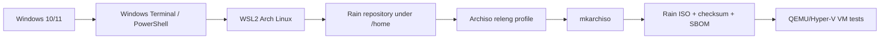

## Diagram 2: One-shot build pipeline

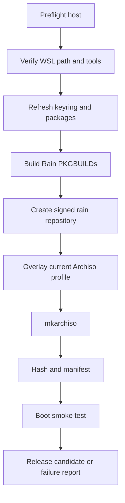

## Diagram 3: Rain OS layered architecture

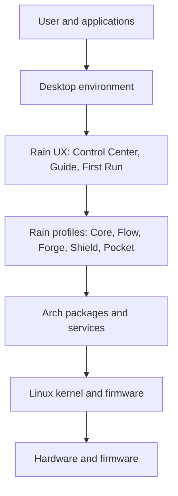

## Diagram 4: Installer flow

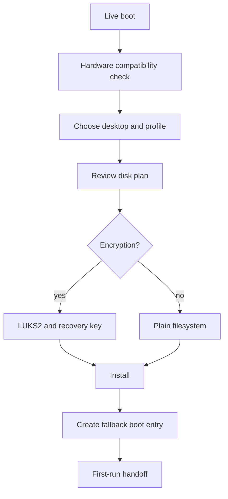

## Diagram 5: Update and rollback

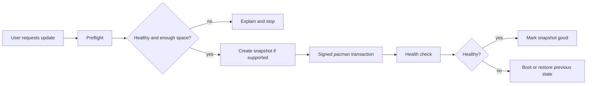

## Diagram 6: Self-updating guide

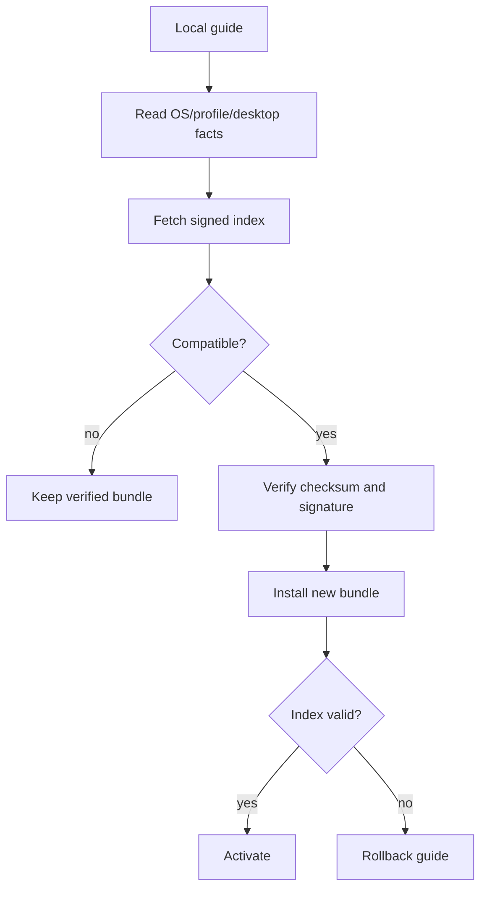

## Diagram 7: Windows application decision tree

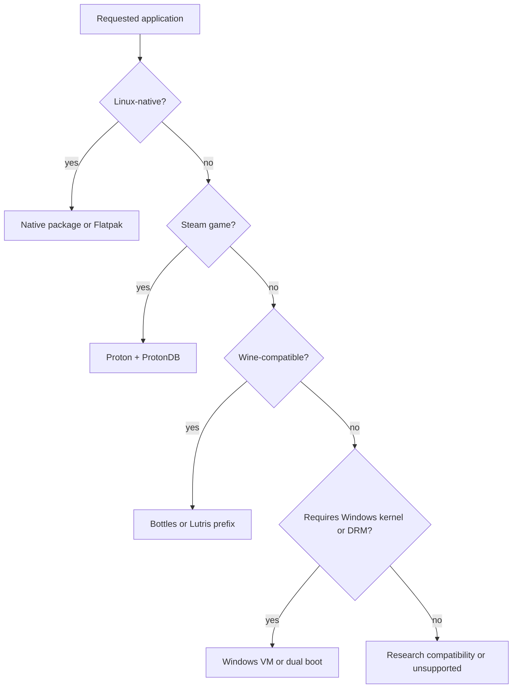

## Diagram 8: Application isolation

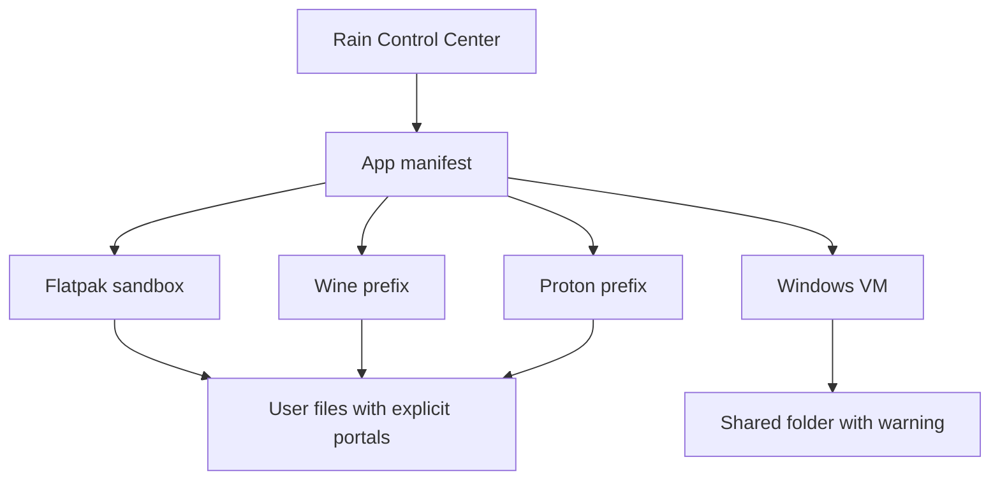

## Diagram 9: AI-agent development loop

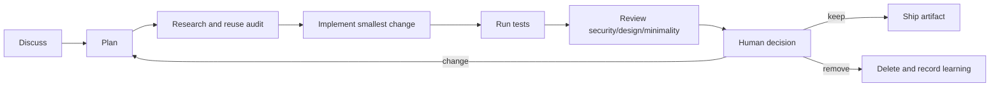

## Diagram 10: Profile composition

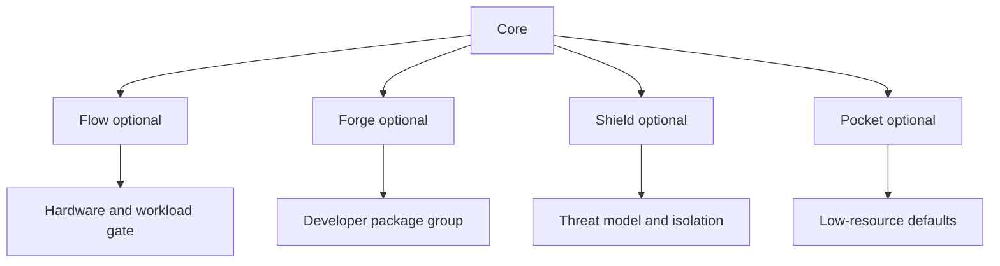

## Diagram 11: Package provenance

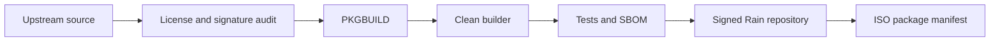

## Diagram 12: Recovery layers

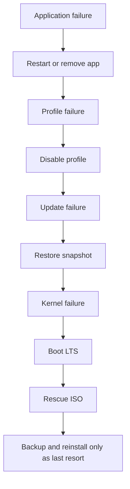

## Diagram 13: Support and telemetry boundary

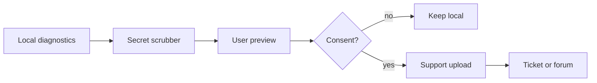

## Diagram 14: Release channels

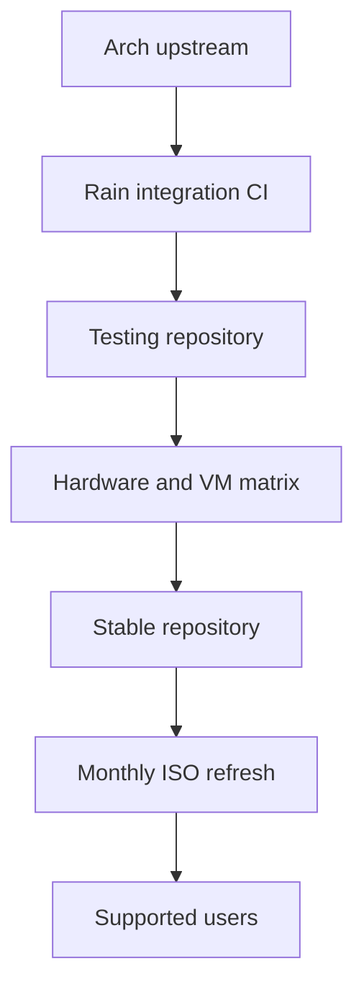

## Diagram 15: Commercial support loop

```mermaid
flowchart LR
  A[User issue] --> B[Guide and diagnostics]
  B --> C[Community triage]
  C --> D[Support escalation]
  D --> E[Reproducible bug]
  E --> F[Upstream or Rain fix]
  F --> G[Regression test]
  G --> H[Guide update]

\newpage

[31]: https://docs.github.com/actions/writing-workflows/choosing-what-your-workflow-does/running-variations-of-jobs-in-a-workflow "GitHub Actions matrix strategies"
[32]: https://docs.github.com/actions/concepts/security/artifact-attestations "GitHub Actions artifact attestations"
[33]: https://docs.github.com/actions/security-for-github-actions/using-artifact-attestations/using-artifact-attestations-to-establish-provenance-for-builds "GitHub Actions build provenance attestations"
[34]: https://docs.github.com/actions/writing-workflows/choosing-what-your-workflow-does/control-the-concurrency-of-workflows-and-jobs "GitHub Actions concurrency"
[35]: https://docs.github.com/en/actions/how-tos/reuse-automations/reuse-workflows "GitHub Actions reusable workflows"
[36]: https://docs.github.com/en/actions/reference/limits "GitHub Actions limits"

# References

[1]: https://github.com/is-it-raining-now/rain-os "Public Rain OS repository audited for this specification"
[2]: https://wiki.archlinux.org/title/Archiso "ArchWiki Archiso documentation"
[3]: https://gitlab.archlinux.org/archlinux/archiso/-/blob/master/docs/README.profile.rst "Archiso profile documentation"
[4]: https://learn.microsoft.com/en-us/windows/wsl/install "Microsoft WSL installation documentation"
[5]: https://wiki.archlinux.org/title/Install_Arch_Linux_on_WSL "ArchWiki Arch Linux on WSL documentation"
[6]: https://code.claude.com/docs/en/setup "Claude Code setup documentation"
[7]: https://code.claude.com/docs/en/desktop-wsl "Claude Code Desktop WSL documentation"
[8]: https://www.winehq.org/ "Wine official project"
[9]: https://www.protondb.com/ "ProtonDB community compatibility reports"
[10]: https://usebottles.com/docs/components/runners "Bottles runner documentation"
[11]: https://github.com/lutris/lutris "Lutris project repository"
[12]: https://github.com/89luca89/distrobox "Distrobox project repository"
[13]: https://flatpak.org/ "Flatpak official project"
[14]: https://wiki.archlinux.org/title/Unified_Extensible_Firmware_Interface/Secure_Boot "ArchWiki Secure Boot guidance"
[15]: https://wiki.archlinux.org/title/Reproducible_builds "ArchWiki reproducible-builds guidance"
[16]: https://wiki.archlinux.org/title/Snapper "ArchWiki Snapper documentation"
[17]: https://github.com/affaan-m/ECC "ECC agent harness repository"
[18]: https://github.com/garrytan/gstack "gstack agent workflow repository"
[19]: https://github.com/Leonxlnx/taste-skill "Taste Skill repository"
[20]: https://github.com/DietrichGebert/ponytail "Ponytail repository"
[21]: https://github.com/headroomlabs-ai/headroom "Headroom repository"
[22]: https://github.com/centminmod/my-claude-code-setup "Claude Code setup templates"
[23]: https://github.com/open-gsd/gsd-core "GSD Core repository"
[24]: https://github.com/vercel-labs/skills "Agent Skills discovery repository"
[25]: https://github.com/frankbria/ralph-claude-code "Ralph loop implementation"
[26]: https://forums.linuxmint.com/ "Linux Mint community forum"
[27]: https://forum.manjaro.org/ "Manjaro community forum"
[28]: https://discuss.kde.org/ "KDE community discussions"
[29]: https://www.reddit.com/r/linux/ "Linux community discussions"
[30]: https://www.reddit.com/r/linux_gaming/ "Linux gaming community discussions"
