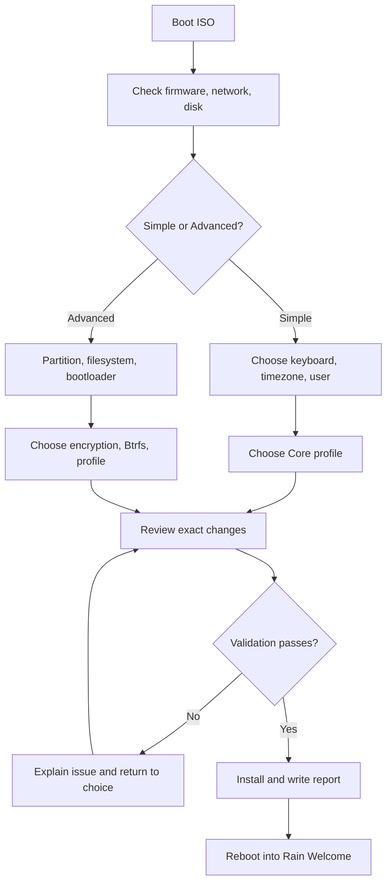
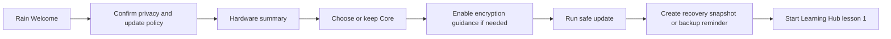
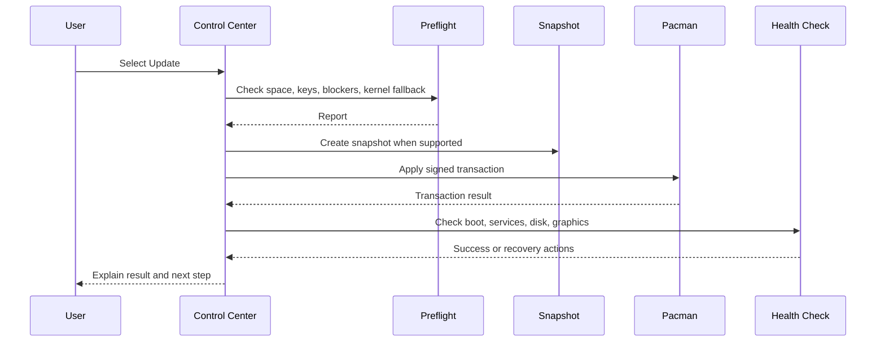
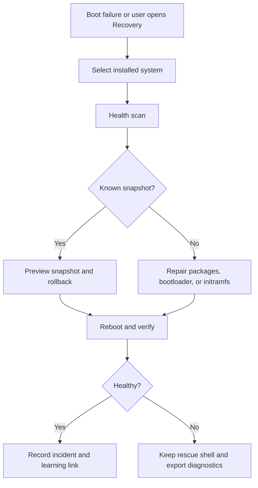
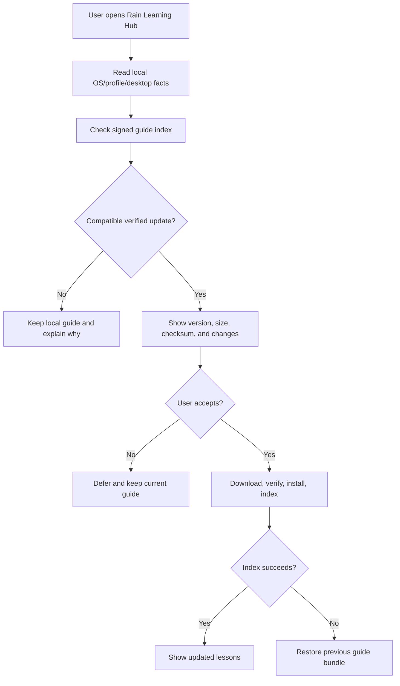

# Rain OS Application and System Flows

## 1. Information architecture

The desktop experience has four persistent entry points:

| Entry point | Job |
|---|---|
| Rain Welcome | First boot, setup checklist, profile selection |
| Rain Control Center | System health, updates, security, hardware, recovery |
| Rain Learning Hub | Guided curriculum and searchable local documentation |
| Rain Rescue | Offline recovery and rollback |

## 2. Installation flow

## 3. First-run flow

## 4. Update flow

## 5. Profile switching flow

Users select a profile, review packages/services/configuration, approve, and receive a rollback point. Removing a profile never removes the Core profile or last kernel.

## 6. Security flow

Rain Shield presents a threat-model summary before activation. It shows the difference between active protections, installed-but-inactive features, and unavailable protections. USBGuard, TPM binding, and aggressive kernel hardening require explicit confirmation and recovery-key guidance.

## 7. Learning flow

The Learning Hub uses short lessons with a safe exercise, a plain-language explanation, a terminal equivalent, a checkpoint, and a recovery hint. Users may complete lessons offline.

## 8. Recovery flow

## 9. Empty and error states

Every error must state what happened, whether data changed, the safest next action, and how to obtain logs. “Something went wrong” is not acceptable copy.

## 10. Guide update flow

## 11. Environment selection flow

The installer recommends KDE Plasma for Core and exposes GNOME, XFCE, and Cinnamon under a supported profile selector. Advanced and community environments are labeled with their support tier, additional packages, display-manager implications, and guide coverage. A user may add another environment later, but the UI warns that multiple desktop environments can create overlapping settings and larger support surfaces.
