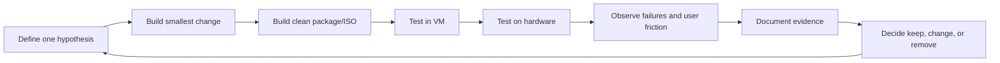

# Rain OS Loop Engineering

Rain OS should be built as a short, evidence-driven loop. The team must avoid building a perfect-looking desktop before proving installation, boot, update, and recovery.

## The loop



## Loop contract

Every iteration has one hypothesis, one owner, a measurable acceptance test, a rollback path, and a written decision. No feature enters the ISO merely because it is attractive.

## Iteration ladder

| Loop | Outcome | Exit gate |
|---|---|---|
| L0 | Repository, governance, license, build skeleton | Clean repo and ownership map |
| L1 | Bootable Archiso with Rain identity | ISO boots in UEFI VM |
| L2 | Installer and Core desktop | Install to ext4 and login |
| L3 | LTS fallback and update preflight | Kernel failure simulation recovers |
| L4 | Btrfs snapshots and Rescue ISO | Broken transaction rolls back |
| L5 | Learning Hub and first-run | New user completes three tasks |
| L6 | Flow performance profile | Enable/disable without reinstall |
| L7 | Forge developer profile | Toolchain and container smoke tests |
| L8 | Shield security profile | Threat-model and policy tests pass |
| L9 | Hardware matrix | Defined laptops/desktops/VMs pass |
| L10 | Release candidate | No P0/P1 issues and reproducible artifacts |

## Definition of done for an ISO iteration

- ISO builds from a clean environment.
- Checksums and package manifest are generated.
- ISO boots in UEFI VM.
- Installer completes on a blank virtual disk.
- User can log in and open the desktop.
- Network, audio, graphics, suspend, and reboot are tested as applicable.
- Update preflight runs and produces understandable output.
- At least one failure path is deliberately tested.
- Logs and screenshots are attached to the iteration record.
- A rollback or removal path exists for every new profile or service.
- Documentation is updated before the next loop begins.

## Issue severity

- **P0:** Cannot boot, install, encrypt, update, or recover. Blocks all work.
- **P1:** Breaks a supported hardware class or profile. Blocks release candidate.
- **P2:** Feature defect with workaround. Can ship only with documented workaround.
- **P3:** Cosmetic or low-impact issue. Track for later.

## Experiment record template

```markdown
# Iteration Lx: title

Hypothesis:
Owner:
Change:
Test environment:
Expected result:
Observed result:
Evidence:
Decision: keep | change | remove
Rollback:
Follow-up:
```
