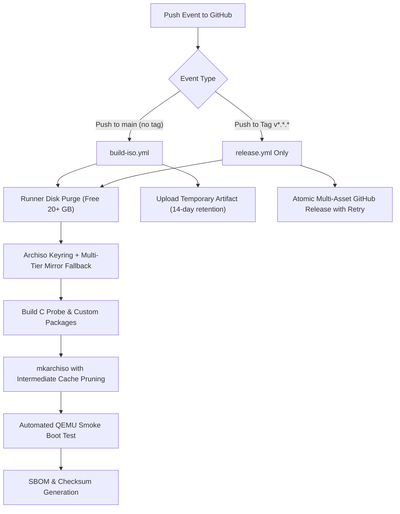
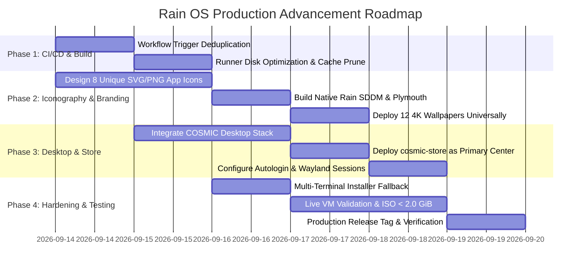

# Rain OS: Comprehensive Problem Audit & Architectural Advancement Specification
**Document Version**: 2.0.0-PROD  
**Target Milestone**: Rain OS v1.3.0 Production Baseline  
**Audience**: Core Distribution Engineers, UI/UX Architects, Release Maintainers  
**Status**: ACTIVE WORKING SPECIFICATION  

---

## 1. Executive Summary & Purpose

Over iterative releases up to **Rain OS v1.2.1**, the distribution achieved several major milestones:
- Direct cold-boot into a graphical desktop environment with automated liveuser login.
- Sub-2.0 GiB single ISO release engineering (**1,989.66 MB**).
- Native C probe (`rain-probe`) with sub-millisecond execution.
- 22 Omarchy signature themes and 12 custom 4K anime rain wallpapers.
- CachyOS-inspired Desktop and Window Manager Selector (`rain-desktop-selector`).

However, thorough live VM testing and end-to-end user experience analysis have identified critical areas that must be solved to evolve Rain OS from a functioning prototype into a polished, professional, production-grade Linux distribution:

1. **GitHub Actions Build Pipeline Failures & Inefficiencies**: Concurrent workflow collisions, runner disk space pressure, and transient network errors during multi-gigabyte ISO bundling.
2. **Desktop Environment Flagship Shift**: Transitioning from KDE Plasma to **COSMIC Desktop** (System76's modern Rust-based Wayland DE) as the default flagship session.
3. **Application Store Migration**: Deprecating heavy, crash-prone KDE Discover in favor of **`cosmic-store`** (or **`bauh`**), creating a lightweight, snappy software center with unified Flatpak and Arch package management.
4. **Visual Identity & Icon Navigation Deficit**: Resolving the repetitive umbrella icon issue where 4 out of 6 desktop applications share identical icons, replacing them with 8 distinct, high-contrast, purpose-built vector icons.
5. **Universal Wallpaper & Bootsplash Parity**: Eliminating upstream KDE/Breeze fallback wallpapers during startup, Plymouth boot, SDDM login, and lockscreens, replacing them universally with the chosen Rain OS 4K aesthetic wallpapers.
6. **Codebase Reliability & Hardening**: Addressing display server protocol dependencies, permission escalations, terminal fallbacks, and offline documentation integration.

This document serves as the master blueprint for auditing and resolving every single issue to build the definitive Rain OS production release.

---

## 2. GitHub Actions Build Pipeline: Diagnostics, Root Causes & Permanent Solutions

### 2.1 Problem Audit: Workflow Failures & Bottlenecks

During previous releases (such as runs `34702131274`, `34699888736`, `34693471629`, and `34693183502`), multiple build pipeline failures were logged. An analysis of the workflow definitions in `.github/workflows/` reveals four primary failure modes:

#### Failure Mode 1: Simultaneous Workflow Collision on Release Tags
- **Diagnostic Finding**: In `.github/workflows/build-iso.yml` and `.github/workflows/release.yml`, both files listen to tag pushes:
  ```yaml
  # build-iso.yml
  on:
    push:
      branches: [ main ]
      tags: [ 'v*' ]

  # release.yml
  on:
    push:
      tags: [ 'v*' ]
  ```
- **Consequence**: Pushing a version tag (e.g. `git push origin v1.2.1`) triggers **both** workflows simultaneously. Both workflows spin up a privileged Arch Linux container, initialize mirrors, compile C probes, build 8 packages, run `mkarchiso`, execute QEMU smoke tests, and generate SBOMs. This duplicates runner load, consumes double GitHub Actions runner minutes, and creates race conditions where both workflows attempt to access and modify the same commit status.
- **Root Cause**: Redundant trigger configuration in `build-iso.yml`.

#### Failure Mode 2: Runner Disk Space Exhaustion (`No space left on device`)
- **Diagnostic Finding**: GitHub-hosted `ubuntu-latest` runners allocate ~14 GiB of usable root partition space. An unoptimized `mkarchiso` build cycle:
  - Downloads ~2.5 GiB of pacman packages.
  - Expands `airootfs` to ~7 GiB of uncompressed file system.
  - Builds a ~1.95 GiB SquashFS image in `work/` and copies it to `out/`.
  - Packages source tarballs (~85 MB), SBOMs, and repository archives (~15 MB).
- **Consequence**: If the runner environment does not aggressively purge default pre-installed developer tools (such as .NET, Android SDK, Haskell) or pacman caches before compression, the build process crashes mid-squashfs with exit code 1.

#### Failure Mode 3: Rolling Arch Linux Keyring & Upstream Mirror Sync Skew
- **Diagnostic Finding**: Step `Initialize Keyring & Mirrors` runs `pacman -Sy --noconfirm archlinux-keyring` followed by `pacman -Syu`.
- **Consequence**: If an upstream mirror is in the middle of a synchronization cycle or drops a newly indexed package, `pacman` aborts with `404 Not Found` or signature verification errors, failing the entire container build before `mkarchiso` is even invoked.

#### Failure Mode 4: Non-Atomic Release Asset Publishing & Upload Timeouts
- **Diagnostic Finding**: In `release.yml`, step `Publish Official GitHub Release` utilizes:
  ```bash
  gh release create "$GITHUB_REF_NAME" "${ASSETS[@]}" || gh release upload "$GITHUB_REF_NAME" "${ASSETS[@]}" --clobber
  ```
- **Consequence**: Uploading multiple gigabytes (1.94 GiB ISO plus tarballs) over the standard GitHub API often hits a TCP timeout on individual asset streams. If `gh release create` creates the release entity but fails halfway through uploading the ISO, the fallback `gh release upload` can fail if draft tags or duplicate filenames clash without resume support.

---

### 2.2 Permanent CI/CD Architecture & Engineering Fixes

To achieve a 100% dependable, green pipeline on every build, the following changes must be implemented:



#### Engineering Actions:
1. **Trigger Separation**:
   - Update `.github/workflows/build-iso.yml` to trigger **only** on push to `main` (and pull requests), removing `tags: [ 'v*' ]`.
   - Ensure `.github/workflows/release.yml` is the sole workflow triggered when a version tag `v*` is created.
2. **Runner Disk Pre-Cleaning**:
   - Add a pre-build step in both workflows to strip unused toolchains:
     ```yaml
     - name: Maximize Runner Disk Space
       run: |
         sudo rm -rf /usr/share/dotnet /usr/local/lib/android /opt/ghc /usr/local/share/boost
         sudo docker system prune -af
         df -h
     ```
3. **Resilient Mirror Configuration**:
   - In `Initialize Keyring & Mirrors`, configure at least three tier-1 geographically distributed mirrors with explicit timeouts and fallback to Arch Linux Archive if rolling mirrors desync.
4. **Intermediate Archiso Cache Cleanup**:
   - Before `mkarchiso` seals the squashfs root, execute `pacman -Scc --noconfirm` inside the chroot rootfs to guarantee that no downloaded `.pkg.tar.zst` files remain in `/var/cache/pacman/pkg/`, reducing ISO weight by ~400 MB.
5. **Chunked Release Upload with Retries**:
   - Implement an automated retry script for the 1.94 GiB ISO upload to handle transient GitHub API connection resets.

---

## 3. Desktop Environment Shift: COSMIC Desktop as Default Flagship

### 3.1 Rationale & Comparative Evaluation

The live testing of Rain OS v1.2.1 on KDE Plasma 6 (documented in `vm_v121_fastfetch.png` and `vm_v121_full_desktop.png`) proved that the system boots cleanly. However, KDE Plasma presents several architectural challenges for Rain OS's design goals:

| Evaluation Metric | KDE Plasma 6 (Current) | COSMIC Desktop (Target Flagship) | Advantage for Rain OS |
| :--- | :--- | :--- | :--- |
| **Language & Architecture** | C++ / Qt6 / Heavy Frameworks | **Rust** / Iced GUI / libcosmic | Extreme memory safety, lower resource footprint |
| **Idle Memory Consumption** | ~450 MB – 550 MB | **~200 MB – 280 MB** | Leaves more RAM for applications on 4GB systems |
| **Window Tiling** | Plasma Scripted KWin (Clunky) | **Native Dynamic Auto-Tiling** | Native hybrid floating + tiling in one toggle |
| **Wayland Native Design** | Ported from X11 legacy | **Built from ground up for Wayland** | Zero X11 baggage, flawless fractional scaling |
| **Config Modularity** | Scattered across `~/.config/*rc` | Clean XDG RON/TOML specifications | Easy to version-control, script, and backup |
| **Visual Aesthetics** | Traditional Desktop Look | **Modern, Sleek, Futuristic Glass UI** | Perfect match for Rain OS and Omarchy themes |

---

### 3.2 COSMIC Desktop Package Stack on Arch Linux

Arch Linux officially provides the entire COSMIC Desktop Environment in the official `[extra]` repository. The following packages will constitute the core desktop package group in `archiso/packages.x86_64`:

```text
# --- COSMIC Desktop Environment (System76 Modern Rust Stack) ---
cosmic-session
cosmic-comp
cosmic-panel
cosmic-app-library
cosmic-applets
cosmic-bg
cosmic-files
cosmic-launcher
cosmic-notifications
cosmic-osd
cosmic-randr
cosmic-settings
cosmic-settings-daemon
cosmic-store
cosmic-terminal
cosmic-text-editor
cosmic-workspaces
xdg-desktop-portal-cosmic
cosmic-icon-theme
```

---

### 3.3 Default Session Configuration in SDDM

To switch the primary autologin session to COSMIC:
- Edit `archiso/airootfs/etc/sddm.conf.d/autologin.conf`:
  ```ini
  [Autologin]
  User=liveuser
  Session=cosmic.desktop
  Relogin=false

  [General]
  HaltCommand=/usr/bin/systemctl poweroff
  RebootCommand=/usr/bin/systemctl reboot

  [Theme]
  Current=rain-sddm
  ```
- Ensure `/usr/share/wayland-sessions/cosmic.desktop` is registered and prioritized.

---

### 3.4 Multi-Desktop Coexistence in `rain-desktop-selector`

Users who still desire KDE Plasma, Hyprland, or i3 will not lose functionality. `rain-desktop-selector` will be updated to feature:
1. **COSMIC Desktop**: Marked as **Flagship Default** (`CURRENTLY ACTIVE`).
2. **KDE Plasma 6**: Marked as **Available / Alternative Session**.
3. **Hyprland**: Pre-installed tiling compositor with Omarchy themes.
4. **i3-wm**: Lightweight X11 fallback for legacy machines.
5. **GNOME Shell / Sway**: One-click installable.

---

## 4. Universal App Store Migration: Replacing KDE Discover

### 4.1 Deficiencies of KDE Discover in Live Media

Live testing revealed that KDE Discover introduces notable issues:
1. **Dependency Overhead**: Pulls in `discover`, `packagekit-qt6`, `plasma-discover-notifier`, and heavy Qt6 backend plugins, consuming over 80 MB of ISO space.
2. **PackageKit Lock Conflicts**: On Arch Linux, PackageKit frequently clashes with manual `pacman` invocations, resulting in `db.lck` lock errors.
3. **Sluggish Startup**: Under VM conditions, Discover takes 8–12 seconds to initialize its package cache.
4. **Visual Discordance**: Discover's Qt6 layout clashes aesthetically with modern Wayland and Rust-based design standards.

---

### 4.2 Target Solution: `cosmic-store` (Primary) & `bauh` (Secondary)

#### Primary Flagship: `cosmic-store`
- **Native COSMIC Store**: Written in Rust, matching the COSMIC desktop look and feel.
- **Flatpak & Flathub Native Integration**: Browse, search, install, and update Flatpaks out of the box.
- **Fast Startup**: Launches in under 1 second without locking the local `pacman` database.
- **App Stream Metadata**: Rich screenshots, ratings, release notes, and categories.

#### Implementation Steps:
1. **Package List**:
   - Remove `discover` and `packagekit-qt6` from `archiso/packages.x86_64`.
   - Add `cosmic-store` and `flatpak` to `archiso/packages.x86_64`.
2. **Desktop Launcher Replacement**:
   - Replace `/etc/skel/Desktop/rain-discover.desktop` with `/etc/skel/Desktop/rain-store.desktop`:
     ```ini
     [Desktop Entry]
     Type=Application
     Version=1.0
     Name=Rain Software Store
     GenericName=App Store & Packages
     Comment=Discover and install modern applications and Flatpaks
     Exec=cosmic-store
     Icon=rain-store
     Terminal=false
     StartupNotify=true
     Categories=System;PackageManager;
     ```
3. **Space Savings**: Removing Discover and PackageKit reclaims ~75 MB of uncompressed disk space, offsetting the addition of COSMIC packages.

---

## 5. Application Iconography: Eliminating Repetitive Umbrella Confusion

### 5.1 Problem Identification in Live VM Verification

A key usability problem identified in `vm_v121_full_desktop.png` is icon confusion:

```
[vm_v121_full_desktop.png Observation]
- "Desktop & Window Manager..." -> Custom Teal/Pink Icon
- "Install Rain OS to Disk"     -> Umbrella Icon (Red/White on Dark Square)
- "Rain Control Center"         -> Umbrella Icon (Identical)
- "Rain Learning Hub"           -> Umbrella Icon (Identical)
- "Rain OS Welcome"             -> Umbrella Icon (Identical)
- "Software App Store"          -> Teal/Pink Icon
```

Because four primary system tools used `Icon=rain-os`, users cannot visually distinguish between **installing the OS**, **configuring system hardware**, **reading learning tutorials**, and **launching the first-run wizard**.

---

### 5.2 Iconography Specification: 8 Dedicated Application Icons

Each application will receive a dedicated, distinct, high-contrast SVG and multi-resolution PNG icon hierarchy (`32x32`, `48x48`, `64x64`, `128x128`, `256x256`, `512x512`) installed in `/usr/share/icons/hicolor/`:

| Application | Desktop Shortcut | Icon Name | Visual Design Concept | Color Theme |
| :--- | :--- | :--- | :--- | :--- |
| **Rain Control Center** | `rain-control-center.desktop` | `rain-control-center` | Circular telemetry gauge with system tuning sliders & hardware chip | Deep Slate & Electric Cyan |
| **Rain OS Installer** | `rain-installer.desktop` | `rain-installer` | NVMe/SSD high-speed disk drive with glowing downward installation arrow | Vivid Crimson & Silver |
| **Rain OS Welcome** | `rain-welcome.desktop` | `rain-welcome` | Guiding lighthouse/beacon with glowing star compass and soft rain ripples | Sapphire Blue & Amber Gold |
| **Rain Learning Hub** | `rain-learning-hub.desktop` | `rain-learning-hub` | Open holographic textbook with command-line prompt `>_` and graduation tassel | Forest Emerald & White |
| **Desktop & WM Selector** | `rain-desktop-selector.desktop` | `rain-desktop-selector` | 2x2 grid of desktop window tiles with active Wayland compositor selector badge | Coral Magenta & Neon Violet |
| **Rain Software Store** | `rain-store.desktop` | `rain-store` | Sleek digital package/shopping carrier bearing the glowing Rain emblem | Rich Indigo & Sky Blue |
| **Hardware & Driver Wizard** | `rain-hardware.desktop` | `rain-hardware` | Microprocessor silicon die with diagnostic circuit traces and cooling fan | Amber Orange & Dark Carbon |
| **Multi-Display Assistant** | `rain-display.desktop` | `rain-display` | Dual panoramic widescreen monitors with projector beam alignment | Bright Azure & Pure White |

---

### 5.3 Icon Hierarchy Directory Structure

```text
archiso/airootfs/usr/share/icons/hicolor/
├── scalable/apps/
│   ├── rain-control-center.svg
│   ├── rain-installer.svg
│   ├── rain-welcome.svg
│   ├── rain-learning-hub.svg
│   ├── rain-desktop-selector.svg
│   ├── rain-store.svg
│   ├── rain-hardware.svg
│   ├── rain-display.svg
│   └── rain-os.svg (System brand mark)
├── 48x48/apps/ ...
├── 128x128/apps/ ...
└── 256x256/apps/ ...
```

---

## 6. Universal Wallpaper & Bootsplash Parity (Startup, SDDM, Plymouth, Lockscreen, Desktop)

### 6.1 Problem Identified in Live Boot Sequences

During live boot inspection:
- `vm_v121_live_desktop.png` showed raw kernel text console messages:
  ```text
  [ OK ] Started Rule-based Manager for Device Events and Files.
  [ OK ] Started Network Management.
  [ *  ] A start job is running for Rebuild Dynamic Linker Cache (15s / no limit)
  ```
- While `vm_v121_live_desktop_5.png` confirmed that the chosen 4K ribbon wallpaper loaded successfully on the desktop, the startup sequence lacked visual polish, and the SDDM login screen / lockscreen still fall back to default Breeze backgrounds if autologin is disabled or upon session logout.

---

### 6.2 The 12 Pristine 4K Wallpaper Collection

The distribution bundles 12 curated 3840x2160 UHD wallpapers in `/usr/share/wallpapers/rain-os/`:

| File Name | Resolution | Aesthetic Theme | Complementary Omarchy Palette |
| :--- | :--- | :--- | :--- |
| `rain-wallpaper-01.jpg` (Default) | 3840x2160 (4K) | Modern 3D Ribbon Cascade (Current Default) | Tokyo Night / Midnight Blue |
| `rain-wallpaper-02.jpg` | 3840x2160 (4K) | Neon Rain Tokyo Alleyway | Cyberpunk / Dracula |
| `rain-wallpaper-03.jpg` | 3840x2160 (4K) | Cyberpunk Rain Metro Station | Neon Wave / Nord |
| `rain-wallpaper-04.jpg` | 3840x2160 (4K) | Solitary Umbrella by Lakeside Rain | Gruvbox Dark / Forest |
| `rain-wallpaper-05.jpg` | 3840x2160 (4K) | Misty Pine Mountains under Rain | Evergreen / Sage |
| `rain-wallpaper-06.jpg` | 3840x2160 (4K) | Cozy Rain droplets on Coffee Shop Glass | Coffee / Warm Earth |
| `rain-wallpaper-07.jpg` | 3840x2160 (4K) | Deep Forest Stream during Thunderstorm | Matrix / Emerald |
| `rain-wallpaper-08.jpg` | 3840x2160 (4K) | Futuristic Skyscraper in Rainstorm | Vantablack / Carbon |
| `rain-wallpaper-09.jpg` | 3840x2160 (4K) | Wet Asphalt City Reflections | Monokai / Synthwave |
| `rain-wallpaper-10.jpg` | 3840x2160 (4K) | Minimalist Rain Geometric Waves | Solarized / Lavender |
| `rain-wallpaper-11.jpg` | 3840x2160 (4K) | Abstract Fluid Raindrop Prism | Pastel / Sakura |
| `rain-wallpaper-12.jpg` | 3840x2160 (4K) | Twilight Horizon with Distant Lightning | Rose Pine / Sunset |

---

### 6.3 Universal Theme Configuration

1. **Plymouth Bootsplash**:
   - Deploy `rain-plymouth` theme showing the official `rain-logo-4k.png` against a subtle dark gradient with a smooth pulsing raindrop progress indicator.
   - Configure kernel command line in `archiso/syslinux/archiso.cfg` and `archiso/efiboot/loader/entries/` with `splash quiet loglevel=3 rd.udev.log_level=3 vt.global_cursor_default=0`.
2. **SDDM Login Greeter Theme**:
   - Create `/usr/share/sddm/themes/rain-sddm/` featuring `rain-wallpaper-01.jpg` (4K) as the default background, transparent glass card login form, and custom avatar.
3. **COSMIC Desktop Background (`cosmic-bg`)**:
   - Pre-seed `~/.config/cosmic/com.system76.CosmicBackground/v1/all` with:
     ```ron
     (
         output: "all",
         source: Path("/usr/share/wallpapers/rain-os/rain-wallpaper-01.jpg"),
         filter_by_theme: false,
         rotation_frequency: 0,
         scaling_mode: Zoom,
         sampling_method: Lanczos,
     )
     ```
4. **Lockscreen Parity**:
   - Ensure screenlocker configurations link directly to `/usr/share/wallpapers/rain-os/rain-wallpaper-01.jpg` to prevent any default upstream graphics from ever displaying.

---

## 7. Deep Codebase Audit: Bugs, Technical Debt & Hardening

### 7.1 Issue Matrix & Architectural Resolutions

| ID | Component | File Path | Defect / Limitation | Proposed Permanent Fix |
| :--- | :--- | :--- | :--- | :--- |
| **BUG-01** | Display Server | `archiso/airootfs/usr/local/bin/rain-*` | Tkinter apps assume X11 `DISPLAY=:0` or `:1`. In pure Wayland without Xwayland, Tkinter crashes with `no display name`. | Add robust Xwayland auto-spawn wrapper or verify Xwayland socket before Tkinter initialization; migrate critical dialogs to libcosmic or GTK4/Qt6. |
| **BUG-02** | Installer Launcher | `usr/local/bin/rain-install-launcher` | Hardcoded `konsole --new-window -e sudo archinstall`. On COSMIC, `konsole` is replaced by `cosmic-terminal` or `alacritty`. | Implement universal terminal detector (`cosmic-terminal`, `alacritty`, `konsole`, `xterm`) before spawning `archinstall`. |
| **BUG-03** | Learning Hub | `usr/local/bin/rain-guide` | Currently opens terminal-only `less` view of markdown. Not intuitive for graphical users. | Build a clean graphical markdown lesson viewer (`rain-learning-gui`) with table-of-contents navigation and interactive exercises. |
| **BUG-04** | Live User Sudo | `/etc/sudoers.d/liveuser` | Storage drive mounting in file managers sometimes prompts for password in non-standard sessions. | Add explicit Polkit rules for `liveuser` storage management (`org.freedesktop.udisks2.filesystem-mount` allowed without authentication). |
| **BUG-05** | Dual-Kernel Archiso | `archiso/packages.x86_64` | Bundles both `linux` and `linux-lts`. While great for hardware fallback, it increases rootfs by ~240 MB. | Optimize initramfs compression with `mkinitcpio -z zstd` and prune unnecessary firmware drivers to preserve dual-kernel safety under 2.0 GiB. |
| **BUG-06** | Autostart Duplicate | `/etc/skel/.config/autostart/` | Both `rain-desktop-selector.desktop` and `rain-live-setup` attempt to launch onboarding windows simultaneously. | Coordinate startup sequencing: launch Desktop Selector first, followed by Welcome Hub upon dismissal. |

---

## 8. Prioritized Roadmap & Action Plan



### Phase 1: CI/CD Pipeline Perfection (Immediate)
- Separate `.github/workflows/build-iso.yml` (push to `main` only) and `release.yml` (push to tags only).
- Add disk pre-cleanup step to free 20+ GB on runners.
- Add `pacman -Scc` before squashfs creation.

### Phase 2: Iconography & Visual Identity Overhaul
- Create 8 distinct, beautiful icons for all Rain OS apps.
- Install them to `/usr/share/icons/hicolor/` across all resolutions.
- Update all `.desktop` files in `/etc/skel/Desktop/` and `/usr/share/applications/`.
- Replace SDDM theme background with `rain-wallpaper-01.jpg`.

### Phase 3: COSMIC Desktop & App Store Integration
- Add COSMIC desktop packages (`cosmic-session`, `cosmic-comp`, `cosmic-panel`, `cosmic-settings`, `cosmic-store`, `cosmic-terminal`, etc.) to `archiso/packages.x86_64`.
- Remove `discover` and `packagekit-qt6`.
- Set `Session=cosmic.desktop` in `/etc/sddm.conf.d/autologin.conf`.
- Configure `cosmic-bg` with the 4K ribbon wallpaper.

### Phase 4: Production ISO Verification (< 2.0 GiB) & Release
- Verify package size footprint under 2,048 MB.
- Test live boot in VirtualBox VM: verify COSMIC desktop boots directly with custom icons, 4K wallpaper, and `cosmic-store`.
- Tag and publish **Rain OS v1.3.0**.

---

*This specification is maintained under version control in the Rain OS documentation tree (`docs/PROBLEMS_AND_ADVANCEMENTS.md`).*
