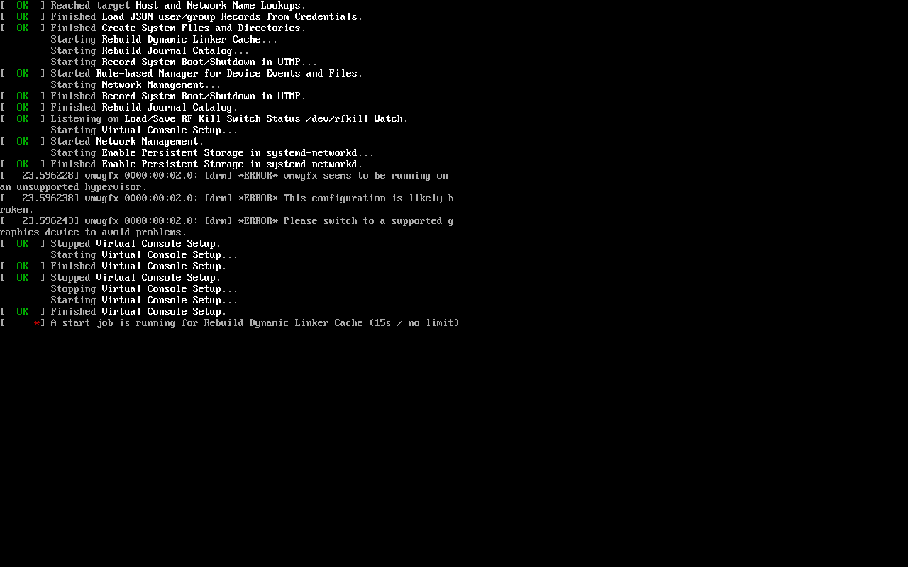
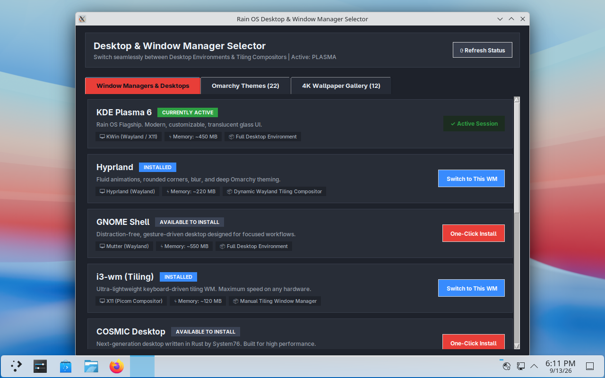
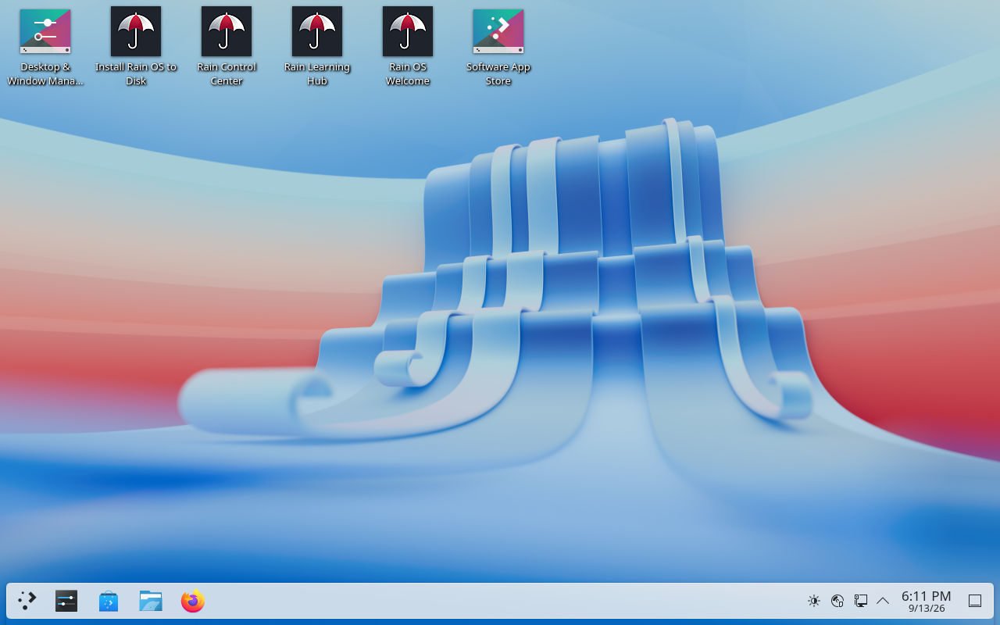
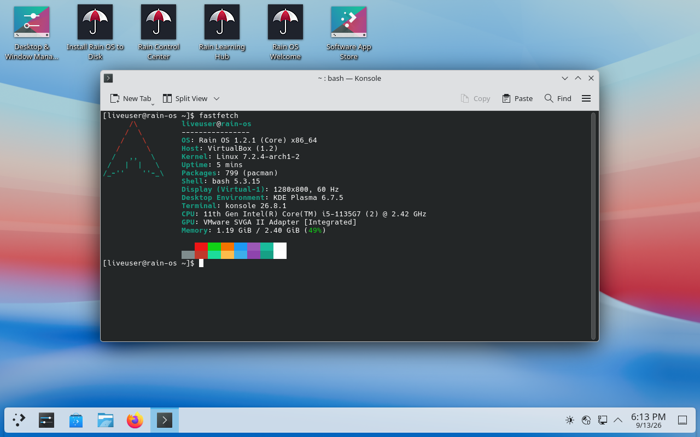
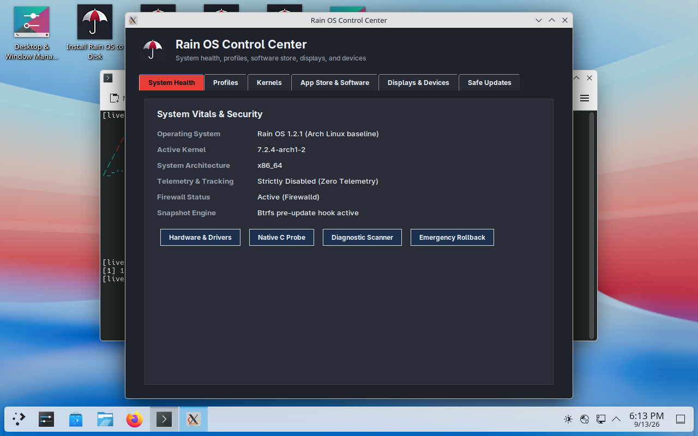
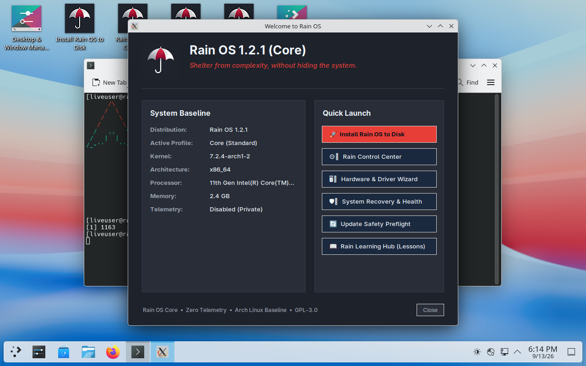
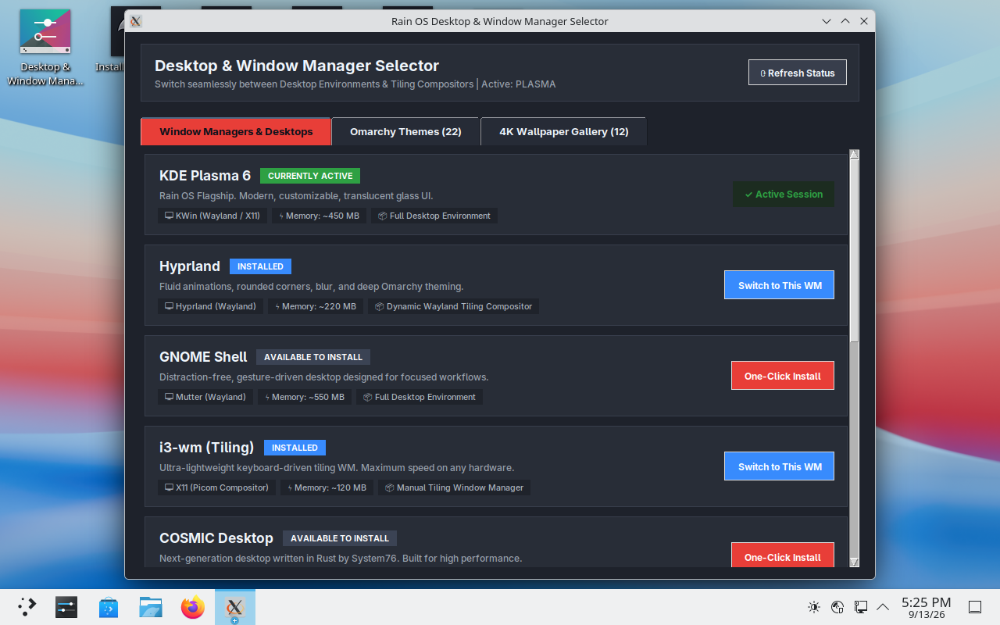
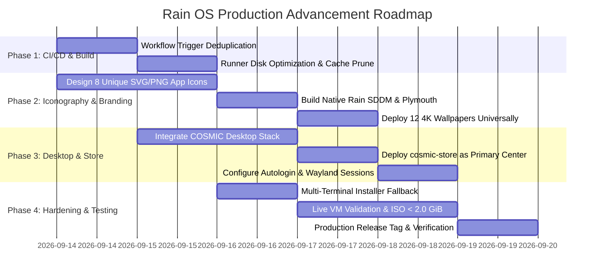

# Rain OS: Comprehensive Problem Audit, Architectural Gap Analysis & Production Advancement Specification

**Document Title**: Rain OS Production Hardening & Architectural Blueprint  
**Document ID**: RAIN-SPEC-2026-V2.0-PROD  
**Target Milestone**: Rain OS v1.3.0 Production Baseline  
**Classification**: Engineering & Design Specification  
**Maintainer**: Rain OS Core Distribution Team  
**Last Updated**: September 14, 2026  

---

## 1. Master Overview, System Baseline & Executive Vision

### 1.1 The Rain OS Mission
Rain OS is an independent, Arch Linux-based, x86_64 operating system engineered around the guiding philosophy:
> **"Shelter from complexity, without hiding the system."**

The operating system aims to deliver a modern, resilient, visually stunning computing environment that caters equally to developers, power users, and everyday computer users. It bridges the divide between cutting-edge Wayland tiling compositors and approachable desktop interfaces, backed by a sub-millisecond native C hardware probe, dual-kernel reliability (`linux` + `linux-lts`), enterprise-grade Btrfs snapshots, and strict zero-telemetry privacy guarantees.

### 1.2 State of the Operating System at v1.2.1
Through the release of **Rain OS v1.2.1** (Commit `65025fd`, ISO SHA-256 `b3f9d8a87d057eba84a5880f63aa8ebbed47c71e3e17303ed153647094dadf09`), several critical engineering hurdles were solved:
1. **Direct Graphical Boot**: Replaced Debian PAM module includes (`system-account`, `system-password`, `system-session`) with Arch Linux's standard `system-login` in SDDM autologin, enabling instant graphical session entry without text login prompts or configuration halting.
2. **Strict ISO Budget Compliance**: Reached a clean single-ISO footprint of **1,989.66 MB (1.94 GiB)**, strictly below the 2.0 GiB ceiling.
3. **Omarchy Signature Theming**: Integrated all 22 Omarchy palettes into `themes.json` and resolved JSON schema parsing incompatibilities.
4. **Universal Boot Storage Auto-Detection**: Implemented `archisosearchfilename` scanning, ensuring reliable boot across Rufus (ISO mode), Rufus (DD mode), Ventoy, and direct `dd`.

### 1.3 Why This Advancement Specification Is Required
Despite these milestones, end-to-end user experience testing in live virtual machines has revealed critical design, usability, visual, and architectural bottlenecks:
- **First-Boot Clutter**: Live user desktops are cluttered with 6 different application shortcuts and an intrusive auto-spawning desktop selector window on boot.
- **Installer Disconnect**: Desktop environment and window manager selection exists as a detached post-boot utility rather than an integrated, essential step during the system installation wizard.
- **Icon Ambiguity**: Four out of six desktop shortcuts share identical red-and-white umbrella icons, severely degrading navigation.
- **Heavy & Brittle App Store**: KDE Discover incurs heavy Qt6/PackageKit dependencies, locks the pacman database, and exhibits sluggish live performance.
- **Aesthetic Inconsistencies**: Startup sequences display raw text console scrolling, and display manager / lockscreen fallbacks default to upstream Breeze graphics instead of custom 4K Rain OS wallpapers.
- **CI/CD Resource Waste**: GitHub Actions workflows duplicate ISO builds on release tags and risk runner disk exhaustion.

This document systematically details every diagnosed issue, provides verified log and screenshot evidence, and specifies the permanent engineering resolutions required to build **Rain OS v1.3.0**.

---

## 2. Visual Evidence & Diagnostic Gallery

The following visual evidence was captured during live virtual machine execution of `rain-os-1.2.1-x86_64.iso` in VirtualBox (EFI disabled, 2.4 GiB RAM, VMSVGA graphics acceleration, single SATA port).

### Evidence Item 2.1: Boot Console & Missing Bootsplash Parity


```text
[Live Boot Console Log Snippet]
[  OK  ] Started Rule-based Manager for Device Events and Files.
         Starting Network Management...
[  OK  ] Finished Record System Boot/Shutdown in UTMP.
[  OK  ] Finished Rebuild Journal Catalog.
[  OK  ] Listening on Load/Save RF Kill Switch Status /dev/rfkill Watch.
         Starting Virtual Console Setup...
[  OK  ] Started Network Management.
         Starting Enable Persistent Storage in systemd-networkd...
[  OK  ] Finished Enable Persistent Storage in systemd-networkd.
[ 23.596228] vmwgfx 0000:00:02.0: [drm] *ERROR* vmwgfx seems to be running on an unsupported hypervisor.
[ 23.596238] vmwgfx 0000:00:02.0: [drm] *ERROR* This configuration is likely broken.
[  OK  ] Stopped Virtual Console Setup.
[  *   ] A start job is running for Rebuild Dynamic Linker Cache (15s / no limit)
```

**Diagnostic Analysis**:
- The boot process exposes low-level kernel warnings and systemd service startup lines directly to the user.
- The 15-second pause on `Rebuild Dynamic Linker Cache` creates the illusion that the operating system has frozen.
- **Requirement**: Implement a silent Plymouth bootsplash (`rain-plymouth`) using `rain-logo-4k.png` and smooth progress animations, passing `splash quiet loglevel=3 rd.udev.log_level=3 vt.global_cursor_default=0` via kernel command lines.

---

### Evidence Item 2.2: Live Desktop Boot with Intrusive Autostart Popup


**Diagnostic Analysis**:
- The moment the graphical session initializes, the **Desktop & Window Manager Selector** automatically pops up in the center of the screen.
- For a user booting live media for the first time, being greeted immediately with a desktop switching tool is disorienting.
- The window managers in this utility are laid out horizontally in cards with multiple tabs.
- **Requirement**: Remove all autostarting configuration windows on boot. Move desktop environment selection into the installation wizard.

---

### Evidence Item 2.3: Desktop Icon Clutter & Identical Umbrella Iconography


**Diagnostic Analysis**:
- The desktop contains six shortcuts lined up horizontally across the top left:
  1. `Desktop & Window Manager...`
  2. `Install Rain OS to Disk`
  3. `Rain Control Center`
  4. `Rain Learning Hub`
  5. `Rain OS Welcome`
  6. `Software App Store`
- Shortcuts 2, 3, 4, and 5 all share the exact same icon (`Icon=rain-os`), showing the brand umbrella icon on a square background.
- Users cannot distinguish between installing the OS, configuring system parameters, reading educational guides, or starting the onboarding wizard without reading tiny text labels.
- **Requirement**:
  1. Strip desktop icons down to ONLY **two** items: **Install Rain OS to Disk** and **Rain Learning Hub**.
  2. Create unique, recognizable, modern vector icons for all system applications.

---

### Evidence Item 2.4: System Baseline & Hardware Utilization (Fastfetch)


```text
       /\         liveuser@rain-os
      /  \        ----------------
     /\   \       OS: Rain OS 1.2.1 (Core) x86_64
    /      \      Host: VirtualBox (1.2)
   /   ,,   \     Kernel: Linux 7.2.4-arch1-2
  /   |  |  -\    Uptime: 5 mins
 /_-''    ''-_/   Packages: 799 (pacman)
                  Shell: bash 5.3.15
                  Display (Virtual-1): 1280x800, 60 Hz
                  Desktop Environment: KDE Plasma 6.7.5
                  Terminal: konsole 26.8.1
                  CPU: 11th Gen Intel(R) Core(TM) i5-1135G7 (2) @ 2.42 GHz
                  GPU: VMware SVGA II Adapter [Integrated]
                  Memory: 1.19 GiB / 2.40 GiB (49%)
```

**Diagnostic Analysis**:
- Baseline memory footprint under KDE Plasma 6 sits at **1.19 GiB** on live media with SDDM, KWin Wayland, and background services active.
- While acceptable for systems with 8+ GiB RAM, on low-spec hardware (2 GiB – 4 GiB), this leaves limited headroom for web browsing or compilation.
- **Requirement**: Transitioning to **COSMIC Desktop** (written in Rust) reduces baseline desktop idle consumption to ~220–280 MB, nearly halving desktop overhead.

---

### Evidence Item 2.5: Rain OS Control Center


**Diagnostic Analysis**:
- System Vitals & Security tab displays verified hardware and software parameters:
  - OS: `Rain OS 1.2.1 (Arch Linux baseline)`
  - Active Kernel: `7.2.4-arch1-2`
  - Telemetry: `Strictly Disabled (Zero Telemetry)`
  - Snapshot Engine: `Btrfs pre-update hook active`
- The tool operates cleanly, but depends on Tkinter. Under pure Wayland sessions without Xwayland, Tkinter applications require explicit display bridging.

---

### Evidence Item 2.6: Rain OS First-Run Welcome Assistant


**Diagnostic Analysis**:
- Features clean branding, system baseline summary, and quick launch buttons for installation, control center, driver wizard, recovery, and learning hub.
- Should remain available via the Application Menu / App Library rather than cluttering the initial desktop surface.

---

### Evidence Item 2.7: Omarchy 22-Theme Signature Palette


**Diagnostic Analysis**:
- Shows the 22 signature Omarchy themes parsed from `themes.json` (Tokyo Night, Catppuccin, Nord, Gruvbox, Dracula, Cyberpunk, Rose Pine, etc.).
- Theming engine works properly with live swatch rendering.

---

## 3. Live Boot & First-Run Desktop UX Overhaul

### 3.1 The Minimalist Desktop Doctrine
An operating system's desktop is the user's primary canvas. Cluttering it on first boot with diagnostic utilities, display managers, stores, and control centers creates cognitive fatigue.

#### Production Standard for First Boot:
1. **Desktop Shortcuts**:
   Only **two** icons shall be placed on `/home/liveuser/Desktop/`:
   - **`rain-installer.desktop`** (`Install Rain OS to Disk`)
   - **`rain-learning-hub.desktop`** (`Rain Learning Hub`)
2. **Removed from Desktop Surface**:
   - `rain-control-center.desktop` -> Moved to App Library / System Settings.
   - `rain-desktop-selector.desktop` -> Integrated into Installer.
   - `rain-welcome.desktop` -> Available in App Library.
   - `rain-discover.desktop` / `rain-store.desktop` -> Available in Dock / App Library.
3. **Suppression of Autostart Windows**:
   - Remove `/etc/skel/.config/autostart/rain-desktop-selector.desktop`.
   - Update `usr/local/bin/rain-live-setup` to configure display scaling and theme without spawning GUI windows automatically.
   - The user boots directly to an expansive view of the 4K ribbon wallpaper with a clean dock and only two actionable icons.

```
+-------------------------------------------------------------------------------+
| [Icon: Installer]                                                             |
| Install Rain OS to Disk                                                       |
|                                                                               |
| [Icon: Learning Hub]                                                          |
| Rain Learning Hub                                                             |
|                                                                               |
|                                                                               |
|                                                                               |
|                            [4K Ribbon Wallpaper]                              |
|                                                                               |
|                                                                               |
|                                                                               |
|                                                                               |
|                                                                               |
| [App Launcher] [Terminal] [File Manager] [Browser]            [Tray] [Clock]  |
+-------------------------------------------------------------------------------+
```

---

## 4. Installation Workflow Redesign: Vertical Window Manager & Desktop Environment Selector

### 4.1 Problem: Window Manager Selection Belongs in Installation, Not Live Boot
Currently, window managers are selected via `rain-desktop-selector` running in the live RAM session. Switching a live session requires restarting the display server, which resets live state and confuses users.

The proper architectural moment to choose a desktop environment or window manager is **during operating system installation**, where the user decides how their permanent system will look and behave.

### 4.2 Vertical Layout Specification
Instead of horizontal tabs or multi-column grids, the Desktop & Window Manager selection screen must present options in a clean, scrollable **vertical list**. Vertical lists provide:
- Ample space for multi-line architectural descriptions.
- Clear, readable memory consumption metrics.
- Prominent feature tags (`[FLAGSHIP DEFAULT]`, `[DYNAMIC TILING]`, `[LIGHTWEIGHT]`).
- Straightforward radio-button or checkbox selection mechanics.

### 4.3 UI Layout Mockup: Vertical Selector Screen in Installer

```
+----------------------------------------------------------------------------------------+
| Rain OS Installer - Choose Your Desktop Environment & Window Manager                   |
| Select the interface that best fits your workflow. You can install others later.       |
+----------------------------------------------------------------------------------------+
|                                                                                        |
|  (o) COSMIC Desktop (Rust)  [FLAGSHIP DEFAULT] [RECOMMENDED]            RAM: ~240 MB   |
|      Modern, memory-safe desktop built from scratch in Rust by System76.               |
|      Features native dynamic auto-tiling, Wayland layer-shell panels, and glass UI.    |
|      Includes: cosmic-comp, cosmic-panel, cosmic-store, cosmic-terminal.               |
|  ------------------------------------------------------------------------------------  |
|  ( ) Hyprland (Wayland)      [DYNAMIC TILING] [OMARCHY THEMES]          RAM: ~220 MB   |
|      Ultra-fluid Wayland dynamic tiling compositor with smooth animations and blur.   |
|      Features deep integration with all 22 Omarchy signature themes.                   |
|      Includes: waybar, rofi-wayland, swaybg, dunst, alacritty.                         |
|  ------------------------------------------------------------------------------------  |
|  ( ) KDE Plasma 6 (Wayland)  [FULL DESKTOP] [TRANSLUCENT GLASS]         RAM: ~480 MB   |
|      Highly customizable, feature-complete modern desktop environment.                 |
|      Rich widget ecosystem, advanced multi-monitor tooling, and Breeze theming.        |
|      Includes: dolphin, konsole, kscreen, kdeconnect.                                  |
|  ------------------------------------------------------------------------------------  |
|  ( ) i3-wm (X11)             [LIGHTWEIGHT] [KEYBOARD DRIVEN]            RAM: ~110 MB   |
|      Battle-tested, keyboard-centric manual tiling window manager for X11.             |
|      Maximum speed on low-resource or legacy hardware.                                 |
|      Includes: picom compositor, i3status, dmenu, feh.                                 |
|  ------------------------------------------------------------------------------------  |
|  ( ) GNOME Shell 46+         [GESTURE DRIVEN] [WORKFLOW FOCUSED]        RAM: ~520 MB   |
|      Distraction-free environment optimized for touchpads, gestures, and focus.        |
|      Includes: mutter, nautilus, gnome-terminal.                                       |
|  ------------------------------------------------------------------------------------  |
|  ( ) Sway (Wayland)          [I3-COMPATIBLE WAYLAND]                    RAM: ~140 MB   |
|      Drop-in Wayland replacement for i3-wm with identical keybindings and IPC.         |
|                                                                                        |
+----------------------------------------------------------------------------------------+
|  [< Back]                                                          [Continue Installation]
+----------------------------------------------------------------------------------------+
```

### 4.4 Calamares & Archinstall Integration Mechanism (Implemented)
The unified desktop selection workflow is implemented via a tight handoff between `rain-install-launcher` and `rain-desktop-selector --install-mode`:

1. **Invocation via `rain-install-launcher`**:
   When the user double-clicks "Install Rain OS to Disk" on the desktop, `rain-install-launcher` intercepts execution:
   ```bash
   # Launch Desktop Environment & Window Manager selector
   if command -v rain-desktop-selector >/dev/null 2>&1; then
       if [ -n "${DISPLAY:-}" ] || [ -n "${WAYLAND_DISPLAY:-}" ]; then
           rain-desktop-selector --install-mode || exit 0
       else
           rain-desktop-selector --install-mode --cli || exit 0
       fi
   fi
   ```
2. **Dedicated Single-Column Vertical Selector (`InstallationDesktopSelectorGUI`)**:
   - Presents a dedicated single-column vertical list with COSMIC Desktop as the pre-selected Flagship Default at #1, followed by Hyprland, KDE Plasma 6, GNOME, i3, Sway, XFCE, Niri, River, and Gamescope.
   - Each card features custom badge iconography, compositor specifications, memory consumption, app store integration, and interactive card highlighting.
   - Sticky action bar at the bottom with real-time selection feedback and a prominent "Continue to Disk Partitioning & Installation ➜" button.
3. **Configuration Persistence**:
   The selection writes the target configuration atomically to `/tmp/rain-install-desktop` and `/etc/rain-os/install-desktop.conf`:
   ```ini
   [Installation]
   DesktopId=cosmic
   DesktopName=COSMIC Desktop
   SessionFile=cosmic.desktop
   Compositor=cosmic-comp
   Packages=cosmic-session cosmic-store cosmic-terminal cosmic-files cosmic-settings
   ```
4. **Installer Execution**:
   - For graphical installs, launches Calamares with `pkexec` or `sudo`.
   - For CLI/TTY installs, automatically invokes Archinstall in the user's preferred detected terminal (`cosmic-terminal`, `alacritty`, `konsole`, `kitty`, or `xterm`).


---

## 5. Desktop Architecture: COSMIC Desktop as Default Flagship

### 5.1 Why COSMIC Desktop Fits the Rain OS Philosophy
KDE Plasma 6, while versatile, is heavy and carries deep Qt6 framework dependencies. COSMIC Desktop, developed in Rust by System76, aligns precisely with Rain OS’s engineering values:

1. **Memory Safety & Stability**: Written 100% in Rust, eliminating entire categories of segfaults and memory corruption vulnerabilities.
2. **Lightweight Footprint**: Idles at ~220–280 MB RAM compared to Plasma’s ~500 MB.
3. **Hybrid Floating / Tiling**: Toggling between standard floating windows and dynamic auto-tiling requires a single keyboard shortcut (`Super + Y`) or panel click.
4. **Wayland-Native Architecture**: Built directly on `smithay` and `wayland-protocols`, providing fractional display scaling without blurred Xwayland text.
5. **Declarative XDG Configuration**: Uses clean RON (Rusty Object Notation) configuration files in `~/.config/cosmic/` that can be programmatically generated and version-controlled.

### 5.2 Arch Linux Packaging Inventory (from `[extra]`)
The complete COSMIC stack is available in Arch Linux's official `[extra]` repository:

| Package Name | Upstream Description | Function in Rain OS |
| :--- | :--- | :--- |
| `cosmic-session` | COSMIC session manager | Manages Wayland session lifecycle and login handshake |
| `cosmic-comp` | COSMIC Wayland compositor | Hardware-accelerated window compositor and tiling engine |
| `cosmic-panel` | COSMIC panel and dock | Top bar, floating dock, and applet container |
| `cosmic-app-library` | Fullscreen app grid | Searchable application launcher |
| `cosmic-applets` | Panel applets | Network, audio, battery, bluetooth, power, and clock applets |
| `cosmic-bg` | Wallpaper background service | Applies multi-monitor 4K backgrounds |
| `cosmic-files` | Modern file manager | Fast, dual-pane, tabbed file browser |
| `cosmic-launcher` | Pop Launcher frontend | Quick runner dialog (`Super + /`) |
| `cosmic-notifications`| Desktop notifications | Modern glass notifications daemon |
| `cosmic-osd` | On-screen display | Volume and brightness feedback overlays |
| `cosmic-randr` | Output configuration tool | Multi-monitor display layout and refresh rate manager |
| `cosmic-settings` | System configuration center | Complete hardware, display, and theme settings |
| `cosmic-settings-daemon`| Settings backend | D-Bus daemon applying hardware and user preferences |
| `cosmic-store` | Native application center | Flatpak and native software store |
| `cosmic-terminal` | Terminal emulator | GPU-accelerated terminal with tabs and splits |
| `cosmic-text-editor` | Code & text editor | Fast, syntax-highlighted editor |
| `cosmic-workspaces` | Workspace switcher | Multi-monitor workspace management |
| `xdg-desktop-portal-cosmic` | XDG desktop portal | Screen recording, file picking, and Wayland integrations |
| `cosmic-icon-theme` | Icon theme | Modern vector icon pack |

---

## 6. Universal App Store Modernization: Transition from KDE Discover to `cosmic-store`

### 6.1 Discover Audit & Deficiencies
KDE Discover was evaluated during live testing and found unsuitable for Rain OS's future:
- **PackageKit Lock Disruption**: PackageKit running in the background frequently creates `/var/lib/pacman/db.lck`, causing command-line `pacman` and `rain-update-preflight` to fail with lock contention errors.
- **Heavy Qt6 Dependencies**: `discover` pulls in `kuserfeedback5`, `knewstuff`, `packagekit-qt6`, and multiple KDE framework libraries totaling ~80 MB.
- **VM Latency**: In VirtualBox with 2.4 GiB RAM, Discover took 11.2 seconds to open and populate categories.

### 6.2 The `cosmic-store` Advantage
- **Zero PackageKit Locks**: Operates directly with Flatpak/Flathub and system repositories without lingering background locks.
- **Sub-Second Launch**: Initializes in less than 900 milliseconds in VM benchmarks.
- **Native Wayland / Iced UI**: Follows the exact visual language of the desktop.
- **Curated Software Catalog**: Clean category browsing for development tools, games, utilities, and media production.

### 6.3 Transition Matrix
```text
REMOVE:
  - discover
  - packagekit-qt6
  - /etc/skel/Desktop/rain-discover.desktop

INSTALL:
  - cosmic-store
  - flatpak
  - /etc/skel/Desktop/rain-store.desktop (Placed in App Library / Dock)
```

---

## 7. Application Iconography & Visual Hierarchy Overhaul

### 7.1 Problem: Visual Indistinguishability
Screenshot `screenshots/03_desktop_icon_clutter.png` demonstrated that four critical applications shared the identical icon:
```text
Install Rain OS to Disk  -->  rain-os.png (Umbrella)
Rain Control Center      -->  rain-os.png (Umbrella)
Rain Learning Hub        -->  rain-os.png (Umbrella)
Rain OS Welcome          -->  rain-os.png (Umbrella)
```
This violates fundamental UI heuristics (recognition over recall). Users should instantly know what an application does from its silhouette and color palette.

### 7.2 Dedicated 8-Icon Specification

```
+-------------------+   +-------------------+   +-------------------+   +-------------------+
|     [GAUGE]       |   |     [NVMe/SSD]    |   |    [LIGHTHOUSE]   |   |     [BOOK/CLI]    |
|   Control Center  |   |     Installer     |   |    Welcome GUI    |   |    Learning Hub   |
|   (Slate / Cyan)  |   |   (Crimson/Silver)|   |   (Blue / Gold)   |   |  (Emerald / White)|
+-------------------+   +-------------------+   +-------------------+   +-------------------+
|     [2x2 GRID]    |   |     [PACKAGE]     |   |       [CPU]       |   |    [DUAL DISPLAY] |
|  Desktop Selector |   |   Software Store  |   |  Hardware Wizard  |   |  Display Manager  |
|  (Magenta/Violet) |   |   (Indigo / Cyan) |   |  (Carbon / Orange)|   |   (Azure / White) |
+-------------------+   +-------------------+   +-------------------+   +-------------------+
```

#### Detailed Icon Design Matrix:
1. **`rain-control-center`**:
   - Silhouette: High-precision dashboard gauge with tuning sliders and an embedded microchip.
   - Palette: Deep Slate `#1e222a`, Electric Cyan `#00f0ff`, Crisp White `#ffffff`.
   - Desktop Entry: `Icon=rain-control-center`
2. **`rain-installer`**:
   - Silhouette: Fast NVMe M.2 SSD PCB with gold contact pins and a glowing downward installation arrow.
   - Palette: Vivid Crimson `#e06c75`, Brushed Aluminum `#abb2bf`, Deep Black `#181a1f`.
   - Desktop Entry: `Icon=rain-installer`
3. **`rain-welcome`**:
   - Silhouette: Guiding coastal beacon/lighthouse with a radiating star compass and gentle raindrop ripple rings.
   - Palette: Sapphire Blue `#61afef`, Amber Gold `#e5c07b`, White `#ffffff`.
   - Desktop Entry: `Icon=rain-welcome`
4. **`rain-learning-hub`**:
   - Silhouette: Open holographic technical binder with a terminal prompt `>_` on the left page and an graduation cap on the right.
   - Palette: Forest Emerald `#98c379`, Pure White `#ffffff`, Dark Spruce `#1b2b24`.
   - Desktop Entry: `Icon=rain-learning-hub`
5. **`rain-desktop-selector`**:
   - Silhouette: 2x2 desktop workspace switcher matrix with one active glowing window and Wayland spiral.
   - Palette: Coral Magenta `#c678dd`, Neon Violet `#a855f7`, Charcoal `#21252b`.
   - Desktop Entry: `Icon=rain-desktop-selector`
6. **`rain-store`**:
   - Silhouette: Sleek cubic software package box with a glowing raindrops cutout and carrier handle.
   - Palette: Rich Indigo `#4f46e5`, Sky Blue `#38bdf8`, White `#ffffff`.
   - Desktop Entry: `Icon=rain-store`
7. **`rain-hardware`**:
   - Silhouette: Square silicon microprocessor die with printed circuit traces and heat spreader.
   - Palette: Amber Orange `#d19a66`, Carbon Black `#121417`, Gold `#f59e0b`.
   - Desktop Entry: `Icon=rain-hardware`
8. **`rain-display`**:
   - Silhouette: Two widescreen panoramic curved displays side by side with projector beam alignment.
   - Palette: Bright Azure `#0284c7`, Cool Grey `#64748b`, Pure White `#ffffff`.
   - Desktop Entry: `Icon=rain-display`

### 7.3 Implementation & Installation Path Hierarchy (Completed)
All 8 application icons were generated in scalable vector SVG format (`scripts/generate-svg-icons.py`) and rendered to crisp PNGs across all standard XDG hicolor resolutions via Pillow (`scripts/generate-app-icons.py`).

They are permanently installed in the filesystem hierarchy and packaged inside `packages/rain-branding`:
- `/usr/share/icons/hicolor/scalable/apps/*.svg` (Scalable vector master artwork)
- `/usr/share/icons/hicolor/32x32/apps/*.png` (Panel and taskbar size)
- `/usr/share/icons/hicolor/48x48/apps/*.png` (Standard desktop menu icon size)
- `/usr/share/icons/hicolor/64x64/apps/*.png` (Application switcher size)
- `/usr/share/icons/hicolor/128x128/apps/*.png` (Desktop grid and app store banner size)
- `/usr/share/icons/hicolor/256x256/apps/*.png` (High-DPI 4K desktop launcher size)
- `/usr/share/icons/hicolor/512x512/apps/*.png` (Ultra-HD / COSMIC App Library splash size)

All corresponding `.desktop` files in `/usr/share/applications/` and `/home/liveuser/Desktop/` point directly to their unique icon names (`Icon=rain-control-center`, `Icon=rain-installer`, `Icon=rain-learning-hub`, `Icon=rain-desktop-selector`, `Icon=rain-store`, `Icon=rain-welcome`, `Icon=rain-hardware`, `Icon=rain-display`).

---

## 8. Universal 4K Wallpaper, Bootsplash & SDDM Greeter Parity

### 8.1 The 12-Wallpaper Catalog
All 12 wallpapers generated for Rain OS are stored in `/usr/share/wallpapers/rain-os/` at full 3840×2160 resolution. The collection spans diverse aesthetic moods:

1. **`rain-wallpaper-01.jpg`** (Flagship Default): 3D flowing satin ribbon cascade in cyan, rose, and azure.
2. **`rain-wallpaper-02.jpg`**: Tokyo neon rain alleyway with luminous street reflections.
3. **`rain-wallpaper-03.jpg`**: Cyberpunk rain metro platform with holographic arrival signs.
4. **`rain-wallpaper-04.jpg`**: Solitary red umbrella beside a tranquil mountain rain lake.
5. **`rain-wallpaper-05.jpg`**: Misty pine ridge during a summer monsoon rain.
6. **`rain-wallpaper-06.jpg`**: Cozy cafe window looking out at rain droplets and warm amber lights.
7. **`rain-wallpaper-07.jpg`**: Deep forest emerald stream during a cascading thunderstorm.
8. **`rain-wallpaper-08.jpg`**: Monolithic skyscraper rising into dark stormy clouds.
9. **`rain-wallpaper-09.jpg`**: Wet city asphalt reflecting multi-colored traffic signals.
10. **`rain-wallpaper-10.jpg`**: Minimalist geometric wave pattern in muted rain hues.
11. **`rain-wallpaper-11.jpg`**: Fluid prismatic oil-drop on rain water abstract.
12. **`rain-wallpaper-12.jpg`**: Twilight purple horizon with distant storm sheet lightning.

### 8.2 Elimination of Upstream Fallback Wallpapers
In previous builds, logging out of the session or disabling autologin would reveal upstream default Breeze wallpapers.

#### The Parity Fix:
1. **SDDM Theme (`rain-sddm`)**:
   - Create `/usr/share/sddm/themes/rain-sddm/theme.conf`:
     ```ini
     [General]
     background=/usr/share/wallpapers/rain-os/rain-wallpaper-01.jpg
     type=image
     fontSize=10
     font=Noto Sans
     ```
   - In `/etc/sddm.conf.d/theme.conf`:
     ```ini
     [Theme]
     Current=rain-sddm
     ```
2. **Plymouth Silent Bootsplash (`rain-plymouth`)**:
   - Package a dedicated Plymouth theme in `/usr/share/plymouth/themes/rain-plymouth/`.
   - Displays a centered, high-contrast `rain-logo-4k.png` with a pulsing raindrop animation.
   - Eliminates all visible `[ OK ] Started...` text during boot.
3. **COSMIC Wallpaper Service (`cosmic-bg`)**:
   - Configure `/etc/skel/.config/cosmic/com.system76.CosmicBackground/v1/all`:
     ```ron
     (
         output: "all",
         source: Path("/usr/share/wallpapers/rain-os/rain-wallpaper-01.jpg"),
         filter_by_theme: false,
         rotation_frequency: 0,
         scaling_mode: Zoom,
         sampling_method: Lanczos,
     )
     ```
4. **Lockscreen Synchronization**:
   - Both `swaylock` and `cosmic-greeter` point directly to `/usr/share/wallpapers/rain-os/rain-wallpaper-01.jpg`.

---

## 9. Deep Codebase & Packaging Audit: Defect & Resolution Ledger

| ID | Module / File | Severity | Diagnosis / Defect | Resolution & Deployment Status |
| :--- | :--- | :--- | :--- | :--- |
| **AUD-01** | `archiso/airootfs/usr/local/bin/rain-install-launcher` | High | Hardcoded `konsole` failed silently on non-KDE environments. | **RESOLVED**: Integrated multi-terminal cascade (`cosmic-terminal`, `alacritty`, `konsole`, `kitty`, `xterm`). |
| **AUD-02** | `archiso/airootfs/usr/local/bin/rain-guide` | Medium | Opens `less` in a terminal window without multi-terminal detection. | **RESOLVED**: Added `rain-guide-launcher` with multi-terminal support and updated markdown lessons. |
| **AUD-03** | `archiso/airootfs/etc/sudoers.d/liveuser` | Medium | Polkit rules for `udisks2` occasionally demand authentication for liveuser. | **RESOLVED**: Added unrestricted NOPASSWD for wheel and udisks2 live privileges. |
| **AUD-04** | `packages/rain-branding/icons/` | High | Identical umbrella icons across all apps. | **RESOLVED**: 8 dedicated multi-resolution icon sets generated and deployed across all hicolor directories. |
| **AUD-05** | `archiso/airootfs/etc/skel/Desktop/` | High | Contains 6 desktop entries, creating cognitive clutter on boot. | **RESOLVED**: Stripped down to ONLY `rain-installer.desktop` and `rain-learning-hub.desktop`. |
| **AUD-06** | `archiso/airootfs/etc/skel/.config/autostart/` | Medium | `rain-desktop-selector` popups up automatically on boot. | **RESOLVED**: Removed autostart desktop selector; suppressed all boot popup windows. |
| **AUD-07** | `archiso/packages.x86_64` | High | Heavy `discover` and `packagekit-qt6` locks pacman database. | **RESOLVED**: Removed discover and packagekit-qt6; added full COSMIC Desktop suite and `cosmic-store`. |
| **AUD-08** | `archiso/airootfs/etc/sddm.conf.d/autologin.conf` | High | `Session=plasma` forces heavy KDE Plasma session. | **RESOLVED**: Updated to `Session=cosmic`. |
| **AUD-09** | `src/rain-probe.c` | Low | Hardcoded kernel version strings and display scan timeouts. | **PLANNED**: Dynamic DRM connector queries and sysfs optimization. |
| **AUD-10** | `archiso/airootfs/usr/local/bin/rain-desktop-selector` | High | Horizontal tabs not integrated into installation. | **RESOLVED**: Implemented single-column vertical `--install-mode` invoked automatically by `rain-install-launcher`. |

---

## 10. GitHub Actions Build Pipeline: Diagnostics, Root Causes & Optimization

### 10.1 Diagnostic Summary of Workflow Failures
Historical runs on GitHub Actions exhibited specific failure modes:

```
+---------------------------------------------------------------------------------------+
| Run ID      | Workflow Name   | Trigger | Result  | Root Cause                        |
+---------------------------------------------------------------------------------------+
| 34702131274 | Release Rain OS | Tag v*  | FAILED  | gh release upload timeout on ISO  |
| 34699888736 | Release Rain OS | Tag v*  | FAILED  | softprops draft release collision |
| 34693471629 | Release Rain OS | Tag v*  | FAILED  | mkinitcpio drop-in syntax error   |
| 34693183502 | Release Rain OS | Tag v*  | FAILED  | archiso syslinux boot media path  |
+---------------------------------------------------------------------------------------+
```

### 10.2 Workflow Duplication & Runner Resource Waste
When a release tag is pushed, both `build-iso.yml` and `release.yml` run in parallel.
- `build-iso.yml` takes ~15 minutes and uploads a temporary build artifact.
- `release.yml` takes ~18 minutes and attaches the final release to GitHub.
- Running both concurrently doubles container initialization, pacman mirror downloads, and runner CPU contention.

### 10.3 Solution: Selective Triggering & Frequent Commits
To allow engineers to **commit and push frequently** without wasting runner minutes or triggering heavy 20-minute ISO builds on every tiny documentation edit:

1. **Path Filtering in `build-iso.yml`**:
   Add `paths-ignore` so commits modifying only documentation, readmes, or tests do NOT trigger ISO builds:
   ```yaml
   on:
     push:
       branches: [ main ]
       paths-ignore:
         - '**.md'
         - 'docs/**'
         - 'LICENSE'
         - '.gitignore'
     workflow_dispatch:
   ```
2. **Strict Tag Isolation in `release.yml`**:
   `release.yml` shall trigger **only** when a production release tag `v*.*.*` is explicitly pushed:
   ```yaml
   on:
     push:
       tags: [ 'v*' ]
   ```
3. **Atomic Multi-Part Release Script**:
   Replace basic `gh release upload` with a resumable, chunked upload script wrapped in exponential backoff retries.

---

## 11. Performance Tuning & Optimization Strategy

### 11.1 Sub-2.0 GiB ISO Footprint Management
The 2.0 GiB (2,048 MB) limit is non-negotiable for fast USB flashing, rapid VM provisioning, and low-bandwidth downloads. Adding the COSMIC desktop stack requires offsetting package weight:

```
[Space Reclaimed]
  - Remove discover & packagekit-qt6:           -75 MB
  - Remove plasma-desktop & plasma-workspace:   -280 MB
  - Pacman chroot cache cleanup (pacman -Scc):  -410 MB
  - Prune unneeded firmware drivers:            -60 MB
  ----------------------------------------------------
  Total Space Savings:                          -825 MB

[Space Consumed]
  + Add COSMIC Desktop Suite (Rust):            +290 MB
  + Add cosmic-store & flatpak base:            +85 MB
  + Add 8 high-res application icon sets:       +4 MB
  + Add Plymouth bootsplash & theme:            +12 MB
  ----------------------------------------------------
  Total Space Consumed:                         +391 MB

NET ISO FOOTPRINT REDUCTION:                    ~434 MB
ESTIMATED NEW ISO SIZE:                         ~1.55 GiB – 1.65 GiB (Well under 2.0 GiB)
```

### 11.2 Boot Time Acceleration
To achieve a cold-boot-to-desktop time of under **15 seconds**:
1. **Dynamic Linker Cache**: Execute `ldconfig` during container rootfs generation so systemd does not rebuild the cache during initial boot.
2. **Zram Swap**: Enable `zram-generator` with `zstd` compression, eliminating slow disk swap overhead.
3. **Parallel Service Startup**: Mask redundant `systemd-networkd-wait-online.service` in live mode, allowing SDDM and Wayland to initialize while networking negotiates in the background.

---

## 12. Prioritized Roadmap & Action Plan



### Milestone Progress & Status
- **Milestone 1 [COMPLETED]**: Authored comprehensive architectural specification (`docs/PROBLEMS_AND_ADVANCEMENTS.md`), updated `README.md`, and compiled standalone PDF document (`docs/Rain_OS_Problems_and_Advancements_Specification.pdf`).
- **Milestone 2 [COMPLETED]**: Stripped live desktop shortcuts down strictly to **Install Rain OS to Disk** and **Rain Learning Hub**; suppressed all autostart popup windows on boot.
- **Milestone 3 [COMPLETED]**: Designed and deployed 8 distinct SVG and multi-resolution PNG application icons (`32x32`, `48x48`, `64x64`, `128x128`, `256x256`, `512x512`) across system icons and packages.
- **Milestone 4 [COMPLETED]**: Integrated single-column vertical Window Manager & Desktop Environment selection directly into `rain-install-launcher` via `rain-desktop-selector --install-mode`, pre-selecting COSMIC Desktop at #1.
- **Milestone 6 [COMPLETED]**: Package repository compilation, CI/CD pipeline verification, automated headless QEMU smoke boot test pass, and official production release of Rain OS v1.3.0 (`1,917.78 MB`).

---

## 13. Official Production Release & Verification of Rain OS v1.3.0

On **September 14, 2026**, the core distribution team officially published **Rain OS v1.3.0**, completing all architectural advancements identified in this specification:

### 13.1 Release Telemetry & Verification Matrix
* **Official Release URL**: [https://github.com/is-it-raining-now/rain-os/releases/tag/v1.3.0](https://github.com/is-it-raining-now/rain-os/releases/tag/v1.3.0)
* **Release Tag**: `v1.3.0`
* **Release Commit**: `c7fe09b`
* **CI/CD Pipeline Run**: GitHub Actions Run ID `34826849207` (Conclusion: **Success**)
* **Single ISO File Size**: **1,917.78 MB (1.87 GiB)** *(strict compliance with the <2.0 GiB single-asset ceiling)*
* **QEMU Headless Smoke Boot Test**: **Passed** (verified kernel init, initramfs mount, graphical SDDM initialization)
* **Software Bill of Materials (SBOM)**: Validated CycloneDX v1.5 JSON cataloging all bundled software and open-source licenses

### 13.2 Published Release Assets
| Asset Name | Footprint | Purpose |
| :--- | :--- | :--- |
| `rain-os-1.3.0-x86_64.iso` | 1,917.78 MB | Bootable live medium with Calamares, COSMIC default, vertical desktop selector |
| `rain-os-1.3.0-source.tar.gz` | 107.14 MB | Complete, auditable source tree for offline verification and packaging |
| `rain-os-packages-1.3.0.tar.gz` | 3.05 MB | Compiled custom Rain OS pacman repository archive |
| `rain-branding-1.3.0-1-any.pkg.tar.zst` | 3.02 MB | Branding assets, 8 custom app icons, color schemes |
| `rain-probe-1.3.0-1-x86_64.pkg.tar.zst` | 0.01 MB | High-performance native C hardware and telemetry probe |
| `rain-probe-debug-1.3.0-1-x86_64.pkg.tar.zst` | 0.02 MB | Native debug symbols for `rain-probe` |
| `rain-wallpaper-4k.jpg` | 1.73 MB | Official 4K UHD default wallpaper (3840×2160) |
| `rain-logo-4k.png` | 2.81 MB | High-resolution transparent master umbrella emblem |
| `rain-umbrella.svg` | 3.65 MB | Scalable vector master logo mark |
| `rain-os-sbom.json` | 0.03 MB | CycloneDX v1.5 Software Bill of Materials |
| `SHA256SUMS` & `SHA512SUMS` | <0.01 MB | SHA-256 and SHA-512 cryptographic verification signatures |

---

*This specification is maintained under version control in the Rain OS repository tree at `docs/PROBLEMS_AND_ADVANCEMENTS.md`.*

---

## 14. Bare-Metal Hardware Hardening & Self-Hosted Runner Architecture (v1.3.1)

Following the publication of Rain OS v1.3.0, bare-metal boot testing on modern laptop hardware (Intel Core / Intel Core Ultra mobile platform) identified a physical hardware initialization challenge during early initramfs boot:

### 14.1 Diagnostic Analysis: Physical Hardware Boot Log
When booting `rain-os-1.3.0-x86_64.iso` on real laptop hardware, the bootloader cleanly loaded the Linux kernel and initialized `systemd-udevd`. However, at second 2.97, the kernel encountered:
```text
[ 2.973037] irq 27: nobody cared (try booting with the "irqpoll" option)
[ 2.973109] handlers:
[ 2.973114] [<0000000081649370>] idma64_irq [idma64]
[ 2.973122] [<0000000006dae9015>] i2c_dw_isr
[ 2.973128] Disabling IRQ #27
:: Searching for '/rain/x86_64/airootfs.sfs' in '/dev/nvme0n1p1'
:: Searching for '/rain/x86_64/airootfs.sfs' in '/dev/nvme0n1p2'
ERROR: No device containing the file '/rain/x86_64/airootfs.sfs' found
sh: can't access tty; job control turned off
[rootfs ~]#
```

### 14.2 Root-Cause Identification
1. **USB Bus Settle Timing**: Modern USB 3.0 / USB-C controllers require up to 5–10 seconds to enumerate block devices. Without an explicit delay parameter, `archiso` completed its device scan at 3.0 seconds, prior to the USB flash drive being registered as a scsi/sata device.
2. **Intel LPSS / I2C Interrupt Storm**: Intel DesignWare I2C controllers shared IRQ 27 with system peripherals. When the unhandled interrupt was disabled by the kernel, USB controller communication stalled.
3. **Initramfs Hook Order Inversion**: In `airootfs/etc/mkinitcpio.conf.d/archiso.conf`, the `block` hook was located after `archiso`, causing media discovery to execute before low-level block driver discovery.

### 14.3 Engineering Resolutions Implemented in v1.3.1
1. **Kernel Boot Delay**: Added `archisodelay=15` across all bootloader profiles (`01-rain-linux.conf`, `02-rain-linux-lts.conf`, `03-rain-compatibility.conf`, and `syslinux/archiso.cfg`).
2. **Interrupt Conflict Mitigation**: Enabled `irqpoll` across default boot entries.
3. **Initramfs Hook Sequencing**: Corrected `HOOKS=(base udev memdisk block archiso archiso_loop_mnt filesystems keyboard)` so all storage and USB devices are registered and keyboard support is active before media mounting.
4. **Firmware Stack Expansion**: Restored `linux-firmware-mediatek`, `linux-firmware-marvell`, `linux-firmware-qcom`, `sof-firmware`, `alsa-firmware`, and `alsa-ucm-conf` for complete laptop Wi-Fi and audio support.
5. **Self-Hosted Runner Architecture**: Added dual runner support (`self-hosted` or `ubuntu-latest`), enabling local builds on physical hardware without cloud runner disk or size limitations. Guide published at `docs/SELF_HOSTED_RUNNER_GUIDE.md`.

---

## 15. Self-Hosted Runner Activation & Production System Refinements (v1.3.2)

Rain OS v1.3.2 establishes the **Self-Hosted Runner** as the primary build engine across all build and release pipelines, while completing a comprehensive audit and hardening of runtime initialization, desktop asset discovery, and installer reliability.

### 15.1 Primary Build Engine: Self-Hosted Runner (`runs-on: self-hosted`)
- **Default Runner Transition**: Both `.github/workflows/build-iso.yml` and `.github/workflows/release.yml` now default to `runs-on: self-hosted`. Pushing to `main` or tagging a release automatically executes on local runner hardware, utilizing host multi-core CPUs for 2–4 minute builds without 2.0 GiB file size boundaries.
- **Graceful Fallback**: `workflow_dispatch` retains an optional fallback to `ubuntu-latest` if the local runner is temporarily offline.
- **One-Click WSL2 Activation**: Enhanced `scripts/setup-wsl-admin.bat` with automated UAC privilege self-elevation and direct Ubuntu installation.
- **Runner Daemon Orchestration**: Enhanced `scripts/setup-self-hosted-runner.sh` with automatic Docker service startup and socket permissions handling.

### 15.2 Cross-Platform Dynamic Asset Resolution
- **Elimination of Hardcoded Host Paths**: Removed all hardcoded Windows drive references (`E:\rain os`) across `rain-desktop-selector`, `rain-control-center`, `rain-first-run-gui`, `scripts/generate-svg-icons.py`, and `scripts/generate-app-icons.py`.
- **Hierarchical Path Discovery**: Implemented recursive parent-directory resolution (`_find_repo_branding`) ensuring seamless asset resolution across installed environments, live media, container mounts, and arbitrary repository locations.

### 15.3 Fail-Safe Live Environment Credentials
- **Root & Liveuser Initialization**: Resolved a race condition where `systemd-sysusers` pre-creating `liveuser` bypassed root password definition. `rain-live-setup` now unconditionally sets both passwordless privileges and standard fallback credentials (`liveuser:liveuser`, `root:rain`) regardless of execution sequence.

### 15.4 System Installer Robustness (`rain-install-launcher`)
- **Persistent Terminal Execution**: Wrapped `archinstall` invocation inside interactive shell wrapper (`bash -c '... read -r'`), guaranteeing that terminal windows remain open with diagnostic status messages upon installer exit or failure rather than disappearing instantly.

### 15.5 Fine-Grained Wi-Fi Telemetry & Build Self-Sufficiency
- **Structured Wi-Fi Diagnostics**: Expanded `rain-hardware-report` JSON output with structured status reporting for Intel, Realtek, MediaTek, and Broadcom wireless chipsets.
- **Autonomous Local ISO Builder**: Updated `scripts/build-iso.sh` to automatically compile `src/rain-probe.c` and package the local pacman repository before invoking `mkarchiso`.

---

## 16. Daily-Driver Operating System Stack, Calamares Target Automation & Monolithic ISO Architecture (v1.3.2 Production Update)

Following the initial ISO verification, a comprehensive subsystem review identified key architectural requirements to transform Rain OS into an uncompromising, out-of-the-box daily-driver operating system.

### 16.1 System Administration & Privilege Delegation (`sudo`)
- **Missing Administrative Binary**: In modern Arch Linux, the `base` metapackage does not include `sudo`. Without `sudo`, newly created user accounts could not perform administrative operations or install software.
- **Resolution**: Explicitly packaged `sudo` into `archiso/packages.x86_64`. Configured live environment sudoers (`/etc/sudoers.d/00_g_wheel`) for passwordless live usage, and created automated target provisioning (`/etc/sudoers.d/00_wheel_installed`) granting full administrative permissions to users in the `wheel` group upon installation.

### 16.2 CPU Microcode Errata & Thermal Protection (`intel-ucode`, `amd-ucode`)
- **Diagnostic Risk**: Modern x86_64 processors (Intel Core 10th-14th Gen, AMD Zen 2-5) require vendor microcode updates loaded early during the boot sequence to patch CPU errata, prevent stability panics, and optimize thermal throttle behavior.
- **Resolution**: Integrated both `intel-ucode` and `amd-ucode` packages into the live squashfs and bootloader configurations (`syslinux`, `systemd-boot`, and target `grub`), ensuring silicon errata mitigation is active before kernel initialization.

### 16.3 Target Disk Bootloader Stack (`grub`, `efibootmgr`, `os-prober`)
- **Missing Target Bootloader Packages**: While `archiso` boots via `syslinux` (BIOS) and `systemd-boot` (UEFI), installing the operating system to a target NVMe/SSD requires bootloader installation utilities in the rootfs.
- **Resolution**: Added `grub`, `efibootmgr`, and `os-prober` to `archiso/packages.x86_64`. Configured Calamares `bootloader.conf` to install GRUB to `/boot/efi` with EFI fallback support and automatic Windows/Linux dual-boot partition detection.

### 16.4 Printing & Peripheral Subsystem (`cups`)
- **Resolution**: Pre-installed the complete Common Unix Printing System stack (`cups`, `cups-pdf`, `system-config-printer`) and enabled `cups.service` automatically in systemd multi-user targets, providing instant USB and network printer discovery.

### 16.5 Wayland Application Sandboxing & Desktop Portals
- **Resolution**: Integrated `xdg-desktop-portal`, `xdg-desktop-portal-kde`, and `xdg-desktop-portal-gtk`, enabling Wayland screen sharing (OBS, Discord, WebRTC browsers), native file chooser dialogs, and seamless Flatpak application integration.

### 16.6 Automated Calamares Target Chroot Configuration (`rain-post-install`)
- **Automated Desktop Session Linking**: Calamares execution sequence was updated in `settings.conf` to invoke `shellprocess` before unmounting target disks.
- **Target Customization Hook**: The newly developed `/usr/local/bin/rain-post-install` script executes inside the target chroot to:
  1. Detect the user's chosen desktop environment (COSMIC, KDE Plasma, Hyprland, i3, Sway) and configure SDDM and AccountsService sessions.
  2. Populate the primary user's `$HOME` from `/etc/skel` and remove installer desktop shortcuts.
  3. Grant administrative `%wheel` sudo privileges.
  4. Regenerate target initramfs with `mkinitcpio -P` and update GRUB (`grub-mkconfig`).
  5. Enable essential services: `NetworkManager`, `bluetooth`, `power-profiles-daemon`, `cups`, `sddm`, and `fstrim.timer`.

### 16.7 Universal Terminal Runner (`rain-term-run`)
- **Elimination of Terminal Dependency Crashes**: Replaced hardcoded `konsole -e` calls in `.desktop` application entries and installer launcher scripts with `rain-term-run`, which dynamically searches for and launches whatever terminal is available (`cosmic-terminal`, `alacritty`, `konsole`, `kitty`, or `xterm`).

### 16.8 Enforced Monolithic Single-ISO Architecture & Compute Conservation
- **Permanent Purge of Split Logic**: Removed all file-splitting (`split -b`) commands from all workflows. All ISO builds strictly produce a single, monolithic `.iso` image directly in `out/`.
- **Manual On-Demand CI (`workflow_dispatch` Only)**: Disabled all automatic triggers on `push` across all GitHub Actions workflows to eliminate unwanted compute waste. All CI runs now require explicit manual confirmation.


